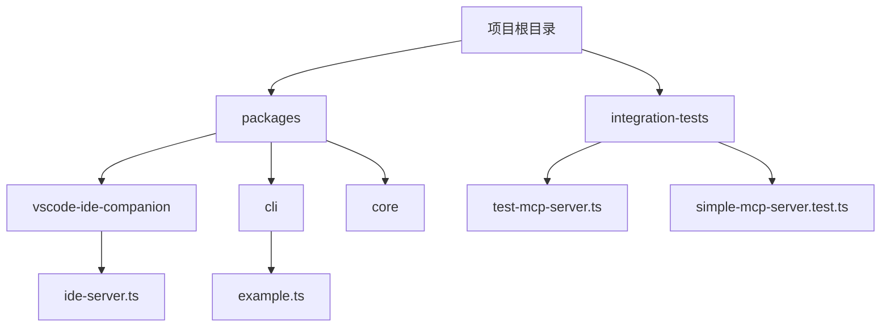
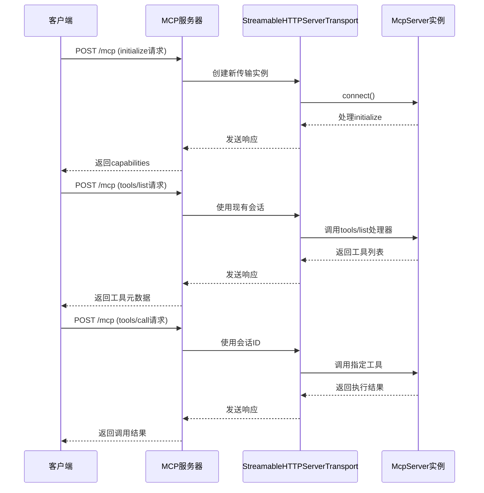
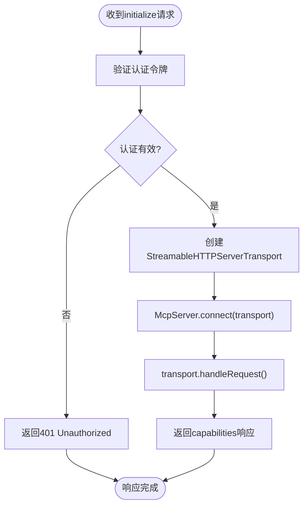

# MCP端点与协议

<cite>
**本文档中引用的文件**  
- [example.ts](file://packages/cli/src/commands/extensions/examples/mcp-server/example.ts)
- [test-mcp-server.ts](file://integration-tests/test-mcp-server.ts)
- [ide-server.ts](file://packages/vscode-ide-companion/src/ide-server.ts)
- [simple-mcp-server.test.ts](file://integration-tests/simple-mcp-server.test.ts)
</cite>

## 目录

1. [引言](#引言)
2. [项目结构](#项目结构)
3. [核心组件](#核心组件)
4. [架构概述](#架构概述)
5. [详细组件分析](#详细组件分析)
6. [依赖分析](#依赖分析)
7. [性能考虑](#性能考虑)
8. [故障排除指南](#故障排除指南)
9. [结论](#结论)

## 引言

本文档详细介绍了MCP（Model Context
Protocol）服务器端点与通信协议的设计与实现。重点分析了`/capabilities`和`/invoke`两个核心HTTP端点，阐述了它们如何支持基于JSON-RPC的无状态交互模式。文档通过代码示例展示了如何使用Node.js的http模块或Express框架来定义这些路由，并解释了服务器如何返回工具元数据以及处理工具调用请求。

## 项目结构

该项目是一个复杂的多包仓库，包含多个子包和集成测试。MCP服务器功能主要分布在`packages/vscode-ide-companion`和`integration-tests`目录中。`example.ts`文件提供了创建MCP服务器的简单示例，而`ide-server.ts`则实现了生产环境中的完整HTTP服务器。



**图示来源**

- [ide-server.ts](file://packages/vscode-ide-companion/src/ide-server.ts)
- [example.ts](file://packages/cli/src/commands/extensions/examples/mcp-server/example.ts)

**节来源**

- [ide-server.ts](file://packages/vscode-ide-companion/src/ide-server.ts)
- [example.ts](file://packages/cli/src/commands/extensions/examples/mcp-server/example.ts)

## 核心组件

MCP服务器的核心组件包括HTTP服务器端点、JSON-RPC处理器和工具注册机制。`/mcp`端点处理所有传入的JSON-RPC请求，而`McpServer`类负责管理工具注册和调用。`StreamableHTTPServerTransport`类实现了基于HTTP的流式传输，支持会话管理和保持连接。

**节来源**

- [test-mcp-server.ts](file://integration-tests/test-mcp-server.ts)
- [ide-server.ts](file://packages/vscode-ide-companion/src/ide-server.ts)

## 架构概述

MCP服务器采用基于JSON-RPC
2.0的无状态通信协议。客户端通过POST请求向`/mcp`端点发送JSON-RPC消息，服务器解析消息并调用相应的处理程序。服务器支持`initialize`、`tools/list`和`tools/call`等方法，实现了完整的工具发现和调用功能。



**图示来源**

- [test-mcp-server.ts](file://integration-tests/test-mcp-server.ts#L37-L46)
- [ide-server.ts](file://packages/vscode-ide-companion/src/ide-server.ts#L205-L269)

**节来源**

- [test-mcp-server.ts](file://integration-tests/test-mcp-server.ts)
- [ide-server.ts](file://packages/vscode-ide-companion/src/ide-server.ts)

## 详细组件分析

### `/capabilities`端点分析

`/capabilities`端点通过`initialize`
JSON-RPC方法实现，返回服务器支持的所有功能和工具的元数据。当客户端发送`initialize`请求时，服务器会返回一个包含协议版本、功能和服务器信息的响应。



**图示来源**

- [ide-server.ts](file://packages/vscode-ide-companion/src/ide-server.ts#L168-L189)
- [simple-mcp-server.test.ts](file://integration-tests/simple-mcp-server.test.ts#L110-L118)

**节来源**

- [ide-server.ts](file://packages/vscode-ide-companion/src/ide-server.ts)
- [simple-mcp-server.test.ts](file://integration-tests/simple-mcp-server.test.ts)

### `/invoke`端点分析

`/invoke`端点通过`tools/call`
JSON-RPC方法实现，用于调用服务器注册的工具。该端点接收包含工具名称和参数的请求，验证请求结构，并返回执行结果。

```mermaid
classDiagram
class McpServer {
+name : string
+version : string
+tools : Map[string, ToolCallback]
+registerTool(name : string, metadata : ToolMetadata, callback : ToolCallback)
+connect(transport : ServerTransport)
-handleToolsCall(params : ToolsCallParams) : Promise~CallToolResult~
}
class StreamableHTTPServerTransport {
+sessionId : string
+handleRequest(req : Request, res : Response, body? : any)
+send(message : AnyMessage)
+close()
-onclose : () => void
}
class ToolCallback {
<<interface>>
(params : any) : Promise~CallToolResult~
}
McpServer --> StreamableHTTPServerTransport : "使用"
McpServer --> ToolCallback : "注册"
StreamableHTTPServerTransport ..> McpServer : "调用处理"
```

**图示来源**

- [test-mcp-server.ts](file://integration-tests/test-mcp-server.ts#L24-L35)
- [example.ts](file://packages/cli/src/commands/extensions/examples/mcp-server/example.ts#L11-L37)

**节来源**

- [test-mcp-server.ts](file://integration-tests/test-mcp-server.ts)
- [example.ts](file://packages/cli/src/commands/extensions/examples/mcp-server/example.ts)

## 依赖分析

MCP服务器依赖于多个外部包和内部模块。主要依赖包括Express框架用于HTTP服务器、`@modelcontextprotocol/sdk`用于MCP协议实现，以及Zod用于数据验证。服务器通过`StreamableHTTPServerTransport`与`McpServer`实例通信，实现了清晰的职责分离。

```mermaid
graph LR
A[Express] --> B[/mcp端点]
B --> C[StreamableHTTPServerTransport]
C --> D[McpServer]
D --> E[注册的工具]
E --> F[fetch_posts工具]
E --> G[其他工具]
H[Zod] --> D
I[@modelcontextprotocol/sdk] --> C
I --> D
```

**图示来源**

- [test-mcp-server.ts](file://integration-tests/test-mcp-server.ts)
- [ide-server.ts](file://packages/vscode-ide-companion/src/ide-server.ts)

**节来源**

- [test-mcp-server.ts](file://integration-tests/test-mcp-server.ts)
- [ide-server.ts](file://packages/vscode-ide-companion/src/ide-server.ts)

## 性能考虑

MCP服务器设计考虑了性能和可扩展性。通过使用流式HTTP传输，服务器能够处理大量数据而不会耗尽内存。会话管理机制允许在多个请求之间保持状态，而保持连接功能则减少了网络延迟。错误处理机制确保了服务器的稳定性和可靠性。

## 故障排除指南

当MCP服务器出现问题时，可以检查以下常见问题：

1. 认证失败：确保请求包含正确的Bearer令牌
2. 会话ID错误：检查请求头中的`mcp-session-id`是否有效
3. 工具调用失败：验证工具名称和参数是否正确
4. CORS错误：确保请求来自允许的主机

**节来源**

- [ide-server.ts](file://packages/vscode-ide-companion/src/ide-server.ts#L140-L153)
- [ide-server.ts](file://packages/vscode-ide-companion/src/ide-server.ts#L168-L187)

## 结论

MCP服务器通过标准化的HTTP端点和JSON-RPC协议实现了强大的工具发现和调用功能。`/capabilities`和`/invoke`端点的设计体现了无状态、基于JSON的现代API设计理念。通过使用Express框架和`@modelcontextprotocol/sdk`，服务器实现了高性能、可扩展和易于维护的架构。
