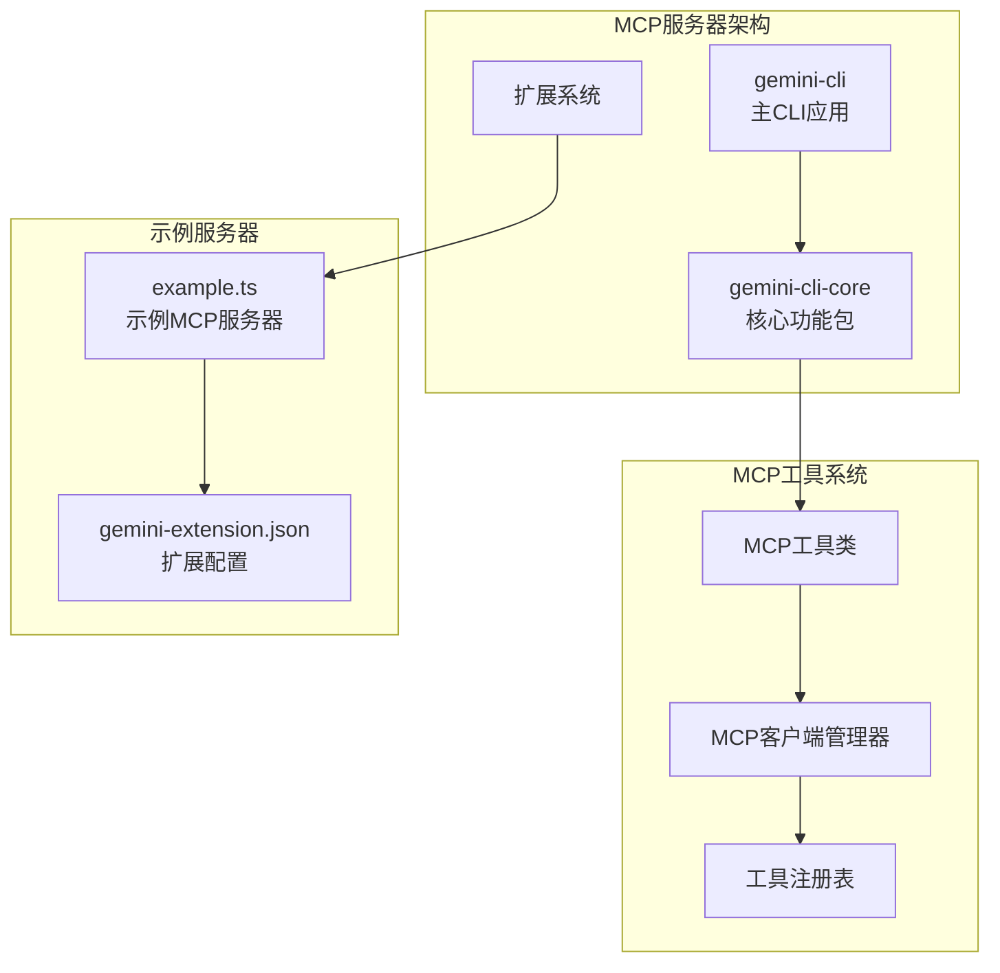
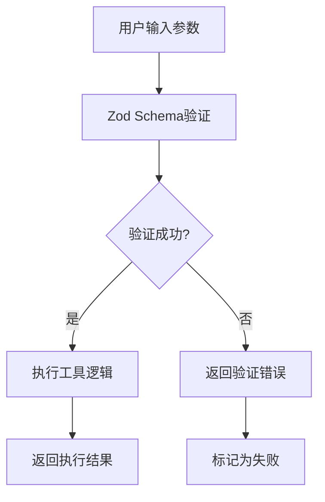
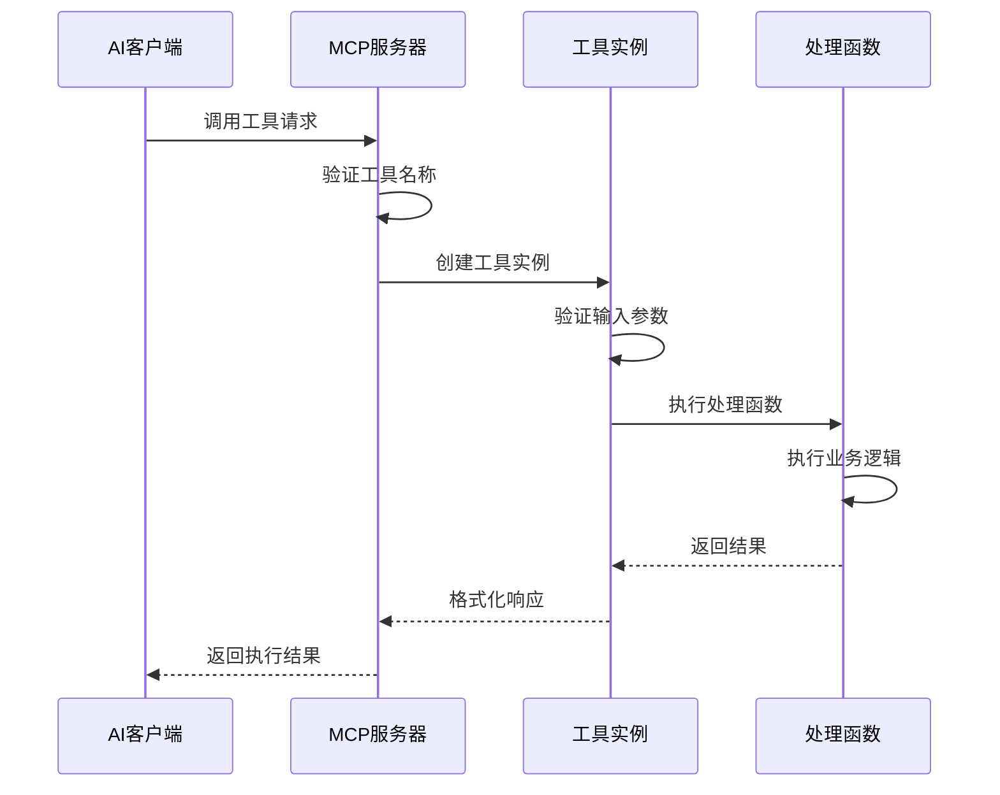
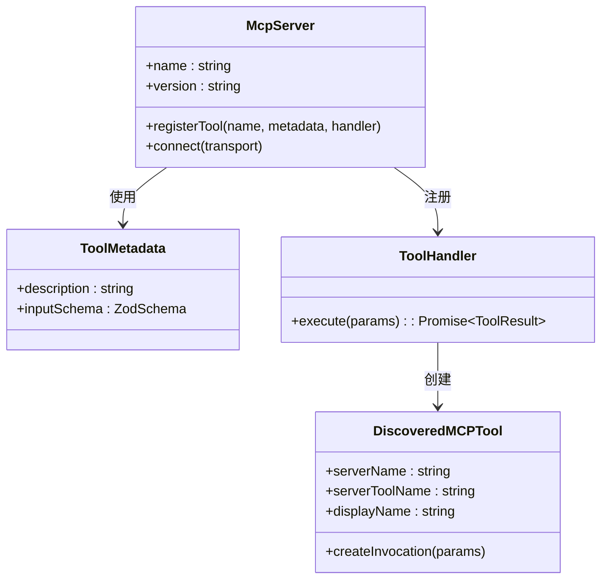
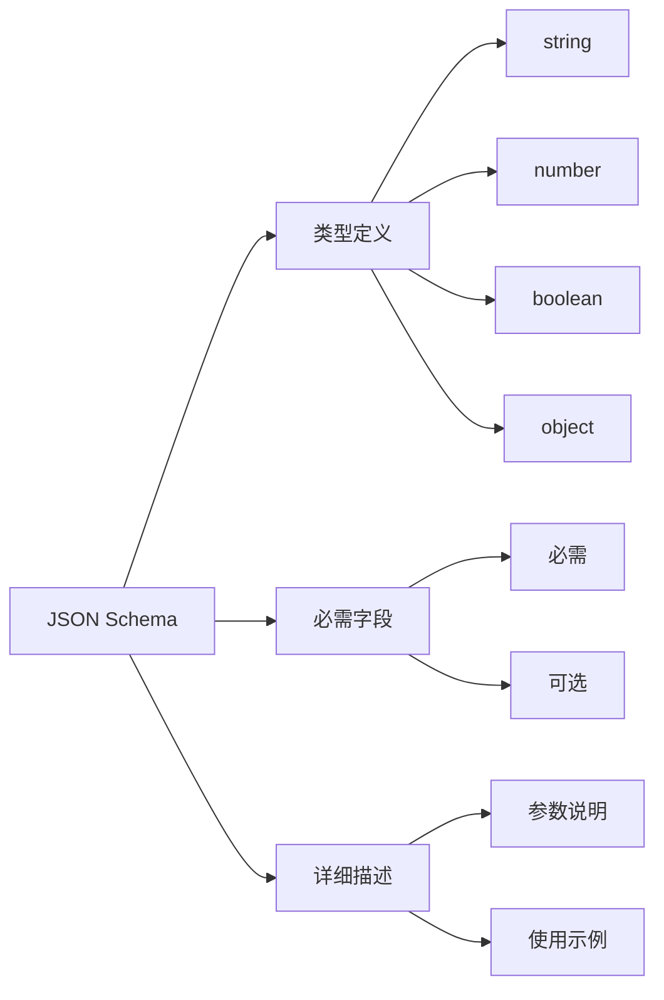
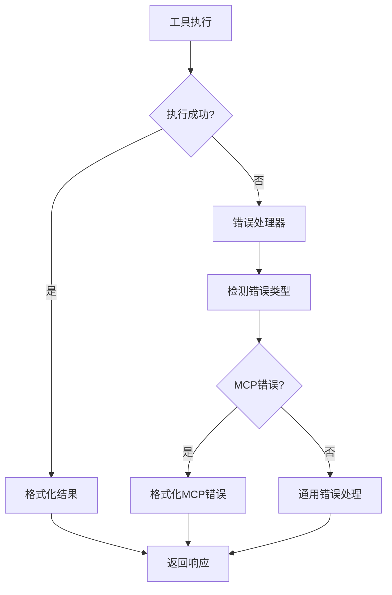
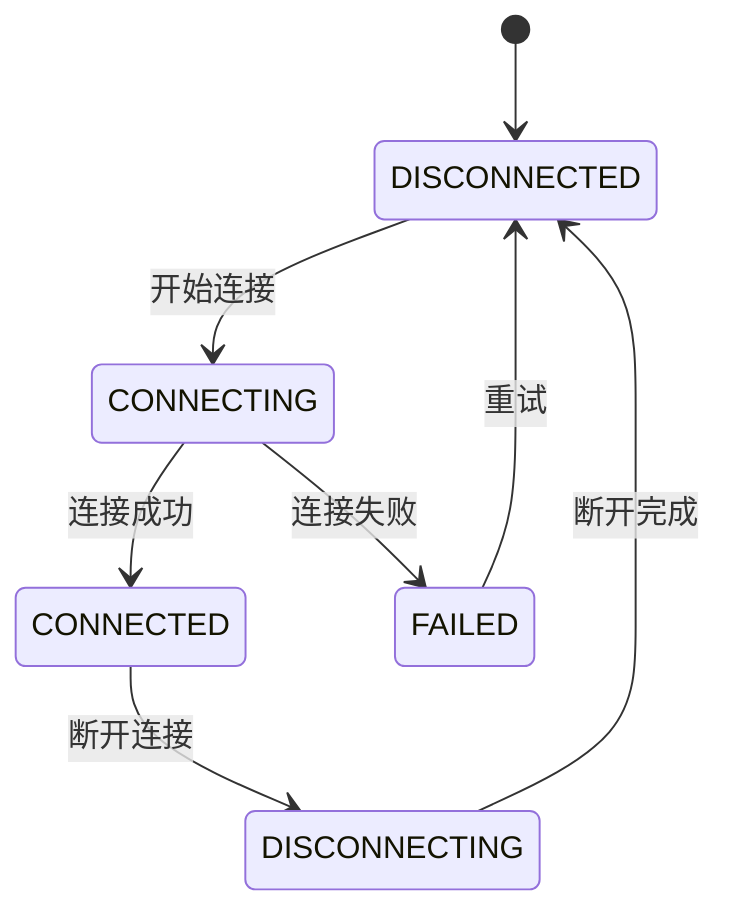
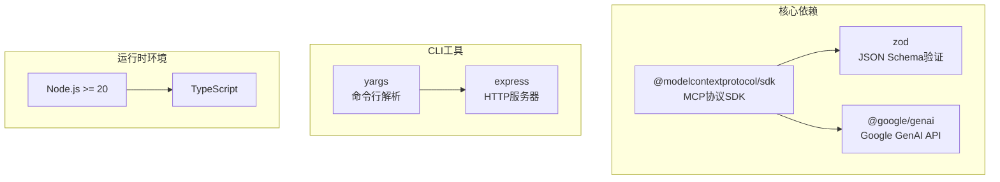

# 定义与实现工具

<cite>
**本文档中引用的文件**
- [example.ts](file://packages/cli/src/commands/extensions/examples/mcp-server/example.ts)
- [mcp-tool.ts](file://packages/core/src/tools/mcp-tool.ts)
- [tools.ts](file://packages/core/src/tools/tools.ts)
- [add.ts](file://packages/cli/src/commands/mcp/add.ts)
- [gemini-extension.json](file://packages/cli/src/commands/extensions/examples/mcp-server/gemini-extension.json)
- [package.json](file://package.json)
- [cli/package.json](file://packages/cli/package.json)
- [core/package.json](file://packages/core/package.json)
</cite>

## 目录

1. [简介](#简介)
2. [项目结构概览](#项目结构概览)
3. [核心组件分析](#核心组件分析)
4. [架构概览](#架构概览)
5. [详细组件分析](#详细组件分析)
6. [依赖关系分析](#依赖关系分析)
7. [性能考虑](#性能考虑)
8. [故障排除指南](#故障排除指南)
9. [结论](#结论)

## 简介

MCP（Model Context Protocol）服务器是Google Gemini
CLI生态系统中的重要组成部分，它允许外部工具和服务与AI模型进行交互。本文档详细介绍了如何在MCP服务器中定义和实现自定义工具，包括工具的声明、参数验证、执行流程以及部署配置。

MCP协议提供了一种标准化的方式来定义和调用工具，使得AI模型能够安全、可靠地执行各种操作。通过JSON
Schema定义工具参数，确保了参数的类型安全和完整性验证。

## 项目结构概览

Gemini CLI项目采用多包架构，主要包含以下核心模块：

**图表来源**

- [example.ts](file://packages/cli/src/commands/extensions/examples/mcp-server/example.ts#L1-L61)
- [mcp-tool.ts](file://packages/core/src/tools/mcp-tool.ts#L1-L50)

**章节来源**

- [example.ts](file://packages/cli/src/commands/extensions/examples/mcp-server/example.ts#L1-L61)
- [gemini-extension.json](file://packages/cli/src/commands/extensions/examples/mcp-server/gemini-extension.json#L1-L12)

## 核心组件分析

### MCP服务器核心类

MCP服务器的核心实现基于`@modelcontextprotocol/sdk`库，提供了标准化的工具定义和调用机制。

#### 工具定义结构

工具定义包含以下关键要素：

| 属性        | 类型      | 描述                      | 示例                                           |
| ----------- | --------- | ------------------------- | ---------------------------------------------- |
| name        | string    | 工具的唯一标识符          | `'fetch_posts'`                                |
| description | string    | 工具的功能描述            | `'Fetches a list of posts from a public API.'` |
| inputSchema | ZodSchema | 输入参数的JSON Schema定义 | `z.object({}).shape`                           |
| handler     | Function  | 工具的执行函数            | 异步处理函数                                   |

#### 参数验证系统

系统使用Zod库进行参数验证，确保传入参数符合预期格式：

**图表来源**

- [tools.ts](file://packages/core/src/tools/tools.ts#L444-L454)
- [mcp-tool.ts](file://packages/core/src/tools/mcp-tool.ts#L146-L208)

**章节来源**

- [example.ts](file://packages/cli/src/commands/extensions/examples/mcp-server/example.ts#L16-L37)
- [tools.ts](file://packages/core/src/tools/tools.ts#L297-L342)

## 架构概览

MCP工具系统的整体架构展示了从定义到执行的完整流程：

**图表来源**

- [mcp-tool.ts](file://packages/core/src/tools/mcp-tool.ts#L146-L208)
- [tools.ts](file://packages/core/src/tools/tools.ts#L342-L361)

## 详细组件分析

### 工具注册与发现

#### 工具注册机制

MCP服务器通过`registerTool`方法注册可用工具：

**图表来源**

- [example.ts](file://packages/cli/src/commands/extensions/examples/mcp-server/example.ts#L11-L37)
- [mcp-tool.ts](file://packages/core/src/tools/mcp-tool.ts#L215-L283)

#### 参数Schema定义

工具的输入参数通过JSON Schema精确定义：

**图表来源**

- [example.ts](file://packages/cli/src/commands/extensions/examples/mcp-server/example.ts#L17-L21)

### 工具执行流程

#### 执行结果格式化

工具执行完成后，结果必须按照MCP规范格式化：

| 字段    | 类型    | 必需 | 描述             |
| ------- | ------- | ---- | ---------------- |
| content | Array   | 是   | 内容块数组       |
| isError | boolean | 否   | 是否表示错误状态 |

#### 错误处理机制

系统提供了完善的错误处理和报告机制：

**图表来源**

- [mcp-tool.ts](file://packages/core/src/tools/mcp-tool.ts#L124-L144)
- [mcp-tool.ts](file://packages/core/src/tools/mcp-tool.ts#L186-L200)

**章节来源**

- [mcp-tool.ts](file://packages/core/src/tools/mcp-tool.ts#L146-L208)
- [tools.ts](file://packages/core/src/tools/tools.ts#L490-L512)

### MCP客户端管理

#### 客户端连接管理

系统维护多个MCP服务器的连接状态：

**图表来源**

- [mcp-tool.ts](file://packages/core/src/tools/mcp-tool.ts#L289-L326)

**章节来源**

- [mcp-tool.ts](file://packages/core/src/tools/mcp-tool.ts#L193-L208)

## 依赖关系分析

### 核心依赖包

项目的主要依赖关系如下：

**图表来源**

- [cli/package.json](file://packages/cli/package.json#L30-L65)
- [core/package.json](file://packages/core/package.json#L22-L70)

### 包依赖关系

项目的包结构展现了清晰的依赖层次：

| 包名                      | 版本    | 主要功能    | 依赖关系                  |
| ------------------------- | ------- | ----------- | ------------------------- |
| @google/gemini-cli        | 0.15.0  | 主CLI应用   | @google/gemini-cli-core   |
| @google/gemini-cli-core   | 0.15.0  | 核心功能    | @modelcontextprotocol/sdk |
| @modelcontextprotocol/sdk | ^1.15.1 | MCP协议实现 | -                         |
| zod                       | ^3.23.8 | 类型验证    | -                         |

**章节来源**

- [package.json](file://package.json#L1-L146)
- [cli/package.json](file://packages/cli/package.json#L30-L65)
- [core/package.json](file://packages/core/package.json#L22-L70)

## 性能考虑

### 工具执行优化

1. **并发控制**: 支持多个工具并行执行
2. **超时处理**: 防止长时间运行的工具阻塞系统
3. **内存管理**: 及时清理工具执行过程中的资源
4. **缓存机制**: 对频繁访问的数据进行缓存

### 网络通信优化

1. **连接池**: 复用HTTP连接减少建立连接的开销
2. **压缩传输**: 对大型响应进行压缩
3. **流式处理**: 支持大文件和大数据的流式传输

## 故障排除指南

### 常见问题及解决方案

#### 工具注册失败

**症状**: 工具无法在服务器中发现 **原因**:

- 工具名称重复
- 参数Schema格式错误
- 处理函数签名不正确

**解决方案**:

1. 检查工具名称的唯一性
2. 验证Zod Schema的语法
3. 确保处理函数返回正确的Promise类型

#### 参数验证错误

**症状**: 工具调用时返回参数验证失败 **原因**:

- 传入参数类型不匹配
- 缺少必需的参数
- 参数值超出范围

**解决方案**:

1. 检查JSON Schema定义
2. 验证参数的实际值
3. 添加适当的默认值处理

#### 执行超时

**症状**: 工具执行时间过长导致超时 **原因**:

- 网络请求超时
- 复杂计算耗时过长
- 死锁或无限循环

**解决方案**:

1. 设置合理的超时时间
2. 实现异步处理机制
3. 添加进度报告功能

**章节来源**

- [mcp-tool.ts](file://packages/core/src/tools/mcp-tool.ts#L186-L200)
- [tools.ts](file://packages/core/src/tools/tools.ts#L380-L418)

## 结论

MCP服务器为AI模型提供了一个强大而灵活的工具调用框架。通过本文档的详细介绍，开发者可以：

1. **理解架构**: 掌握MCP工具系统的整体设计和工作原理
2. **定义工具**: 学会使用JSON Schema精确定义工具参数
3. **实现功能**: 理解工具的注册、验证和执行流程
4. **部署配置**: 了解如何将MCP服务器集成到现有应用中

随着AI技术的发展，MCP协议将继续演进，为更多的应用场景提供标准化的工具接口。开发者应该关注协议的更新，并及时适配新的功能特性。

通过遵循本文档的最佳实践，可以构建出安全、可靠、高性能的MCP工具服务器，为AI应用提供强大的后端支持。
