# 实现MCP服务器

<cite>
**本文档中引用的文件**
- [example.ts](file://packages/cli/src/commands/extensions/examples/mcp-server/example.ts)
- [gemini-extension.json](file://packages/cli/src/commands/extensions/examples/mcp-server/gemini-extension.json)
- [package.json](file://packages/cli/src/commands/extensions/examples/mcp-server/package.json)
- [test-mcp-server.ts](file://integration-tests/test-mcp-server.ts)
- [mcp_server_cyclic_schema.test.ts](file://integration-tests/mcp_server_cyclic_schema.test.ts)
- [simple-mcp-server.test.ts](file://integration-tests/simple-mcp-server.test.ts)
- [mcp-client.ts](file://packages/core/src/tools/mcp-client.ts)
- [ide-server.ts](file://packages/vscode-ide-companion/src/ide-server.ts)
- [config.ts](file://packages/cli/src/config/config.ts)
- [list.ts](file://packages/cli/src/commands/mcp/list.ts)
</cite>

## 目录

1. [简介](#简介)
2. [项目结构](#项目结构)
3. [核心组件](#核心组件)
4. [架构概览](#架构概览)
5. [详细组件分析](#详细组件分析)
6. [依赖关系分析](#依赖关系分析)
7. [性能考虑](#性能考虑)
8. [故障排除指南](#故障排除指南)
9. [结论](#结论)

## 简介

本教程将指导您从零开始构建一个符合Model Context Protocol
(MCP) 规范的服务器。我们将使用Node.js作为示例语言，并参考Gemini
CLI项目中的实际实现来展示如何创建一个功能完整的MCP服务器。

MCP协议允许AI助手与外部服务和工具进行交互，为用户提供更强大的功能扩展能力。通过实现MCP服务器，您可以将自己的工具和服务集成到Gemini
CLI中。

## 项目结构

Gemini CLI项目中的MCP服务器实现遵循清晰的模块化结构：

**图表来源**

- [example.ts](file://packages/cli/src/commands/extensions/examples/mcp-server/example.ts#L1-L61)
- [test-mcp-server.ts](file://integration-tests/test-mcp-server.ts#L1-L81)

**章节来源**

- [example.ts](file://packages/cli/src/commands/extensions/examples/mcp-server/example.ts#L1-L61)
- [gemini-extension.json](file://packages/cli/src/commands/extensions/examples/mcp-server/gemini-extension.json#L1-L12)

## 核心组件

### MCP服务器SDK

Gemini CLI使用`@modelcontextprotocol/sdk`包来简化MCP服务器的开发：

**图表来源**

- [example.ts](file://packages/cli/src/commands/extensions/examples/mcp-server/example.ts#L7-L61)
- [test-mcp-server.ts](file://integration-tests/test-mcp-server.ts#L11-L12)

### 工具注册机制

MCP服务器的核心是工具注册系统，它允许定义可被AI助手调用的功能：

**图表来源**

- [example.ts](file://packages/cli/src/commands/extensions/examples/mcp-server/example.ts#L16-L37)
- [test-mcp-server.ts](file://integration-tests/test-mcp-server.ts#L31-L37)

**章节来源**

- [example.ts](file://packages/cli/src/commands/extensions/examples/mcp-server/example.ts#L16-L57)
- [test-mcp-server.ts](file://integration-tests/test-mcp-server.ts#L24-L37)

## 架构概览

MCP服务器采用分层架构设计，支持多种传输协议：

**图表来源**

- [test-mcp-server.ts](file://integration-tests/test-mcp-server.ts#L22-L47)
- [ide-server.ts](file://packages/vscode-ide-companion/src/ide-server.ts#L211-L241)

## 详细组件分析

### 基础MCP服务器实现

最简单的MCP服务器实现展示了核心概念：

```mermaid
flowchart TD
Start([启动服务器]) --> Init["初始化McpServer实例"]
Init --> Register["注册工具和提示"]
Register --> Connect["建立传输连接"]
Connect --> Listen["监听请求"]
Listen --> Parse["解析JSON-RPC消息"]
Parse --> Route{"路由到处理程序"}
Route --> |initialize| InitCap["返回初始化能力"]
Route --> |tools/list| ListTools["列出可用工具"]
Route --> |tools/call| CallTool["调用指定工具"]
Route --> |其他| NotFound["返回方法未找到错误"]
InitCap --> Respond["发送响应"]
ListTools --> Respond
CallTool --> Execute["执行工具逻辑"]
Execute --> Respond
NotFound --> Respond
Respond --> Listen
```

**图表来源**

- [simple-mcp-server.test.ts](file://integration-tests/simple-mcp-server.test.ts#L40-L106)
- [mcp_server_cyclic_schema.test.ts](file://integration-tests/mcp_server_cyclic_schema.test.ts#L29-L77)

### HTTP传输层实现

对于需要通过HTTP访问的MCP服务器，Gemini CLI提供了完整的Express服务器实现：

**图表来源**

- [test-mcp-server.ts](file://integration-tests/test-mcp-server.ts#L37-L47)
- [ide-server.ts](file://packages/vscode-ide-companion/src/ide-server.ts#L243-L285)

### 工具元数据定义

每个工具都需要定义详细的元数据，包括名称、描述和参数模式：

| 元素         | 类型   | 描述                  | 示例                    |
| ------------ | ------ | --------------------- | ----------------------- |
| name         | string | 工具的唯一标识符      | "fetch_posts"           |
| description  | string | 工具功能的简要描述    | "从公共API获取帖子列表" |
| inputSchema  | object | 输入参数的JSON Schema | 包含类型、必需字段等    |
| outputSchema | object | 输出格式的JSON Schema | 定义返回内容结构        |

**章节来源**

- [example.ts](file://packages/cli/src/commands/extensions/examples/mcp-server/example.ts#L16-L37)
- [mcp_server_cyclic_schema.test.ts](file://integration-tests/mcp_server_cyclic_schema.test.ts#L137-L158)

### 提示模板系统

除了工具，MCP服务器还可以提供可重用的提示模板：

**图表来源**

- [example.ts](file://packages/cli/src/commands/extensions/examples/mcp-server/example.ts#L39-L57)

**章节来源**

- [example.ts](file://packages/cli/src/commands/extensions/examples/mcp-server/example.ts#L39-L57)

## 依赖关系分析

MCP服务器的依赖关系体现了现代JavaScript生态系统的特点：

**图表来源**

- [package.json](file://packages/cli/src/commands/extensions/examples/mcp-server/package.json#L14-L17)

**章节来源**

- [package.json](file://packages/cli/src/commands/extensions/examples/mcp-server/package.json#L1-L19)

## 性能考虑

### 连接管理和会话

MCP服务器需要高效管理多个并发连接：

- 使用连接池来复用传输连接
- 实现超时机制防止资源泄漏
- 支持会话状态持久化
- 实现优雅的关闭流程

### 错误处理策略

健壮的错误处理是MCP服务器的关键：

- JSON-RPC错误码标准化
- 详细的错误信息记录
- 用户友好的错误响应
- 自动重试机制

### 资源优化

- 内存使用监控
- CPU使用率控制
- 网络带宽限制
- 并发请求处理

## 故障排除指南

### 常见问题诊断

| 问题类型     | 症状                 | 可能原因               | 解决方案                     |
| ------------ | -------------------- | ---------------------- | ---------------------------- |
| 连接失败     | 无法建立MCP连接      | 端口被占用、防火墙阻止 | 检查端口状态、配置防火墙规则 |
| 工具调用失败 | 工具返回错误         | 参数验证失败、权限不足 | 验证输入参数、检查权限设置   |
| 协议错误     | JSON-RPC消息格式错误 | 消息格式不正确         | 检查JSON-RPC实现             |
| 性能问题     | 响应时间过长         | 资源竞争、算法复杂度高 | 优化算法、增加缓存           |

### 调试技巧

1. **启用调试日志**：设置环境变量`MCP_DEBUG=true`
2. **使用开发工具**：利用浏览器开发者工具检查网络请求
3. **单元测试**：编写针对各个组件的测试用例
4. **集成测试**：模拟完整的MCP交互流程

**章节来源**

- [mcp_client.ts](file://packages/core/src/tools/mcp-client.ts#L1082-L1115)
- [ide-server.ts](file://packages/vscode-ide-companion/src/ide-server.ts#L413-L459)

## 结论

通过本教程，我们深入了解了如何在Gemini CLI环境中实现MCP服务器。关键要点包括：

1. **模块化设计**：使用标准的MCP SDK简化开发
2. **多协议支持**：同时支持HTTP和STDIO传输
3. **类型安全**：利用Zod进行参数验证
4. **错误处理**：实现健壮的错误处理机制
5. **性能优化**：考虑并发处理和资源管理

MCP服务器为AI助手提供了强大的扩展能力，通过合理的架构设计和最佳实践，您可以构建出既稳定又高效的MCP服务器。
