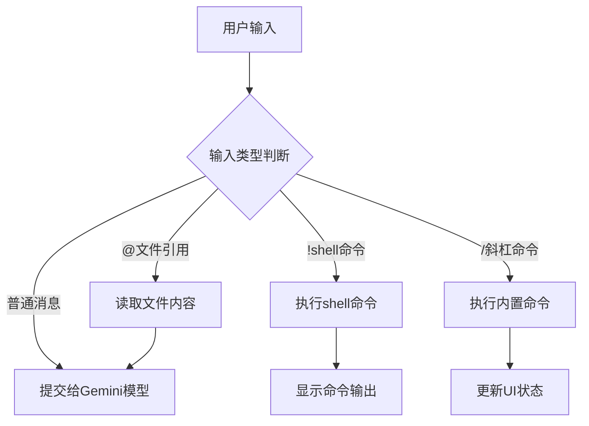
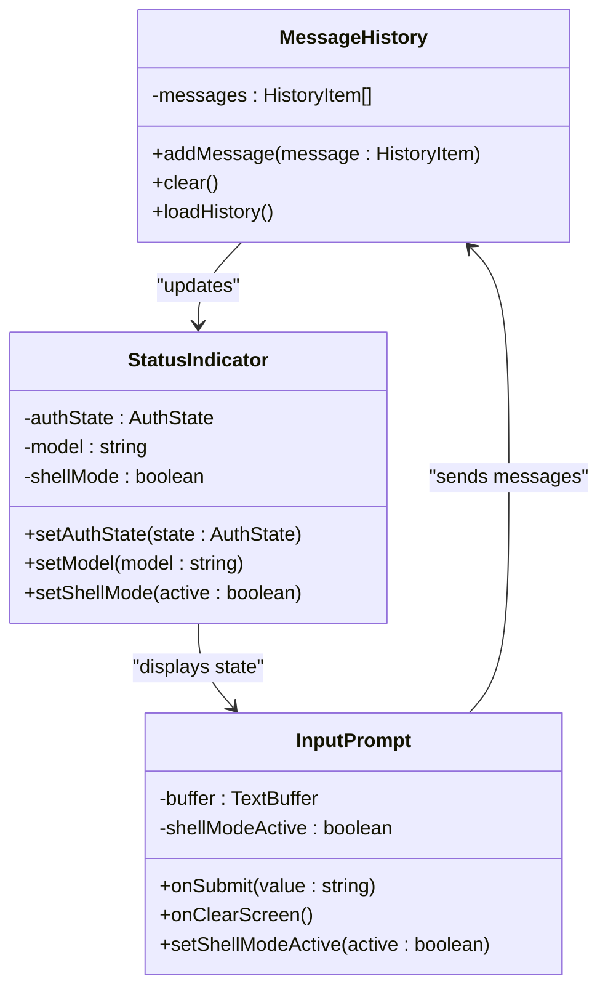
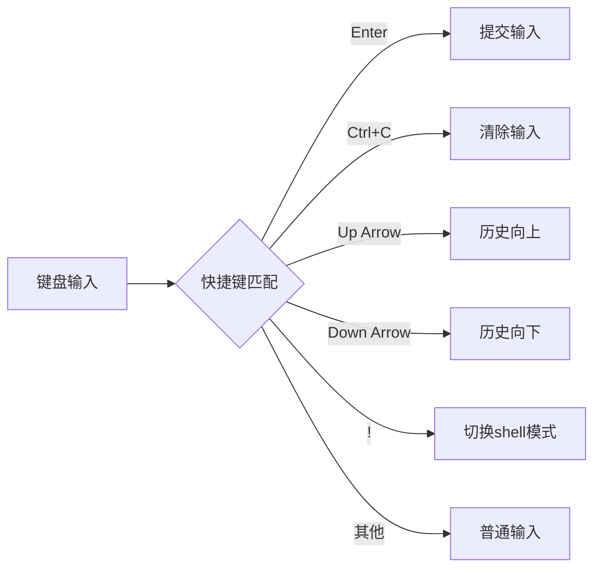
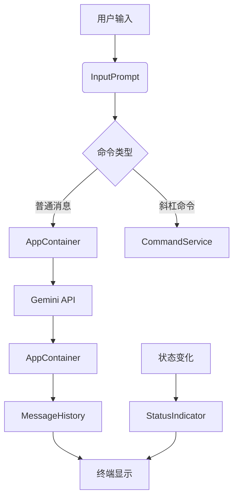

# 交互模式

<cite>
**本文档中引用的文件**  
- [gemini.tsx](file://packages/cli/src/gemini.tsx)
- [AppContainer.tsx](file://packages/cli/src/ui/AppContainer.tsx)
- [InputPrompt.tsx](file://packages/cli/src/ui/components/InputPrompt.tsx)
- [types.ts](file://packages/cli/src/ui/types.ts)
- [keyMatchers.ts](file://packages/cli/src/ui/keyMatchers.ts)
- [ShellModeIndicator.tsx](file://packages/cli/src/ui/components/ShellModeIndicator.tsx)
</cite>

## 目录

1. [简介](#简介)
2. [用户界面布局](#用户界面布局)
3. [命令提示符与输入区域](#命令提示符与输入区域)
4. [消息历史与状态指示器](#消息历史与状态指示器)
5. [交互功能详解](#交互功能详解)
6. [键盘快捷键与自定义方法](#键盘快捷键与自定义方法)
7. [React组件工作原理](#react组件工作原理)

## 简介

gemini-cli的交互模式提供了一个基于TTY（Teletypewriter）界面的命令行交互环境，允许用户与Gemini模型进行实时对话。该模式通过React组件构建用户界面，支持丰富的交互功能，包括聊天、文件引用、shell命令执行和上下文管理。本文档将详细介绍交互模式的用户界面布局、导航方式、交互功能以及键盘快捷键。

**Section sources**

- [gemini.tsx](file://packages/cli/src/gemini.tsx#L149-L183)
- [AppContainer.tsx](file://packages/cli/src/ui/AppContainer.tsx#L146-L800)

## 用户界面布局

gemini-cli的交互界面由多个组件构成，主要包括命令提示符、消息历史、输入区域和状态指示器。界面布局设计旨在提供清晰的视觉层次和高效的交互体验。

- **命令提示符**：位于界面底部，用于输入用户查询和命令。
- **消息历史**：显示用户和Gemini模型之间的对话历史。
- **状态指示器**：显示当前会话的状态信息，如认证状态、模型选择等。
- **输入区域**：支持多行输入、自动补全和历史导航。

界面通过Ink库进行渲染，确保在不同终端环境下的兼容性和一致性。

**Section sources**

- [AppContainer.tsx](file://packages/cli/src/ui/AppContainer.tsx#L146-L800)
- [types.ts](file://packages/cli/src/ui/types.ts#L1-L379)

## 命令提示符与输入区域

命令提示符是用户与gemini-cli交互的主要入口，支持多种输入模式和功能。

### 功能特性

- **占位符文本**：默认显示"Type your message or
  @path/to/file"，提示用户可以输入消息或引用文件。
- **文件引用**：使用`@`符号引用文件，例如`@path/to/file`，将文件内容作为上下文提供给模型。
- **Shell模式**：通过`!`命令切换到shell模式，允许执行shell命令。
- **多行输入**：支持使用反斜杠`\`进行多行输入。

### 输入处理

输入区域通过`TextBuffer`组件管理用户输入，支持以下功能：

- **历史导航**：使用上下箭头键浏览输入历史。
- **自动补全**：根据上下文提供命令和路径的自动补全建议。
- **剪贴板操作**：支持Ctrl+V粘贴剪贴板内容，包括图像文件。



**Diagram sources**

- [InputPrompt.tsx](file://packages/cli/src/ui/components/InputPrompt.tsx#L1-L800)
- [AppContainer.tsx](file://packages/cli/src/ui/AppContainer.tsx#L146-L800)

## 消息历史与状态指示器

消息历史和状态指示器为用户提供会话的上下文和当前状态信息。

### 消息历史

消息历史显示用户和Gemini模型之间的完整对话，包括：

- **用户消息**：以"User"标签显示。
- **Gemini响应**：以"Gemini"标签显示。
- **系统消息**：显示工具调用、错误信息和状态更新。

### 状态指示器

状态指示器显示当前会话的关键信息：

- **认证状态**：显示当前的认证方法和状态。
- **模型选择**：显示当前使用的Gemini模型。
- **Shell模式**：当shell模式启用时，显示"shell mode enabled"提示。



**Diagram sources**

- [types.ts](file://packages/cli/src/ui/types.ts#L1-L379)
- [ShellModeIndicator.tsx](file://packages/cli/src/ui/components/ShellModeIndicator.tsx#L1-L18)

## 交互功能详解

gemini-cli支持多种交互功能，增强用户与模型的交互能力。

### 聊天功能

用户可以输入自然语言消息与Gemini模型进行对话。模型会根据上下文和历史消息生成响应。

### 文件引用

使用`@`符号引用文件，将文件内容作为上下文提供给模型。例如：

```
请分析以下代码：@src/main.py
```

### Shell命令执行

通过`!`命令切换到shell模式，执行shell命令：

```
!ls -l
```

在shell模式下，可以使用上下箭头键浏览shell命令历史。

### 上下文管理

- **压缩上下文**：使用`/compress`命令压缩对话历史，减少token使用。
- **清除屏幕**：使用`/clear`命令清除消息历史和屏幕。
- **会话恢复**：支持保存和恢复对话会话。

**Section sources**

- [InputPrompt.tsx](file://packages/cli/src/ui/components/InputPrompt.tsx#L1-L800)
- [AppContainer.tsx](file://packages/cli/src/ui/AppContainer.tsx#L146-L800)

## 键盘快捷键与自定义方法

gemini-cli提供丰富的键盘快捷键，提高交互效率。

### 常用快捷键

| 快捷键     | 功能                   |
| ---------- | ---------------------- |
| Enter      | 提交当前输入           |
| Ctrl+C     | 清除当前输入           |
| Ctrl+V     | 粘贴剪贴板内容         |
| Up Arrow   | 浏览输入历史（上）     |
| Down Arrow | 浏览输入历史（下）     |
| Esc        | 清除输入或退出当前模式 |
| !          | 切换shell模式          |
| @          | 引用文件               |

### 自定义方法

用户可以通过配置文件自定义快捷键和行为：

- **修改快捷键**：在配置文件中重新映射键盘快捷键。
- **自定义主题**：更改界面颜色和样式。
- **扩展功能**：通过插件系统添加新功能。



**Diagram sources**

- [keyMatchers.ts](file://packages/cli/src/ui/keyMatchers.ts#L1-L100)
- [InputPrompt.tsx](file://packages/cli/src/ui/components/InputPrompt.tsx#L1-L800)

## React组件工作原理

gemini-cli的用户界面由多个React组件构成，通过组件化设计实现功能分离和代码复用。

### 核心组件

- **AppContainer**：主容器组件，管理应用状态和数据流。
- **InputPrompt**：输入提示组件，处理用户输入和命令解析。
- **MessageHistory**：消息历史组件，显示对话历史。
- **StatusIndicator**：状态指示器组件，显示会话状态。

### 数据流

1. 用户在`InputPrompt`中输入消息。
2. `InputPrompt`将消息提交给`AppContainer`。
3. `AppContainer`调用Gemini API获取响应。
4. 响应消息通过`MessageHistory`组件显示。
5. 状态变化通过`StatusIndicator`组件更新。

### 状态管理

使用React Context API管理全局状态：

- **ConfigContext**：存储配置信息。
- **UIStateContext**：存储UI状态。
- **SessionContext**：存储会话数据。



**Diagram sources**

- [AppContainer.tsx](file://packages/cli/src/ui/AppContainer.tsx#L146-L800)
- [InputPrompt.tsx](file://packages/cli/src/ui/components/InputPrompt.tsx#L1-L800)
- [types.ts](file://packages/cli/src/ui/types.ts#L1-L379)
