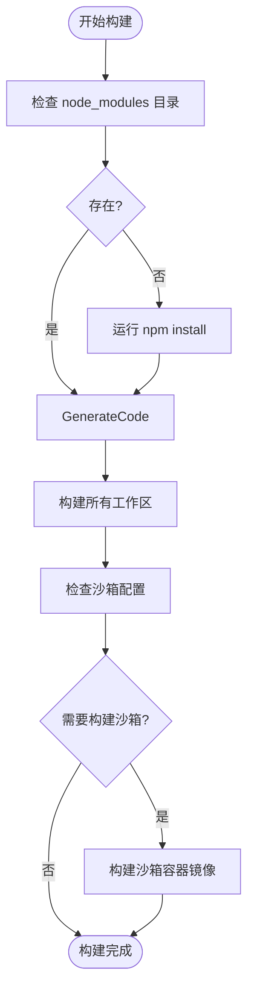

# 安装指南

<cite>
**本文档中引用的文件**  
- [package.json](file://package.json)
- [Makefile](file://Makefile)
- [README.md](file://README.md)
- [scripts/build.js](file://scripts/build.js)
- [scripts/prepare-package.js](file://scripts/prepare-package.js)
- [scripts/create_alias.sh](file://scripts/create_alias.sh)
- [scripts/clean.js](file://scripts/clean.js)
- [esbuild.config.js](file://esbuild.config.js)
- [scripts/build_package.js](file://scripts/build_package.js)
- [scripts/sandbox_command.js](file://scripts/sandbox_command.js)
</cite>

## 目录

1. [简介](#简介)
2. [系统要求](#系统要求)
3. [通过npm安装](#通过npm安装)
4. [通过yarn安装](#通过yarn安装)
5. [通过Makefile进行本地构建和安装](#通过makefile进行本地构建和安装)
6. [不同操作系统的安装说明](#不同操作系统的安装说明)
7. [安装脚本的作用](#安装脚本的作用)
8. [验证安装](#验证安装)
9. [故障排除](#故障排除)

## 简介

Gemini
CLI 是一个开源的AI代理，可将Gemini的强大功能直接带入您的终端。本安装指南提供了全面的安装说明，涵盖了所有可用的安装方法，包括通过npm和yarn从npm仓库安装，以及使用Makefile进行本地构建和安装。文档还提供了针对不同操作系统（macOS、Linux、Windows）的特定安装说明，解释了安装过程中执行的关键脚本的作用，并提供了验证安装是否成功的步骤。

## 系统要求

在安装Gemini CLI之前，请确保您的系统满足以下先决条件：

- **Node.js版本**:
  20.0.0或更高版本。项目根目录下的`package.json`文件明确指定了`"engines": {"node": ">=20.0.0"}`。
- **操作系统**: 支持macOS、Linux和Windows。

**Section sources**

- [package.json](file://package.json#L4-L6)
- [README.md](file://README.md#L31-L33)

## 通过npm安装

npm是安装Gemini
CLI最常用的方法。项目提供了多种npm安装选项，以满足不同的使用需求。

### 全局安装（推荐）

使用npm的`-g`标志可以将Gemini
CLI全局安装到您的系统中，使其可以在任何目录下通过`gemini`命令调用。

```bash
npm install -g @google/gemini-cli
```

### 使用不同版本标签安装

npm支持语义化版本控制，Gemini
CLI项目利用了这一特性，为用户提供不同稳定性的版本。

- **稳定版本 (latest)**: 这是经过充分测试的稳定版本，适合生产环境使用。

  ```bash
  npm install -g @google/gemini-cli@latest
  ```

- **预览版本 (preview)**: 这是每周发布的预览版，可能包含新功能但尚未完全验证。

  ```bash
  npm install -g @google/gemini-cli@preview
  ```

- **夜间版本 (nightly)**: 这是从主分支每日构建的版本，包含了最新的代码变更，但可能存在未解决的问题。
  ```bash
  npm install -g @google/gemini-cli@nightly
  ```

### 直接运行（无需安装）

您可以使用`npx`命令直接运行Gemini
CLI，而无需将其安装到全局或本地。这对于快速测试非常有用。

```bash
npx https://github.com/google-gemini/gemini-cli
```

**Section sources**

- [README.md](file://README.md#L46-L88)
- [package.json](file://package.json#L2-L3)

## 通过yarn安装

Yarn是另一个流行的JavaScript包管理器。安装过程与npm类似，只需将`npm`命令替换为`yarn`。

### 全局安装

```bash
yarn global add @google/gemini-cli
```

### 使用不同版本标签安装

Yarn同样支持版本标签。

- **稳定版本**:

  ```bash
  yarn global add @google/gemini-cli@latest
  ```

- **预览版本**:

  ```bash
  yarn global add @google/gemini-cli@preview
  ```

- **夜间版本**:
  ```bash
  yarn global add @google/gemini-cli@nightly
  ```

**Section sources**

- [README.md](file://README.md#L46-L88)

## 通过Makefile进行本地构建和安装

对于希望从源代码构建和安装Gemini
CLI的开发者，项目提供了一个`Makefile`，其中包含了一系列预定义的命令来简化开发流程。

### Makefile目标

`Makefile`定义了多个目标（targets），每个目标对应一个特定的任务。

```makefile
# Makefile for gemini-cli

.PHONY: help install build build-sandbox build-all test lint format preflight clean start debug release run-npx create-alias

help:
	@echo "Makefile for gemini-cli"
	@echo ""
	@echo "Usage:"
	@echo "  make install          - Install npm dependencies"
	@echo "  make build            - Build the main project"
	@echo "  make build-all        - Build the main project and sandbox"
	@echo "  make test             - Run the test suite"
	@echo "  make lint             - Lint the code"
	@echo "  make format           - Format the code"
	@echo "  make preflight        - Run formatting, linting, and tests"
	@echo "  make clean            - Remove generated files"
	@echo "  make start            - Start the Gemini CLI"
	@echo "  make debug            - Start the Gemini CLI in debug mode"
	@echo ""
	@echo "  make run-npx          - Run the CLI using npx (for testing the published package)"
	@echo "  make create-alias     - Create a 'gemini' alias for your shell"
```

### 本地构建和安装步骤

1.  **安装依赖**: 运行`make install`，这会执行`npm install`来安装项目所需的所有依赖包。

    ```bash
    make install
    ```

2.  **构建项目**: 运行`make build`，这会执行`npm run build`，触发项目的构建流程。

    ```bash
    make build
    ```

3.  **启动应用**: 构建完成后，可以使用`make start`来启动Gemini CLI。

    ```bash
    make start
    ```

4.  **创建别名 (可选)**: 运行`make create-alias`会在您的shell配置文件（`.bashrc`或`.zshrc`）中创建一个`gemini`别名，指向本地的`start.js`脚本，从而允许您像全局安装一样使用`gemini`命令。
    ```bash
    make create-alias
    ```

**Section sources**

- [Makefile](file://Makefile#L1-L60)

## 不同操作系统的安装说明

Gemini CLI支持macOS、Linux和Windows。虽然核心安装流程相同，但某些细节需要注意。

### macOS 和 Linux

在macOS和Linux上，安装过程基本一致。除了上述的npm/yarn/Makefile方法外，macOS和Linux用户还可以使用Homebrew进行安装。

```bash
brew install gemini-cli
```

**潜在陷阱**:

- **权限问题**: 使用`npm install -g`时，如果遇到权限错误，可能需要使用`sudo`，但这不推荐。更好的方法是配置npm以使用一个您拥有写权限的目录，或使用Node版本管理器（如`nvm`）。
- **Shell配置**: 使用`make create-alias`后，需要重新加载shell配置文件（`source ~/.zshrc`或`source ~/.bashrc`）或打开一个新的终端窗口才能使用`gemini`命令。

### Windows

在Windows上，安装过程与macOS/Linux类似，但需要注意以下几点：

- **PowerShell vs Command
  Prompt**: 建议在PowerShell中执行命令，因为它对现代JavaScript工具链的支持更好。
- **文件路径**:
  Windows使用反斜杠`\`作为路径分隔符，而项目脚本通常使用正斜杠`/`。Node.js的`path`模块会自动处理这种差异，但手动输入路径时需注意。
- **WSL (Windows Subsystem for
  Linux)**: 对于更接近原生Linux的体验，强烈建议在WSL中安装和使用Gemini CLI。

**Section sources**

- [README.md](file://README.md#L33)
- [scripts/create_alias.sh](file://scripts/create_alias.sh#L10-L17)

## 安装脚本的作用

在安装和构建过程中，几个关键的JavaScript脚本扮演着重要角色。

### `build.js` 脚本

位于`scripts/build.js`的此脚本是项目构建流程的核心。

- **功能**:
  1.  **检查并安装依赖**: 如果`node_modules`目录不存在，它会自动运行`npm install`。
  2.  **生成代码**: 运行`npm run generate`，这通常用于生成代码（如从`.proto`文件生成代码）。
  3.  **构建工作区**: 运行`npm run build --workspaces`，为所有工作区包（如`cli`和`core`）执行构建。
  4.  **沙箱构建 (可选)**: 如果启用了沙箱功能，它会调用`sandbox_command.js`和`build_sandbox.js`来构建沙箱容器镜像。

这个脚本确保了构建过程的自动化和一致性。



**Diagram sources**

- [scripts/build.js](file://scripts/build.js#L1-L56)

### `prepare-package.js` 脚本

位于`scripts/prepare-package.js`的此脚本在准备发布包时被调用（通过`package.json`中的`prepare:package`脚本）。

- **功能**:
  - **复制文件**: 将`README.md`、`LICENSE`等必要文件复制到`packages/cli`和`packages/core`目录中。这些文件是发布npm包所必需的元数据。
  - **确保完整性**: 确保每个要发布的包都包含其独立的文档和许可证信息。

**Section sources**

- [scripts/prepare-package.js](file://scripts/prepare-package.js#L1-L52)
- [package.json](file://package.json#L56)

## 验证安装

成功安装后，您应该能够通过命令行验证安装是否正确。

### 检查版本号

运行以下命令来检查已安装的Gemini CLI版本：

```bash
gemini --version
```

或者

```bash
gemini -v
```

如果安装成功，该命令将输出版本号，例如`0.15.0-nightly.20251107.b8eeb553`。

### 启动CLI

最直接的验证方法是启动Gemini CLI：

```bash
gemini
```

如果安装成功，您应该会看到CLI的交互式界面启动。

### 检查可执行文件

您可以通过`which`命令（在macOS/Linux上）或`where`命令（在Windows上）来检查`gemini`命令的可执行文件位置：

```bash
which gemini
```

这应该返回一个指向`gemini`可执行文件的路径。

**Section sources**

- [README.md](file://README.md#L203)
- [package.json](file://package.json#L70-L72)

## 故障排除

如果在安装过程中遇到问题，请参考以下建议。

### 常见问题

- **Node.js版本过低**: 确保您安装的Node.js版本为20.0.0或更高。可以通过`node --version`来检查。
- **网络问题**: 如果`npm install`或`yarn`失败，请检查您的网络连接，或尝试更换npm镜像源。
- `npm ERR! code EACCES`: 这通常表示权限不足。请勿使用`sudo`，而是重新配置npm或使用`nvm`。
- **命令未找到**: 如果安装后无法找到`gemini`命令，请检查您的`PATH`环境变量，确保npm的全局安装目录已包含在内。

### 清理和重试

`scripts/clean.js`脚本提供了一种彻底清理项目的方法，可以删除`node_modules`、`dist`和`bundle`等生成的目录。在遇到难以解决的构建问题时，运行`npm run clean`然后重新安装依赖通常可以解决问题。

**Section sources**

- [scripts/clean.js](file://scripts/clean.js#L1-L78)
- [README.md](file://README.md#L32)
