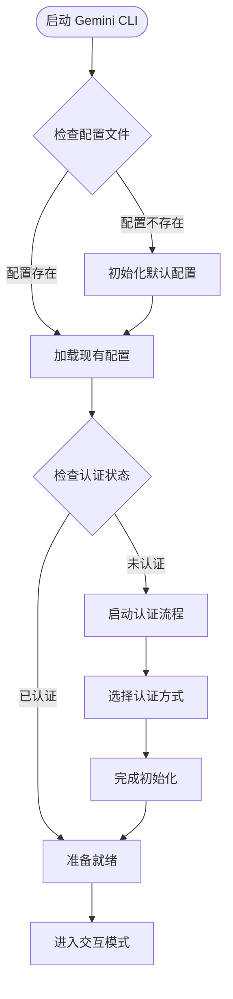
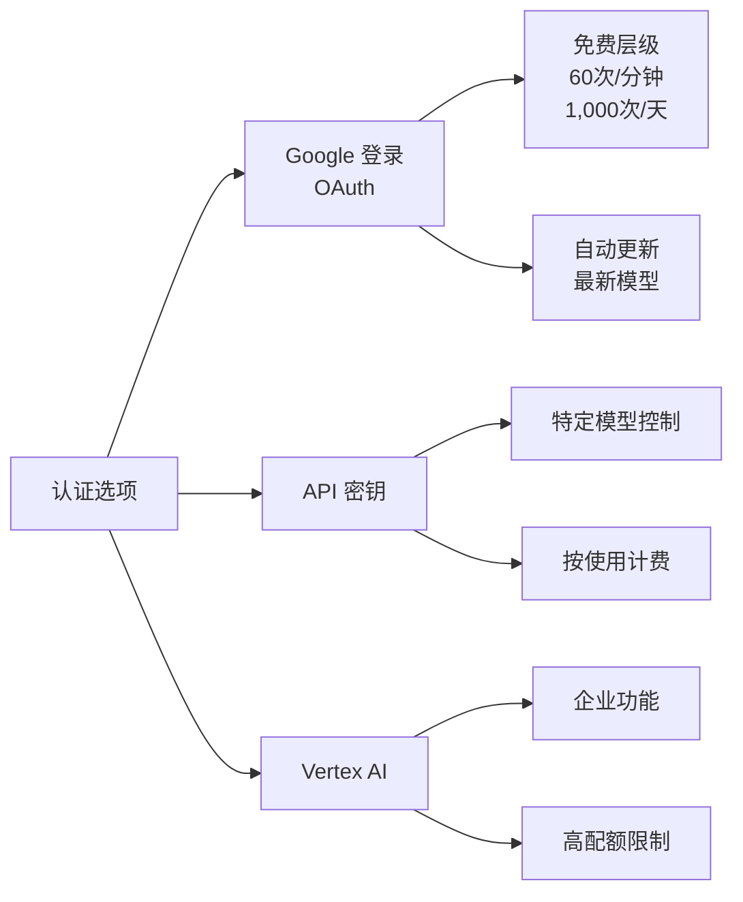
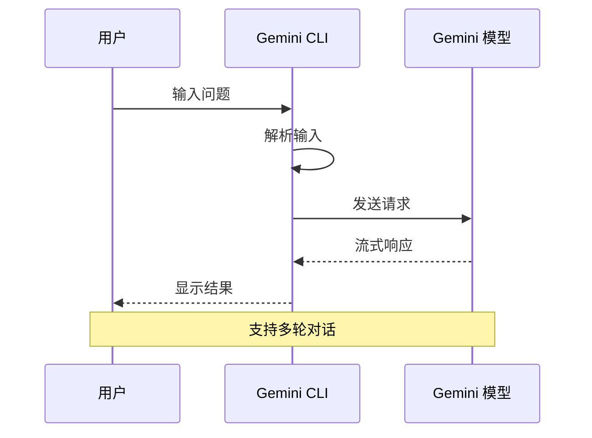

# 快速开始

<cite>
**本文档中引用的文件**
- [package.json](file://package.json)
- [README.md](file://README.md)
- [CONTRIBUTING.md](file://CONTRIBUTING.md)
- [Makefile](file://Makefile)
- [initializer.ts](file://packages/cli/src/core/initializer.ts)
- [nonInteractiveCli.ts](file://packages/cli/src/nonInteractiveCli.ts)
- [settings.ts](file://packages/cli/src/config/settings.ts)
- [settingsSchema.ts](file://packages/cli/src/config/settingsSchema.ts)
- [auth.ts](file://packages/cli/src/core/auth.ts)
- [oauth2.ts](file://packages/core/src/code_assist/oauth2.ts)
- [nonInteractiveCliCommands.ts](file://packages/cli/src/nonInteractiveCliCommands.ts)
- [App.tsx](file://packages/cli/src/ui/App.tsx)
</cite>

## 目录

1. [简介](#简介)
2. [系统要求](#系统要求)
3. [安装方法](#安装方法)
4. [初始化配置](#初始化配置)
5. [认证设置](#认证设置)
6. [首次使用](#首次使用)
7. [交互式会话](#交互式会话)
8. [非交互模式](#非交互模式)
9. [基本命令参考](#基本命令参考)
10. [故障排除](#故障排除)

## 简介

Gemini
CLI 是一个开源的人工智能代理，将 Gemini 的强大功能直接带入您的终端。它提供了对 Gemini 的轻量级访问，让您能够从提示直接与我们的模型进行交互。

### 主要特性

- **免费层级**：个人 Google 账户享有每分钟 60 次请求和每天 1,000 次请求的配额
- **强大的 Gemini 2.5 Pro**：访问 1M token 上下文窗口
- **内置工具**：Google 搜索、文件操作、Shell 命令、网页抓取
- **可扩展性**：支持 MCP（模型上下文协议）以实现自定义集成
- **终端优先**：专为生活在命令行中的开发者设计

## 系统要求

在开始之前，请确保您的系统满足以下要求：

- **Node.js 版本 20 或更高版本**
- **操作系统**：macOS、Linux 或 Windows
- **内存**：建议至少 4GB RAM（用于大型项目）

## 安装方法

Gemini CLI 提供多种安装方式，您可以选择最适合您环境的方法。

### 方法一：使用 npm 全局安装

这是最推荐的安装方式，适用于大多数用户：

```bash
# 使用 npm 安装
npm install -g @google/gemini-cli

# 验证安装
gemini --version
```

### 方法二：使用 npx 运行（无需安装）

如果您只想临时使用而不想安装，可以使用 npx：

```bash
# 直接运行（无需安装）
npx https://github.com/google-gemini/gemini-cli
```

### 方法三：使用 Homebrew（仅限 macOS/Linux）

```bash
# 安装 Homebrew（如果尚未安装）
/bin/bash -c "$(curl -fsSL https://raw.githubusercontent.com/Homebrew/install/HEAD/install.sh)"

# 使用 Homebrew 安装
brew install gemini-cli
```

### 方法四：使用 Makefile 构建

对于开发者或需要从源码构建的用户：

```bash
# 克隆仓库
git clone https://github.com/google-gemini/gemini-cli.git
cd gemini-cli

# 使用 Makefile 安装依赖
make install

# 构建项目
make build

# 启动 CLI
make start
```

**章节来源**

- [package.json](file://package.json#L19-L61)
- [README.md](file://README.md#L37-L88)
- [Makefile](file://Makefile#L1-L60)

## 初始化配置

安装完成后，您需要初始化 Gemini CLI 并设置基本配置。

### 启动 Gemini CLI

```bash
# 启动 CLI
gemini
```

首次启动时，CLI 将自动检测配置状态并引导您完成初始化过程。

### 初始化流程



**图表来源**

- [initializer.ts](file://packages/cli/src/core/initializer.ts#L34-L65)

### 配置文件位置

Gemini CLI 的配置文件存储在以下位置：

- **用户配置**：`~/.gemini/settings.json`
- **系统配置**：`/etc/gemini-cli/settings.json`（Linux/macOS）或
  `C:\ProgramData\gemini-cli\settings.json`（Windows）

**章节来源**

- [initializer.ts](file://packages/cli/src/core/initializer.ts#L1-L65)
- [settings.ts](file://packages/cli/src/config/settings.ts#L54-L151)

## 认证设置

Gemini CLI 支持多种认证方式，您可以根据自己的需求选择最适合的方式。

### 认证选项概览



**图表来源**

- [auth.ts](file://packages/cli/src/core/auth.ts#L1-L36)
- [oauth2.ts](file://packages/core/src/code_assist/oauth2.ts#L249-L298)

### 选项 1：Google 登录（推荐）

这是最适合大多数用户的认证方式。

#### 步骤 1：启动认证流程

```bash
# 启动 Gemini CLI
gemini

# 在提示符中选择 "Login with Google"
```

#### 步骤 2：浏览器认证

CLI 将自动打开浏览器，您需要：

1. 点击 "登录 Google"
2. 选择您的 Google 账户
3. 授权 Gemini CLI 访问权限

#### 步骤 3：组织账户设置

如果您使用的是付费的 Code Assist 许可证，请设置 Google Cloud 项目：

```bash
# 设置 Google Cloud 项目（如果需要）
export GOOGLE_CLOUD_PROJECT="YOUR_PROJECT_ID"

# 启动 CLI
gemini
```

#### Google 登录的优势

- ✅ **免费层级**：60 次请求/分钟，1,000 次请求/天
- ✅ **Gemini 2.5 Pro**：1M token 上下文窗口
- ✅ **无需 API 密钥管理**：只需使用 Google 账户登录
- ✅ **自动更新**：始终使用最新的模型

### 选项 2：Gemini API 密钥

适合需要特定模型控制或付费层级访问的开发者。

#### 获取 API 密钥

1. 访问 [AI Studio](https://aistudio.google.com/apikey)
2. 点击 "获取 API 密钥"
3. 复制生成的密钥

#### 设置环境变量

```bash
# 设置 API 密钥
export GEMINI_API_KEY="YOUR_API_KEY"

# 验证设置
echo $GEMINI_API_KEY

# 启动 CLI
gemini
```

#### API 密钥的优势

- ✅ **免费层级**：100 次请求/天（Gemini 2.5 Pro）
- ✅ **模型选择**：可以选择特定的 Gemini 模型
- ✅ **按使用计费**：需要时升级到更高的限制

### 选项 3：Vertex AI

适合企业团队和生产工作负载。

#### 设置环境变量

```bash
# 设置 Vertex AI API 密钥
export GOOGLE_API_KEY="YOUR_API_KEY"
export GOOGLE_GENAI_USE_VERTEXAI=true

# 启动 CLI
gemini
```

#### Vertex AI 的优势

- ✅ **企业功能**：高级安全性和合规性
- ✅ **可扩展性**：通过计费账户获得更高的速率限制
- ✅ **集成性**：与现有的 Google Cloud 基础设施配合使用

**章节来源**

- [README.md](file://README.md#L128-L195)
- [oauth2.ts](file://packages/core/src/code_assist/oauth2.ts#L295-L332)

## 首次使用

完成认证后，您已经准备好开始使用 Gemini CLI 了！

### 基本启动

```bash
# 在当前目录启动
gemini

# 或指定目录
gemini --include-directories ./src,./docs
```

### 初始界面

首次启动时，您将看到类似以下的界面：

```
Welcome to Gemini CLI!

Type your question or command here (Ctrl+C to quit):

[User Input Area]
```

### 基本交互



**图表来源**

- [nonInteractiveCli.ts](file://packages/cli/src/nonInteractiveCli.ts#L54-L439)

## 交互式会话

Gemini
CLI 的主要使用方式是交互式会话，在这种模式下，您可以与 AI 进行连续的对话。

### 基本对话示例

```bash
# 启动交互式会话
gemini

# 示例 1：代码解释
> 解释这段代码的功能
> 如何优化这个算法？

# 示例 2：项目分析
> 分析这个项目的架构
> 找出潜在的安全漏洞

# 示例 3：学习指导
> 教我如何使用 React Hooks
> 解释计算机网络的基础概念

# 示例 4：创意写作
> 写一首关于春天的诗
> 编写一个科幻故事开头
```

### 会话管理

#### 保存对话

```bash
# 保存当前对话到检查点
/chat save my-session

# 查看所有保存的对话
/chat list

# 从检查点恢复对话
/chat resume my-session
```

#### 删除对话

```bash
# 删除特定检查点
/chat delete my-session
```

### 高级交互功能

#### 文件包含

```bash
# 包含特定文件的内容
> @include ./src/main.js

# 包含整个目录
> @include ./src/components/
```

#### 工具调用

```bash
# 使用内置工具
> 列出当前目录的所有文件
> 搜索项目中的 TODO 注释
> 运行测试并报告结果
```

**章节来源**

- [App.tsx](file://packages/cli/src/ui/App.tsx#L1-L28)
- [nonInteractiveCliCommands.ts](file://packages/cli/src/nonInteractiveCliCommands.ts#L31-L109)

## 非交互模式

除了交互式会话，Gemini CLI 还支持非交互模式，这非常适合脚本自动化和批量处理。

### 基本非交互命令

#### 单行查询

```bash
# 简单文本响应
gemini -p "解释什么是机器学习"

# 使用输出格式
gemini -p "列出项目的主要技术栈" --output-format json
```

#### 输出格式选项

```bash
# 文本格式（默认）
gemini -p "总结项目架构"

# JSON 格式
gemini -p "提取配置参数" --output-format json

# 流式 JSON 格式（实时事件）
gemini -p "监控服务器状态" --output-format stream-json
```

### 高级非交互用法

#### 脚本集成示例

```bash
#!/bin/bash
# 项目文档生成脚本

# 获取项目架构摘要
ARCHITECTURE=$(gemini -p "分析项目架构并生成技术文档" --output-format json)

# 生成 README.md
echo "# 项目名称" > README.md
echo "" >> README.md
echo "$ARCHITECTURE" | jq -r '.content' >> README.md

# 添加使用说明
echo "" >> README.md
echo "## 使用说明" >> README.md
echo "" >> README.md
echo "$(gemini -p "生成使用说明" --output-format text)" >> README.md
```

#### 错误处理

```bash
# 带错误检查的脚本
response=$(gemini -p "验证代码质量" --output-format json 2>/dev/null)
if [ $? -eq 0 ]; then
    echo "验证成功: $response"
else
    echo "验证失败: 无法连接到 Gemini"
    exit 1
fi
```

### 非交互命令参考

```bash
# 基本语法
gemini [OPTIONS] [PROMPT]

# 常用选项
-p, --prompt          # 指定提示文本（已弃用，建议使用位置参数）
--output-format       # 输出格式：text/json/stream-json
--model               # 指定模型（如 gemini-2.5-flash）
--include-directories # 包含的目录
```

**章节来源**

- [nonInteractiveCli.ts](file://packages/cli/src/nonInteractiveCli.ts#L46-L439)

## 基本命令参考

Gemini CLI 提供了一系列内置命令来增强您的使用体验。

### 对话管理命令

```bash
# 保存当前对话
/chat save <tag>

# 列出所有保存的对话
/chat list

# 从检查点恢复对话
/chat resume <tag>

# 删除特定对话
/chat delete <tag>

# 分享对话到文件
/chat share [filename]
```

### 系统命令

```bash
# 显示帮助
/help

# 显示系统信息
/system

# 退出程序
/quit
```

### 工具命令

```bash
# 列出可用工具
/tool list

# 搜索文件
/grep <pattern>

# 列出目录
/ls [path]

# 编辑文件
/edit <file>

# 运行 Shell 命令
/shell <command>
```

### 配置命令

```bash
# 查看当前配置
/config get

# 设置配置项
/config set <key> <value>

# 重置配置
/config reset
```

## 故障排除

### 常见问题及解决方案

#### 1. 安装问题

**问题**：`npm install -g @google/gemini-cli` 失败 **解决方案**：

```bash
# 清理 npm 缓存
npm cache clean --force

# 重新安装
npm install -g @google/gemini-cli
```

**问题**：权限错误 **解决方案**：

```bash
# 使用 sudo（不推荐）
sudo npm install -g @google/gemini-cli

# 或者修复 npm 权限
mkdir ~/.npm-global
npm config set prefix '~/.npm-global'
export PATH=~/.npm-global/bin:$PATH
```

#### 2. 认证问题

**问题**：Google 登录失败 **解决方案**：

```bash
# 清除缓存的认证信息
rm -rf ~/.gemini/auth/*

# 重新尝试登录
gemini
```

**问题**：API 密钥无效 **解决方案**：

```bash
# 验证 API 密钥
echo $GEMINI_API_KEY

# 重新设置
unset GEMINI_API_KEY
export GEMINI_API_KEY="NEW_API_KEY"
```

#### 3. 性能问题

**问题**：响应速度慢 **解决方案**：

```bash
# 使用更快的模型
gemini -m gemini-2.5-flash

# 减少上下文大小
gemini --include-directories ./src
```

**问题**：内存不足 **解决方案**：

```bash
# 增加 Node.js 内存限制
export NODE_OPTIONS="--max-old-space-size=4096"
gemini
```

#### 4. 调试技巧

启用调试模式：

```bash
# 启用详细日志
DEBUG=1 gemini

# 查看配置信息
gemini --help
```

查看配置文件：

```bash
# 编辑配置
nano ~/.gemini/settings.json

# 重置配置
gemini config reset
```

### 获取帮助

```bash
# 查看帮助
gemini --help

# 查看版本
gemini --version

# 报告问题
/bug
```

**章节来源**

- [CONTRIBUTING.md](file://CONTRIBUTING.md#L1-L549)

## 结论

恭喜！您现在已经掌握了 Gemini CLI 的基本使用方法。从这里开始，您可以：

1. **探索更多功能**：尝试不同的认证方式和配置选项
2. **自动化工作流**：将 Gemini CLI 集成到您的开发流程中
3. **扩展功能**：使用 MCP 服务器添加自定义工具
4. **贡献社区**：参与开源项目的发展

记住，Gemini
CLI 是一个强大的工具，随着您使用得越多，您会发现更多提高生产力的方法。祝您使用愉快！
