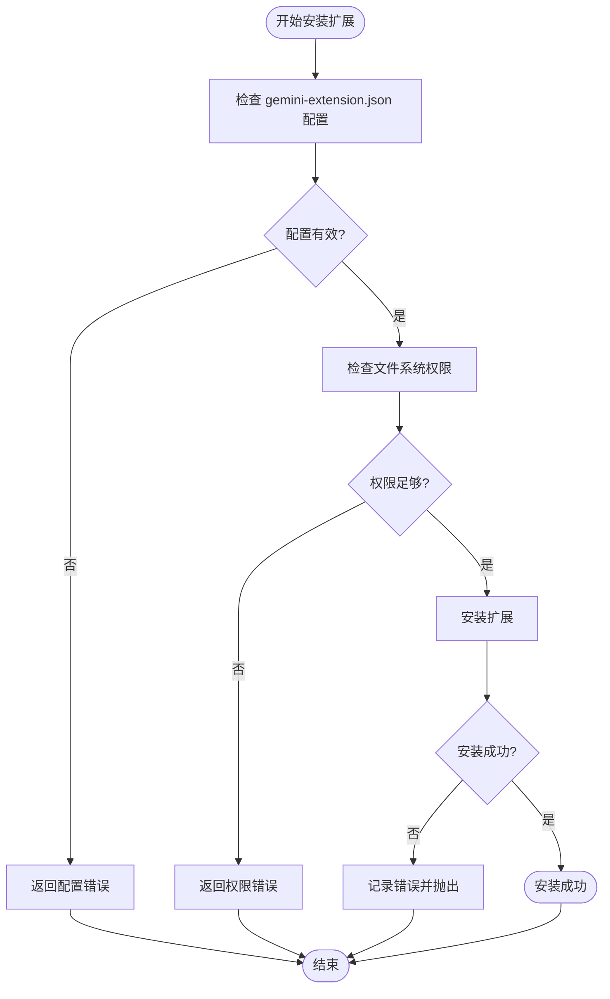
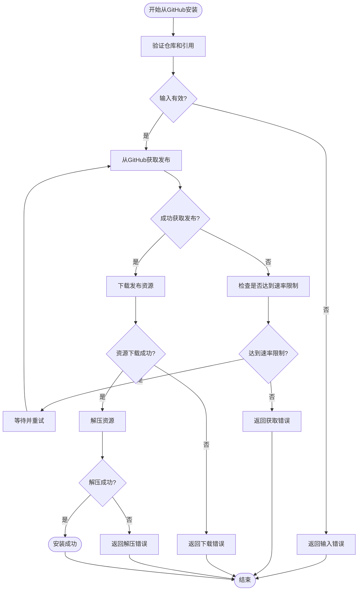
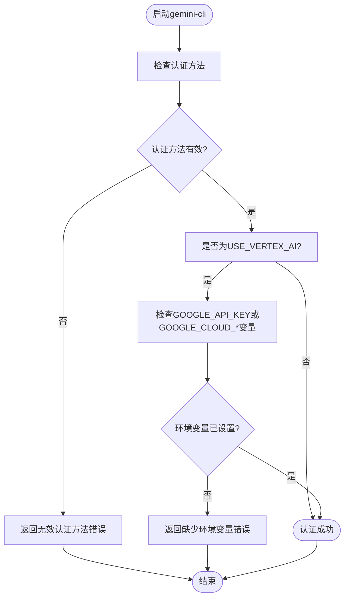
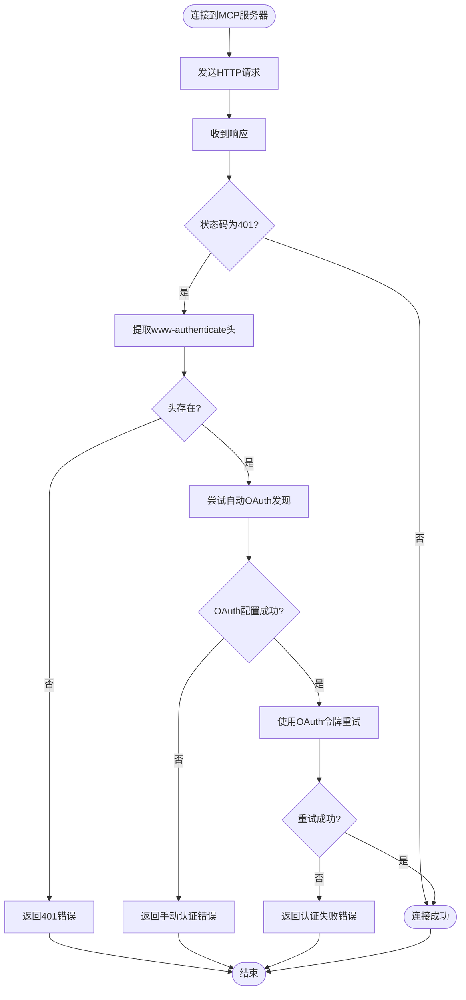
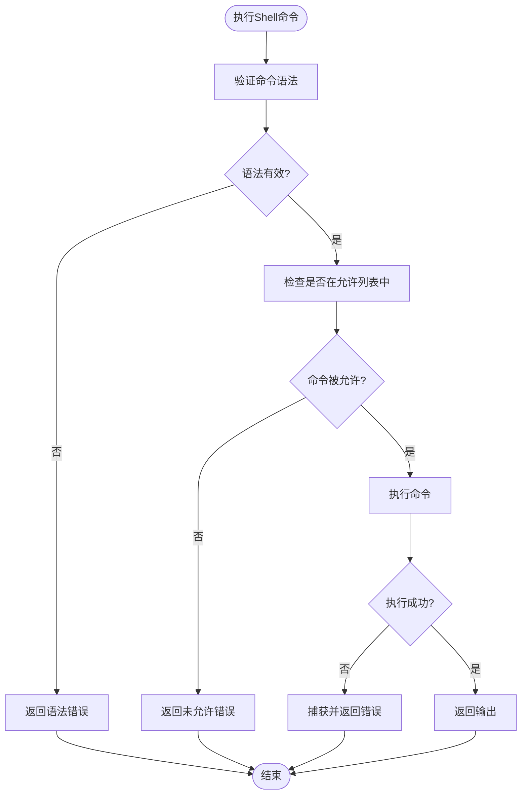
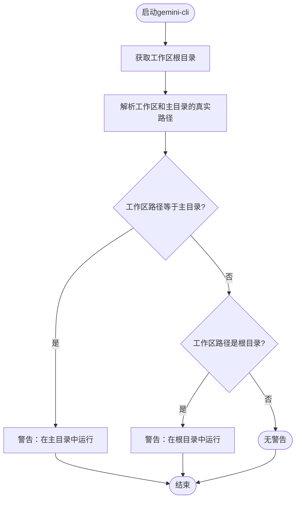

# 故障排除

<cite>
**本文档中引用的文件**  
- [startupWarnings.ts](file://packages/cli/src/utils/startupWarnings.ts)
- [userStartupWarnings.ts](file://packages/cli/src/utils/userStartupWarnings.ts)
- [auth.ts](file://packages/cli/src/config/auth.ts)
- [errors.ts](file://packages/core/src/utils/errors.ts)
- [errorReporting.ts](file://packages/core/src/utils/errorReporting.ts)
- [googleErrors.ts](file://packages/core/src/utils/googleErrors.ts)
- [quotaErrorDetection.ts](file://packages/core/src/utils/quotaErrorDetection.ts)
- [mcp-client.ts](file://packages/core/src/tools/mcp-client.ts)
- [extension-manager.ts](file://packages/cli/src/config/extension-manager.ts)
- [github.ts](file://packages/cli/src/config/extensions/github.ts)
- [run_shell_command.test.ts](file://integration-tests/run_shell_command.test.ts)
- [extensions-install.test.ts](file://integration-tests/extensions-install.test.ts)
- [mcp_server_cyclic_schema.test.ts](file://integration-tests/mcp_server_cyclic_schema.test.ts)
- [globalSetup.ts](file://integration-tests/globalSetup.ts)
- [cleanup.ts](file://packages/cli/src/utils/cleanup.ts)
</cite>

## 目录

1. [简介](#简介)
2. [安装失败](#安装失败)
3. [认证错误](#认证错误)
4. [网络连接问题](#网络连接问题)
5. [工具执行失败](#工具执行失败)
6. [性能问题](#性能问题)
7. [诊断信息收集](#诊断信息收集)
8. [寻求进一步帮助](#寻求进一步帮助)

## 简介

本故障排除指南旨在帮助用户解决在使用gemini-cli时可能遇到的常见问题。该指南根据问题的性质将其分为几个类别，包括安装失败、认证错误、网络连接问题、工具执行失败和性能问题。本指南利用集成测试用例来识别常见故障点，并引用`startupWarnings.ts`中提到的警告信息，为用户提供清晰的症状描述、可能的根本原因和逐步的解决方案。

**Section sources**

- [startupWarnings.ts](file://packages/cli/src/utils/startupWarnings.ts)
- [userStartupWarnings.ts](file://packages/cli/src/utils/userStartupWarnings.ts)

## 安装失败

### 本地扩展安装失败

当尝试安装本地扩展时，可能会遇到安装失败的问题。这通常发生在使用`extensions install`命令时。

**症状**：

- 安装命令返回错误消息
- 扩展未出现在`extensions list`命令的输出中

**可能的根本原因**：

- 源路径中的扩展配置文件（`gemini-extension.json`）格式不正确
- 文件系统权限问题，导致无法读取或写入文件
- 网络问题（如果安装涉及远程资源）

**解决方案**：

1. 验证`gemini-extension.json`文件是否存在且格式正确。
2. 检查您对源路径和目标安装目录的读写权限。
3. 如果问题持续存在，请检查`TELEMETRY_LOG_FILE`环境变量指定的日志文件以获取更多详细信息。

**Diagram sources**

- [extension-manager.ts](file://packages/cli/src/config/extension-manager.ts#L332-L376)
- [extensions-install.test.ts](file://integration-tests/extensions-install.test.ts#L22-L54)

### GitHub扩展安装失败

从GitHub安装扩展时可能会失败，尤其是在处理发布版本或预发布版本时。

**症状**：

- `extensions install`命令无法从GitHub获取扩展
- 返回“无法获取发布数据”或“未找到发布资源”等错误

**可能的根本原因**：

- 指定的GitHub仓库、所有者或引用（如标签或分支）不正确
- 网络连接问题阻止访问GitHub API
- GitHub API速率限制

**解决方案**：

1. 验证您在安装命令中提供的GitHub仓库URL是否正确。
2. 检查您的网络连接，并确保可以访问`api.github.com`。
3. 如果您遇到速率限制，请等待一段时间后重试，或考虑使用个人访问令牌进行身份验证。

**Diagram sources**

- [github.ts](file://packages/cli/src/config/extensions/github.ts#L235-L283)
- [extensions-install.test.ts](file://integration-tests/extensions-install.test.ts#L22-L54)

## 认证错误

### 无效的认证方法

当配置的认证方法无效或缺少必要的环境变量时，会出现此错误。

**症状**：

- 启动gemini-cli时出现错误消息
- 错误消息指出“无效的认证方法”或缺少`GOOGLE_API_KEY`、`GOOGLE_CLOUD_PROJECT`等环境变量

**可能的根本原因**：

- `authMethod`设置为`USE_VERTEX_AI`，但未设置`GOOGLE_API_KEY`或`GOOGLE_CLOUD_PROJECT`和`GOOGLE_CLOUD_LOCATION`环境变量
- `authMethod`配置值拼写错误或不被支持

**解决方案**：

1. 检查您的配置文件或环境变量中的`authMethod`设置。
2. 如果使用Vertex
   AI，请确保设置了`GOOGLE_API_KEY`或`GOOGLE_CLOUD_PROJECT`和`GOOGLE_CLOUD_LOCATION`。
3. 参考`auth.ts`文件中的`validateAuthMethod`函数以了解支持的认证方法和要求。

**Diagram sources**

- [auth.ts](file://packages/cli/src/config/auth.ts#L10-L40)
- [errors.ts](file://packages/core/src/utils/errors.ts#L37-L45)

### MCP服务器OAuth认证失败

当MCP服务器需要OAuth认证但配置失败时，会出现此问题。

**症状**：

- 连接到MCP服务器时出现“401错误”或“需要认证”的消息
- 错误消息建议使用`/mcp auth <server_name>`进行认证

**可能的根本原因**：

- 未为MCP服务器配置OAuth凭据
- 存储的OAuth令牌已过期或被服务器拒绝
- 自动OAuth发现失败

**解决方案**：

1. 使用`/mcp auth <server_name>`命令手动为MCP服务器进行认证。
2. 如果已认证但令牌被拒绝，请重新运行认证命令以获取新令牌。
3. 检查服务器的`www-authenticate`头以确认其支持的认证方案。

**Diagram sources**

- [mcp-client.ts](file://packages/core/src/tools/mcp-client.ts#L900-L966)
- [mcp-client.ts](file://packages/core/src/tools/mcp-client.ts#L1008-L1038)

## 网络连接问题

### MCP服务器连接被拒绝

当无法建立与MCP服务器的网络连接时，会出现此问题。

**症状**：

- 错误消息包含`ECONNREFUSED`或`ENOTFOUND`
- 无法通过`/mcp list`命令看到服务器的工具

**可能的根本原因**：

- MCP服务器未运行或在指定端口上未监听
- 防火墙或网络策略阻止了连接
- 服务器URL配置错误

**解决方案**：

1. 验证MCP服务器进程是否正在运行。
2. 检查服务器配置中的URL和端口是否正确。
3. 确认您的网络环境允许与服务器的通信。

**Section sources**

- [mcp-client.ts](file://packages/core/src/tools/mcp-client.ts#L1112-L1141)

### 无法获取www-authenticate头

当服务器返回401错误但未提供`www-authenticate`头时，自动OAuth发现会失败。

**症状**：

- 尝试连接需要认证的MCP服务器时失败
- 日志显示“未从错误中获取www-authenticate头”
- 系统尝试从服务器获取头但失败

**可能的根本原因**：

- 服务器实现不标准，未在401响应中包含`www-authenticate`头
- 网络问题导致HEAD请求失败
- 服务器暂时不可用

**解决方案**：

1. 检查MCP服务器的实现，确保它在401响应中正确发送`www-authenticate`头。
2. 手动使用`/mcp auth <server_name>`命令进行认证，绕过自动发现。
3. 检查网络连接和服务器状态。

**Section sources**

- [mcp-client.ts](file://packages/core/src/tools/mcp-client.ts#L900-L940)

## 工具执行失败

### Shell命令执行失败

当`run_shell_command`工具执行失败时，通常是因为命令语法错误或不在允许列表中。

**症状**：

- 模型尝试执行shell命令但失败
- 错误消息指出命令无效或未被允许
- 在非交互模式下，命令因安全策略被拒绝

**可能的根本原因**：

- 命令包含无效语法（如`echo "hello" > > file`）
- 命令或其子命令未在`--allowed-tools`标志中指定
- 使用了平台特定的命令，而当前shell不支持

**解决方案**：

1. 验证shell命令的语法是否正确。
2. 在非交互模式下，使用`--allowed-tools`标志明确允许所需的命令或工具。
3. 使用`--yolo`标志临时禁用工具执行限制进行测试。

**Diagram sources**

- [run_shell_command.test.ts](file://integration-tests/run_shell_command.test.ts#L567-L614)
- [run_shell_command.test.ts](file://integration-tests/run_shell_command.test.ts#L363-L392)

### 文件读写权限错误

当工具尝试读取或写入文件但遇到权限问题时，会发生此错误。

**症状**：

- `read-file`或`write-file`工具返回“权限被拒绝”错误
- 错误消息包含`EACCES`代码

**可能的根本原因**：

- 目标文件或目录的权限设置阻止了读取或写入
- 尝试写入一个目录而不是文件
- 磁盘空间不足

**解决方案**：

1. 检查相关文件和目录的权限，确保gemini-cli进程有适当的访问权限。
2. 确保您没有尝试将内容写入一个已存在的目录。
3. 检查磁盘空间，确保有足够的可用空间。

**Section sources**

- [write-file.test.ts](file://packages/core/src/tools/write-file.test.ts#L831-L868)

## 性能问题

### 启动警告：在根目录或主目录中运行

在根目录或主目录中运行gemini-cli会导致性能问题，因为它会将整个文件系统作为上下文。

**症状**：

- 启动时显示警告消息
- 消息内容为“您正在根目录中运行Gemini CLI”或“您正在主目录中运行Gemini CLI”

**可能的根本原因**：

- 当前工作目录是`/`（根目录）或`~`（主目录）
- 这会导致工具扫描整个文件系统，消耗大量时间和资源

**解决方案**：

1. 将您的工作目录更改为一个特定的项目目录。
2. 在项目根目录中启动gemini-cli。

**Diagram sources**

- [userStartupWarnings.ts](file://packages/cli/src/utils/userStartupWarnings.ts#L17-L32)
- [userStartupWarnings.ts](file://packages/cli/src/utils/userStartupWarnings.ts#L36-L53)

## 诊断信息收集

为了帮助诊断问题，您可以收集以下诊断信息：

- **日志文件**：检查`TELEMETRY_LOG_FILE`环境变量指定的日志文件。
- **错误报告**：当发生严重错误时，系统会生成一个JSON格式的错误报告，其中包含错误消息、堆栈跟踪和上下文。报告文件通常位于系统的临时目录中，文件名以`gemini-client-error-`开头。
- **调试信息**：设置`VERBOSE=true`或`MCP_DEBUG=true`环境变量以启用更详细的日志记录。

**Section sources**

- [errorReporting.ts](file://packages/core/src/utils/errorReporting.ts#L25-L118)
- [globalSetup.ts](file://integration-tests/globalSetup.ts#L57)

## 寻求进一步帮助

如果上述步骤无法解决问题，请提供以下信息以寻求进一步帮助：

1. 您遇到的具体错误消息。
2. 您执行的命令。
3. 相关的日志文件或错误报告。
4. 您的gemini-cli版本和操作系统信息。

您可以将这些信息提交给支持团队或在相关社区论坛中寻求帮助。

**Section sources**

- [cleanup.ts](file://packages/cli/src/utils/cleanup.ts#L28-L37)
- [errorReporting.ts](file://packages/core/src/utils/errorReporting.ts#L25-L118)
