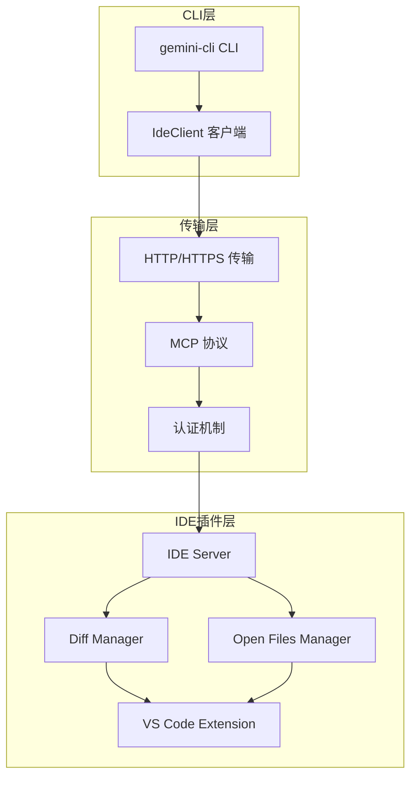
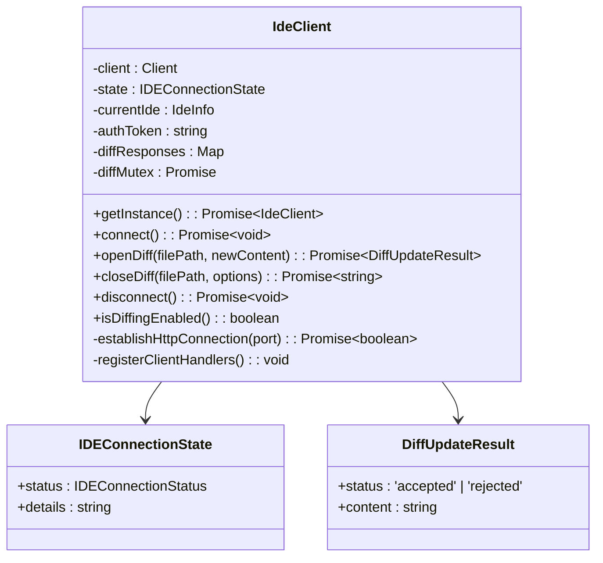
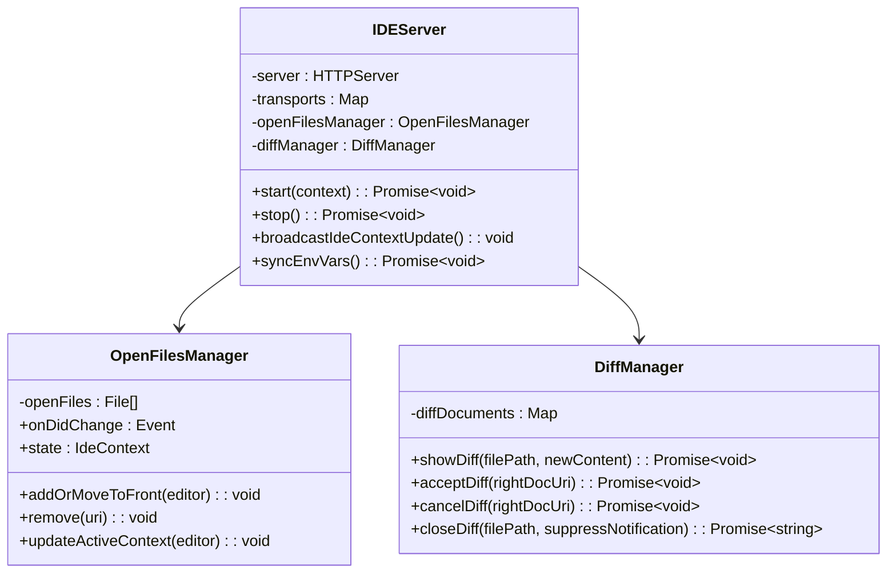
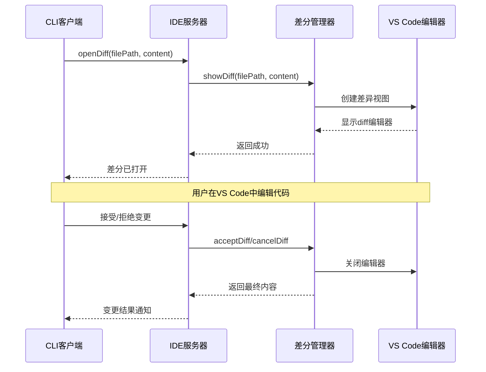
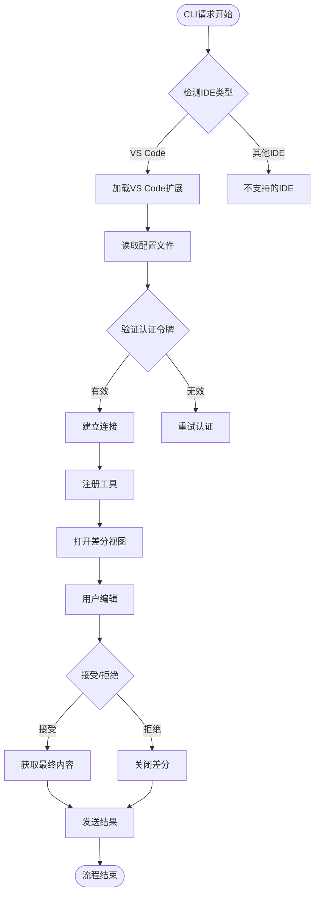
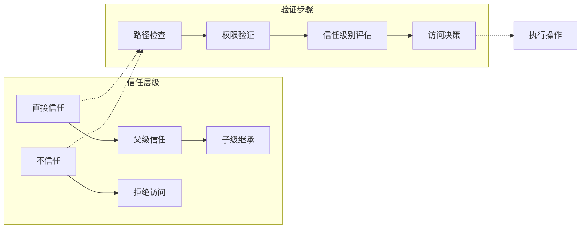
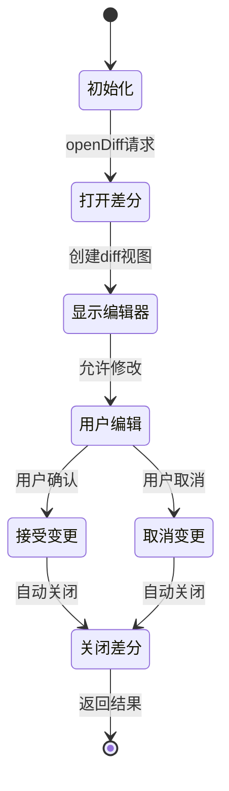
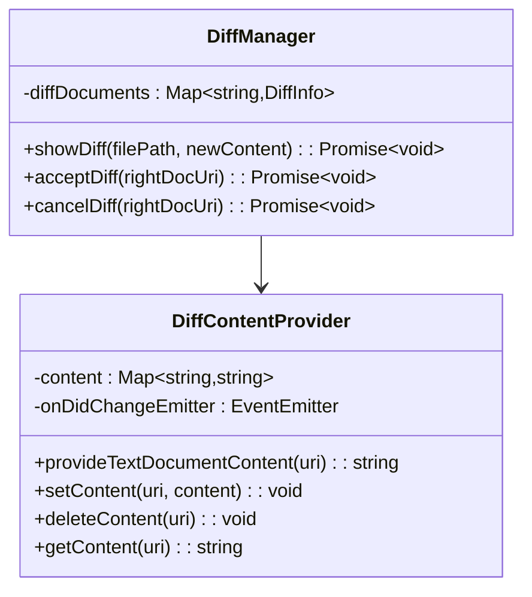

# IDE集成架构文档

<cite>
**本文档中引用的文件**
- [ide-server.ts](file://packages/vscode-ide-companion/src/ide-server.ts)
- [diff-manager.ts](file://packages/vscode-ide-companion/src/diff-manager.ts)
- [ide-client.ts](file://packages/core/src/ide/ide-client.ts)
- [detect-ide.ts](file://packages/core/src/ide/detect-ide.ts)
- [extension.ts](file://packages/vscode-ide-companion/src/extension.ts)
- [types.ts](file://packages/core/src/ide/types.ts)
- [open-files-manager.ts](file://packages/vscode-ide-companion/src/open-files-manager.ts)
- [process-utils.ts](file://packages/core/src/ide/process-utils.ts)
- [constants.ts](file://packages/core/src/ide/constants.ts)
</cite>

## 目录

1. [简介](#简介)
2. [系统架构概览](#系统架构概览)
3. [核心组件分析](#核心组件分析)
4. [通信协议与数据流](#通信协议与数据流)
5. [安全模型与权限控制](#安全模型与权限控制)
6. [代码变更管理](#代码变更管理)
7. [开发体验增强功能](#开发体验增强功能)
8. [故障排除指南](#故障排除指南)
9. [总结](#总结)

## 简介

gemini-cli的IDE集成功术提供了一个强大的跨平台开发环境，通过VS
Code插件扩展实现了CLI与IDE之间的无缝通信。该集成支持智能代码编辑、实时上下文感知和安全的代码变更管理，显著提升了开发效率和代码质量。

## 系统架构概览

整个IDE集成系统采用分层架构设计，包含三个主要层次：

**图表来源**

- [ide-client.ts](file://packages/core/src/ide/ide-client.ts#L80-L120)
- [ide-server.ts](file://packages/vscode-ide-companion/src/ide-server.ts#L113-L130)
- [extension.ts](file://packages/vscode-ide-companion/src/extension.ts#L106-L150)

**章节来源**

- [ide-client.ts](file://packages/core/src/ide/ide-client.ts#L1-L100)
- [ide-server.ts](file://packages/vscode-ide-companion/src/ide-server.ts#L1-L100)

## 核心组件分析

### IdeClient - CLI客户端

IdeaClient是CLI与IDE插件通信的核心组件，负责建立连接、发送请求和处理响应。

**图表来源**

- [ide-client.ts](file://packages/core/src/ide/ide-client.ts#L81-L110)
- [ide-client.ts](file://packages/core/src/ide/ide-client.ts#L46-L56)

#### 关键特性：

- **连接管理**：自动检测IDE类型并建立连接
- **差分编辑**：支持打开、接受和拒绝代码变更
- **互斥锁机制**：确保同时只能有一个差分视图打开
- **状态监控**：实时跟踪连接状态和信任级别

**章节来源**

- [ide-client.ts](file://packages/core/src/ide/ide-client.ts#L81-L200)

### IDEServer - VS Code插件服务器

IDEServer在VS Code插件中运行，作为CLI与IDE之间的桥梁，提供HTTP
API和MCP协议支持。

**图表来源**

- [ide-server.ts](file://packages/vscode-ide-companion/src/ide-server.ts#L113-L130)
- [open-files-manager.ts](file://packages/vscode-ide-companion/src/open-files-manager.ts#L19-L40)
- [diff-manager.ts](file://packages/vscode-ide-companion/src/diff-manager.ts#L52-L70)

#### 核心功能：

- **HTTP服务器**：监听本地端口提供REST API
- **MCP协议支持**：实现Model Context Protocol标准
- **会话管理**：维护多个并发会话连接
- **心跳机制**：定期检查连接健康状态

**章节来源**

- [ide-server.ts](file://packages/vscode-ide-companion/src/ide-server.ts#L113-L200)
- [open-files-manager.ts](file://packages/vscode-ide-companion/src/open-files-manager.ts#L19-L80)

### DiffManager - 差分管理器

DiffManager专门负责处理代码变更的可视化和用户交互。

**图表来源**

- [diff-manager.ts](file://packages/vscode-ide-companion/src/diff-manager.ts#L77-L130)
- [ide-server.ts](file://packages/vscode-ide-companion/src/ide-server.ts#L441-L492)

**章节来源**

- [diff-manager.ts](file://packages/vscode-ide-companion/src/diff-manager.ts#L52-L150)

## 通信协议与数据流

### MCP协议实现

系统采用Model Context Protocol (MCP)作为主要通信协议，提供标准化的工具调用接口。

**图表来源**

- [ide-server.ts](file://packages/vscode-ide-companion/src/ide-server.ts#L441-L492)
- [ide-client.ts](file://packages/core/src/ide/ide-client.ts#L230-L280)

### 数据类型定义

系统使用Zod模式验证确保数据完整性：

| 消息类型                      | 描述              | 主要字段                                               |
| ----------------------------- | ----------------- | ------------------------------------------------------ |
| `IdeContextNotification`      | IDE上下文更新通知 | `workspaceState.openFiles`, `workspaceState.isTrusted` |
| `IdeDiffAcceptedNotification` | 差分接受通知      | `filePath`, `content`                                  |
| `IdeDiffRejectedNotification` | 差分拒绝通知      | `filePath`                                             |
| `OpenDiffRequest`             | 打开差分请求      | `filePath`, `newContent`                               |
| `CloseDiffRequest`            | 关闭差分请求      | `filePath`, `suppressNotification`                     |

**章节来源**

- [types.ts](file://packages/core/src/ide/types.ts#L1-L149)

## 安全模型与权限控制

### 工作区信任机制

系统实现了多层次的信任验证机制：

**图表来源**

- [trustedFolders.ts](file://packages/cli/src/config/trustedFolders.ts#L167-L216)

### 认证与授权

#### HTTP认证机制

- **Bearer Token**：使用随机生成的UUID作为认证令牌
- **CORS策略**：严格限制允许的源地址
- **主机头验证**：只接受本地回环地址请求

#### 连接安全特性

- **临时端口**：每次启动时分配随机端口
- **文件权限**：配置文件设置严格的600权限
- **进程隔离**：通过进程树识别和验证IDE进程

**章节来源**

- [ide-server.ts](file://packages/vscode-ide-companion/src/ide-server.ts#L131-L200)
- [process-utils.ts](file://packages/core/src/ide/process-utils.ts#L1-L100)

## 代码变更管理

### 差分视图生命周期

**图表来源**

- [diff-manager.ts](file://packages/vscode-ide-companion/src/diff-manager.ts#L132-L215)

### 内容提供者模式

DiffManager使用VS Code的文本文档内容提供者API：

**图表来源**

- [diff-manager.ts](file://packages/vscode-ide-companion/src/diff-manager.ts#L16-L40)

**章节来源**

- [diff-manager.ts](file://packages/vscode-ide-companion/src/diff-manager.ts#L52-L268)

## 开发体验增强功能

### 实时上下文感知

OpenFilesManager持续监控IDE状态：

- **文件活动跟踪**：记录最近打开的10个文件
- **光标位置同步**：实时更新当前光标位置
- **选中文本捕获**：最大16KB的选中文本缓存
- **工作区信任状态**：同步VS Code的信任级别

### 智能编辑功能

- **跨文件编辑**：支持在不同文件间进行智能编辑
- **实时预览**：差分视图提供即时反馈
- **手动编辑支持**：允许用户在差分视图中手动调整代码
- **批量操作**：支持多个文件的批量变更管理

### 性能优化特性

- **防抖机制**：上下文更新采用50ms防抖
- **内存管理**：限制同时打开的文件数量
- **增量更新**：只在必要时发送上下文更新
- **连接池管理**：高效管理多个并发连接

**章节来源**

- [open-files-manager.ts](file://packages/vscode-ide-companion/src/open-files-manager.ts#L19-L183)

## 故障排除指南

### 常见问题诊断

#### 连接失败

1. **检查扩展安装**：确认VS Code扩展已正确安装
2. **验证端口可用性**：检查本地端口是否被占用
3. **防火墙设置**：确保本地回环地址访问未被阻止
4. **进程状态**：确认IDE进程仍在运行

#### 权限错误

1. **工作区信任**：检查VS Code工作区信任设置
2. **文件权限**：验证配置文件权限设置
3. **路径匹配**：确认CLI和IDE在同一工作区目录下

#### 差分功能异常

1. **互斥锁问题**：等待当前差分操作完成
2. **编辑器状态**：检查VS Code编辑器窗口状态
3. **内存限制**：注意大文件的内存使用情况

### 调试工具

系统提供了详细的日志记录功能：

- **调试输出**：通过环境变量启用详细日志
- **连接状态**：实时监控连接状态变化
- **错误追踪**：完整的错误堆栈信息

**章节来源**

- [ide-client.ts](file://packages/core/src/ide/ide-client.ts#L769-L847)
- [ide-server.ts](file://packages/vscode-ide-companion/src/ide-server.ts#L366-L438)

## 总结

gemini-cli的IDE集成功术通过精心设计的架构实现了CLI与VS
Code之间的深度集成。该系统具备以下核心优势：

### 技术创新点

- **标准化协议**：采用MCP协议确保跨平台兼容性
- **安全优先**：多层认证和权限控制机制
- **用户体验**：直观的差分编辑界面
- **性能优化**：高效的资源管理和响应式设计

### 应用价值

- **开发效率**：显著提升代码编辑和审查速度
- **质量保证**：通过可视化审查提高代码质量
- **协作支持**：便于团队间的代码审查和协作
- **学习辅助**：为开发者提供更好的代码理解工具

该集成系统不仅展示了现代IDE生态系统的深度整合能力，更为未来的开发工具创新提供了重要的技术参考和实践范例。
