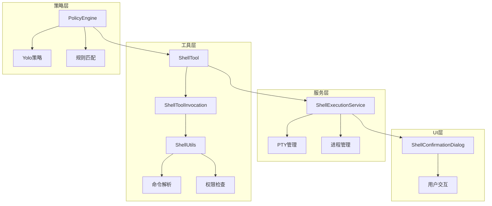
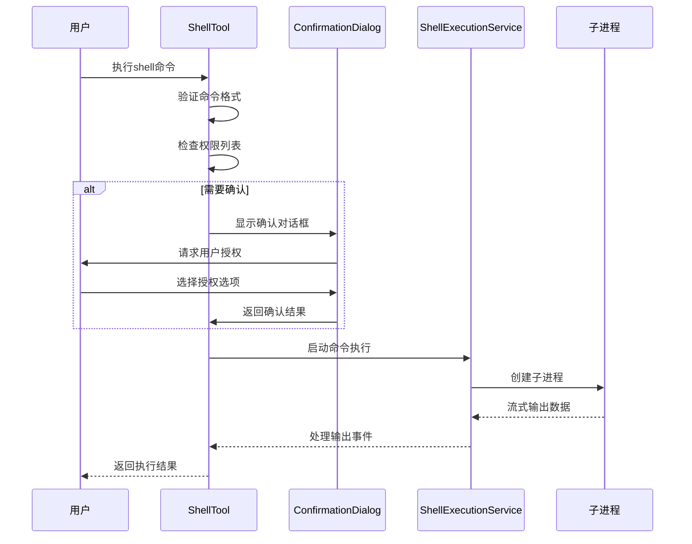
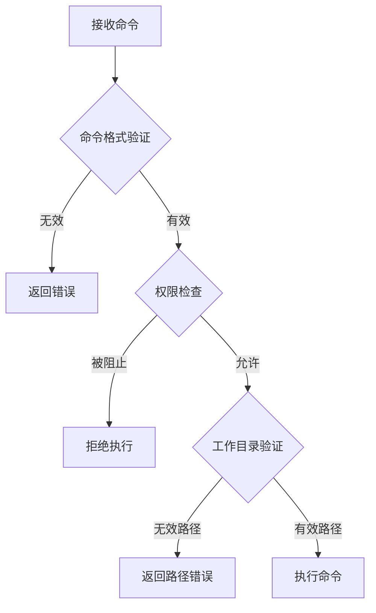
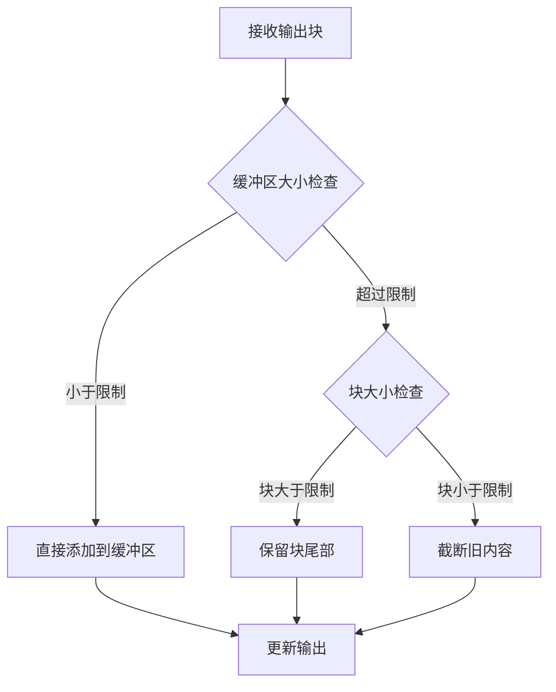
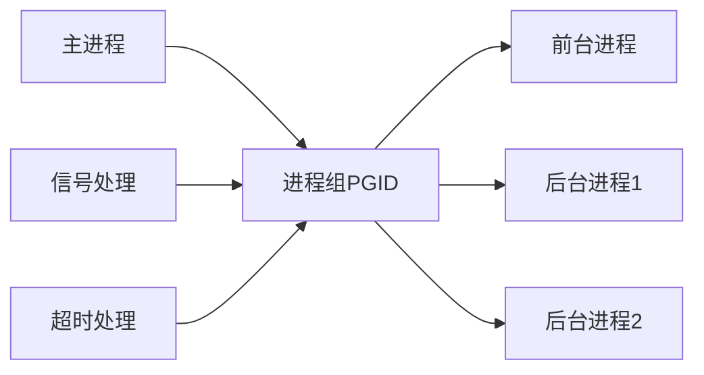
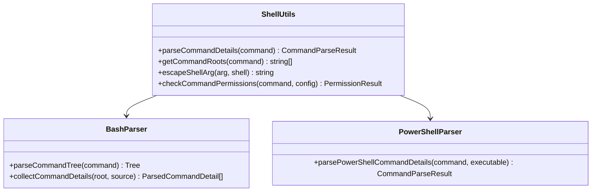
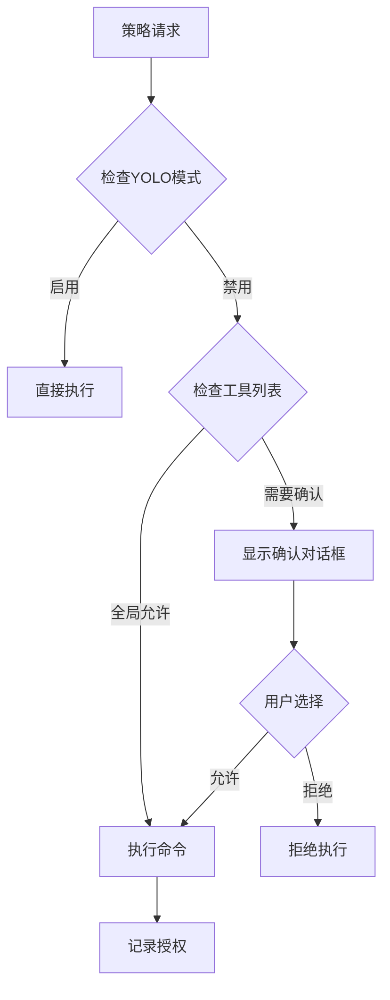

# Shell执行工具

<cite>
**本文档中引用的文件**
- [shell.ts](file://packages/core/src/tools/shell.ts)
- [shellExecutionService.ts](file://packages/core/src/services/shellExecutionService.ts)
- [shell-utils.ts](file://packages/core/src/utils/shell-utils.ts)
- [ShellConfirmationDialog.tsx](file://packages/cli/src/ui/components/ShellConfirmationDialog.tsx)
- [policy-engine.ts](file://packages/core/src/policy/policy-engine.ts)
- [types.ts](file://packages/core/src/policy/types.ts)
- [tool-names.ts](file://packages/core/src/tools/tool-names.ts)
</cite>

## 目录

1. [简介](#简介)
2. [项目结构](#项目结构)
3. [核心组件](#核心组件)
4. [架构概览](#架构概览)
5. [详细组件分析](#详细组件分析)
6. [安全机制](#安全机制)
7. [使用示例](#使用示例)
8. [最佳实践](#最佳实践)
9. [故障排除指南](#故障排除指南)
10. [结论](#结论)

## 简介

gemini-cli
Shell执行工具是一个高度安全且功能强大的命令行工具，专为AI驱动的代码助手设计。该工具提供了对系统shell命令的安全访问，同时实施了多层安全防护机制来防止命令注入攻击和潜在的系统破坏。

该工具的核心特性包括：

- 基于策略的安全沙箱机制
- 智能命令解析和权限验证
- 实时输出流管理和截断策略
- 用户确认对话框和会话级授权
- 跨平台兼容性和进程生命周期管理

## 项目结构

Shell执行工具的代码分布在多个模块中，形成了一个层次化的架构：



**图表来源**

- [shell.ts](file://packages/core/src/tools/shell.ts#L376-L471)
- [shellExecutionService.ts](file://packages/core/src/services/shellExecutionService.ts#L125-L170)
- [shell-utils.ts](file://packages/core/src/utils/shell-utils.ts#L1-L50)

## 核心组件

### ShellTool类

ShellTool是整个系统的核心入口点，负责命令验证、权限检查和执行协调。它继承自BaseDeclarativeTool，提供了声明式的工具接口。

### ShellExecutionService类

ShellExecutionService管理实际的进程执行，支持多种执行模式包括PTY（伪终端）和传统子进程方式。

### ShellUtils模块

ShellUtils提供了一系列辅助函数，用于命令解析、权限验证和跨平台兼容性处理。

### ShellConfirmationDialog组件

ShellConfirmationDialog为用户提供直观的确认界面，支持一次性授权和会话级授权两种模式。

**章节来源**

- [shell.ts](file://packages/core/src/tools/shell.ts#L376-L471)
- [shellExecutionService.ts](file://packages/core/src/services/shellExecutionService.ts#L125-L170)
- [shell-utils.ts](file://packages/core/src/utils/shell-utils.ts#L1-L50)
- [ShellConfirmationDialog.tsx](file://packages/cli/src/ui/components/ShellConfirmationDialog.tsx#L27-L109)

## 架构概览

Shell执行工具采用分层架构设计，确保了安全性、可扩展性和维护性：



**图表来源**

- [shell.ts](file://packages/core/src/tools/shell.ts#L132-L228)
- [shellExecutionService.ts](file://packages/core/src/services/shellExecutionService.ts#L137-L169)
- [ShellConfirmationDialog.tsx](file://packages/cli/src/ui/components/ShellConfirmationDialog.tsx#L31-L49)

## 详细组件分析

### ShellTool实现分析

ShellTool类是Shell执行工具的主要接口，实现了以下关键功能：

#### 命令验证机制



**图表来源**

- [shell.ts](file://packages/core/src/tools/shell.ts#L422-L452)

#### 输出截断策略

Shell执行服务实现了智能的输出截断机制，防止内存溢出：



**图表来源**

- [shellExecutionService.ts](file://packages/core/src/services/shellExecutionService.ts#L171-L199)

**章节来源**

- [shell.ts](file://packages/core/src/tools/shell.ts#L132-L228)
- [shellExecutionService.ts](file://packages/core/src/services/shellExecutionService.ts#L171-L199)

### ShellExecutionService进程管理

ShellExecutionService提供了强大的进程生命周期管理功能：

#### 多执行模式支持

- **PTY模式**：使用node-pty创建伪终端，支持交互式命令和颜色输出
- **子进程模式**：传统的child_process方式，作为后备方案
- **动态降级**：当PTY失败时自动切换到子进程模式

#### 进程组管理

系统能够识别和管理后台进程，确保所有相关进程都能被正确终止：



**图表来源**

- [shellExecutionService.ts](file://packages/core/src/services/shellExecutionService.ts#L408-L696)

**章节来源**

- [shellExecutionService.ts](file://packages/core/src/services/shellExecutionService.ts#L137-L696)

### ShellUtils辅助功能

ShellUtils模块提供了命令解析和环境处理的核心功能：

#### 命令解析器

支持多种shell语法的智能解析：



**图表来源**

- [shell-utils.ts](file://packages/core/src/utils/shell-utils.ts#L176-L414)

#### 跨平台兼容性

系统能够自动检测和适配不同的shell环境：

| 平台        | 默认Shell  | 执行方式                           |
| ----------- | ---------- | ---------------------------------- |
| Windows     | PowerShell | powershell.exe -NoProfile -Command |
| Linux/macOS | Bash       | bash -c                            |
| 兼容模式    | cmd.exe    | cmd.exe /c                         |

**章节来源**

- [shell-utils.ts](file://packages/core/src/utils/shell-utils.ts#L416-L451)
- [shell-utils.ts](file://packages/core/src/utils/shell-utils.ts#L176-L414)

### ShellConfirmationDialog用户交互

确认对话框提供了直观的用户授权界面：

#### 授权选项

- **Yes, allow once**：一次性授权，仅本次执行有效
- **Yes, allow always for this
  session**：会话级授权，本次会话内所有相同命令都允许
- **No (esc)**：拒绝执行，可以使用ESC键快速取消

#### 安全考虑

对话框设计遵循最小权限原则，只显示必要的命令信息，避免泄露敏感参数。

**章节来源**

- [ShellConfirmationDialog.tsx](file://packages/cli/src/ui/components/ShellConfirmationDialog.tsx#L27-L109)

## 安全机制

### 策略引擎（Yolo策略）

策略引擎是Shell执行工具安全架构的核心组件：



**图表来源**

- [policy-engine.ts](file://packages/core/src/policy/policy-engine.ts#L61-L106)

#### Yolo策略详解

YOLO（You Only Live
Once）策略是一种极端宽松的安全模式，允许所有shell命令无条件执行。这种策略主要用于：

- 开发和调试环境
- 特殊用途的自动化脚本
- 高信任度的用户场景

使用YOLO策略时，系统会跳过所有权限检查，直接执行命令。这大大简化了操作流程，但同时也带来了显著的安全风险。

#### 权限验证流程

系统实施了多层次的权限验证：

1. **全局阻断列表检查**：首先检查命令是否在全局禁止列表中
2. **工具调用匹配**：验证命令是否符合已授权的工具模式
3. **会话级授权**：检查当前会话中的临时授权
4. **默认允许模式**：在没有明确限制的情况下，默认允许

**章节来源**

- [policy-engine.ts](file://packages/core/src/policy/policy-engine.ts#L61-L106)
- [shell-utils.ts](file://packages/core/src/utils/shell-utils.ts#L556-L725)

### 命令注入防护

系统采用了多种技术来防止命令注入攻击：

#### 输入验证

- **语法解析**：使用Tree-sitter解析器验证命令语法
- **参数转义**：自动转义特殊字符和引号
- **长度限制**：防止超长命令导致的资源耗尽

#### 执行隔离

- **进程沙箱**：每个命令在独立的进程中执行
- **环境隔离**：清理敏感环境变量
- **权限降级**：限制进程的系统访问权限

#### 输出过滤

- **二进制检测**：自动识别和处理二进制输出
- **内容截断**：防止大量输出导致的内存问题
- **ANSI清理**：移除潜在的恶意控制序列

**章节来源**

- [shell-utils.ts](file://packages/core/src/utils/shell-utils.ts#L547-L574)
- [shellExecutionService.ts](file://packages/core/src/services/shellExecutionService.ts#L240-L291)

## 使用示例

### 基本命令执行

以下是Shell执行工具支持的各种使用场景：

#### 构建命令执行

```typescript
// 编译项目
const buildCommand = 'npm run build';
const result = await shellTool.execute({ command: buildCommand });

// 带描述的构建
const buildWithDesc = await shellTool.execute({
  command: 'make -j4',
  description: '并行编译项目',
  dir_path: './src',
});
```

#### 测试套件运行

```typescript
// 运行单元测试
const testCommand = 'pytest -v --cov=app';
const testResult = await shellTool.execute({ command: testCommand });

// 集成测试
const integrationTest = await shellTool.execute({
  command: 'npm test -- --integration',
  description: '运行集成测试套件',
});
```

#### 系统信息查询

```typescript
// 获取系统信息
const systemInfo = await shellTool.execute({
  command: 'uname -a && lscpu && free -h',
  description: '收集系统硬件和操作系统信息',
});

// 监控磁盘使用情况
const diskUsage = await shellTool.execute({
  command: 'df -h && du -sh ~/projects/*',
  description: '分析磁盘空间使用情况',
});
```

### 高级用法示例

#### 复杂管道命令

```typescript
const complexPipeline = await shellTool.execute({
  command: "find . -name '*.log' | xargs wc -l | sort -nr",
  description: '统计项目中各目录的日志文件数量',
});
```

#### 条件执行

```typescript
const conditionalCmd = await shellTool.execute({
  command: "[ -f package.json ] && npm install || echo 'No package.json found'",
  description: '根据存在性条件执行不同命令',
});
```

#### 后台进程管理

```typescript
const backgroundCmd = await shellTool.execute({
  command: 'python -m http.server 8000 &',
  description: '启动后台Web服务器',
});
```

**章节来源**

- [shell.ts](file://packages/core/src/tools/shell.ts#L346-L366)

## 最佳实践

### 安全编程指南

#### 命令构建最佳实践

1. **使用参数化命令**：避免字符串拼接构建命令
2. **验证输入来源**：始终验证外部输入
3. **最小权限原则**：只授予必要的系统权限
4. **输出监控**：实时监控命令输出，及时发现异常

#### 错误处理策略

```typescript
try {
  const result = await shellTool.execute({
    command: riskyCommand,
    description: '执行高风险命令',
  });

  if (result.error) {
    console.error('命令执行失败:', result.error.message);
    // 实施适当的错误恢复策略
  }
} catch (error) {
  console.error('命令执行过程中发生错误:', error);
}
```

### 性能优化建议

#### 输出处理优化

- **流式处理**：对于大型输出，使用流式处理而非一次性加载
- **内容截断**：合理设置输出缓冲区大小
- **二进制检测**：及时检测和处理二进制数据

#### 资源管理

- **进程清理**：确保所有子进程都被正确终止
- **内存监控**：监控内存使用，防止泄漏
- **并发控制**：限制同时执行的命令数量

### 调试和诊断

#### 启用调试模式

```typescript
// 在配置中启用调试模式
config.setDebugMode(true);
```

#### 日志分析

系统提供了详细的日志信息，包括：

- 命令执行时间线
- 进程状态变化
- 权限检查结果
- 输出截断事件

**章节来源**

- [shell.ts](file://packages/core/src/tools/shell.ts#L298-L328)
- [shellExecutionService.ts](file://packages/core/src/services/shellExecutionService.ts#L240-L291)

## 故障排除指南

### 常见问题及解决方案

#### 命令执行失败

**问题**：命令无法正常执行 **可能原因**：

- 权限不足
- 工作目录不存在
- 依赖程序缺失

**解决方案**：

1. 检查命令语法和参数
2. 验证工作目录路径
3. 确认所需依赖程序可用

#### 输出截断问题

**问题**：命令输出被意外截断 **可能原因**：

- 输出量过大
- 缓冲区设置过小

**解决方案**：

1. 检查输出大小限制
2. 调整缓冲区配置
3. 使用分页工具处理大输出

#### 进程挂起

**问题**：命令执行后进程不退出 **可能原因**：

- 后台进程未终止
- 信号处理异常

**解决方案**：

1. 检查后台进程列表
2. 强制终止相关进程
3. 清理僵尸进程

### 性能问题诊断

#### 内存使用过高

```typescript
// 监控内存使用
const memoryUsage = process.memoryUsage();
console.log('堆内存使用:', memoryUsage.heapUsed / 1024 / 1024, 'MB');
```

#### 执行时间过长

- 检查命令复杂度
- 分析I/O等待时间
- 优化并发执行策略

**章节来源**

- [shellExecutionService.ts](file://packages/core/src/services/shellExecutionService.ts#L294-L310)
- [shell.ts](file://packages/core/src/tools/shell.ts#L248-L274)

## 结论

gemini-cli
Shell执行工具代表了AI驱动代码助手领域的一个重要创新。通过精心设计的安全架构、智能的权限管理和强大的跨平台兼容性，该工具在保证安全性的同时提供了灵活的功能。

### 主要优势

- **安全性优先**：多层防护机制防止命令注入和系统破坏
- **智能授权**：基于策略的灵活授权机制
- **跨平台兼容**：统一的接口支持多种操作系统
- **性能优化**：智能的输出管理和资源控制
- **用户体验**：直观的确认界面和详细的反馈信息

### 发展方向

随着AI技术的不断发展，Shell执行工具将继续演进：

- 更智能的命令预测和建议
- 增强的安全分析能力
- 更丰富的交互式功能
- 更好的性能监控和优化

该工具为开发者提供了一个安全、可靠且功能强大的命令行执行环境，是现代AI驱动开发工具链的重要组成部分。
