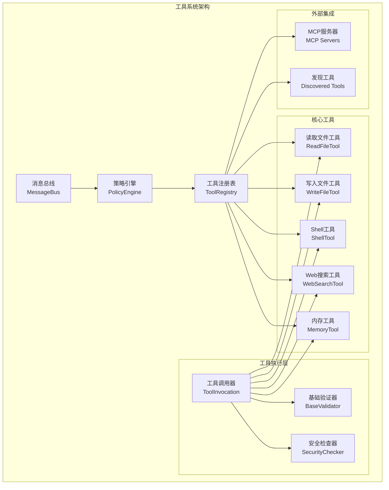
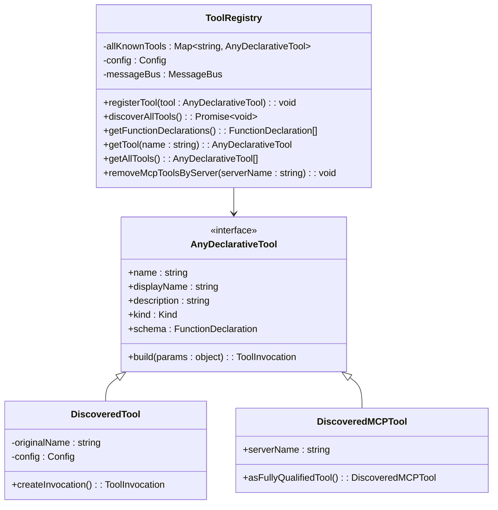
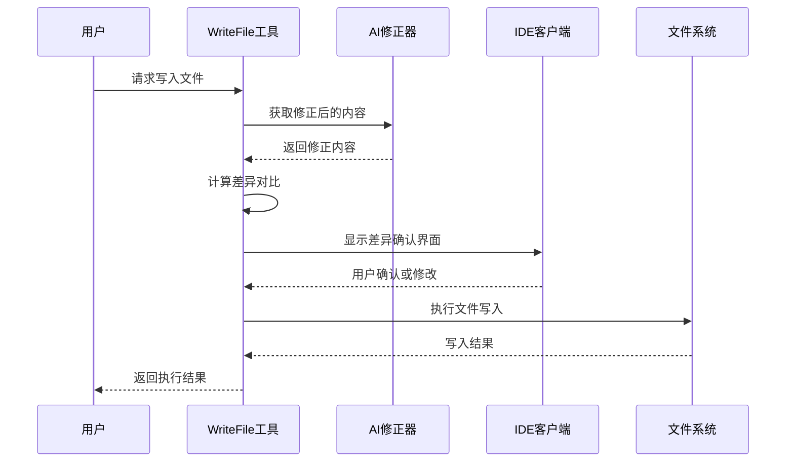
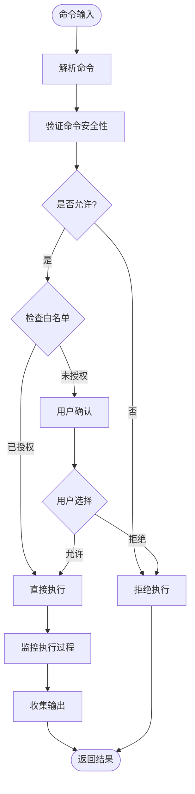
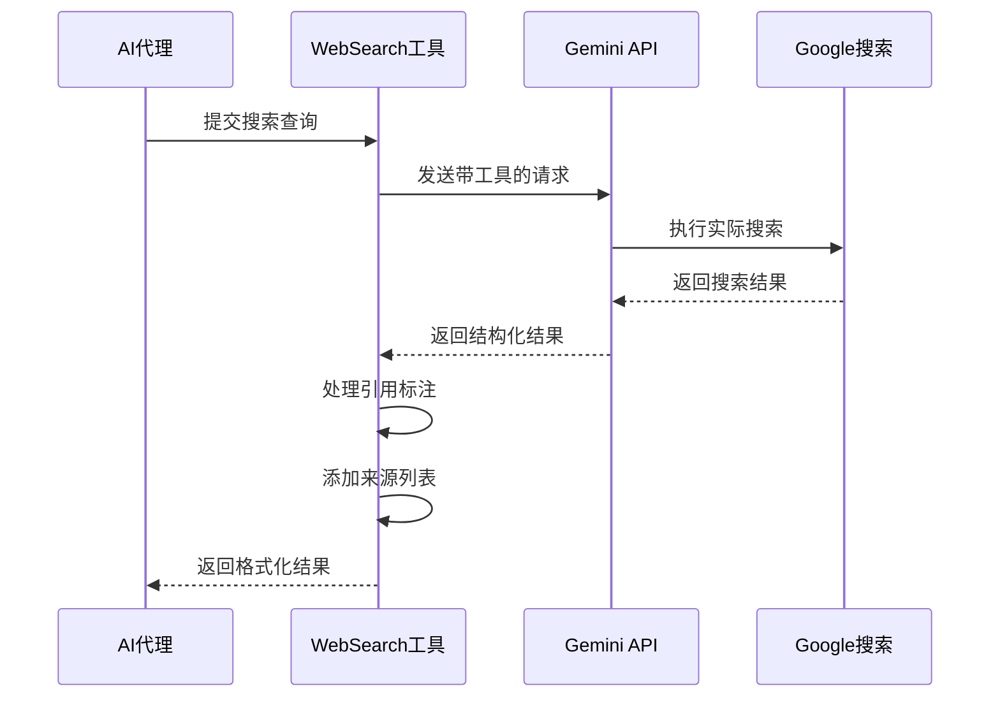
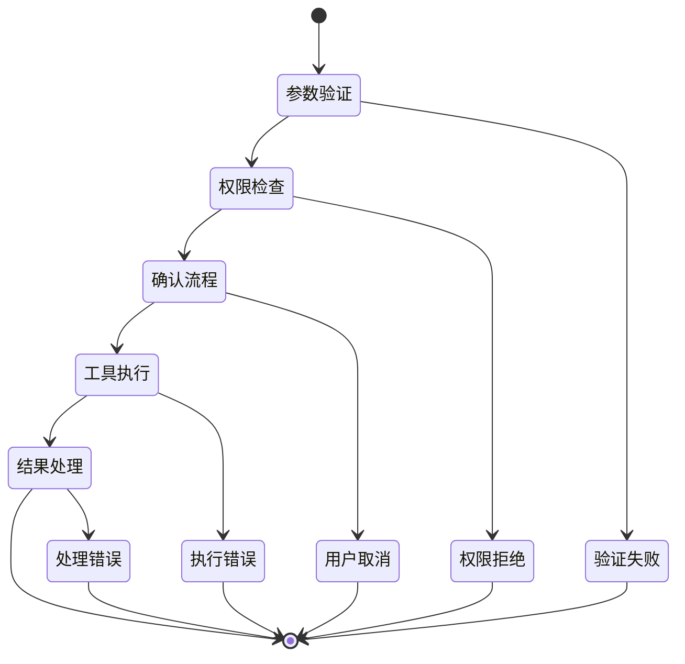
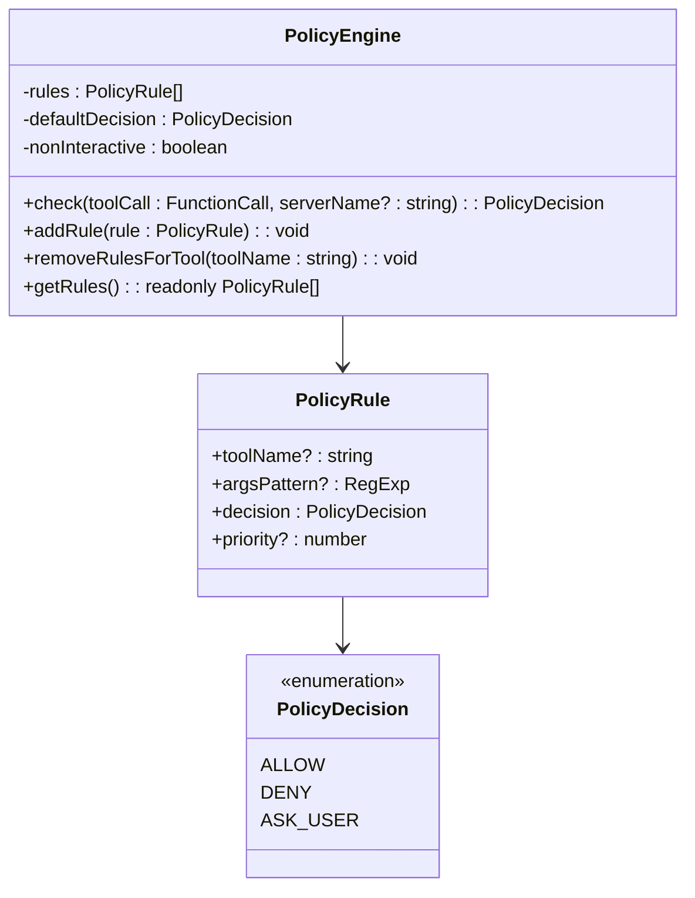
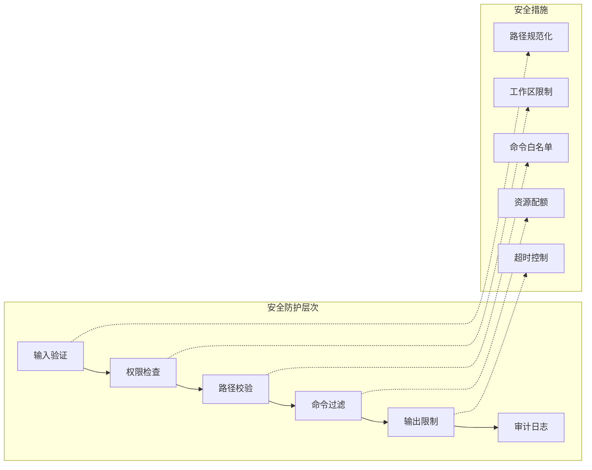

# 内置工具系统

<cite>
**本文档中引用的文件**
- [tools.ts](file://packages/core/src/tools/tools.ts)
- [tool-registry.ts](file://packages/core/src/tools/tool-registry.ts)
- [read-file.ts](file://packages/core/src/tools/read-file.ts)
- [write-file.ts](file://packages/core/src/tools/write-file.ts)
- [shell.ts](file://packages/core/src/tools/shell.ts)
- [web-search.ts](file://packages/core/src/tools/web-search.ts)
- [memoryTool.ts](file://packages/core/src/tools/memoryTool.ts)
- [tool-names.ts](file://packages/core/src/tools/tool-names.ts)
- [policy-engine.ts](file://packages/core/src/policy/policy-engine.ts)
</cite>

## 目录

1. [简介](#简介)
2. [系统架构概览](#系统架构概览)
3. [工具注册与调度机制](#工具注册与调度机制)
4. [核心工具详解](#核心工具详解)
5. [工具调用生命周期](#工具调用生命周期)
6. [权限模型与策略引擎](#权限模型与策略引擎)
7. [安全机制](#安全机制)
8. [使用示例](#使用示例)
9. [故障排除指南](#故障排除指南)
10. [总结](#总结)

## 简介

gemini-cli的内置工具系统是一个强大而灵活的架构，允许AI代理通过各种工具与本地文件系统、外部服务和环境进行交互。该系统采用模块化设计，支持动态发现和注册工具，并提供了完善的权限控制和安全机制。

### 核心特性

- **统一的工具接口**：所有工具都遵循相同的抽象层，确保一致的行为模式
- **声明式配置**：使用JSON Schema定义工具参数和验证规则
- **权限控制**：基于策略引擎的细粒度访问控制
- **安全沙箱**：多层安全检查防止恶意操作
- **可扩展性**：支持自定义工具和第三方集成

## 系统架构概览



**图表来源**

- [tool-registry.ts](file://packages/core/src/tools/tool-registry.ts#L190-L535)
- [tools.ts](file://packages/core/src/tools/tools.ts#L25-L719)

## 工具注册与调度机制

### 工具注册表

工具注册表是整个工具系统的核心组件，负责管理所有可用的工具及其生命周期。



**图表来源**

- [tool-registry.ts](file://packages/core/src/tools/tool-registry.ts#L190-L535)
- [tools.ts](file://packages/core/src/tools/tools.ts#L246-L472)

### 工具发现机制

系统支持多种工具发现方式：

1. **内置工具**：预定义的核心功能
2. **命令行发现**：通过配置的命令自动发现项目工具
3. **MCP服务器**：通过MCP协议发现外部工具

**章节来源**

- [tool-registry.ts](file://packages/core/src/tools/tool-registry.ts#L294-L423)

### 工具排序与优先级

工具按以下优先级排序：

1. 内置工具（最高优先级）
2. 发现的工具
3. MCP工具（按服务器名称排序）

**章节来源**

- [tool-registry.ts](file://packages/core/src/tools/tool-registry.ts#L240-L267)

## 核心工具详解

### ReadFile工具 - 文件读取操作

ReadFile工具提供了安全的文件读取功能，支持文本文件和二进制文件的处理。

#### 主要特性

- **路径安全校验**：确保文件路径在工作区范围内
- **内容截断**：大文件自动分页显示
- **格式检测**：自动识别文件类型（文本、图片、PDF等）
- **行范围读取**：支持指定起始行和行数

#### 参数说明

| 参数名    | 类型   | 必需 | 描述                |
| --------- | ------ | ---- | ------------------- |
| file_path | string | 是   | 要读取的文件路径    |
| offset    | number | 否   | 起始行号（从0开始） |
| limit     | number | 否   | 最大读取行数        |

#### 安全机制

- **工作区限制**：只允许访问配置的工作区目录
- **临时目录访问**：允许访问项目临时目录
- **忽略模式过滤**：根据.gitignore和.geminiignore过滤文件
- **路径规范化**：防止路径遍历攻击

**章节来源**

- [read-file.ts](file://packages/core/src/tools/read-file.ts#L25-L241)

### WriteFile工具 - 文件写入操作

WriteFile工具实现了安全的文件写入功能，包含智能确认机制和内容修正。

#### 主要特性

- **智能确认**：基于差异对比的编辑确认
- **内容修正**：AI辅助的内容质量检查
- **冲突解决**：自动处理文件冲突
- **IDE集成**：支持外部编辑器集成

#### 参数说明

| 参数名              | 类型    | 必需 | 描述             |
| ------------------- | ------- | ---- | ---------------- |
| file_path           | string  | 是   | 要写入的文件路径 |
| content             | string  | 是   | 要写入的内容     |
| modified_by_user    | boolean | 否   | 是否由用户修改过 |
| ai_proposed_content | string  | 否   | AI建议的原始内容 |

#### 编辑确认流程



**图表来源**

- [write-file.ts](file://packages/core/src/tools/write-file.ts#L174-L238)

**章节来源**

- [write-file.ts](file://packages/core/src/tools/write-file.ts#L1-L522)

### Shell工具 - 命令执行

Shell工具提供了安全的系统命令执行功能，具有严格的权限控制和输出监控。

#### 主要特性

- **命令白名单**：基于工具名称的权限控制
- **输出流监控**：实时监控和限制输出大小
- **进程组管理**：支持后台进程管理和终止
- **跨平台支持**：Windows和Unix系统兼容

#### 参数说明

| 参数名      | 类型   | 必需 | 描述         |
| ----------- | ------ | ---- | ------------ |
| command     | string | 是   | 要执行的命令 |
| description | string | 否   | 命令描述     |
| dir_path    | string | 否   | 执行目录路径 |

#### 安全检查流程



**图表来源**

- [shell.ts](file://packages/core/src/tools/shell.ts#L86-L130)

**章节来源**

- [shell.ts](file://packages/core/src/tools/shell.ts#L1-L471)

### WebSearch工具 - 搜索集成

WebSearch工具集成了Google搜索功能，为AI提供实时的网络信息检索能力。

#### 主要特性

- **Google搜索集成**：通过Gemini API访问Google搜索
- **引用标注**：自动添加搜索来源引用
- **内容摘要**：智能的内容压缩和总结
- **错误处理**：完善的异常处理机制

#### 参数说明

| 参数名 | 类型   | 必需 | 描述           |
| ------ | ------ | ---- | -------------- |
| query  | string | 是   | 搜索查询关键词 |

#### 搜索结果处理



**图表来源**

- [web-search.ts](file://packages/core/src/tools/web-search.ts#L79-L182)

**章节来源**

- [web-search.ts](file://packages/core/src/tools/web-search.ts#L1-L248)

### MemoryTool工具 - 上下文记忆

MemoryTool工具实现了长期记忆功能，帮助AI记住重要的用户信息和个人偏好。

#### 主要特性

- **结构化记忆**：以Markdown格式存储记忆条目
- **自动去重**：避免重复的记忆条目
- **批量管理**：支持多个记忆文件
- **编辑确认**：修改时的确认机制

#### 参数说明

| 参数名 | 类型   | 必需 | 描述               |
| ------ | ------ | ---- | ------------------ |
| fact   | string | 是   | 要记住的事实或信息 |

#### 记忆存储格式

记忆文件采用Markdown格式，支持多个记忆文件：

```markdown
# 用户记忆

## Gemini Added Memories

- 我喜欢披萨上加菠萝
- 我的猫叫Whiskers
- 我最喜欢的编程语言是TypeScript
```

**章节来源**

- [memoryTool.ts](file://packages/core/src/tools/memoryTool.ts#L1-L400)

## 工具调用生命周期

### 生命周期阶段

工具调用遵循标准化的生命周期，确保一致性和可预测性：



### 具体执行步骤

1. **参数验证**：使用JSON Schema验证输入参数
2. **权限检查**：策略引擎评估工具访问权限
3. **安全扫描**：多层安全检查防止恶意操作
4. **用户确认**：需要时提示用户确认危险操作
5. **工具执行**：调用具体的工具实现逻辑
6. **结果处理**：格式化输出并记录日志

**章节来源**

- [tools.ts](file://packages/core/src/tools/tools.ts#L25-L113)

## 权限模型与策略引擎

### 策略引擎架构



**图表来源**

- [policy-engine.ts](file://packages/core/src/policy/policy-engine.ts#L61-L139)

### 权限级别

系统定义了不同的权限级别来控制工具行为：

| 权限级别  | 描述                     | 示例工具   |
| --------- | ------------------------ | ---------- |
| read-only | 只读访问，无副作用       | read_file  |
| write     | 允许文件写入             | write_file |
| yolo      | 无限制访问（仅用于测试） | 所有工具   |

### 策略规则匹配

策略规则按优先级匹配，支持通配符和正则表达式：

- **精确匹配**：`toolName`完全匹配
- **通配符匹配**：`serverName__*`匹配所有服务器工具
- **参数匹配**：基于JSON参数的正则表达式匹配

**章节来源**

- [policy-engine.ts](file://packages/core/src/policy/policy-engine.ts#L16-L59)

## 安全机制

### 多层安全防护



### 关键安全特性

1. **路径安全**：严格限制文件系统访问范围
2. **命令过滤**：阻止危险的系统命令
3. **资源限制**：防止资源耗尽攻击
4. **输出监控**：实时监控和限制输出大小
5. **审计追踪**：完整操作日志记录

## 使用示例

### 基本文件操作

```typescript
// 读取文件内容
const readFileParams = {
  file_path: './src/main.ts',
  limit: 100,
};

// 写入文件内容
const writeFileParams = {
  file_path: './output.txt',
  content: 'Hello, World!',
};
```

### Shell命令执行

```typescript
// 执行系统命令
const shellParams = {
  command: 'npm install --save lodash',
  description: '安装lodash依赖包',
};
```

### Web搜索

```typescript
// 执行网络搜索
const searchParams = {
  query: 'TypeScript最佳实践',
};
```

### 记忆保存

```typescript
// 保存用户记忆
const memoryParams = {
  fact: '我喜欢在周末阅读科幻小说',
};
```

## 故障排除指南

### 常见问题及解决方案

#### 文件访问被拒绝

**问题**：尝试访问不在工作区范围内的文件 **原因**：路径超出工作区限制
**解决方案**：确保文件路径在配置的工作区目录内

#### Shell命令被阻止

**问题**：某些命令无法执行 **原因**：命令不在白名单中或存在安全隐患
**解决方案**：检查命令安全性或添加到允许列表

#### 内存工具写入失败

**问题**：无法保存记忆条目 **原因**：磁盘空间不足或权限问题
**解决方案**：检查磁盘空间和文件权限

#### Web搜索无结果

**问题**：搜索请求失败或无结果 **原因**：网络连接问题或API配额限制
**解决方案**：检查网络连接和API密钥配置

**章节来源**

- [tools.ts](file://packages/core/src/tools/tools.ts#L489-L512)

## 总结

gemini-cli的内置工具系统是一个设计精良、功能完备的架构，它成功地平衡了功能性、安全性和易用性。通过统一的抽象层、灵活的权限控制和强大的安全机制，该系统为AI代理提供了安全可靠的工具访问能力。

### 主要优势

1. **模块化设计**：每个工具都是独立的模块，便于维护和扩展
2. **安全第一**：多层安全检查确保系统安全
3. **灵活配置**：支持细粒度的权限控制和策略配置
4. **易于集成**：标准化的接口便于新工具的集成
5. **可观测性**：完整的日志和监控支持

### 未来发展方向

- **工具生态扩展**：支持更多第三方工具集成
- **性能优化**：提升工具执行效率和响应速度
- **用户体验改进**：简化配置和使用流程
- **安全增强**：引入更先进的安全检测和防护机制

这个工具系统为构建智能、安全的AI助手奠定了坚实的基础，是现代AI应用开发的重要组成部分。
