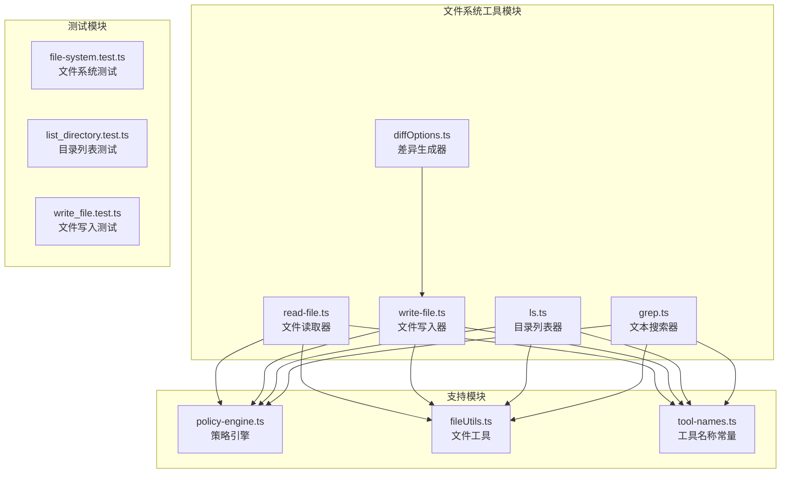
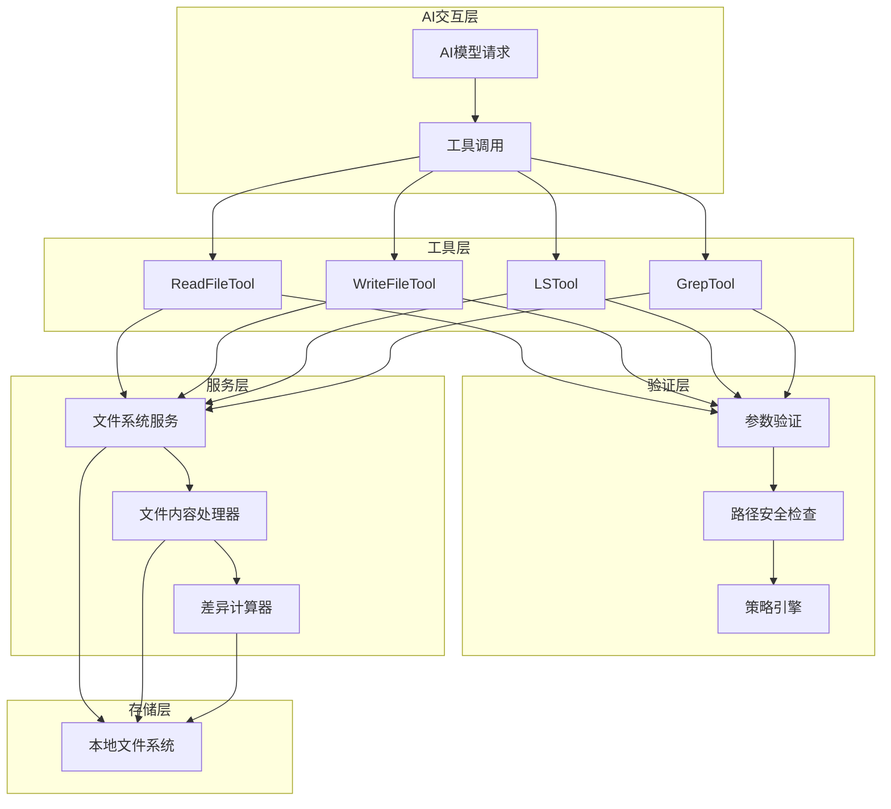
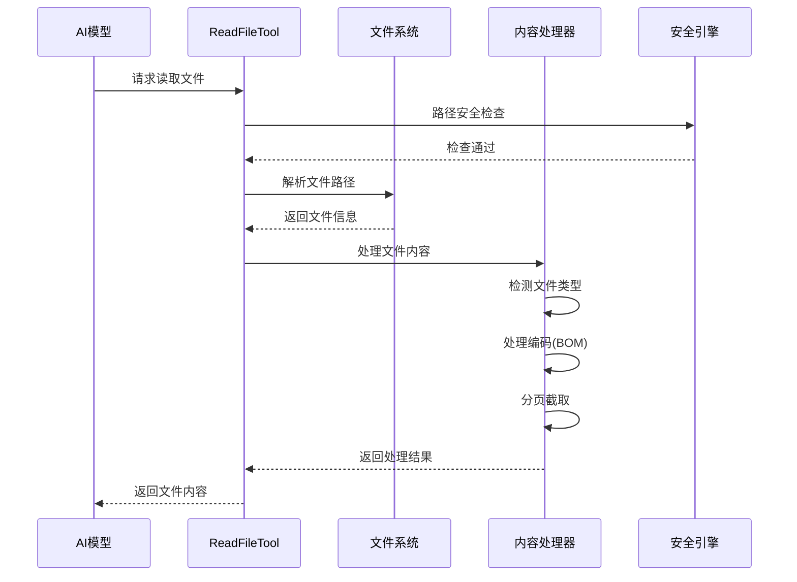
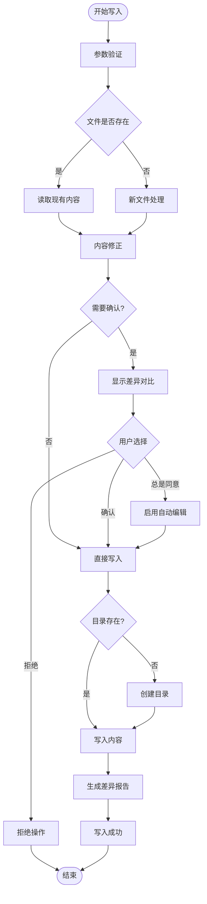
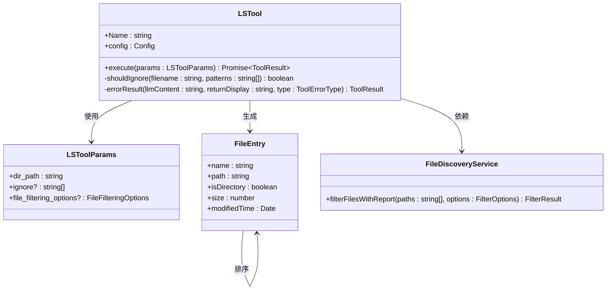
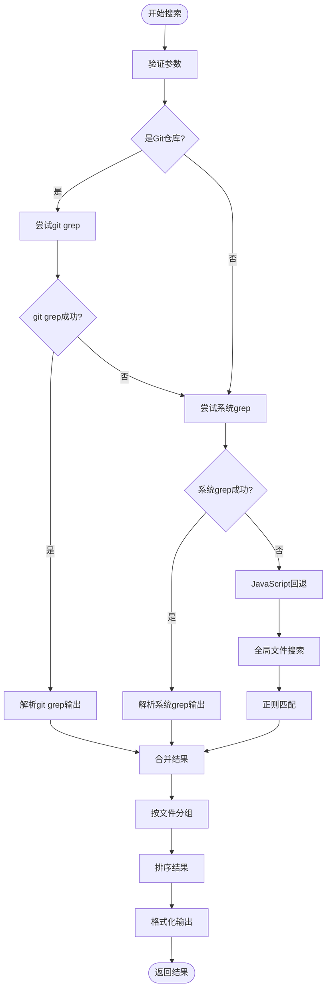
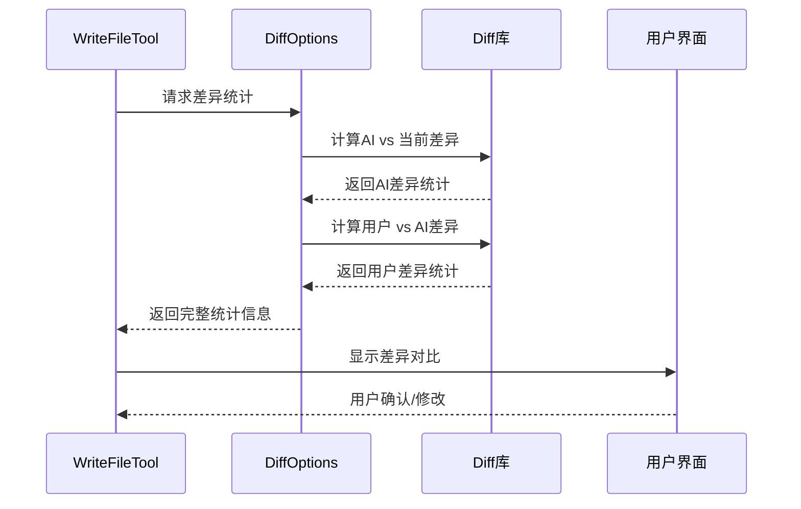
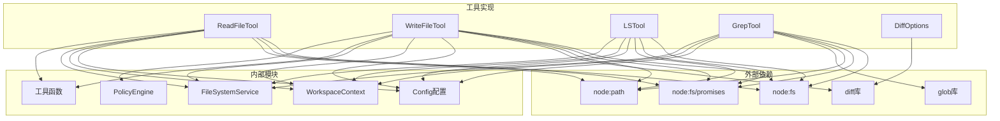

# 文件系统工具

<cite>
**本文档中引用的文件**
- [read-file.ts](file://packages/core/src/tools/read-file.ts)
- [write-file.ts](file://packages/core/src/tools/write-file.ts)
- [ls.ts](file://packages/core/src/tools/ls.ts)
- [grep.ts](file://packages/core/src/tools/grep.ts)
- [diffOptions.ts](file://packages/core/src/tools/diffOptions.ts)
- [policy-engine.ts](file://packages/core/src/policy/policy-engine.ts)
- [fileUtils.ts](file://packages/core/src/utils/fileUtils.ts)
- [tool-names.ts](file://packages/core/src/tools/tool-names.ts)
- [file-system.test.ts](file://integration-tests/file-system.test.ts)
- [list_directory.test.ts](file://integration-tests/list_directory.test.ts)
- [write_file.test.ts](file://integration-tests/write_file.test.ts)
</cite>

## 目录

1. [简介](#简介)
2. [项目结构](#项目结构)
3. [核心组件](#核心组件)
4. [架构概览](#架构概览)
5. [详细组件分析](#详细组件分析)
6. [依赖关系分析](#依赖关系分析)
7. [性能考虑](#性能考虑)
8. [故障排除指南](#故障排除指南)
9. [结论](#结论)

## 简介

gemini-cli文件系统工具是一套强大的本地文件操作工具集，为AI代理提供了安全、可控的文件系统访问能力。该工具集包含五个核心工具：文件读取器（read-file）、文件写入器（write-file）、目录列表器（ls）、文本搜索器（grep）和差异生成器（diffOptions）。所有工具都实现了严格的安全策略引擎，确保操作的安全性和合规性。

## 项目结构

文件系统工具位于gemini-cli项目的`packages/core/src/tools/`目录下，采用模块化设计，每个工具都是独立的类，遵循统一的接口规范。

**图表来源**

- [read-file.ts](file://packages/core/src/tools/read-file.ts#L1-L50)
- [write-file.ts](file://packages/core/src/tools/write-file.ts#L1-L50)
- [ls.ts](file://packages/core/src/tools/ls.ts#L1-L50)
- [grep.ts](file://packages/core/src/tools/grep.ts#L1-L50)
- [diffOptions.ts](file://packages/core/src/tools/diffOptions.ts#L1-L30)

**章节来源**

- [read-file.ts](file://packages/core/src/tools/read-file.ts#L1-L241)
- [write-file.ts](file://packages/core/src/tools/write-file.ts#L1-L522)
- [ls.ts](file://packages/core/src/tools/ls.ts#L1-L346)
- [grep.ts](file://packages/core/src/tools/grep.ts#L1-L690)
- [diffOptions.ts](file://packages/core/src/tools/diffOptions.ts#L1-L74)

## 核心组件

### 工具命名常量

系统定义了统一的工具名称常量，避免循环依赖问题：

| 工具名称            | 常量名               | 功能描述         |
| ------------------- | -------------------- | ---------------- |
| read_file           | READ_FILE_TOOL_NAME  | 文件读取工具     |
| write_file          | WRITE_FILE_TOOL_NAME | 文件写入工具     |
| list_directory      | LS_TOOL_NAME         | 目录列表工具     |
| search_file_content | GREP_TOOL_NAME       | 文件内容搜索工具 |

### 权限控制策略

所有文件系统工具都集成到统一的策略引擎中，支持多种执行模式：

- **ASK_USER**: 需要用户确认的操作
- **ALLOW**: 自动允许的操作
- **DENY**: 完全禁止的操作
- **AUTO_EDIT**: 自动编辑模式

**章节来源**

- [tool-names.ts](file://packages/core/src/tools/tool-names.ts#L1-L23)
- [policy-engine.ts](file://packages/core/src/policy/policy-engine.ts#L1-L139)

## 架构概览

文件系统工具采用分层架构设计，从底层文件系统服务到高层AI交互接口：

**图表来源**

- [read-file.ts](file://packages/core/src/tools/read-file.ts#L45-L85)
- [write-file.ts](file://packages/core/src/tools/write-file.ts#L142-L180)
- [ls.ts](file://packages/core/src/tools/ls.ts#L72-L110)
- [grep.ts](file://packages/core/src/tools/grep.ts#L56-L95)

## 详细组件分析

### ReadFileTool - 文件读取器

ReadFileTool提供了安全的文件读取功能，支持多种文件类型和分页读取。

#### 核心特性

1. **多格式支持**: 文本、图片(PNG、JPG、GIF、WEBP、SVG、BMP)、PDF文件
2. **分页读取**: 支持offset和limit参数进行大文件分页读取
3. **编码处理**: 自动检测和处理Unicode BOM编码
4. **安全校验**: 路径安全检查和文件大小限制

#### 实现细节

**图表来源**

- [read-file.ts](file://packages/core/src/tools/read-file.ts#L76-L138)
- [fileUtils.ts](file://packages/core/src/utils/fileUtils.ts#L353-L495)

#### 参数配置

| 参数名    | 类型   | 必需 | 描述              |
| --------- | ------ | ---- | ----------------- |
| file_path | string | 是   | 要读取的文件路径  |
| offset    | number | 否   | 起始行号(0-based) |
| limit     | number | 否   | 最大读取行数      |

#### 安全机制

- **路径规范化**: 使用`path.resolve()`防止目录遍历攻击
- **工作区限制**: 只能访问配置的工作区目录
- **文件大小限制**: 20MB最大文件大小
- **忽略模式**: 支持.gitignore和.geminiignore模式

**章节来源**

- [read-file.ts](file://packages/core/src/tools/read-file.ts#L25-L179)
- [fileUtils.ts](file://packages/core/src/utils/fileUtils.ts#L164-L229)

### WriteFileTool - 文件写入器

WriteFileTool实现了智能的文件写入功能，包含内容修正、差异比较和用户确认机制。

#### 核心特性

1. **内容修正**: AI生成内容的自动修正和优化
2. **差异比较**: 使用三方差异算法生成修改前后对比
3. **用户确认**: 支持IDE集成的可视化确认界面
4. **原子操作**: 确保写入操作的原子性

#### 工作流程

**图表来源**

- [write-file.ts](file://packages/core/src/tools/write-file.ts#L174-L238)
- [write-file.ts](file://packages/core/src/tools/write-file.ts#L240-L393)

#### 参数配置

| 参数名              | 类型    | 必需 | 描述               |
| ------------------- | ------- | ---- | ------------------ |
| file_path           | string  | 是   | 目标文件路径       |
| content             | string  | 是   | 要写入的内容       |
| modified_by_user    | boolean | 否   | 用户是否修改过内容 |
| ai_proposed_content | string  | 否   | AI最初提议的内容   |

#### 错误处理

系统提供了详细的错误分类和处理机制：

- **FILE_WRITE_FAILURE**: 通用写入失败
- **PERMISSION_DENIED**: 权限不足
- **NO_SPACE_LEFT**: 磁盘空间不足
- **TARGET_IS_DIRECTORY**: 目标是目录而非文件

**章节来源**

- [write-file.ts](file://packages/core/src/tools/write-file.ts#L49-L140)
- [write-file.ts](file://packages/core/src/tools/write-file.ts#L394-L521)

### LSTool - 目录列表器

LSTool提供了安全的目录列表功能，支持过滤和排序。

#### 核心特性

1. **智能过滤**: 支持.gitignore和.geminiignore模式
2. **递归控制**: 可选的递归列表功能
3. **权限检查**: 自动跳过无权限访问的条目
4. **格式化输出**: 结构化的目录信息展示

#### 实现架构

**图表来源**

- [ls.ts](file://packages/core/src/tools/ls.ts#L20-L71)
- [ls.ts](file://packages/core/src/tools/ls.ts#L72-L110)

#### 参数配置

| 参数名                 | 类型     | 必需 | 描述             |
| ---------------------- | -------- | ---- | ---------------- |
| dir_path               | string   | 是   | 要列出的目录路径 |
| ignore                 | string[] | 否   | 要忽略的glob模式 |
| file_filtering_options | object   | 否   | 文件过滤选项     |

#### 过滤选项

| 选项名                | 类型    | 默认值 | 描述                      |
| --------------------- | ------- | ------ | ------------------------- |
| respect_git_ignore    | boolean | true   | 是否尊重.gitignore模式    |
| respect_gemini_ignore | boolean | true   | 是否尊重.geminiignore模式 |

**章节来源**

- [ls.ts](file://packages/core/src/tools/ls.ts#L20-L69)
- [ls.ts](file://packages/core/src/tools/ls.ts#L257-L345)

### GrepTool - 文本搜索器

GrepTool实现了强大的文本搜索功能，支持正则表达式和多种搜索策略。

#### 搜索策略

系统采用三层搜索策略，优先级从高到低：

1. **git grep**: Git仓库中的快速搜索
2. **系统grep**: 系统原生grep命令
3. **JavaScript回退**: 纯JavaScript实现

#### 搜索流程

**图表来源**

- [grep.ts](file://packages/core/src/tools/grep.ts#L330-L562)

#### 正则表达式支持

GrepTool完全支持JavaScript正则表达式语法：

- **基础匹配**: 字面字符串匹配
- **字符类**: `[abc]`, `[^abc]`
- **数量限定符**: `*`, `+`, `?`, `{n}`, `{n,m}`
- **位置锚点**: `^`, `$`, `\b`, `\B`
- **分组和捕获**: `()`, `(?:)`, `(?=)`
- **反向引用**: `\1`, `\2`

#### 参数配置

| 参数名   | 类型   | 必需 | 描述               |
| -------- | ------ | ---- | ------------------ |
| pattern  | string | 是   | 正则表达式模式     |
| dir_path | string | 否   | 搜索目录路径       |
| include  | string | 否   | 包含文件的glob模式 |

**章节来源**

- [grep.ts](file://packages/core/src/tools/grep.ts#L27-L58)
- [grep.ts](file://packages/core/src/tools/grep.ts#L564-L689)

### DiffOptions - 差异生成器

DiffOptions提供了智能的差异计算和统计功能。

#### 差异计算

系统使用三方差异算法，比较三个版本之间的差异：

1. **当前版本 vs AI提议**: 计算模型生成的差异
2. **AI提议 vs 用户修改**: 计算用户调整的差异

#### 统计指标

| 指标类别 | 具体指标      | 描述       |
| -------- | ------------- | ---------- |
| 行数统计 | added_lines   | 新增行数   |
| 行数统计 | removed_lines | 删除行数   |
| 字符统计 | added_chars   | 新增字符数 |
| 字符统计 | removed_chars | 删除字符数 |

#### 实现细节

**图表来源**

- [diffOptions.ts](file://packages/core/src/tools/diffOptions.ts#L15-L73)

**章节来源**

- [diffOptions.ts](file://packages/core/src/tools/diffOptions.ts#L1-L74)

## 依赖关系分析

文件系统工具的依赖关系体现了清晰的分层架构：

**图表来源**

- [read-file.ts](file://packages/core/src/tools/read-file.ts#L7-L11)
- [write-file.ts](file://packages/core/src/tools/write-file.ts#L7-L11)
- [ls.ts](file://packages/core/src/tools/ls.ts#L7-L11)
- [grep.ts](file://packages/core/src/tools/grep.ts#L7-L11)
- [diffOptions.ts](file://packages/core/src/tools/diffOptions.ts#L7-L8)

**章节来源**

- [read-file.ts](file://packages/core/src/tools/read-file.ts#L1-L11)
- [write-file.ts](file://packages/core/src/tools/write-file.ts#L1-L11)
- [ls.ts](file://packages/core/src/tools/ls.ts#L1-L11)
- [grep.ts](file://packages/core/src/tools/grep.ts#L1-L11)
- [diffOptions.ts](file://packages/core/src/tools/diffOptions.ts#L1-L8)

## 性能考虑

### 文件大小限制

系统对不同类型的文件设置了合理的大小限制：

- **文本文件**: 20MB最大限制
- **图片文件**: 无硬性限制，但会进行内存优化
- **PDF文件**: 无硬性限制，但会进行流式处理
- **二进制文件**: 1MB最大SVG文件限制

### 编码处理优化

- **BOM检测**: 自动识别和处理Unicode字节顺序标记
- **流式读取**: 大文件采用流式处理减少内存占用
- **缓存机制**: 对频繁访问的文件信息进行缓存

### 搜索性能优化

- **索引优先**: Git仓库优先使用git grep
- **并行处理**: 支持多个目录的并行搜索
- **早期终止**: 找到足够匹配时提前终止搜索

## 故障排除指南

### 常见错误及解决方案

#### 文件读取错误

**错误类型**: FILE_NOT_FOUND **原因**: 文件不存在或路径错误 **解决方案**:

- 检查文件路径是否正确
- 确认文件确实存在于指定位置
- 验证工作区目录配置

**错误类型**: PERMISSION_DENIED **原因**: 缺少文件读取权限 **解决方案**:

- 检查文件权限设置
- 确认运行用户有访问权限
- 考虑使用sudo或更改文件权限

#### 文件写入错误

**错误类型**: NO_SPACE_LEFT **原因**: 磁盘空间不足 **解决方案**:

- 清理磁盘空间
- 移除不必要的文件
- 使用更大容量的存储设备

**错误类型**: TARGET_IS_DIRECTORY **原因**: 目标路径是目录而非文件 **解决方案**:

- 检查目标路径是否为文件
- 如果需要创建文件，请确保路径包含文件名
- 验证目录权限

#### 搜索工具错误

**错误类型**: GREP_EXECUTION_ERROR **原因**: grep命令执行失败 **解决方案**:

- 检查系统是否安装了grep
- 验证正则表达式语法
- 确认搜索目录存在且可访问

**章节来源**

- [read-file.ts](file://packages/core/src/tools/read-file.ts#L85-L94)
- [write-file.ts](file://packages/core/src/tools/write-file.ts#L353-L391)
- [grep.ts](file://packages/core/src/tools/grep.ts#L201-L212)

## 结论

gemini-cli文件系统工具提供了一套完整、安全、高效的本地文件操作解决方案。通过严格的权限控制、智能的内容处理和灵活的搜索功能，这些工具能够满足AI代理在各种场景下的文件系统操作需求。

### 主要优势

1. **安全性**: 多层安全检查和权限控制
2. **可靠性**: 完善的错误处理和恢复机制
3. **性能**: 优化的算法和资源管理
4. **易用性**: 直观的API设计和丰富的功能

### 应用场景

- **代码审查**: 读取和分析源代码文件
- **配置管理**: 修改和更新配置文件
- **日志分析**: 搜索和分析系统日志
- **文档处理**: 创建和编辑文档内容

这套工具集为AI驱动的开发工作流提供了坚实的基础，确保了文件操作的安全性和效率。
