# 网络工具

<cite>
**本文档中引用的文件**
- [web-search.ts](file://packages/core/src/tools/web-search.ts)
- [web-fetch.ts](file://packages/core/src/tools/web-fetch.ts)
- [fileDiscoveryService.ts](file://packages/core/src/services/fileDiscoveryService.ts)
- [fetch.ts](file://packages/core/src/utils/fetch.ts)
- [web-search.test.ts](file://packages/core/src/tools/web-search.test.ts)
- [web-fetch.test.ts](file://packages/core/src/tools/web-fetch.test.ts)
- [google_web_search.test.ts](file://integration-tests/google_web_search.test.ts)
- [config.ts](file://packages/core/src/config/config.ts)
- [policy-engine.ts](file://packages/core/src/policy/policy-engine.ts)
- [LruCache.ts](file://packages/core/src/utils/LruCache.ts)
- [crawlCache.ts](file://packages/core/src/utils/filesearch/crawlCache.ts)
</cite>

## 目录

1. [简介](#简介)
2. [项目结构](#项目结构)
3. [核心组件](#核心组件)
4. [架构概览](#架构概览)
5. [详细组件分析](#详细组件分析)
6. [依赖关系分析](#依赖关系分析)
7. [性能考虑](#性能考虑)
8. [故障排除指南](#故障排除指南)
9. [结论](#结论)

## 简介

gemini-cli网络工具套件提供了强大的互联网搜索和内容获取功能，使AI代理能够实时访问和处理网络信息。该系统包含三个主要组件：`WebSearchTool`用于集成Google搜索的网络查询、`WebFetchTool`用于安全地从指定URL获取网页内容，以及`FileDiscoveryService`用于发现和索引远程资源。

这些工具通过与Gemini
API的深度集成，提供了智能的网络访问能力，支持实时信息检索、内容提取和知识构建。系统设计注重安全性、可靠性和可扩展性，提供了完善的错误处理、缓存策略和访问控制机制。

## 项目结构

网络工具模块采用分层架构设计，将功能划分为不同的层次：

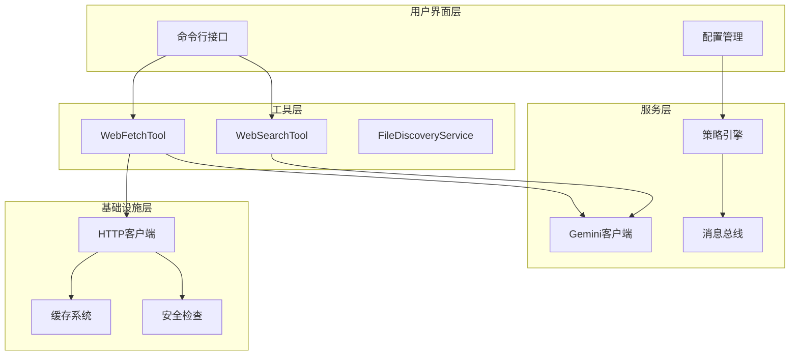

**图表来源**

- [web-search.ts](file://packages/core/src/tools/web-search.ts#L1-L50)
- [web-fetch.ts](file://packages/core/src/tools/web-fetch.ts#L1-L50)
- [fileDiscoveryService.ts](file://packages/core/src/services/fileDiscoveryService.ts#L1-L50)

**章节来源**

- [web-search.ts](file://packages/core/src/tools/web-search.ts#L1-L248)
- [web-fetch.ts](file://packages/core/src/tools/web-fetch.ts#L1-L453)
- [fileDiscoveryService.ts](file://packages/core/src/services/fileDiscoveryService.ts#L1-L101)

## 核心组件

### WebSearchTool - 智能网络搜索

WebSearchTool是集成Google搜索的核心组件，通过Gemini
API提供语义化的网络搜索能力。该工具能够理解自然语言查询，执行智能搜索，并返回结构化的搜索结果。

#### 主要特性：

- **语义化搜索**：基于Gemini API的语义理解能力
- **智能结果排序**：自动识别最相关的信息源
- **引用标注**：为每个段落添加来源引用
- **多语言支持**：支持多种语言的搜索查询
- **实时信息获取**：直接从搜索引擎获取最新数据

#### 查询处理流程：

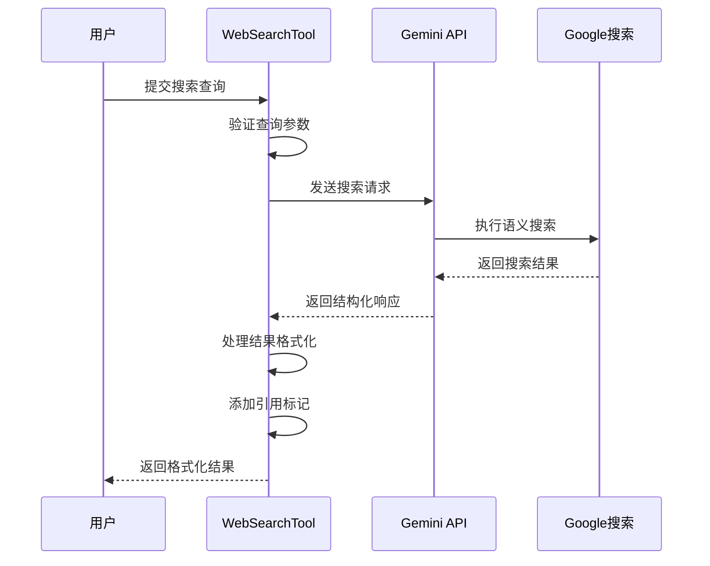

**图表来源**

- [web-search.ts](file://packages/core/src/tools/web-search.ts#L79-L181)

### WebFetchTool - 安全内容获取

WebFetchTool提供了安全可靠的网页内容获取功能，支持从各种URL源获取内容，包括本地网络地址和公共网站。

#### 核心功能：

- **多协议支持**：HTTP/HTTPS协议处理
- **智能回退机制**：主流程失败时自动切换到备用方案
- **内容转换**：HTML内容转换为纯文本
- **GitHub链接优化**：自动转换GitHub blob链接为raw格式
- **私网检测**：自动识别并处理私有网络地址

#### 内容获取策略：

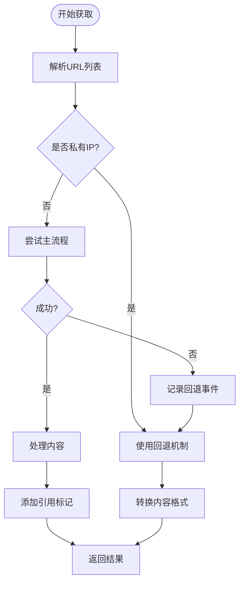

**图表来源**

- [web-fetch.ts](file://packages/core/src/tools/web-fetch.ts#L240-L380)

### FileDiscoveryService - 资源发现

FileDiscoveryService负责在网络环境中发现和索引可用的文件资源，提供智能的文件过滤和发现功能。

#### 关键特性：

- **智能过滤**：结合.gitignore和.geminiignore规则
- **多层过滤**：支持独立或组合的过滤策略
- **性能优化**：高效的文件路径匹配算法
- **扩展性**：支持自定义过滤规则

**章节来源**

- [web-search.ts](file://packages/core/src/tools/web-search.ts#L188-L248)
- [web-fetch.ts](file://packages/core/src/tools/web-fetch.ts#L386-L453)
- [fileDiscoveryService.ts](file://packages/core/src/services/fileDiscoveryService.ts#L24-L101)

## 架构概览

网络工具系统采用模块化架构，各组件之间通过明确定义的接口进行交互：

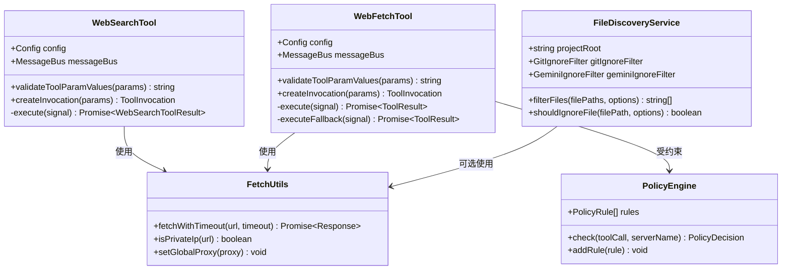

**图表来源**

- [web-search.ts](file://packages/core/src/tools/web-search.ts#L188-L248)
- [web-fetch.ts](file://packages/core/src/tools/web-fetch.ts#L386-L453)
- [fileDiscoveryService.ts](file://packages/core/src/services/fileDiscoveryService.ts#L24-L101)
- [fetch.ts](file://packages/core/src/utils/fetch.ts#L40-L63)

## 详细组件分析

### WebSearchTool 实现详解

WebSearchTool通过与Gemini
API的深度集成，实现了智能的网络搜索功能。该工具的核心实现包括查询验证、API调用、结果处理和引用标注等关键步骤。

#### 查询验证机制

工具对输入查询进行严格验证，确保搜索的有效性：

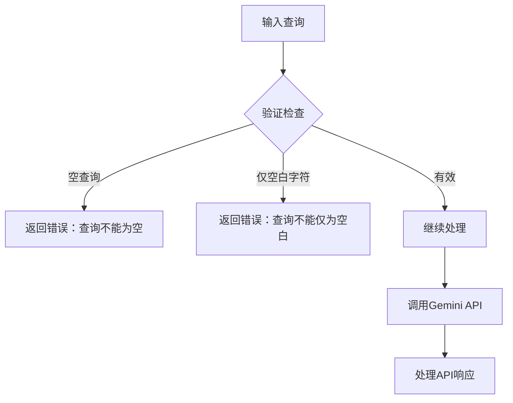

**图表来源**

- [web-search.ts](file://packages/core/src/tools/web-search.ts#L224-L231)

#### 结果处理和引用系统

WebSearchTool实现了复杂的引用处理机制，能够准确地标记每个段落的来源：

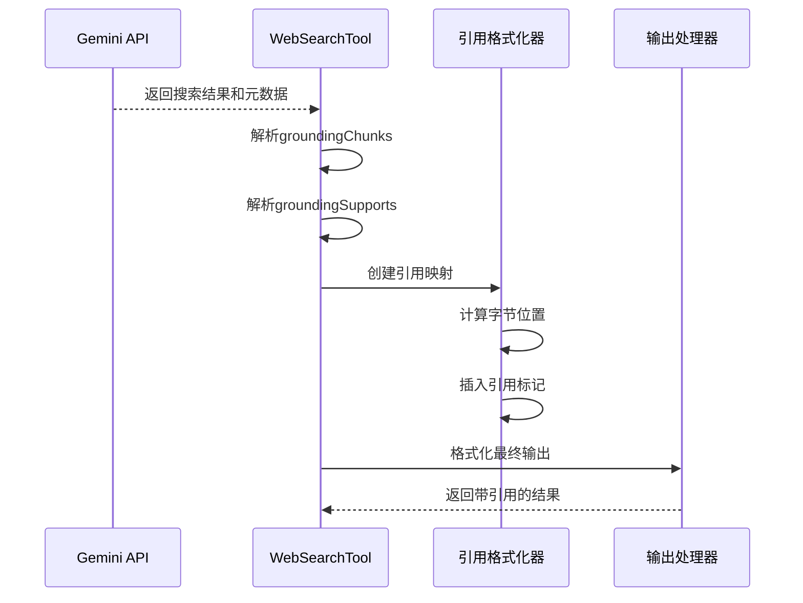

**图表来源**

- [web-search.ts](file://packages/core/src/tools/web-search.ts#L106-L167)

**章节来源**

- [web-search.ts](file://packages/core/src/tools/web-search.ts#L61-L181)

### WebFetchTool 安全机制

WebFetchTool实现了多层次的安全保障机制，确保网络访问的安全性和可靠性。

#### URL解析和验证

工具使用严格的URL解析逻辑，支持多种URL格式：

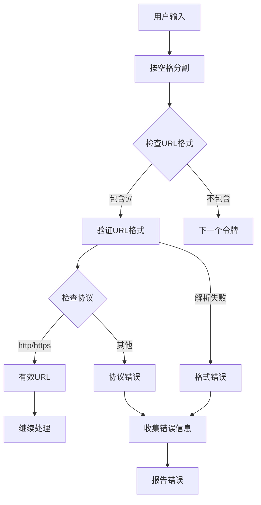

**图表来源**

- [web-fetch.ts](file://packages/core/src/tools/web-fetch.ts#L39-L74)

#### 回退机制设计

当主流程失败时，WebFetchTool会自动切换到备用获取策略：

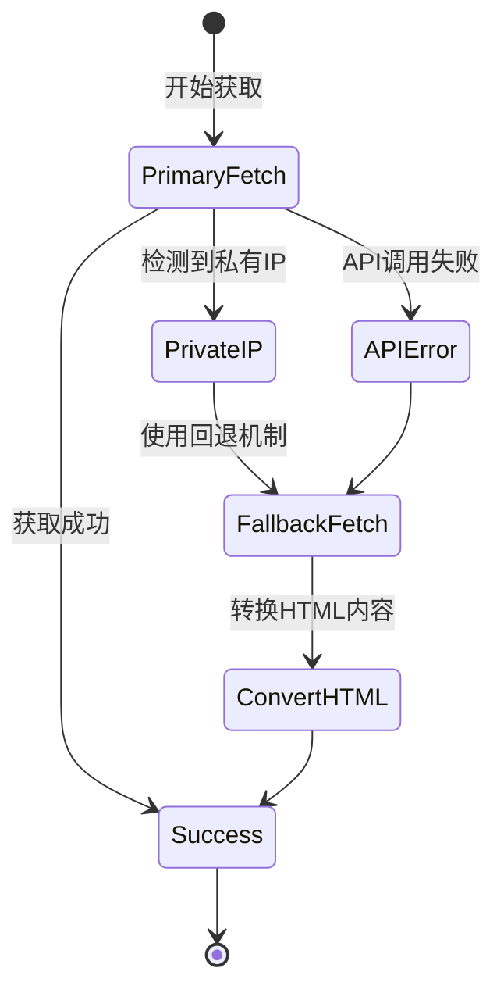

**图表来源**

- [web-fetch.ts](file://packages/core/src/tools/web-fetch.ts#L121-L196)

**章节来源**

- [web-fetch.ts](file://packages/core/src/tools/web-fetch.ts#L107-L380)

### FileDiscoveryService 过滤系统

FileDiscoveryService提供了智能的文件过滤功能，支持多种过滤规则的组合使用。

#### 过滤策略组合

服务支持灵活的过滤策略配置：

| 过滤选项            | 功能描述              | 默认行为 |
| ------------------- | --------------------- | -------- |
| respectGitIgnore    | 应用.gitignore规则    | 启用     |
| respectGeminiIgnore | 应用.geminiignore规则 | 启用     |

#### 文件过滤流程

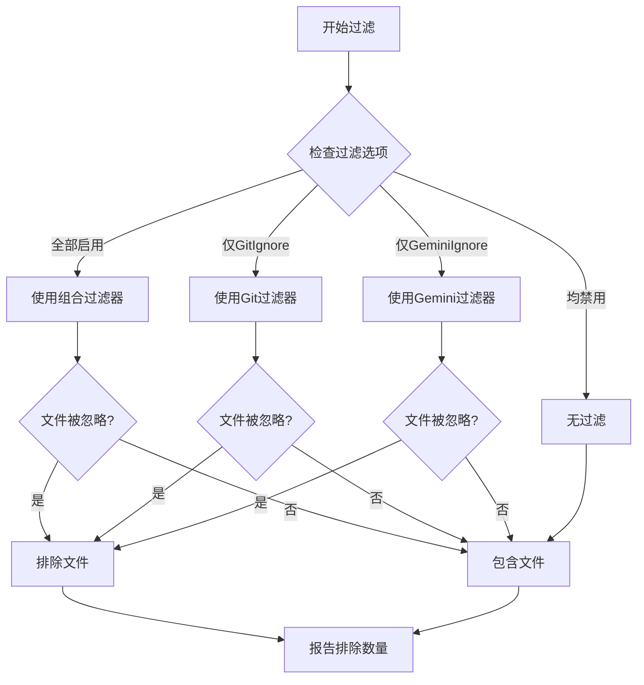

**图表来源**

- [fileDiscoveryService.ts](file://packages/core/src/services/fileDiscoveryService.ts#L50-L68)

**章节来源**

- [fileDiscoveryService.ts](file://packages/core/src/services/fileDiscoveryService.ts#L47-L101)

### 网络安全和访问控制

#### 私网检测机制

系统实现了全面的私网地址检测，防止对内部网络的意外访问：

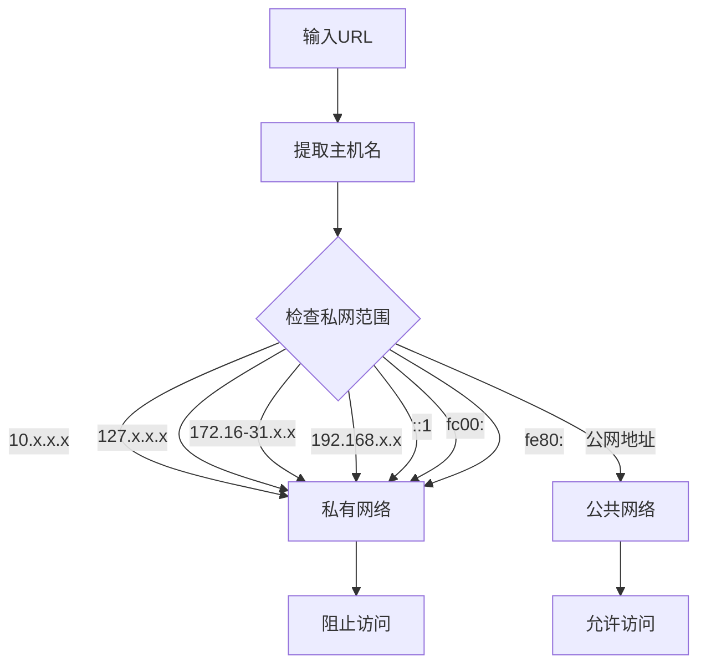

**图表来源**

- [fetch.ts](file://packages/core/src/utils/fetch.ts#L31-L38)

#### 代理配置支持

系统支持全局代理配置，提供灵活的网络访问选项：

| 配置项      | 支持的协议 | 默认值 |
| ----------- | ---------- | ------ |
| HTTP_PROXY  | HTTP/HTTPS | 无     |
| HTTPS_PROXY | HTTP/HTTPS | 无     |
| http_proxy  | HTTP/HTTPS | 无     |
| https_proxy | HTTP/HTTPS | 无     |

**章节来源**

- [fetch.ts](file://packages/core/src/utils/fetch.ts#L1-L63)
- [config.ts](file://packages/core/src/config/config.ts#L84-L85)

## 依赖关系分析

网络工具系统的依赖关系体现了清晰的分层架构设计：

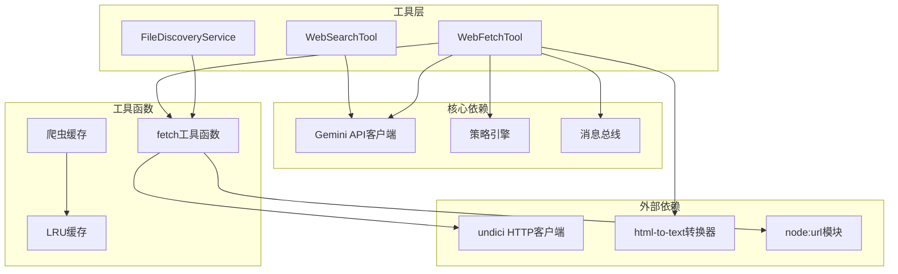

**图表来源**

- [web-search.ts](file://packages/core/src/tools/web-search.ts#L7-L18)
- [web-fetch.ts](file://packages/core/src/tools/web-fetch.ts#L7-L34)
- [fetch.ts](file://packages/core/src/utils/fetch.ts#L7-L10)

**章节来源**

- [web-search.ts](file://packages/core/src/tools/web-search.ts#L1-L18)
- [web-fetch.ts](file://packages/core/src/tools/web-fetch.ts#L1-L34)
- [fileDiscoveryService.ts](file://packages/core/src/services/fileDiscoveryService.ts#L1-L13)

## 性能考虑

### 缓存策略

系统实现了多层缓存机制来优化性能：

#### LRU缓存实现

基础的LRU缓存提供内存级别的快速访问：

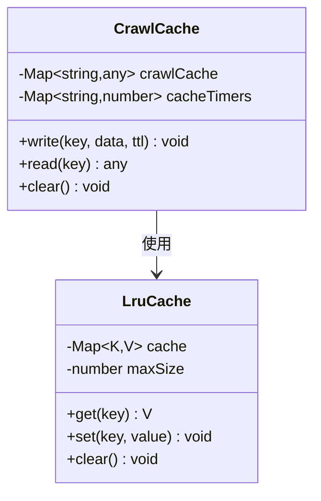

**图表来源**

- [LruCache.ts](file://packages/core/src/utils/LruCache.ts#L1-L41)
- [crawlCache.ts](file://packages/core/src/utils/filesearch/crawlCache.ts#L1-L69)

#### 超时和重试机制

网络操作实现了智能的超时和重试策略：

| 组件           | 超时设置 | 重试策略     |
| -------------- | -------- | ------------ |
| WebFetchTool   | 10秒     | 自动回退     |
| Gemini API调用 | 可配置   | 基于信号中断 |
| HTTP请求       | 10秒     | 错误时回退   |

### 并发控制

系统通过以下机制控制并发访问：

- **信号量模式**：使用AbortSignal控制请求生命周期
- **异步队列**：避免同时发起过多网络请求
- **资源限制**：通过配置控制最大并发数

## 故障排除指南

### 常见问题和解决方案

#### 网络连接问题

**症状**：工具调用失败，出现网络错误 **原因**：网络连接不稳定或防火墙限制
**解决方案**：

1. 检查网络连接状态
2. 配置代理服务器（如果需要）
3. 调整超时设置
4. 验证DNS解析

#### 权限和策略问题

**症状**：工具被策略引擎拒绝执行 **原因**：安全策略限制或未授权的网络访问
**解决方案**：

1. 检查策略配置
2. 更新信任规则
3. 调整审批模式
4. 验证工具权限

#### 内容获取失败

**症状**：WebFetchTool无法获取指定URL的内容
**原因**：目标网站限制、SSL证书问题或内容格式不支持 **解决方案**：

1. 检查URL有效性
2. 验证SSL证书
3. 尝试回退机制
4. 检查内容类型支持

**章节来源**

- [web-search.test.ts](file://packages/core/src/tools/web-search.test.ts#L118-L130)
- [web-fetch.test.ts](file://packages/core/src/tools/web-fetch.test.ts#L178-L198)

## 结论

gemini-cli网络工具套件提供了一个完整、安全且高性能的网络访问解决方案。通过WebSearchTool的智能搜索能力、WebFetchTool的安全内容获取功能，以及FileDiscoveryService的资源发现能力，系统能够满足各种网络信息处理需求。

### 主要优势

1. **安全性优先**：完善的私网检测和访问控制机制
2. **可靠性高**：多重回退机制和错误处理策略
3. **性能优化**：智能缓存和并发控制
4. **易于扩展**：模块化设计支持功能扩展
5. **配置灵活**：丰富的配置选项适应不同环境

### 最佳实践建议

1. **合理配置超时时间**：根据网络环境调整超时设置
2. **实施适当的缓存策略**：平衡性能和数据新鲜度
3. **监控网络访问**：定期审查访问日志和策略配置
4. **保持安全更新**：及时更新安全规则和依赖库
5. **测试回退机制**：验证在各种网络条件下的表现

该网络工具套件为开发者提供了强大而可靠的网络信息处理能力，是构建智能AI应用的重要基础设施。
