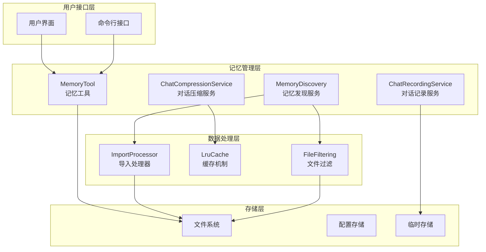
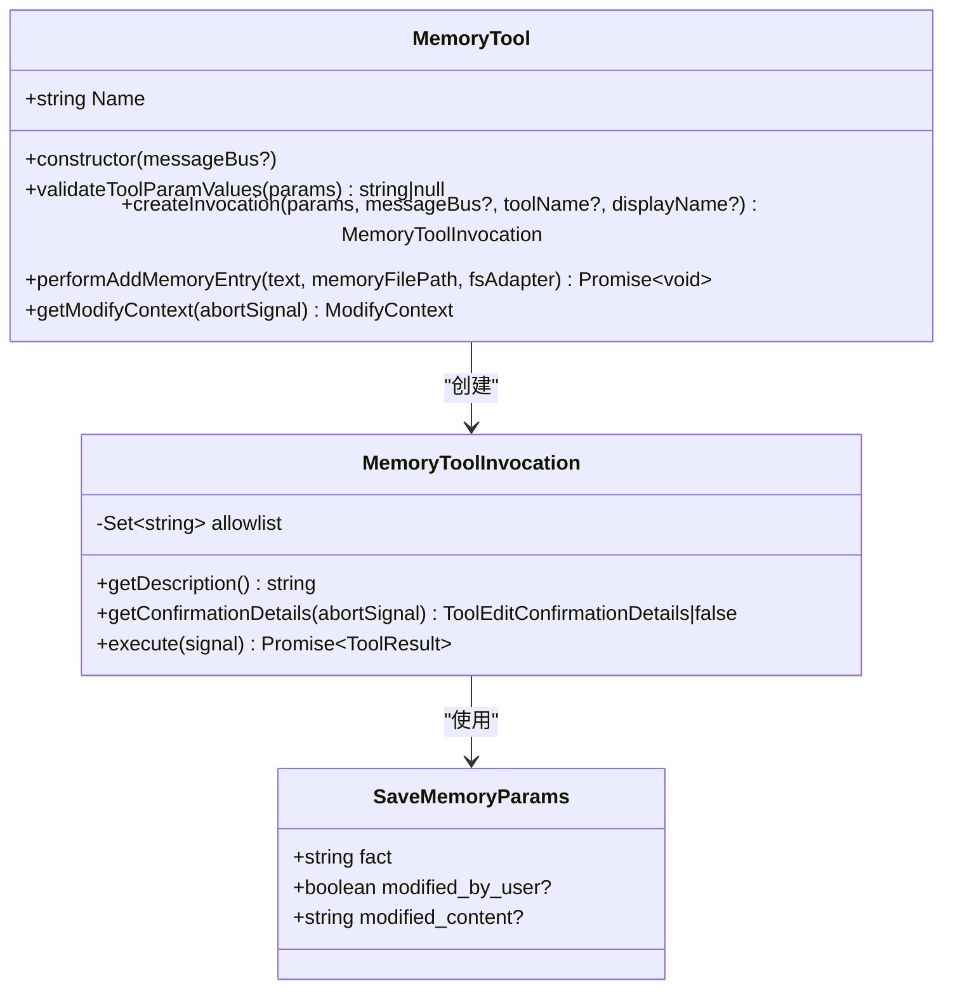
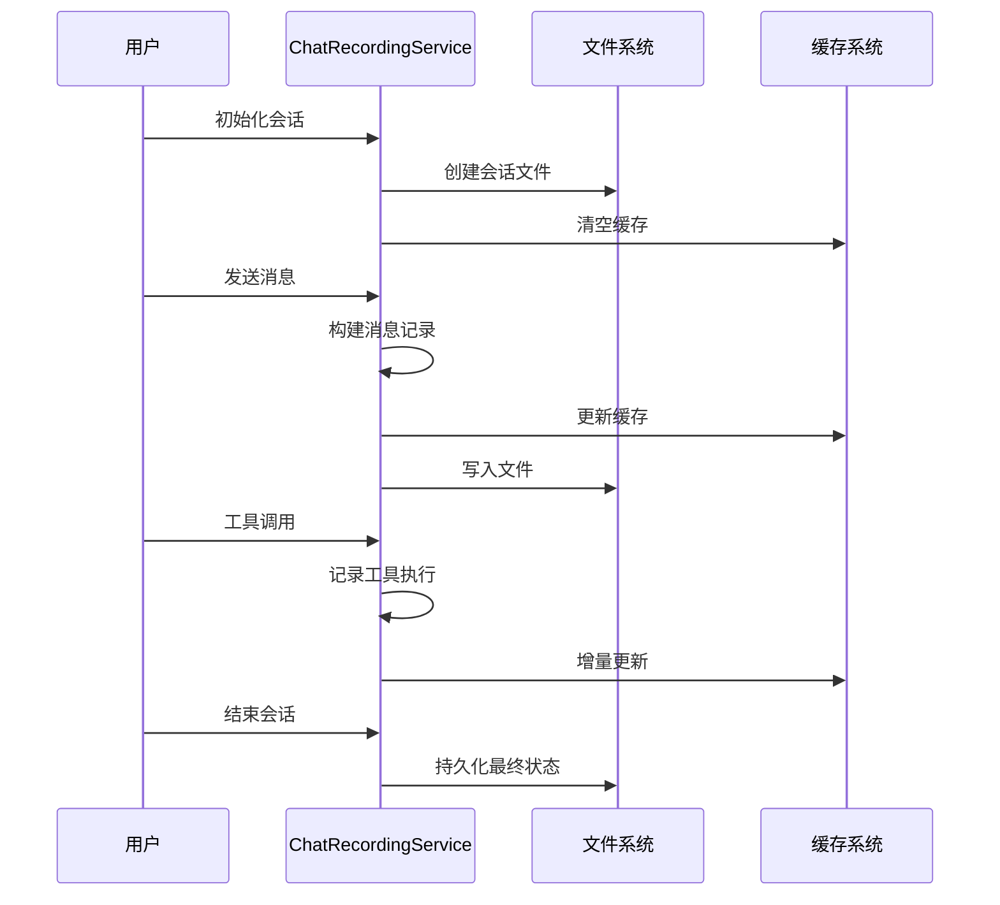
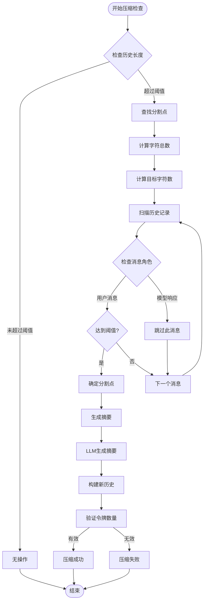
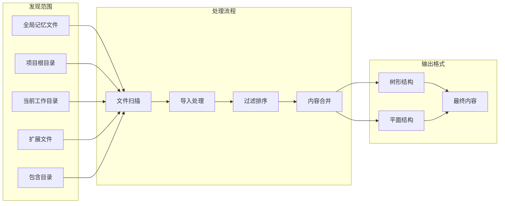
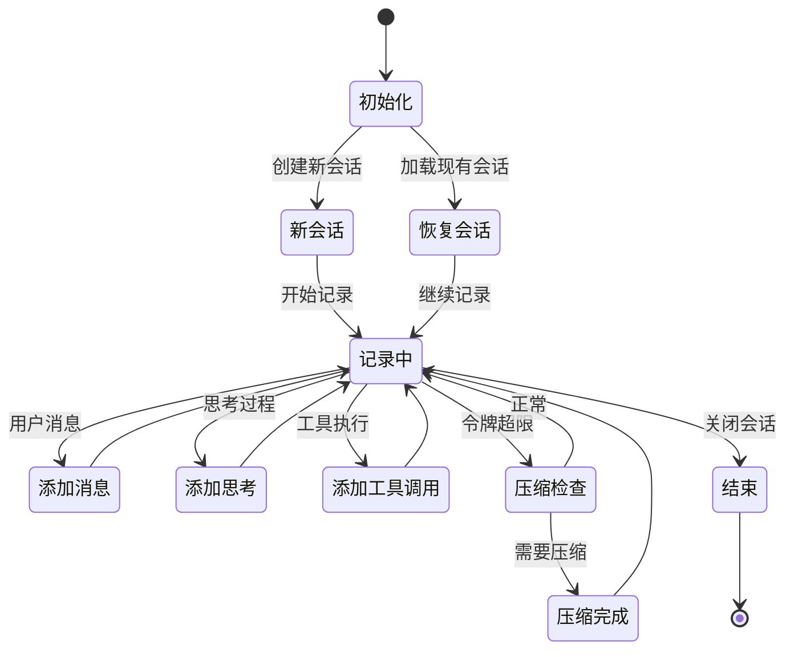
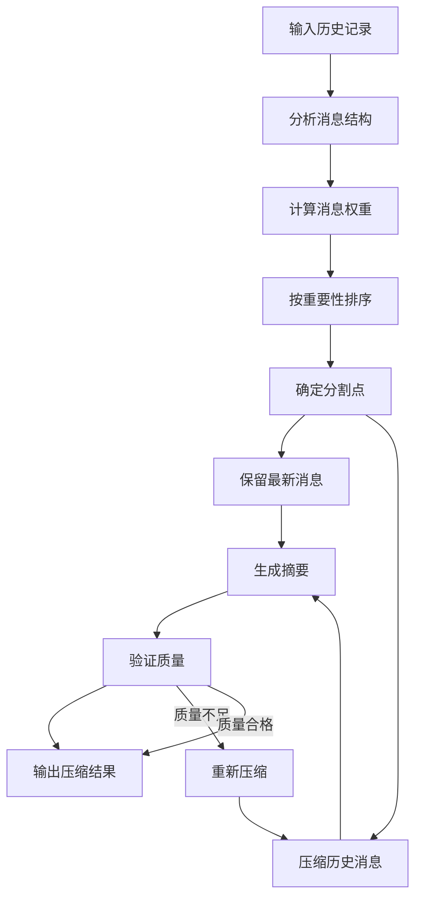
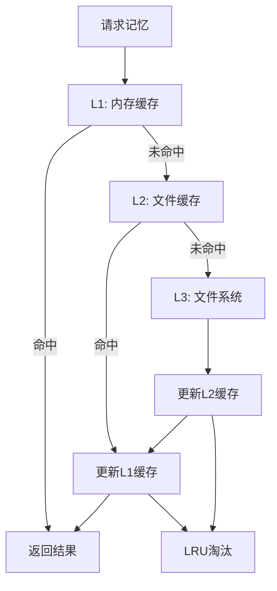

# 记忆管理工具

<cite>
**本文档中引用的文件**
- [memoryTool.ts](file://packages/core/src/tools/memoryTool.ts)
- [chatRecordingService.ts](file://packages/core/src/services/chatRecordingService.ts)
- [chatCompressionService.ts](file://packages/core/src/services/chatCompressionService.ts)
- [memoryDiscovery.ts](file://packages/core/src/utils/memoryDiscovery.ts)
- [storage.ts](file://packages/core/src/config/storage.ts)
- [memoryImportProcessor.ts](file://packages/core/src/utils/memoryImportProcessor.ts)
- [constants.ts](file://packages/core/src/config/constants.ts)
- [memoryTool.test.ts](file://packages/core/src/tools/memoryTool.test.ts)
- [chatRecordingService.test.ts](file://packages/core/src/services/chatRecordingService.test.ts)
- [chatCompressionService.test.ts](file://packages/core/src/services/chatCompressionService.test.ts)
- [memoryDiscovery.test.ts](file://packages/core/src/utils/memoryDiscovery.test.ts)
</cite>

## 目录

1. [简介](#简介)
2. [系统架构概览](#系统架构概览)
3. [核心组件详解](#核心组件详解)
4. [记忆存储机制](#记忆存储机制)
5. [对话记录服务](#对话记录服务)
6. [智能压缩服务](#智能压缩服务)
7. [记忆发现与检索](#记忆发现与检索)
8. [使用示例](#使用示例)
9. [隐私与安全考虑](#隐私与安全考虑)
10. [性能优化策略](#性能优化策略)
11. [故障排除指南](#故障排除指南)
12. [总结](#总结)

## 简介

gemini-cli的记忆管理工具是一个综合性的知识管理系统，旨在为AI助手提供长期记忆存储、对话历史管理和智能上下文压缩功能。该系统通过四个核心模块协同工作：记忆工具（MemoryTool）、对话记录服务（ChatRecordingService）、对话压缩服务（ChatCompressionService）和记忆发现服务（MemoryDiscovery），为用户提供无缝的智能交互体验。

## 系统架构概览



**图表来源**

- [memoryTool.ts](file://packages/core/src/tools/memoryTool.ts#L1-L400)
- [chatRecordingService.ts](file://packages/core/src/services/chatRecordingService.ts#L1-L457)
- [chatCompressionService.ts](file://packages/core/src/services/chatCompressionService.ts#L1-L217)
- [memoryDiscovery.ts](file://packages/core/src/utils/memoryDiscovery.ts#L1-L643)

## 核心组件详解

### MemoryTool - 记忆存储核心

MemoryTool是记忆管理系统的入口点，负责将用户的特定事实保存到长期记忆中。它采用声明式工具模式，提供安全的记忆存储机制。



**图表来源**

- [memoryTool.ts](file://packages/core/src/tools/memoryTool.ts#L297-L400)

**节来源**

- [memoryTool.ts](file://packages/core/src/tools/memoryTool.ts#L1-L400)

### ChatRecordingService - 对话记录管理

ChatRecordingService负责完整记录用户的对话历史，包括消息内容、工具调用、思考过程和令牌使用统计。它提供了会话恢复、实时记录和批量操作功能。



**图表来源**

- [chatRecordingService.ts](file://packages/core/src/services/chatRecordingService.ts#L110-L457)

**节来源**

- [chatRecordingService.ts](file://packages/core/src/services/chatRecordingService.ts#L1-L457)

### ChatCompressionService - 上下文压缩

ChatCompressionService在对话历史过长时自动进行智能压缩，通过LLM摘要技术保留关键信息，同时控制令牌使用量。



**图表来源**

- [chatCompressionService.ts](file://packages/core/src/services/chatCompressionService.ts#L78-L217)

**节来源**

- [chatCompressionService.ts](file://packages/core/src/services/chatCompressionService.ts#L1-L217)

### MemoryDiscovery - 智能发现

MemoryDiscovery负责从多个来源收集和整合记忆内容，支持层次化搜索、导入处理和动态刷新。



**图表来源**

- [memoryDiscovery.ts](file://packages/core/src/utils/memoryDiscovery.ts#L475-L577)

**节来源**

- [memoryDiscovery.ts](file://packages/core/src/utils/memoryDiscovery.ts#L1-L643)

## 记忆存储机制

### 存储位置与组织

记忆文件默认存储在用户主目录下的`.gemini`目录中，采用层次化的文件组织结构：

| 存储类型 | 路径                    | 描述               |
| -------- | ----------------------- | ------------------ |
| 全局记忆 | `~/.gemini/GEMINI.md`   | 用户级别的通用记忆 |
| 项目记忆 | `./GEMINI.md`           | 项目特定的记忆文件 |
| 临时会话 | `~/.gemini/tmp/chats/`  | 会话历史文件       |
| 扩展记忆 | `~/.gemini/extensions/` | 扩展程序提供的记忆 |

### 文件格式规范

记忆文件采用Markdown格式，具有以下结构特征：

```markdown
# 项目名称

## Gemini Added Memories

- 用户偏好：喜欢蓝色
- 项目配置：使用TypeScript
- 团队成员：张三负责前端

## 导入的文件

<!-- Imported from: ./src/config.ts -->

配置文件内容...

## 工具调用历史

- 工具：read_file
  - 参数：{"path":"./package.json"}
  - 结果：项目依赖信息
```

**节来源**

- [storage.ts](file://packages/core/src/config/storage.ts#L1-L142)
- [memoryTool.ts](file://packages/core/src/tools/memoryTool.ts#L64-L104)

## 对话记录服务

### 会话管理

ChatRecordingService提供完整的会话生命周期管理，包括初始化、记录、恢复和清理功能。



**图表来源**

- [chatRecordingService.ts](file://packages/core/src/services/chatRecordingService.ts#L119-L177)

### 数据结构设计

对话记录采用标准化的数据结构，确保跨平台兼容性和可扩展性：

| 字段类型          | 必需字段               | 可选字段                    | 描述         |
| ----------------- | ---------------------- | --------------------------- | ------------ |
| BaseMessageRecord | id, timestamp, content | -                           | 基础消息属性 |
| UserMessage       | type: "user"           | -                           | 用户消息     |
| GeminiMessage     | type: "gemini", model  | toolCalls, thoughts, tokens | AI助手消息   |
| ToolCallRecord    | id, name, args, status | result, displayName         | 工具调用记录 |

**节来源**

- [chatRecordingService.ts](file://packages/core/src/services/chatRecordingService.ts#L37-L98)

## 智能压缩服务

### 压缩算法

ChatCompressionService使用基于字符计数的智能分割算法，在保留关键信息的同时最大化压缩效率。



**图表来源**

- [chatCompressionService.ts](file://packages/core/src/services/chatCompressionService.ts#L36-L76)

### 压缩阈值配置

| 配置项       | 默认值 | 描述                    |
| ------------ | ------ | ----------------------- |
| 压缩阈值比例 | 0.2    | 令牌限制的20%触发压缩   |
| 保留比例     | 0.3    | 压缩后保留最后30%的消息 |
| 最大深度     | 5      | 导入处理的最大递归深度  |
| 并发限制     | 10/20  | 目录扫描/文件读取并发数 |

**节来源**

- [chatCompressionService.ts](file://packages/core/src/services/chatCompressionService.ts#L18-L30)

## 记忆发现与检索

### 层次化搜索策略

MemoryDiscovery采用多层级的搜索策略，优先级从高到低依次为：

1. **全局记忆文件**：用户主目录中的通用记忆
2. **项目根目录**：Git仓库根目录下的记忆文件
3. **当前工作目录**：用户当前所在目录的记忆文件
4. **扩展程序文件**：激活扩展提供的记忆内容
5. **包含目录**：用户指定的额外搜索路径

### 导入处理机制

支持复杂的文件导入语法，允许在一个记忆文件中引用其他文件内容：

```markdown
# 主记忆文件

@./config/settings.md @./src/components/README.md

## 当前项目信息

- 项目名称：gemini-cli
- 技术栈：TypeScript, React
- 版本：1.0.0
```

导入处理支持：

- **循环检测**：防止无限递归导入
- **路径验证**：防止路径遍历攻击
- **格式转换**：支持树形和扁平两种输出格式
- **错误处理**：优雅处理导入失败的情况

**节来源**

- [memoryDiscovery.ts](file://packages/core/src/utils/memoryDiscovery.ts#L475-L577)
- [memoryImportProcessor.ts](file://packages/core/src/utils/memoryImportProcessor.ts#L1-L414)

## 使用示例

### 基本记忆保存

```bash
# 保存个人偏好
/gemini memory add "我喜欢蓝色作为主题色"

# 保存项目配置
/gemini memory add "项目使用TypeScript作为主要语言"

# 保存团队信息
/gemini memory add "张三是前端负责人"
```

### 高级记忆管理

```bash
# 刷新所有记忆源
/gemini memory refresh

# 查看当前记忆内容
/gemini memory show

# 设置自定义记忆文件名
/gemini memory set-filename "PROJECT_CONTEXT.md"
```

### 对话历史回顾

```bash
# 回顾之前的决策
/gemini "我之前说过我喜欢蓝色吗？"

# 引用历史代码片段
/gemini "请展示我上次提到的配置文件"

# 总结项目进展
/gemini "总结一下我们项目的当前状态"
```

### 自动化记忆集成

```javascript
// 在扩展中访问记忆内容
const memoryContent = await refreshServerHierarchicalMemory(config);
console.log('可用记忆:', memoryContent.memoryContent);
```

**节来源**

- [memoryTool.test.ts](file://packages/core/src/tools/memoryTool.test.ts#L1-L432)
- [chatRecordingService.test.ts](file://packages/core/src/services/chatRecordingService.test.ts#L1-L405)

## 隐私与安全考虑

### 数据隔离机制

系统采用多层次的数据隔离策略：

1. **文件权限控制**：记忆文件仅对当前用户可读写
2. **目录信任机制**：只有受信任的目录才能被扫描
3. **路径验证**：严格验证导入路径，防止路径遍历攻击
4. **临时文件清理**：会话结束后自动清理临时文件

### 安全特性

| 安全措施     | 实现方式          | 目标             |
| ------------ | ----------------- | ---------------- |
| 路径遍历防护 | `isSubpath()`检查 | 防止恶意路径访问 |
| 权限最小化   | 仅读取必要文件    | 减少攻击面       |
| 输入验证     | 严格的参数校验    | 防止注入攻击     |
| 错误隔离     | 独立的错误处理    | 防止信息泄露     |

### 隐私保护

- **本地存储**：所有记忆数据存储在本地设备
- **加密传输**：敏感数据传输时使用加密通道
- **访问控制**：基于用户身份的访问权限管理
- **审计日志**：记录重要的记忆操作行为

**节来源**

- [memoryImportProcessor.ts](file://packages/core/src/utils/memoryImportProcessor.ts#L398-L414)
- [constants.ts](file://packages/core/src/config/constants.ts#L1-L23)

## 性能优化策略

### 缓存机制

系统实现了多级缓存策略：



### 并发控制

- **目录扫描并发**：最多10个并发目录扫描任务
- **文件读取并发**：最多20个并发文件读取任务
- **内存限制**：单次操作最大内存使用限制
- **超时控制**：防止长时间阻塞操作

### 压缩优化

- **增量压缩**：只压缩超出阈值的部分
- **预估令牌**：使用字符数估算减少计算开销
- **智能分割**：基于消息重要性选择分割点

**节来源**

- [chatCompressionService.ts](file://packages/core/src/services/chatCompressionService.ts#L18-L30)
- [memoryDiscovery.ts](file://packages/core/src/utils/memoryDiscovery.ts#L101-L136)

## 故障排除指南

### 常见问题诊断

| 问题症状     | 可能原因     | 解决方案                  |
| ------------ | ------------ | ------------------------- |
| 记忆无法保存 | 文件权限不足 | 检查`.gemini`目录权限     |
| 对话丢失     | 会话文件损坏 | 使用`/memory refresh`重载 |
| 压缩失败     | 令牌估算错误 | 手动调整压缩阈值          |
| 导入失败     | 路径不存在   | 检查导入路径的有效性      |

### 调试工具

```bash
# 启用调试模式
export GEMINI_DEBUG=true

# 查看记忆文件列表
/gemini memory list

# 检查当前配置
/gemini config show

# 测试导入功能
/gemini memory test-import ./test.md
```

### 性能监控

系统提供内置的性能监控功能：

```javascript
// 监控压缩事件
logChatCompression(
  config,
  makeChatCompressionEvent({
    tokens_before: originalCount,
    tokens_after: newCount,
  }),
);
```

**节来源**

- [chatCompressionService.test.ts](file://packages/core/src/services/chatCompressionService.test.ts#L1-L295)
- [memoryDiscovery.test.ts](file://packages/core/src/utils/memoryDiscovery.test.ts#L1-L800)

## 总结

gemini-cli的记忆管理工具提供了一个完整、安全、高效的智能记忆解决方案。通过MemoryTool的精确存储、ChatRecordingService的完整记录、ChatCompressionService的智能压缩和MemoryDiscovery的全面发现，系统能够为用户提供持续的学习能力和上下文感知能力。

### 核心优势

1. **安全性**：多重防护机制确保数据安全
2. **可扩展性**：模块化设计支持功能扩展
3. **性能**：智能缓存和并发控制保证高效运行
4. **易用性**：简洁的API和丰富的配置选项
5. **可靠性**：完善的错误处理和恢复机制

### 未来发展方向

- **机器学习增强**：基于用户行为优化记忆策略
- **云同步支持**：跨设备的记忆同步功能
- **语义搜索**：基于向量检索的智能记忆查询
- **可视化界面**：图形化的记忆管理工具

这个记忆管理系统不仅为当前的AI交互提供了强大的支持，也为未来的智能化发展奠定了坚实的基础。
