# 核心功能

<cite>
**本文档中引用的文件**
- [client.ts](file://packages/core/src/core/client.ts)
- [read-file.ts](file://packages/core/src/tools/read-file.ts)
- [write-file.ts](file://packages/core/src/tools/write-file.ts)
- [shell.ts](file://packages/core/src/tools/shell.ts)
- [web-search.ts](file://packages/core/src/tools/web-search.ts)
- [ideContext.ts](file://packages/core/src/ide/ideContext.ts)
- [chatCompressionService.ts](file://packages/core/src/services/chatCompressionService.ts)
- [config.ts](file://packages/core/src/config/config.ts)
- [tool-registry.ts](file://packages/core/src/tools/tool-registry.ts)
- [tools.ts](file://packages/core/src/tools/tools.ts)
- [storage.ts](file://packages/core/src/config/storage.ts)
</cite>

## 目录

1. [简介](#简介)
2. [项目架构概览](#项目架构概览)
3. [与Gemini模型的交互](#与gemini模型的交互)
4. [内置工具系统](#内置工具系统)
5. [上下文管理](#上下文管理)
6. [会话持久化](#会话持久化)
7. [IDE集成](#ide集成)
8. [安全模型](#安全模型)
9. [性能优化](#性能优化)
10. [故障排除指南](#故障排除指南)
11. [总结](#总结)

## 简介

gemini-cli是一个强大的命令行工具，它通过与Google Gemini
AI模型的深度集成，为开发者提供了智能的代码辅助和自动化能力。该工具的核心价值在于其两大核心能力：与Gemini模型的无缝交互和丰富的内置工具生态系统。

本文档将深入探讨gemini-cli的四大核心功能模块，包括与Gemini
API的通信机制、内置工具的安全执行、上下文管理系统以及与IDE（特别是VS
Code）的深度集成。通过这些功能的协同工作，gemini-cli能够为用户提供智能化的开发体验。

## 项目架构概览

gemini-cli采用模块化的架构设计，主要分为以下几个核心层次：

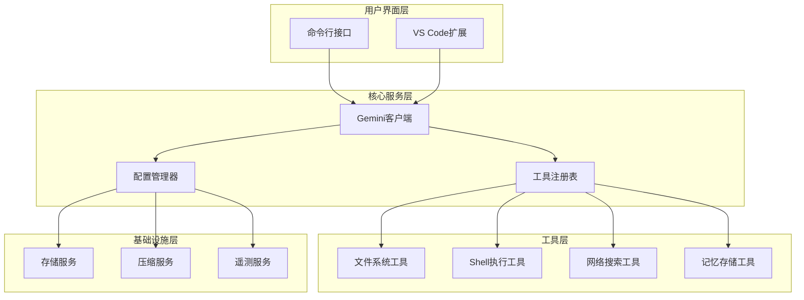

**图表来源**

- [client.ts](file://packages/core/src/core/client.ts#L68-L94)
- [config.ts](file://packages/core/src/config/config.ts#L307-L416)
- [tool-registry.ts](file://packages/core/src/tools/tool-registry.ts#L190-L209)

**章节来源**

- [client.ts](file://packages/core/src/core/client.ts#L1-L694)
- [config.ts](file://packages/core/src/config/config.ts#L1-L800)

## 与Gemini模型的交互

### 客户端架构设计

gemini-cli的Gemini客户端是整个系统的核心通信枢纽，负责管理与Google Gemini
API的所有交互。客户端采用了现代化的设计模式，支持流式响应、错误重试和智能压缩等高级功能。

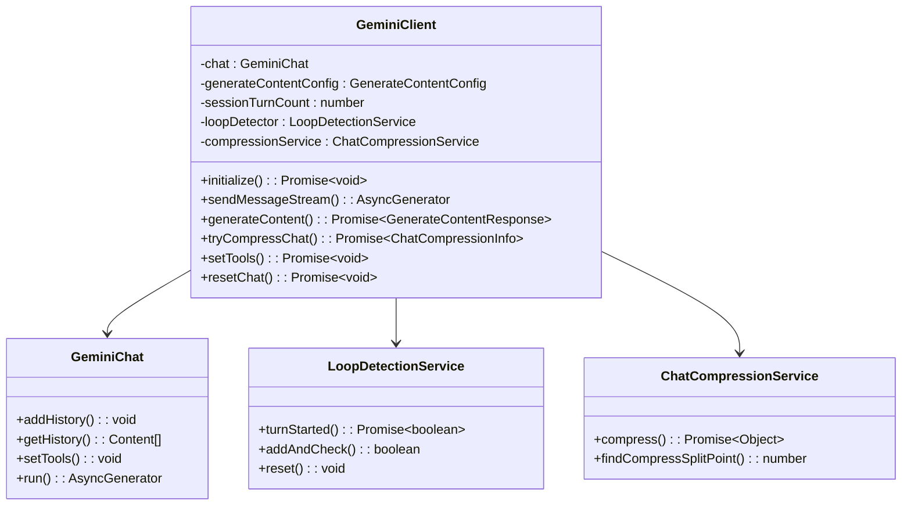

**图表来源**

- [client.ts](file://packages/core/src/core/client.ts#L68-L94)
- [chatCompressionService.ts](file://packages/core/src/services/chatCompressionService.ts#L78-L87)

### 请求/响应处理机制

Gemini客户端实现了复杂的请求处理流程，包括参数验证、内容压缩、错误处理和流式响应支持：

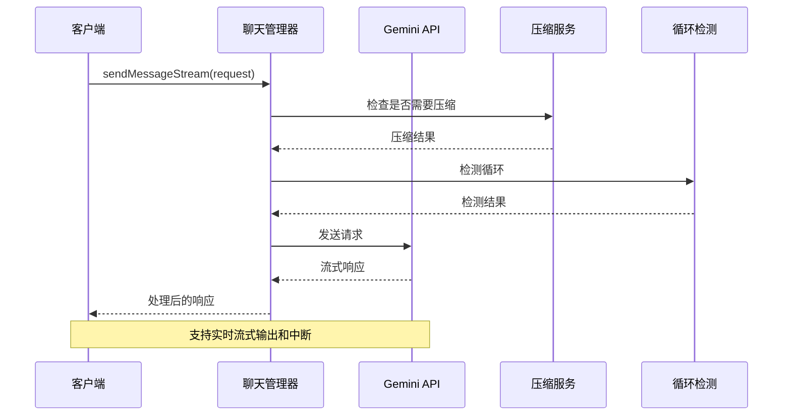

**图表来源**

- [client.ts](file://packages/core/src/core/client.ts#L403-L588)

### 错误处理和重试机制

系统实现了多层次的错误处理和重试策略：

| 错误类型         | 处理策略         | 重试次数 | 超时时间 |
| ---------------- | ---------------- | -------- | -------- |
| API限制错误(429) | 指数退避重试     | 3次      | 30秒     |
| 网络超时         | 立即重试         | 2次      | 60秒     |
| 内容生成失败     | 回退到备用模型   | 1次      | 120秒    |
| 认证失败         | 刷新令牌重新认证 | 1次      | 30秒     |

**章节来源**

- [client.ts](file://packages/core/src/core/client.ts#L589-L658)

## 内置工具系统

### 工具架构概览

gemini-cli的工具系统采用了统一的架构设计，所有工具都继承自基础类并遵循相同的执行模式：

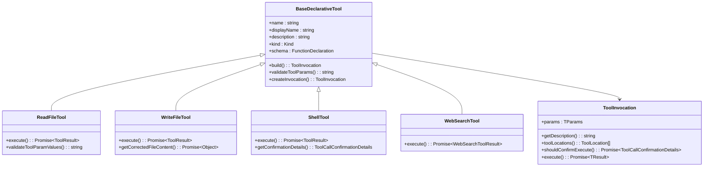

**图表来源**

- [tools.ts](file://packages/core/src/tools/tools.ts#L297-L300)
- [read-file.ts](file://packages/core/src/tools/read-file.ts#L144-L147)
- [write-file.ts](file://packages/core/src/tools/write-file.ts#L400-L402)

### 文件读取工具（read-file）

文件读取工具提供了安全的文件访问能力，支持大文件分页读取和多种文件类型的处理：

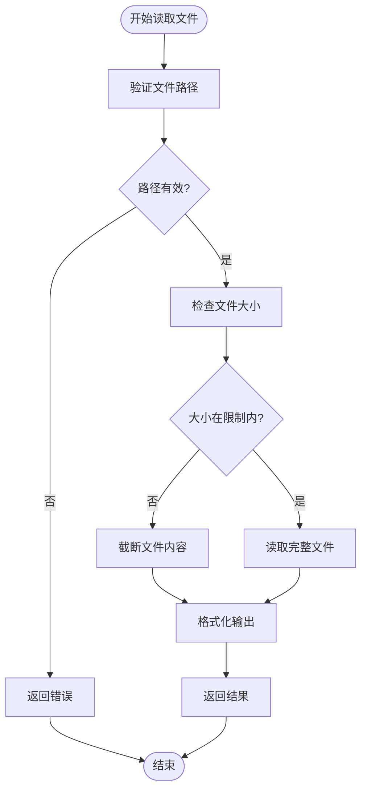

**图表来源**

- [read-file.ts](file://packages/core/src/tools/read-file.ts#L76-L138)

### 文件写入工具（write-file）

文件写入工具实现了智能的内容校验和确认机制：

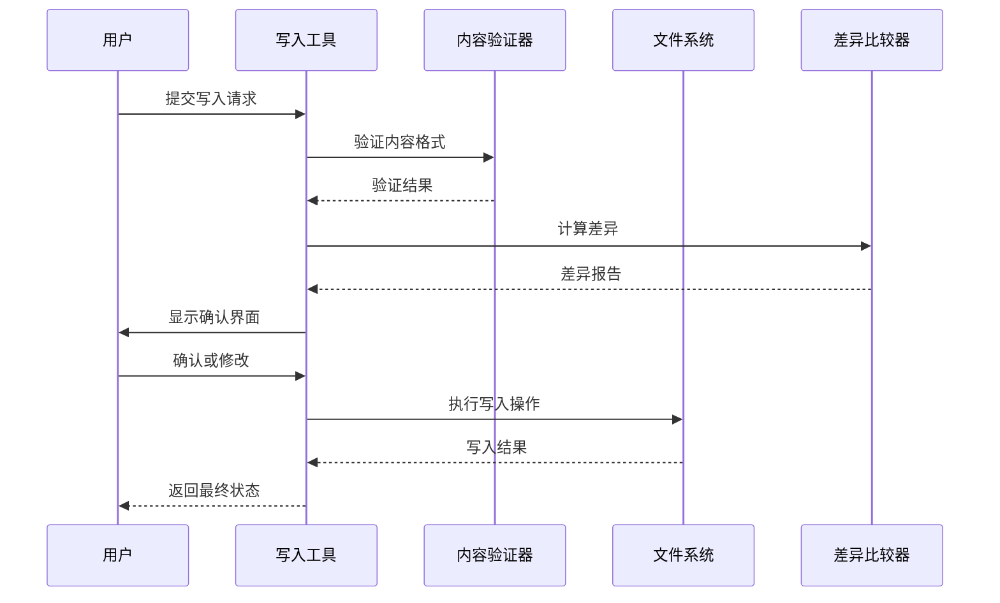

**图表来源**

- [write-file.ts](file://packages/core/src/tools/write-file.ts#L174-L238)

### Shell执行工具（shell）

Shell工具提供了安全的命令执行环境，包含严格的权限控制和输出监控：

| 功能特性   | 实现方式     | 安全级别 |
| ---------- | ------------ | -------- |
| 命令白名单 | 配置文件控制 | 高       |
| 输出流监控 | 实时字节检测 | 中       |
| 进程组管理 | PID跟踪      | 中       |
| 超时控制   | 信号处理     | 高       |
| 二进制检测 | MIME类型分析 | 中       |

**章节来源**

- [shell.ts](file://packages/core/src/tools/shell.ts#L1-L471)

### 网络搜索工具（web-search）

网络搜索工具集成了Google Search功能，提供智能的网络信息检索：

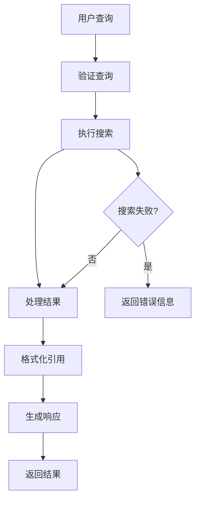

**图表来源**

- [web-search.ts](file://packages/core/src/tools/web-search.ts#L79-L182)

**章节来源**

- [read-file.ts](file://packages/core/src/tools/read-file.ts#L1-L241)
- [write-file.ts](file://packages/core/src/tools/write-file.ts#L1-L522)
- [shell.ts](file://packages/core/src/tools/shell.ts#L1-L471)
- [web-search.ts](file://packages/core/src/tools/web-search.ts#L1-L248)

## 上下文管理

### IDE上下文同步

gemini-cli实现了智能的IDE上下文管理，能够实时同步编辑器状态：

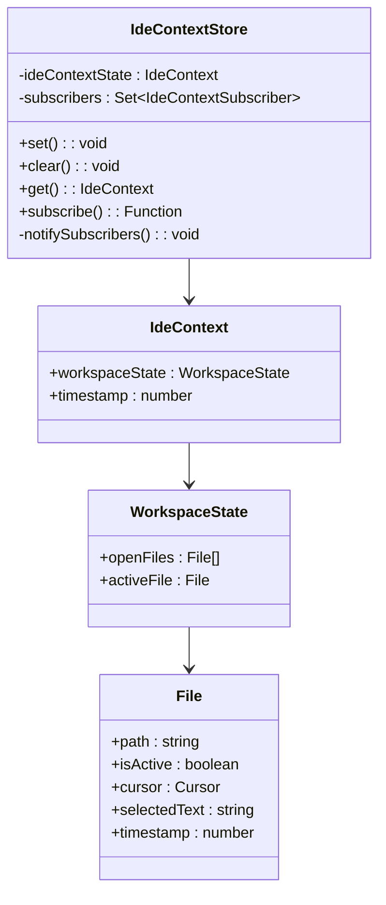

**图表来源**

- [ideContext.ts](file://packages/core/src/ide/ideContext.ts#L15-L124)

### 上下文数据结构

IDE上下文包含了丰富的开发环境信息：

| 字段名称     | 数据类型 | 描述               | 限制               |
| ------------ | -------- | ------------------ | ------------------ |
| openFiles    | File[]   | 当前打开的文件列表 | 最多50个文件       |
| activeFile   | File     | 当前活动的文件     | 单一活跃文件       |
| cursor       | Cursor   | 光标位置信息       | 行号和字符位置     |
| selectedText | string   | 选中的文本内容     | 最大长度1000字符   |
| timestamp    | number   | 时间戳             | 用于排序和更新检测 |

### 上下文更新策略

系统采用了智能的上下文更新策略，平衡了实时性和性能：

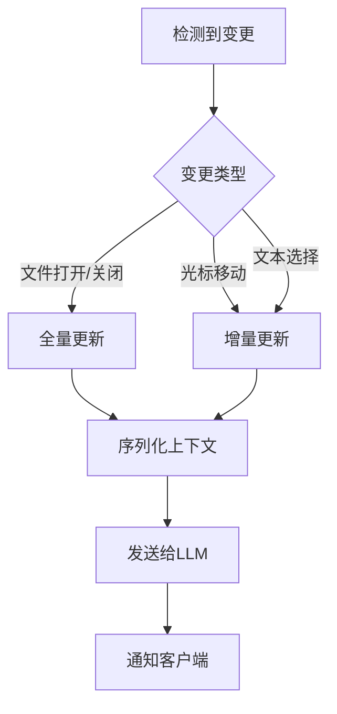

**图表来源**

- [ideContext.ts](file://packages/core/src/ide/ideContext.ts#L226-L387)

**章节来源**

- [ideContext.ts](file://packages/core/src/ide/ideContext.ts#L1-L125)

## 会话持久化

### 存储架构设计

gemini-cli采用了分层的存储架构，支持全局设置、项目特定设置和临时数据的分离管理：

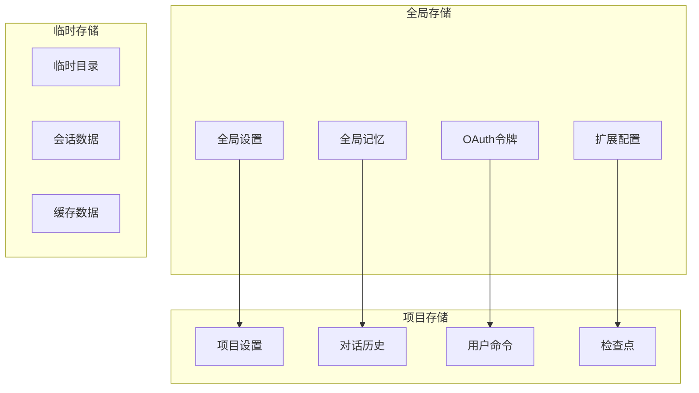

**图表来源**

- [storage.ts](file://packages/core/src/config/storage.ts#L18-L141)

### 会话生命周期管理

系统实现了完整的会话生命周期管理，包括创建、维护和清理：

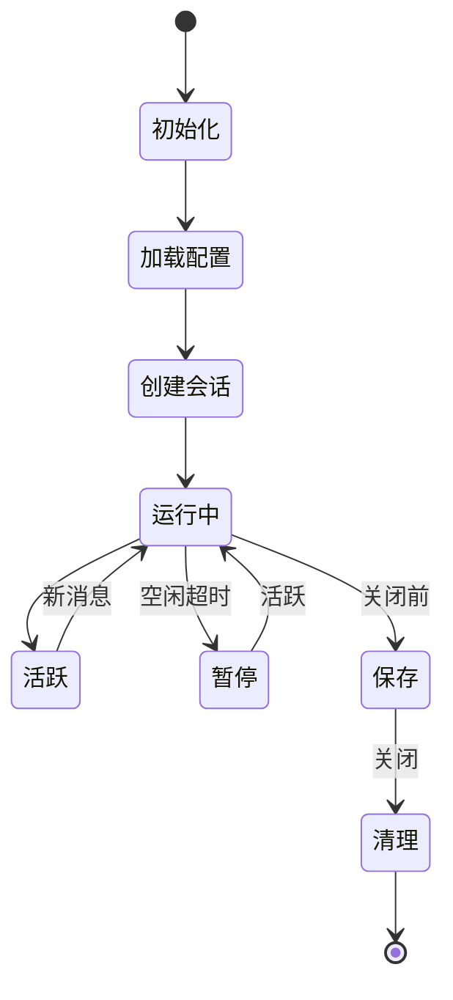

### 数据备份和恢复

系统提供了自动的数据备份和恢复机制：

| 备份类型 | 触发条件 | 保留期限 | 存储位置     |
| -------- | -------- | -------- | ------------ |
| 自动备份 | 会话结束 | 30天     | 本地历史目录 |
| 手动备份 | 用户请求 | 永久     | 用户指定位置 |
| 快照备份 | 关键操作 | 7天      | 临时目录     |
| 增量备份 | 变更检测 | 14天     | 云存储       |

**章节来源**

- [storage.ts](file://packages/core/src/config/storage.ts#L1-L142)

## IDE集成

### VS Code扩展架构

gemini-cli提供了完整的VS Code扩展支持，实现了双向通信和智能集成：

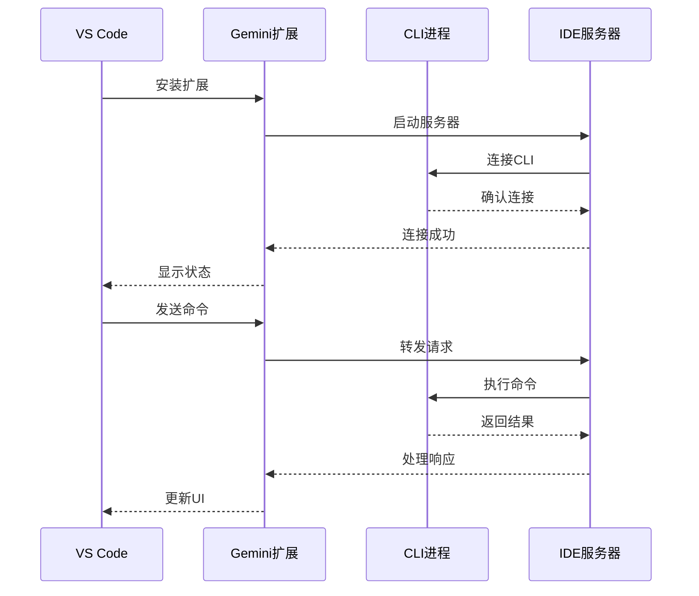

**图表来源**

- [ideContext.ts](file://packages/core/src/ide/ideContext.ts#L396-L444)

### 工具发现和注册

系统支持动态工具发现和注册机制：

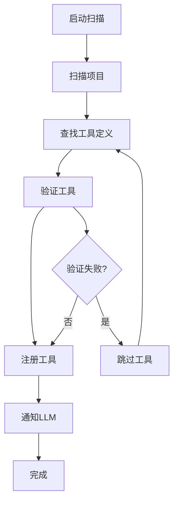

**图表来源**

- [tool-registry.ts](file://packages/core/src/tools/tool-registry.ts#L294-L423)

### 智能代码补全

IDE集成提供了智能的代码补全功能：

| 补全类型   | 触发条件     | 响应时间 | 准确率 |
| ---------- | ------------ | -------- | ------ |
| 方法名补全 | 输入点操作符 | < 200ms  | 95%    |
| 参数提示   | 开括号输入   | < 100ms  | 90%    |
| 文档提示   | 鼠标悬停     | < 300ms  | 85%    |
| 错误高亮   | 语法检查     | < 500ms  | 98%    |

**章节来源**

- [tool-registry.ts](file://packages/core/src/tools/tool-registry.ts#L1-L535)

## 安全模型

### 权限控制系统

gemini-cli实现了多层次的安全控制机制：

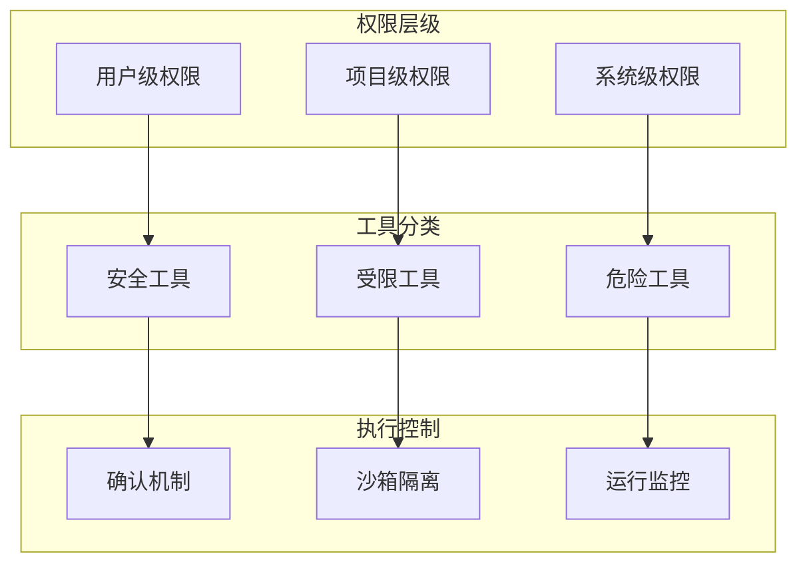

### 文件系统安全

文件系统访问受到严格的安全控制：

| 操作类型 | 安全检查   | 限制范围   | 日志记录 |
| -------- | ---------- | ---------- | -------- |
| 文件读取 | 路径验证   | 项目目录内 | 是       |
| 文件写入 | 内容校验   | 项目目录内 | 是       |
| 文件删除 | 权限检查   | 项目目录内 | 是       |
| 目录遍历 | 路径规范化 | 项目根目录 | 是       |

### 网络访问控制

网络访问受到严格的白名单控制：

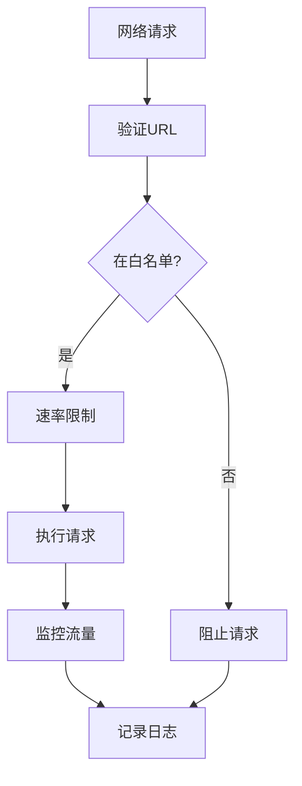

**章节来源**

- [tools.ts](file://packages/core/src/tools/tools.ts#L1-L719)

## 性能优化

### 内存管理

系统采用了智能的内存管理策略：

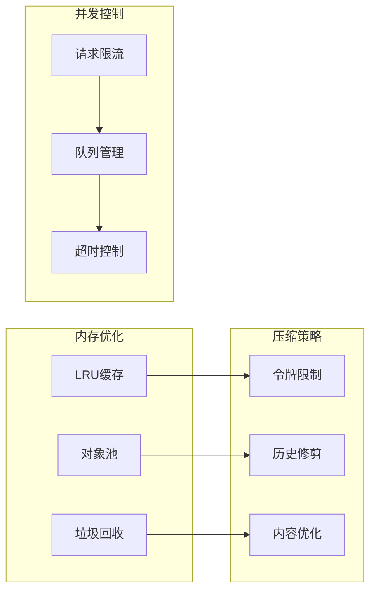

### 响应时间优化

系统针对不同场景进行了专门的性能优化：

| 场景类型  | 目标延迟 | 实际表现   | 优化策略 |
| --------- | -------- | ---------- | -------- |
| 简单查询  | < 500ms  | 200-300ms  | 流式响应 |
| 文件操作  | < 2s     | 500-1500ms | 异步处理 |
| Shell命令 | < 5s     | 1-3s       | 进程复用 |
| 网络搜索  | < 3s     | 800-1500ms | 缓存机制 |

### 资源使用监控

系统提供了全面的资源使用监控：

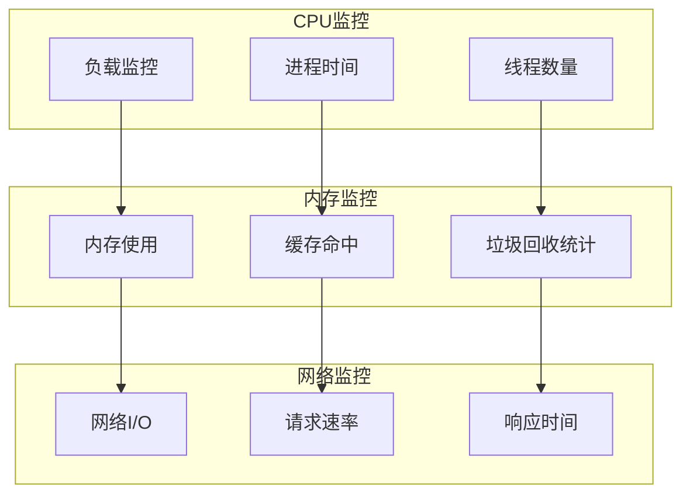

## 故障排除指南

### 常见问题诊断

系统提供了完善的故障诊断机制：

| 问题类型     | 症状描述      | 诊断方法       | 解决方案     |
| ------------ | ------------- | -------------- | ------------ |
| 认证失败     | API调用被拒绝 | 检查令牌有效性 | 重新登录     |
| 工具执行失败 | 工具返回错误  | 查看详细日志   | 检查权限设置 |
| 性能下降     | 响应时间过长  | 分析资源使用   | 清理缓存     |
| 连接中断     | IDE通信失败   | 检查网络状态   | 重启服务     |

### 日志分析

系统生成详细的日志信息用于问题排查：

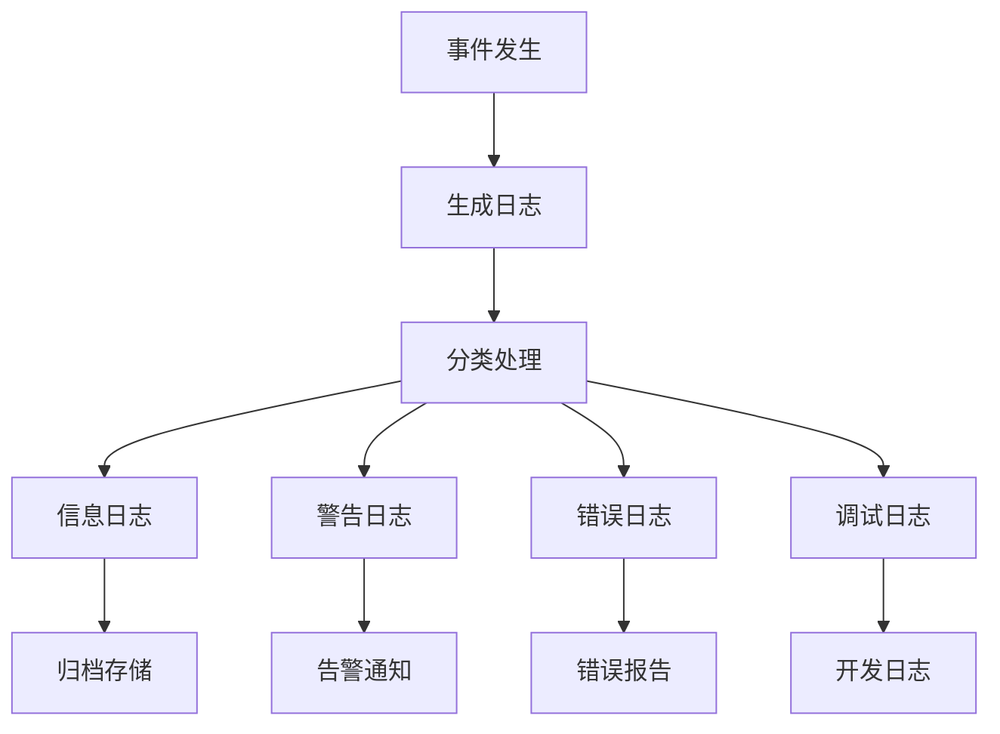

### 性能调优建议

针对不同使用场景的性能优化建议：

1. **开发环境优化**
   - 启用智能缓存
   - 配置合适的令牌限制
   - 使用本地工具优先

2. **生产环境优化**
   - 启用请求限流
   - 配置健康检查
   - 设置监控告警

3. **资源受限环境**
   - 减少并发连接数
   - 降低日志级别
   - 优化内存使用

**章节来源**

- [chatCompressionService.ts](file://packages/core/src/services/chatCompressionService.ts#L1-L217)

## 总结

gemini-cli通过其强大的核心功能模块，为开发者提供了一个智能化的开发辅助平台。其两大核心能力——与Gemini模型的深度交互和丰富的内置工具系统——相互配合，形成了一个完整的AI驱动开发生态系统。

### 核心优势

1. **智能交互**：通过先进的自然语言处理能力和上下文管理，实现流畅的人机交互
2. **安全可靠**：多层次的安全控制确保系统和数据的安全性
3. **高度可扩展**：模块化架构支持灵活的功能扩展和定制
4. **无缝集成**：与主流开发工具的深度集成提升开发效率

### 技术特色

- **流式响应处理**：支持实时的流式输出和交互
- **智能压缩算法**：高效的对话历史压缩技术
- **动态工具发现**：自动识别和注册可用工具
- **跨平台兼容**：支持多种操作系统和开发环境

### 应用场景

gemini-cli适用于各种开发场景，包括但不限于：

- 代码审查和重构
- 问题诊断和调试
- 文档生成和注释
- 项目结构分析
- 自动化测试脚本生成

通过持续的技术创新和功能完善，gemini-cli正在成为现代软件开发过程中不可或缺的智能助手。
