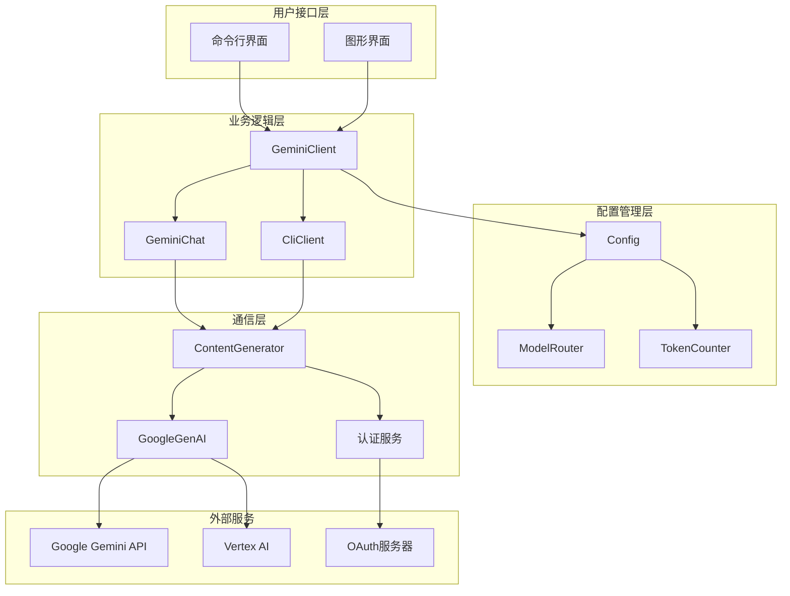
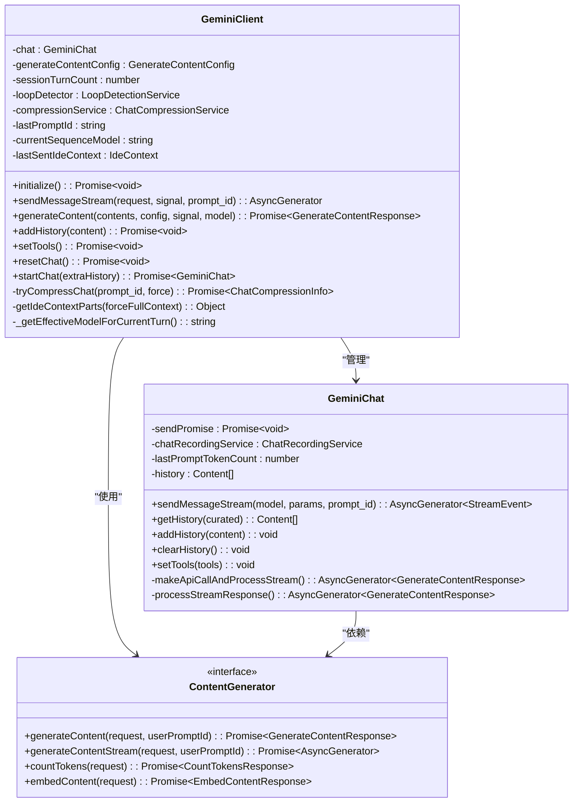
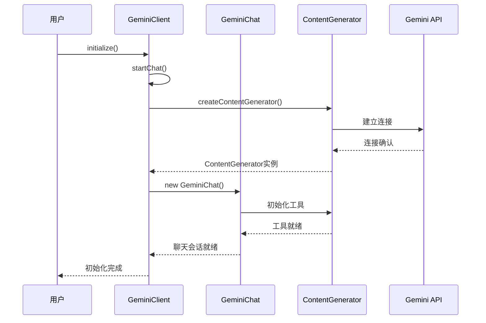
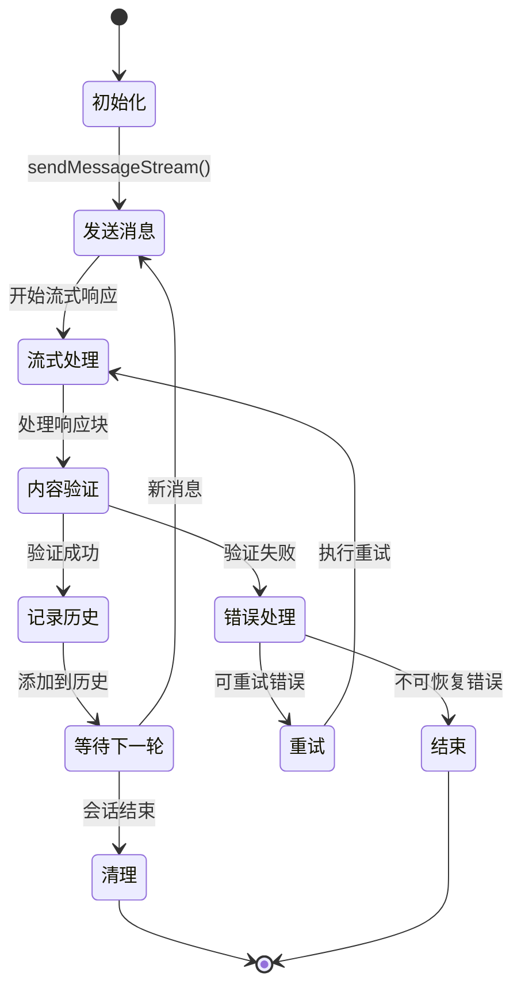
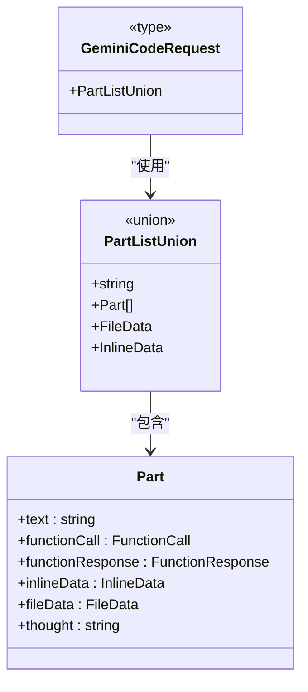
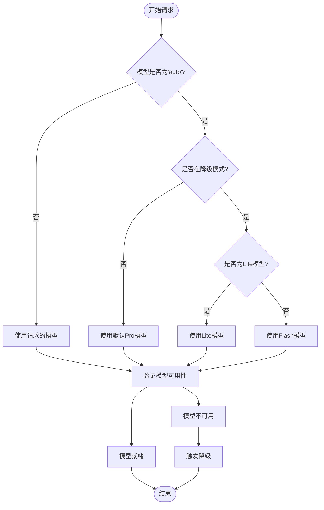
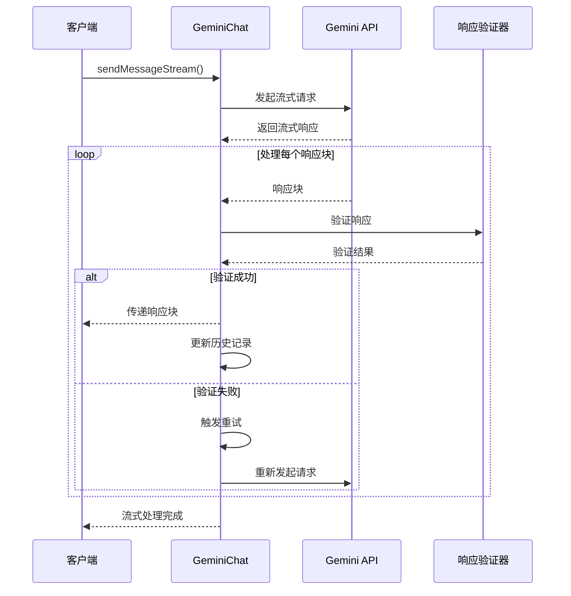
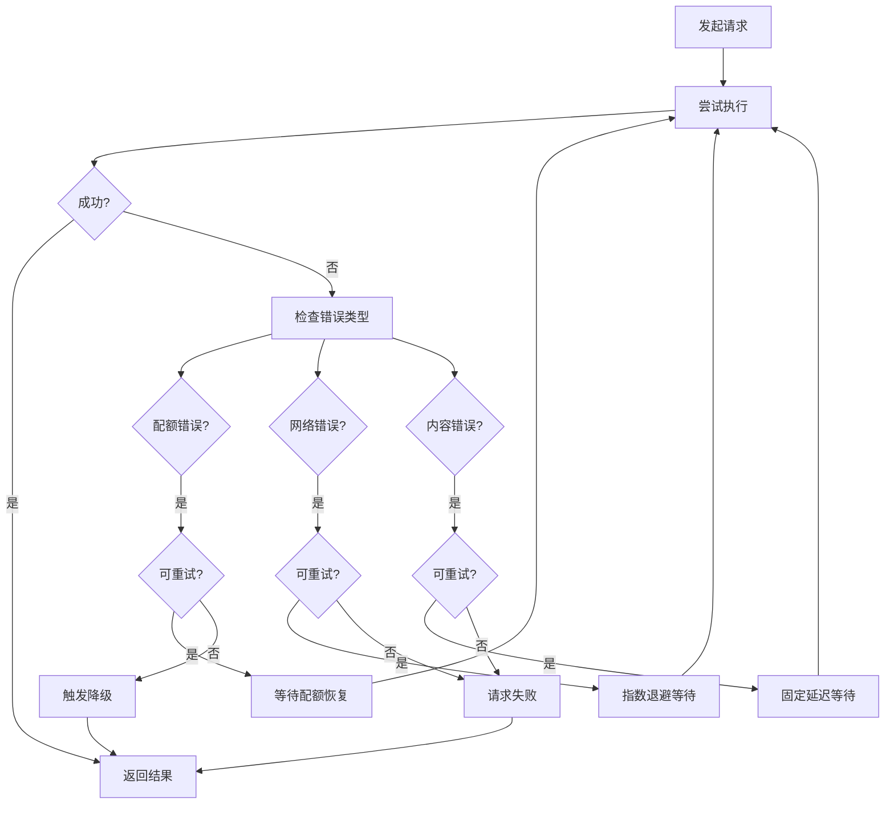
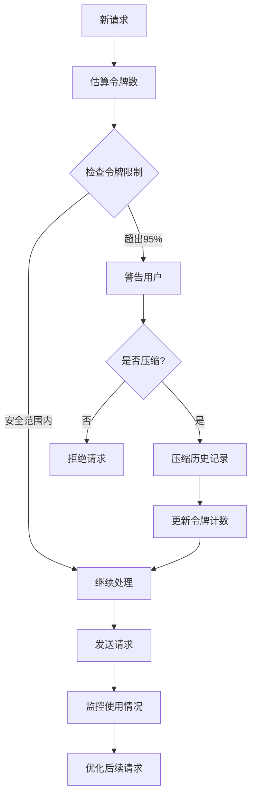

# 模型交互

<cite>
**本文档引用的文件**
- [client.ts](file://packages/core/src/core/client.ts)
- [geminiChat.ts](file://packages/core/src/core/geminiChat.ts)
- [geminiRequest.ts](file://packages/core/src/core/geminiRequest.ts)
- [models.ts](file://packages/core/src/config/models.ts)
- [baseLlmClient.ts](file://packages/core/src/core/baseLlmClient.ts)
- [contentGenerator.ts](file://packages/core/src/core/contentGenerator.ts)
- [config.ts](file://packages/core/src/config/config.ts)
- [retry.ts](file://packages/core/src/utils/retry.ts)
- [tokenLimits.ts](file://packages/core/src/core/tokenLimits.ts)
- [googleErrors.ts](file://packages/core/src/utils/googleErrors.ts)
- [delay.ts](file://packages/core/src/utils/delay.ts)
</cite>

## 目录

1. [简介](#简介)
2. [系统架构概览](#系统架构概览)
3. [核心客户端组件](#核心客户端组件)
4. [会话管理](#会话管理)
5. [请求格式与处理](#请求格式与处理)
6. [模型配置与路由](#模型配置与路由)
7. [流式响应处理](#流式响应处理)
8. [错误处理与重试机制](#错误处理与重试机制)
9. [性能优化与可靠性](#性能优化与可靠性)
10. [实际使用示例](#实际使用示例)
11. [故障排除指南](#故障排除指南)

## 简介

gemini-cli项目实现了一个复杂的Gemini模型交互系统，提供了与Google Gemini
API的无缝集成。该系统通过多层抽象设计，实现了高效、可靠的模型通信，支持多种认证方式、智能重试机制和流式响应处理。

核心系统包含三个主要组件：

- **GeminiClient**: 高级客户端，负责整体会话管理和请求协调
- **GeminiChat**: 会话管理器，处理具体的聊天交互
- **ContentGenerator**: 底层内容生成器，直接与Gemini API通信

## 系统架构概览



**图表来源**

- [client.ts](file://packages/core/src/core/client.ts#L68-L100)
- [geminiChat.ts](file://packages/core/src/core/geminiChat.ts#L183-L200)
- [config.ts](file://packages/core/src/config/config.ts#L307-L350)

## 核心客户端组件

### GeminiClient类架构

GeminiClient是系统的核心控制器，负责管理整个对话生命周期和资源协调。



**图表来源**

- [client.ts](file://packages/core/src/core/client.ts#L68-L100)
- [geminiChat.ts](file://packages/core/src/core/geminiChat.ts#L183-L200)
- [contentGenerator.ts](file://packages/core/src/core/contentGenerator.ts#L29-L45)

### 客户端初始化流程

客户端初始化过程涉及多个步骤，确保所有依赖项正确配置：



**图表来源**

- [client.ts](file://packages/core/src/core/client.ts#L103-L105)
- [client.ts](file://packages/core/src/core/client.ts#L178-L219)

**章节来源**

- [client.ts](file://packages/core/src/core/client.ts#L68-L100)
- [geminiChat.ts](file://packages/core/src/core/geminiChat.ts#L183-L200)

## 会话管理

### GeminiChat会话生命周期

GeminiChat类负责维护单个对话会话的状态和历史记录。



**图表来源**

- [geminiChat.ts](file://packages/core/src/core/geminiChat.ts#L229-L347)
- [geminiChat.ts](file://packages/core/src/core/geminiChat.ts#L494-L587)

### 历史记录管理

系统维护两种类型的历史记录：

| 历史类型 | 描述                           | 用途                |
| -------- | ------------------------------ | ------------------- |
| 全面历史 | 包含所有对话轮次，包括无效输出 | 完整审计和调试      |
| 优化历史 | 仅包含有效对话轮次             | API请求和上下文压缩 |

**章节来源**

- [geminiChat.ts](file://packages/core/src/core/geminiChat.ts#L418-L425)
- [geminiChat.ts](file://packages/core/src/core/geminiChat.ts#L133-L159)

## 请求格式与处理

### 请求结构定义

GeminiRequest模块定义了与Gemini API交互的标准请求格式。



**图表来源**

- [geminiRequest.ts](file://packages/core/src/core/geminiRequest.ts#L15-L20)

### 内容生成配置

系统支持灵活的生成配置，包括温度控制、Top-P采样和思考模式：

| 配置项         | 默认值 | 描述           |
| -------------- | ------ | -------------- |
| temperature    | 0      | 控制输出随机性 |
| topP           | 1      | 核采样参数     |
| thinkingConfig | 可选   | 启用思考模式   |
| maxTokens      | 动态   | 最大令牌数限制 |

**章节来源**

- [client.ts](file://packages/core/src/core/client.ts#L70-L73)
- [client.ts](file://packages/core/src/core/client.ts#L195-L200)

## 模型配置与路由

### 支持的模型类型

系统支持多种Gemini模型，每种都有特定的用途和限制：

| 模型名称              | 类别  | 上下文长度 | 推荐用途         |
| --------------------- | ----- | ---------- | ---------------- |
| gemini-2.5-pro        | Pro   | 1,048,576  | 复杂推理和长文档 |
| gemini-2.5-flash      | Flash | 1,048,576  | 快速任务和对话   |
| gemini-2.5-flash-lite | Lite  | 1,048,576  | 轻量级任务       |
| gemini-1.5-pro        | Pro   | 2,097,152  | 高质量输出       |
| gemini-1.5-flash      | Flash | 1,048,576  | 平衡性能和质量   |

### 模型选择逻辑



**图表来源**

- [models.ts](file://packages/core/src/config/models.ts#L31-L48)
- [client.ts](file://packages/core/src/core/client.ts#L390-L400)

**章节来源**

- [models.ts](file://packages/core/src/config/models.ts#L7-L48)
- [tokenLimits.ts](file://packages/core/src/core/tokenLimits.ts#L12-L32)

## 流式响应处理

### 流式处理架构

系统实现了高效的流式响应处理机制，支持实时内容传输和错误检测。



**图表来源**

- [geminiChat.ts](file://packages/core/src/core/geminiChat.ts#L229-L347)
- [geminiChat.ts](file://packages/core/src/core/geminiChat.ts#L494-L587)

### 响应验证机制

系统实现了严格的响应验证，确保内容质量和完整性：

| 验证类型   | 检查项目           | 处理策略   |
| ---------- | ------------------ | ---------- |
| 内容完整性 | 非空内容检查       | 重试机制   |
| 文本有效性 | 非空文本验证       | 内容过滤   |
| 工具调用   | 函数调用完整性     | 状态跟踪   |
| 结束标志   | finishReason存在性 | 流终止检测 |

**章节来源**

- [geminiChat.ts](file://packages/core/src/core/geminiChat.ts#L70-L109)
- [geminiChat.ts](file://packages/core/src/core/geminiChat.ts#L564-L587)

## 错误处理与重试机制

### 重试策略架构

系统采用指数退避算法和智能重试策略处理各种错误情况。



**图表来源**

- [retry.ts](file://packages/core/src/utils/retry.ts#L89-L215)
- [retry.ts](file://packages/core/src/utils/retry.ts#L47-L80)

### 错误分类与处理

系统对不同类型的错误采用专门的处理策略：

| 错误类型     | HTTP状态码 | 处理策略 | 重试次数 |
| ------------ | ---------- | -------- | -------- |
| 配额耗尽     | 429        | 指数退避 | 3次      |
| 服务器错误   | 5xx        | 指数退避 | 3次      |
| 内容验证失败 | 200        | 固定延迟 | 2次      |
| 网络连接失败 | -          | 指数退避 | 3次      |
| 认证失败     | 401/403    | 终止     | 0次      |

**章节来源**

- [retry.ts](file://packages/core/src/utils/retry.ts#L47-L80)
- [retry.ts](file://packages/core/src/utils/retry.ts#L148-L215)
- [googleErrors.ts](file://packages/core/src/utils/googleErrors.ts#L131-L306)

## 性能优化与可靠性

### 上下文窗口管理

系统实现了智能的上下文窗口管理，防止超出令牌限制：



**图表来源**

- [client.ts](file://packages/core/src/core/client.ts#L429-L445)

### 超时与取消机制

系统支持基于AbortSignal的优雅取消和超时处理：

| 特性     | 实现方式       | 用途           |
| -------- | -------------- | -------------- |
| 信号监听 | AbortSignal    | 异步操作取消   |
| 超时控制 | setTimeout包装 | 请求超时       |
| 内存清理 | 事件监听器移除 | 防止内存泄漏   |
| 状态同步 | Promise链      | 确保状态一致性 |

**章节来源**

- [delay.ts](file://packages/core/src/utils/delay.ts#L22-L48)
- [geminiChat.ts](file://packages/core/src/core/geminiChat.ts#L234-L240)

## 实际使用示例

### 基本消息发送

以下是发送简单消息的基本流程：

```typescript
// 创建客户端实例
const client = new GeminiClient(config);

// 初始化会话
await client.initialize();

// 发送消息
const response = await client.sendMessageStream(
  [{ text: '你好，请解释什么是机器学习？' }],
  new AbortController().signal,
  'unique-prompt-id',
);

// 处理流式响应
for await (const chunk of response) {
  if (chunk.type === 'chunk') {
    console.log(chunk.value.candidates[0].content.parts[0].text);
  }
}
```

### 工具调用示例

系统支持复杂的工具调用和函数响应：

```typescript
// 设置可用工具
await client.setTools();

// 发送包含工具调用的消息
const response = await client.sendMessageStream(
  [{ text: '请列出当前目录下的所有文件' }],
  new AbortController().signal,
  'file-list-prompt',
);
```

### 错误处理示例

```typescript
try {
  const response = await client.sendMessageStream(request, signal, promptId);

  for await (const chunk of response) {
    // 处理响应
  }
} catch (error) {
  if (error.name === 'AbortError') {
    console.log('请求被取消');
  } else if (error instanceof InvalidStreamError) {
    console.log('响应验证失败:', error.type);
  } else {
    console.error('API调用失败:', error.message);
  }
}
```

## 故障排除指南

### 常见问题与解决方案

| 问题类型     | 症状               | 可能原因       | 解决方案                   |
| ------------ | ------------------ | -------------- | -------------------------- |
| 认证失败     | 401/403错误        | API密钥无效    | 检查环境变量或配置文件     |
| 配额超限     | 429错误            | 使用量超过限制 | 等待配额恢复或升级账户     |
| 内容验证失败 | InvalidStreamError | 模型输出异常   | 重试或检查输入内容         |
| 网络超时     | 连接超时           | 网络不稳定     | 检查网络连接或增加超时时间 |
| 令牌溢出     | 上下文过长         | 对话历史太长   | 启用上下文压缩或清理历史   |

### 调试技巧

1. **启用调试模式**: 设置`debugMode: true`获取详细日志
2. **检查令牌使用**: 监控`lastPromptTokenCount`了解使用情况
3. **分析错误详情**: 查看Google API错误详情获取更多信息
4. **测试网络连接**: 验证API端点可达性
5. **监控配额使用**: 跟踪API使用量避免超限

**章节来源**

- [client.ts](file://packages/core/src/core/client.ts#L403-L587)
- [geminiChat.ts](file://packages/core/src/core/geminiChat.ts#L229-L347)
