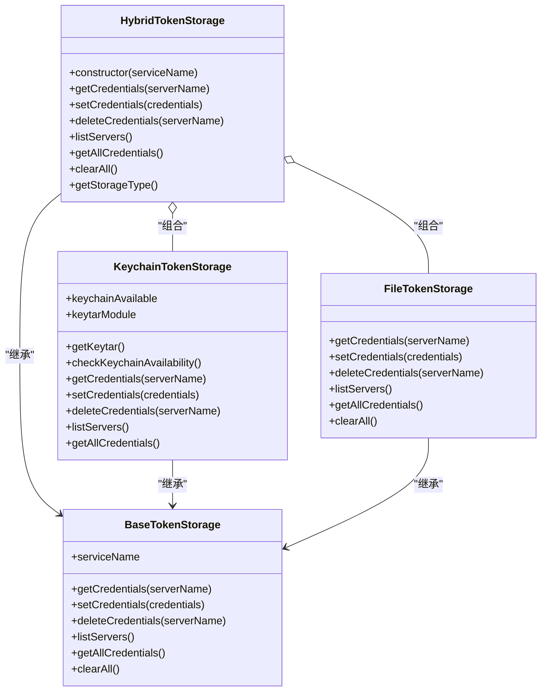
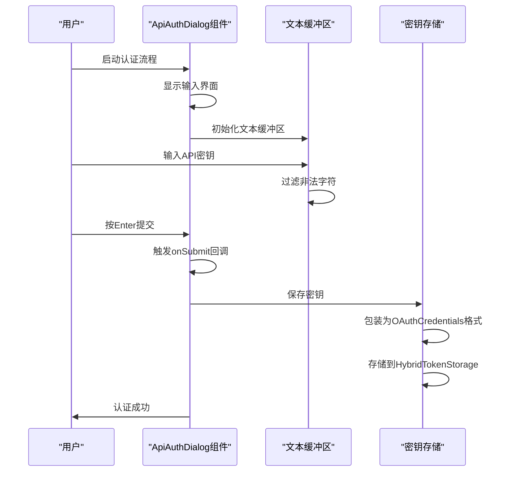
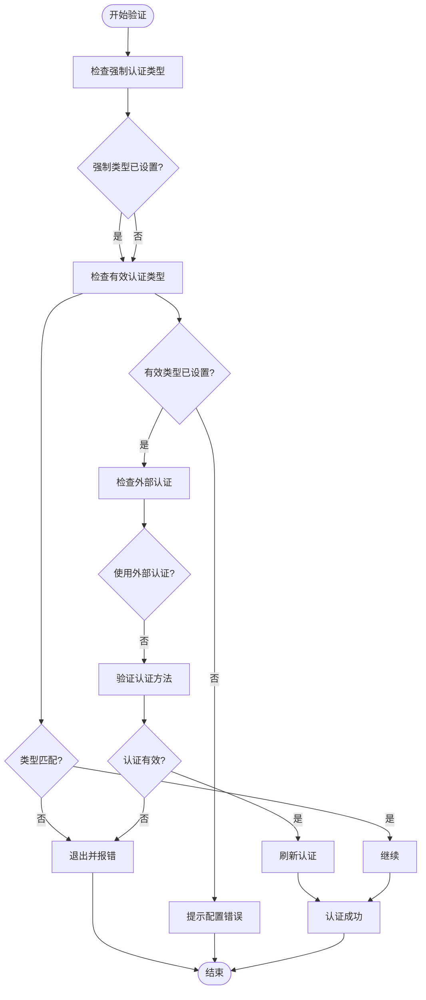
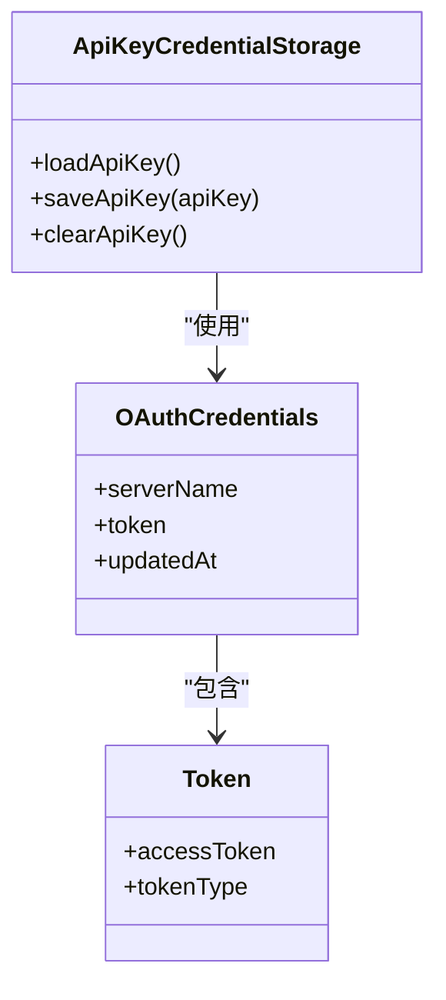

# API密钥认证

<cite>
**本文档引用的文件**   
- [apiKeyCredentialStorage.ts](file://packages/core/src/core/apiKeyCredentialStorage.ts)
- [ApiAuthDialog.tsx](file://packages/cli/src/ui/auth/ApiAuthDialog.tsx)
- [AuthDialog.tsx](file://packages/cli/src/ui/auth/AuthDialog.tsx)
- [hybrid-token-storage.ts](file://packages/core/src/mcp/token-storage/hybrid-token-storage.ts)
- [keychain-token-storage.ts](file://packages/core/src/mcp/token-storage/keychain-token-storage.ts)
- [validateNonInterActiveAuth.ts](file://packages/cli/src/validateNonInterActiveAuth.ts)
- [useAuth.ts](file://packages/cli/src/ui/auth/useAuth.ts)
</cite>

## 目录

1. [API密钥认证概述](#api密钥认证概述)
2. [API密钥生成与配置](#api密钥生成与配置)
3. [安全存储机制](#安全存储机制)
4. [ApiAuthDialog组件分析](#apiauthdialog组件分析)
5. [非交互式模式下的API密钥使用](#非交互式模式下的api密钥使用)
6. [密钥轮换与安全审计](#密钥轮换与安全审计)
7. [密钥验证与错误处理](#密钥验证与错误处理)

## API密钥认证概述

Gemini
CLI提供了多种认证方式，其中API密钥认证是一种简单直接的身份验证方法。用户可以通过生成Gemini
API密钥并将其安全地存储在系统中来访问Gemini服务。该系统支持交互式和非交互式两种认证模式，允许用户通过UI界面输入密钥或通过环境变量进行配置。

**Section sources**

- [AuthDialog.tsx](file://packages/cli/src/ui/auth/AuthDialog.tsx#L36-L92)

## API密钥生成与配置

要使用Gemini API密钥认证，用户首先需要在Google AI
Studio的API密钥管理页面（https://aistudio.google.com/app/apikey）生成一个API密钥。生成后，用户可以通过以下几种方式配置密钥：

1. **交互式配置**：在CLI启动时选择"Use Gemini API
   Key"选项，然后在提示界面输入密钥
2. **环境变量配置**：通过设置`GEMINI_API_KEY`环境变量来提供密钥
3. **默认认证类型**：通过设置`GEMINI_DEFAULT_AUTH_TYPE=USE_GEMINI`环境变量来指定默认使用API密钥认证

系统会优先检查环境变量中的API密钥，如果没有找到，则会提示用户输入。

**Section sources**

- [AuthDialog.tsx](file://packages/cli/src/ui/auth/AuthDialog.tsx#L94-L98)
- [validateNonInterActiveAuth.ts](file://packages/cli/src/validateNonInterActiveAuth.ts#L21-L24)

## 安全存储机制

Gemini
CLI采用分层的加密存储机制来安全地保存API密钥。系统通过`HybridTokenStorage`类实现了一个混合存储策略，优先使用操作系统的密钥链（Keychain）进行存储，如果密钥链不可用则回退到加密文件存储。

**Diagram sources**

- [hybrid-token-storage.ts](file://packages/core/src/mcp/token-storage/hybrid-token-storage.ts#L14-L97)
- [keychain-token-storage.ts](file://packages/core/src/mcp/token-storage/keychain-token-storage.ts#L28-L42)

### 密钥链存储

在支持的操作系统上，API密钥会被存储在系统的密钥链中。`KeychainTokenStorage`类使用`keytar`库与操作系统的密钥链服务进行交互，将API密钥作为密码项存储。在初始化时，系统会进行可用性检查，确保密钥链功能正常工作。

### 混合存储策略

`HybridTokenStorage`实现了智能的存储选择逻辑：

1. 首先尝试使用密钥链存储
2. 如果密钥链不可用或初始化失败，则回退到加密文件存储
3. 存储选择结果会被缓存，确保后续操作使用相同的存储后端

用户还可以通过设置`GEMINI_FORCE_FILE_STORAGE=true`环境变量来强制使用文件存储，这在某些特殊环境下可能很有用。

**Section sources**

- [hybrid-token-storage.ts](file://packages/core/src/mcp/token-storage/hybrid-token-storage.ts#L23-L47)
- [keychain-token-storage.ts](file://packages/core/src/mcp/token-storage/keychain-token-storage.ts#L1-L42)

## ApiAuthDialog组件分析

`ApiAuthDialog`组件负责在交互式模式下引导用户输入和验证API密钥。该组件提供了一个用户友好的界面，指导用户完成密钥输入过程。

**Diagram sources**

- [ApiAuthDialog.tsx](file://packages/cli/src/ui/auth/ApiAuthDialog.tsx#L21-L98)
- [apiKeyCredentialStorage.ts](file://packages/core/src/core/apiKeyCredentialStorage.ts#L51-L62)

### 组件功能

`ApiAuthDialog`组件具有以下主要功能：

- 显示清晰的说明文本，指导用户获取API密钥
- 提供输入框供用户粘贴API密钥
- 对输入进行过滤，只允许字母、数字、下划线和连字符
- 处理Enter键提交和Escape键取消操作
- 显示验证错误信息

组件使用`useTextBuffer`钩子来管理输入状态，并通过`onSubmit`和`onCancel`回调与父组件通信。

**Section sources**

- [ApiAuthDialog.tsx](file://packages/cli/src/ui/auth/ApiAuthDialog.tsx#L21-L98)

## 非交互式模式下的API密钥使用

对于自动化脚本和CI/CD环境，Gemini
CLI支持非交互式模式下的API密钥使用。在这种模式下，系统通过环境变量来获取认证信息，无需用户交互。

### 环境变量支持

系统支持以下环境变量：

- `GEMINI_API_KEY`: 直接提供API密钥
- `GEMINI_DEFAULT_AUTH_TYPE`: 指定默认认证类型
- `GEMINI_FORCE_FILE_STORAGE`: 强制使用文件存储而非密钥链

### 认证验证流程

在非交互式模式下，`validateNonInteractiveAuth`函数负责验证认证配置：

**Diagram sources**

- [validateNonInterActiveAuth.ts](file://packages/cli/src/validateNonInterActiveAuth.ts#L27-L72)

当强制认证类型被设置时，系统会验证当前配置的认证类型是否匹配。如果不匹配，程序将退出并显示错误信息，确保安全策略得到执行。

**Section sources**

- [validateNonInterActiveAuth.ts](file://packages/cli/src/validateNonInterActiveAuth.ts#L37-L42)

## 密钥轮换与安全审计

Gemini CLI提供了完整的密钥生命周期管理功能，包括密钥轮换和安全审计。

### 密钥轮换

系统提供了以下API来管理密钥轮换：

- `loadApiKey()`: 从存储中加载API密钥
- `saveApiKey()`: 保存API密钥到安全存储
- `clearApiKey()`: 清除已存储的API密钥

**Diagram sources**

- [apiKeyCredentialStorage.ts](file://packages/core/src/core/apiKeyCredentialStorage.ts#L19-L73)

当保存API密钥时，系统会将其包装为`OAuthCredentials`格式，包含访问令牌、令牌类型和更新时间戳。这种设计允许系统统一处理不同类型的认证凭证。

### 安全审计日志

系统通过`coreEvents`和`uiTelemetryService`记录认证相关的安全事件，包括：

- 认证成功和失败事件
- 密钥存储和清除操作
- 认证类型变更

这些日志可用于安全审计和故障排查。

**Section sources**

- [apiKeyCredentialStorage.ts](file://packages/core/src/core/apiKeyCredentialStorage.ts#L19-L73)
- [useAuth.ts](file://packages/cli/src/ui/auth/useAuth.ts#L1-L45)

## 密钥验证与错误处理

系统实现了全面的密钥验证和错误处理机制，确保认证过程的可靠性和用户体验。

### 错误处理策略

当认证过程中出现错误时，系统会：

1. 捕获异常并记录详细的错误日志
2. 向用户显示友好的错误信息
3. 提供解决问题的建议

例如，当无法从存储中加载API密钥时，系统会记录错误但不会崩溃，而是返回null值，提示用户重新输入密钥。

### 验证流程

密钥验证流程包括以下步骤：

1. 检查是否有强制认证类型设置
2. 验证环境变量中的认证配置
3. 检查存储中的密钥是否有效
4. 尝试使用密钥进行实际API调用验证

这种分层验证确保了认证的安全性和可靠性。

**Section sources**

- [apiKeyCredentialStorage.ts](file://packages/core/src/core/apiKeyCredentialStorage.ts#L28-L32)
- [useAuth.ts](file://packages/cli/src/ui/auth/useAuth.ts#L47-L95)
