# Google账户认证

<cite>
**本文档中引用的文件**
- [google-auth-provider.ts](file://packages/core/src/mcp/google-auth-provider.ts)
- [oauth-provider.ts](file://packages/core/src/mcp/oauth-provider.ts)
- [oauth-token-storage.ts](file://packages/core/src/mcp/oauth-token-storage.ts)
- [oauth-utils.ts](file://packages/core/src/mcp/oauth-utils.ts)
- [oauth2.ts](file://packages/core/src/code_assist/oauth2.ts)
- [AuthDialog.tsx](file://packages/cli/src/ui/auth/AuthDialog.tsx)
- [contentGenerator.ts](file://packages/core/src/core/contentGenerator.ts)
- [keychain-token-storage.ts](file://packages/core/src/mcp/token-storage/keychain-token-storage.ts)
- [hybrid-token-storage.ts](file://packages/core/src/mcp/token-storage/hybrid-token-storage.ts)
- [types.ts](file://packages/core/src/mcp/token-storage/types.ts)
</cite>

## 目录

1. [简介](#简介)
2. [系统架构概览](#系统架构概览)
3. [OAuth 2.0流程详解](#oauth-20流程详解)
4. [核心组件分析](#核心组件分析)
5. [UI交互流程](#ui交互流程)
6. [安全存储机制](#安全存储机制)
7. [会话管理和多账户支持](#会话管理和多账户支持)
8. [故障排除指南](#故障排除指南)
9. [最佳实践](#最佳实践)
10. [总结](#总结)

## 简介

Gemini CLI提供了完整的Google账户认证解决方案，基于OAuth
2.0协议实现安全的用户身份验证。该系统支持多种认证方式，包括浏览器自动登录、用户代码输入和Cloud
Shell集成，同时提供强大的令牌管理和安全存储机制。

## 系统架构概览

Gemini CLI的Google认证系统采用分层架构设计，确保安全性和可扩展性：

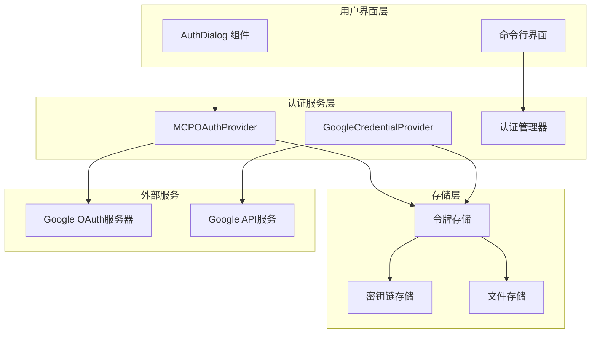

**图表来源**

- [oauth-provider.ts](file://packages/core/src/mcp/oauth-provider.ts#L99-L104)
- [google-auth-provider.ts](file://packages/core/src/mcp/google-auth-provider.ts#L21-L25)
- [oauth-token-storage.ts](file://packages/core/src/mcp/oauth-token-storage.ts#L26-L30)

## OAuth 2.0流程详解

### 标准OAuth 2.0授权码流程

Gemini CLI实现了完整的OAuth 2.0授权码流程，支持PKCE（Proof Key for Code
Exchange）增强安全性：

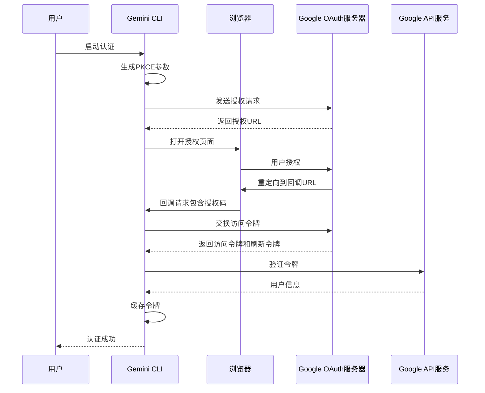

**图表来源**

- [oauth-provider.ts](file://packages/core/src/mcp/oauth-provider.ts#L708-L800)
- [oauth2.ts](file://packages/core/src/code_assist/oauth2.ts#L317-L439)

### PKCE参数生成

系统使用PKCE增强OAuth安全性，防止授权码拦截攻击：

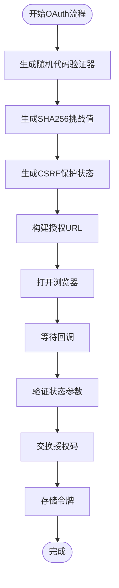

**图表来源**

- [oauth-provider.ts](file://packages/core/src/mcp/oauth-provider.ts#L246-L259)

**章节来源**

- [oauth-provider.ts](file://packages/core/src/mcp/oauth-provider.ts#L246-L259)
- [oauth2.ts](file://packages/core/src/code_assist/oauth2.ts#L317-L439)

## 核心组件分析

### GoogleCredentialProvider类

`GoogleCredentialProvider`是Google特定认证的核心实现，负责与Google Cloud
SDK集成：

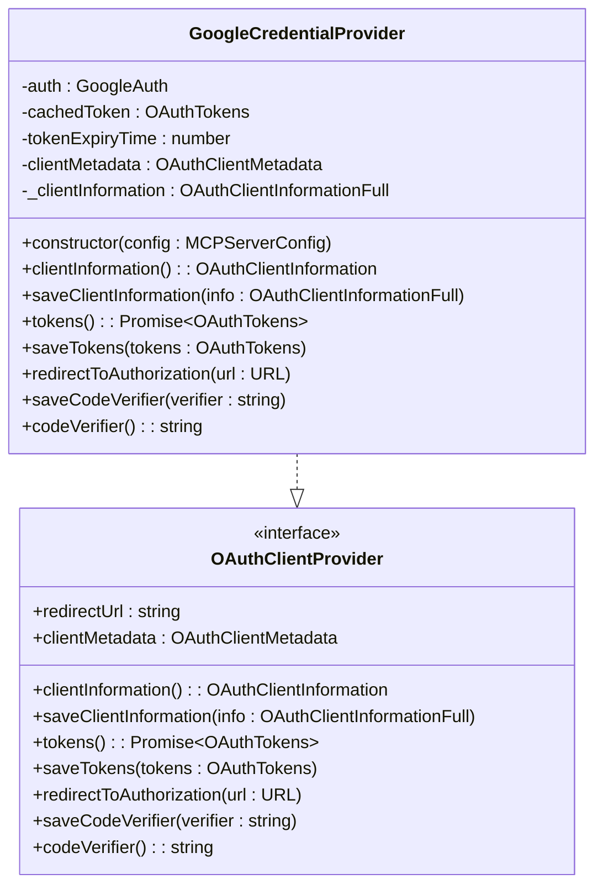

**图表来源**

- [google-auth-provider.ts](file://packages/core/src/mcp/google-auth-provider.ts#L21-L127)

### MCPOAuthProvider类

通用OAuth提供程序，支持多种OAuth服务器：

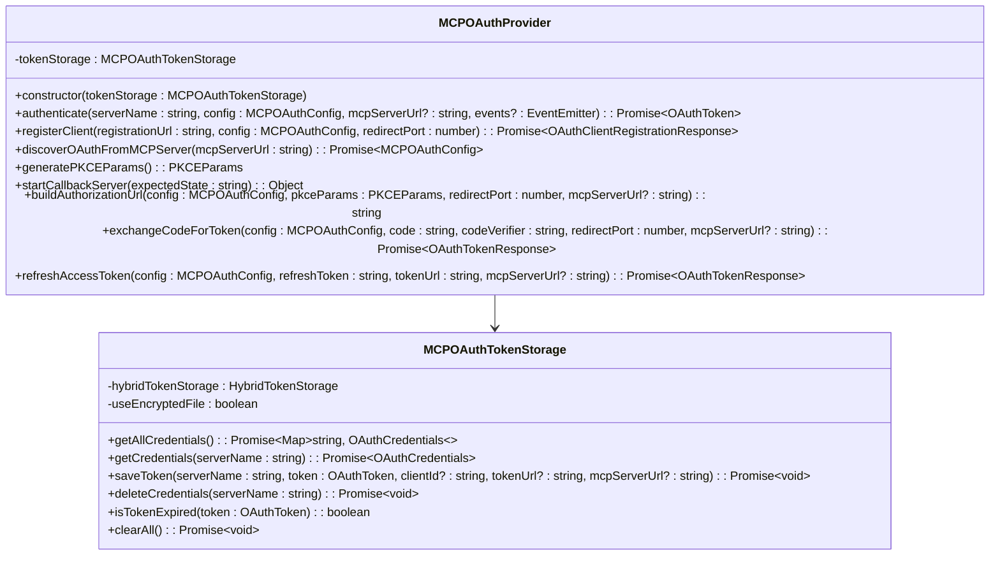

**图表来源**

- [oauth-provider.ts](file://packages/core/src/mcp/oauth-provider.ts#L99-L104)
- [oauth-token-storage.ts](file://packages/core/src/mcp/oauth-token-storage.ts#L26-L30)

**章节来源**

- [google-auth-provider.ts](file://packages/core/src/mcp/google-auth-provider.ts#L21-L127)
- [oauth-provider.ts](file://packages/core/src/mcp/oauth-provider.ts#L99-L104)

## UI交互流程

### AuthDialog组件

认证对话框提供直观的用户界面，支持多种认证方式选择：

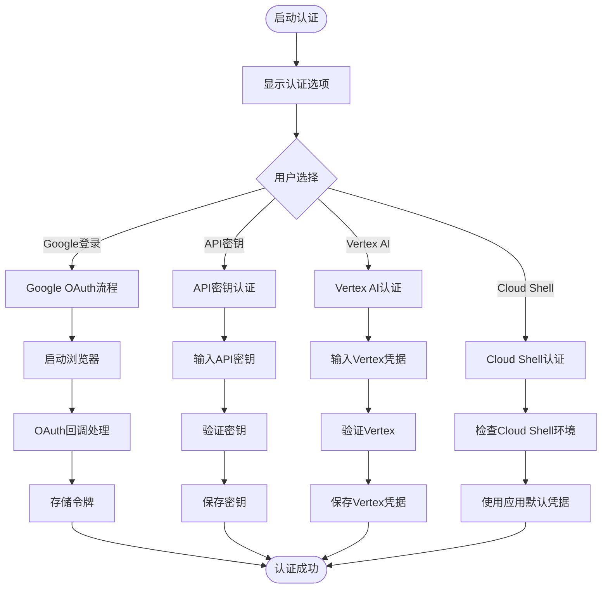

**图表来源**

- [AuthDialog.tsx](file://packages/cli/src/ui/auth/AuthDialog.tsx#L36-L217)

### 认证类型枚举

系统支持多种认证类型，每种都有特定的用途和配置要求：

| 认证类型            | 描述                     | 使用场景         |
| ------------------- | ------------------------ | ---------------- |
| `LOGIN_WITH_GOOGLE` | Google OAuth个人账户认证 | 个人开发和测试   |
| `USE_GEMINI`        | Gemini API密钥认证       | 生产环境API调用  |
| `USE_VERTEX_AI`     | Vertex AI认证            | 企业级AI服务     |
| `CLOUD_SHELL`       | Cloud Shell凭据认证      | Google Cloud环境 |

**章节来源**

- [AuthDialog.tsx](file://packages/cli/src/ui/auth/AuthDialog.tsx#L36-L217)
- [contentGenerator.ts](file://packages/core/src/core/contentGenerator.ts#L47-L52)

## 安全存储机制

### 多层存储架构

Gemini CLI采用混合存储策略，优先使用操作系统密钥链，回退到加密文件存储：

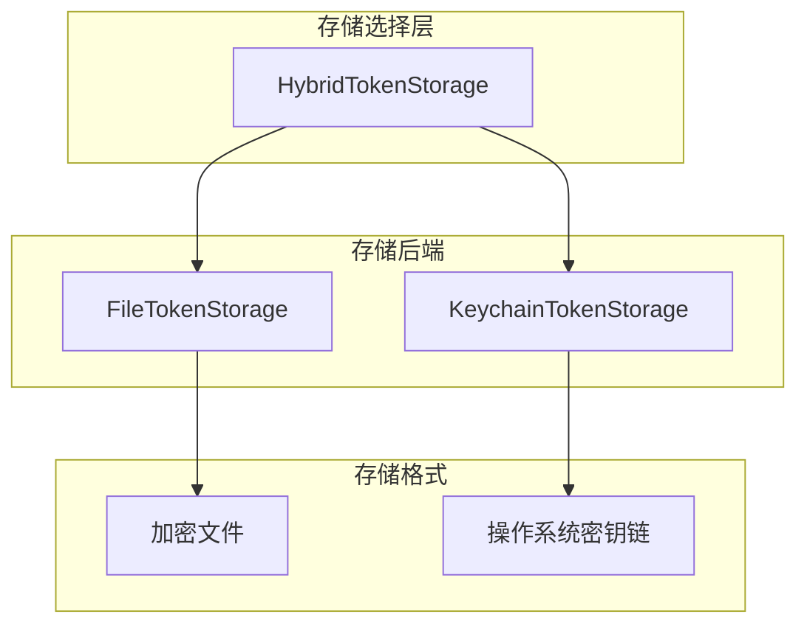

**图表来源**

- [hybrid-token-storage.ts](file://packages/core/src/mcp/token-storage/hybrid-token-storage.ts#L1-L50)
- [keychain-token-storage.ts](file://packages/core/src/mcp/token-storage/keychain-token-storage.ts#L1-L42)

### 密钥链存储实现

密钥链存储提供最高级别的安全性，利用操作系统的安全特性：

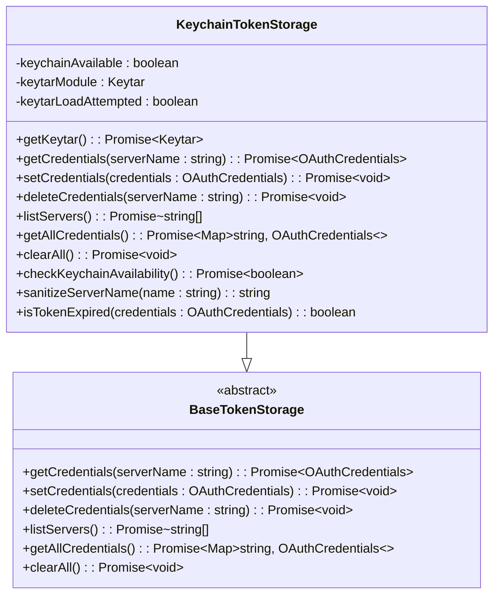

**图表来源**

- [keychain-token-storage.ts](file://packages/core/src/mcp/token-storage/keychain-token-storage.ts#L33-L91)

### 令牌过期检测

系统实现了智能的令牌过期检测机制：

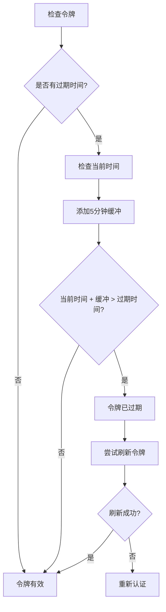

**图表来源**

- [oauth-token-storage.ts](file://packages/core/src/mcp/oauth-token-storage.ts#L204-L212)

**章节来源**

- [hybrid-token-storage.ts](file://packages/core/src/mcp/token-storage/hybrid-token-storage.ts#L1-L50)
- [keychain-token-storage.ts](file://packages/core/src/mcp/token-storage/keychain-token-storage.ts#L33-L91)
- [oauth-token-storage.ts](file://packages/core/src/mcp/oauth-token-storage.ts#L204-L212)

## 会话管理和多账户支持

### 用户账户管理

系统维护用户的Google账户历史记录，支持多账户切换：

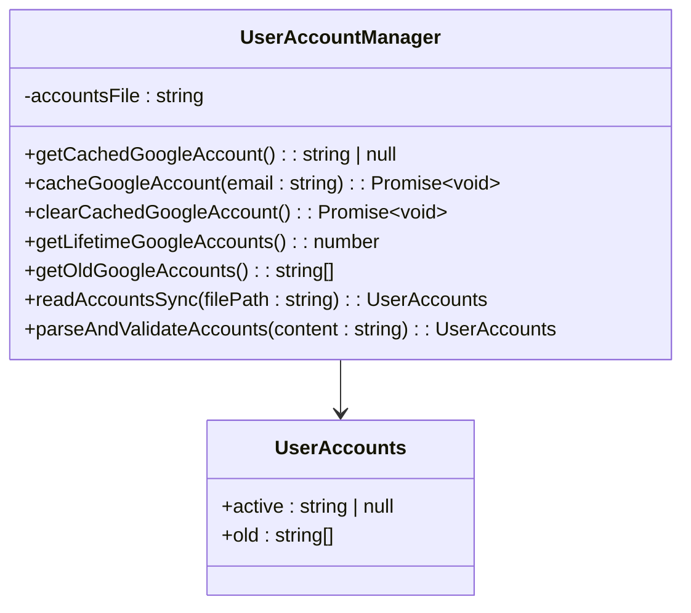

**图表来源**

- [userAccountManager.ts](file://packages/core/src/utils/userAccountManager.ts#L1-L100)

### 会话清理机制

系统提供智能的会话清理功能，优化存储空间：

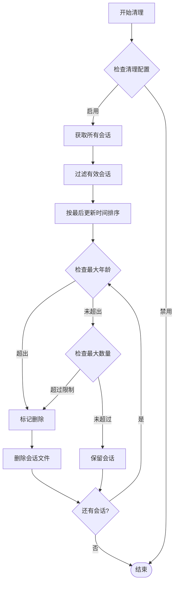

**图表来源**

- [sessionCleanup.ts](file://packages/cli/src/utils/sessionCleanup.ts#L163-L203)

**章节来源**

- [userAccountManager.ts](file://packages/core/src/utils/userAccountManager.ts#L1-L100)
- [sessionCleanup.ts](file://packages/cli/src/utils/sessionCleanup.ts#L163-L203)

## 故障排除指南

### 常见认证失败原因

| 错误类型     | 可能原因                 | 解决方案                 |
| ------------ | ------------------------ | ------------------------ |
| 状态不匹配   | CSRF攻击或浏览器会话问题 | 检查浏览器设置，清除缓存 |
| 授权码无效   | 用户拒绝授权或授权超时   | 重新启动认证流程         |
| 令牌交换失败 | 网络问题或服务器错误     | 检查网络连接，稍后重试   |
| 密钥链不可用 | 操作系统密钥链服务未运行 | 使用加密文件存储         |
| 代理配置错误 | 网络代理设置问题         | 检查代理配置             |

### 错误处理机制

系统实现了多层次的错误处理和恢复机制：

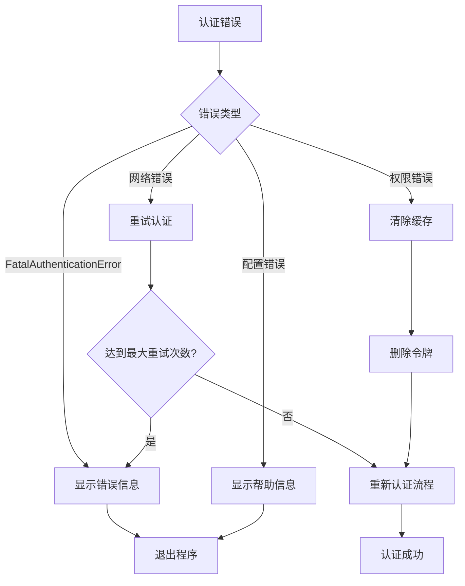

**图表来源**

- [oauth2.ts](file://packages/core/src/code_assist/oauth2.ts#L334-L439)

### 恢复策略

当认证失败时，系统提供多种恢复策略：

1. **自动重试**: 对于临时性错误，系统会自动重试认证
2. **令牌刷新**: 尝试使用刷新令牌获取新的访问令牌
3. **重新认证**: 清除现有凭据并启动全新的认证流程
4. **降级模式**: 在某些情况下，允许使用API密钥作为备选方案

**章节来源**

- [oauth2.ts](file://packages/core/src/code_assist/oauth2.ts#L334-L439)
- [oauth-provider.ts](file://packages/core/src/mcp/oauth-provider.ts#L299-L328)

## 最佳实践

### 安全配置建议

1. **使用HTTPS**: 确保所有通信都通过HTTPS加密
2. **定期轮换令牌**: 实施令牌轮换策略
3. **最小权限原则**: 仅请求必要的OAuth作用域
4. **监控异常**: 实施认证活动监控

### 性能优化

1. **令牌缓存**: 合理配置令牌缓存策略
2. **并发控制**: 限制同时进行的认证请求数量
3. **连接池**: 使用连接池优化API调用性能

### 用户体验优化

1. **进度指示**: 提供清晰的认证进度反馈
2. **错误消息**: 显示友好的错误消息和解决建议
3. **快速通道**: 支持快速认证路径（如Cloud Shell）

## 总结

Gemini
CLI的Google账户认证系统是一个功能完整、安全可靠的解决方案。它结合了现代OAuth
2.0最佳实践、强大的安全存储机制和优秀的用户体验设计。通过支持多种认证方式、智能的令牌管理和完善的错误处理机制，该系统能够满足从个人开发者到企业用户的各种需求。

系统的主要优势包括：

- 基于OAuth 2.0标准的安全认证流程
- 多层存储架构确保令牌安全
- 智能的会话管理和多账户支持
- 完善的错误处理和恢复机制
- 优秀的用户体验设计

随着云原生应用的发展，这种现代化的认证架构为未来的扩展和集成奠定了坚实的基础。
