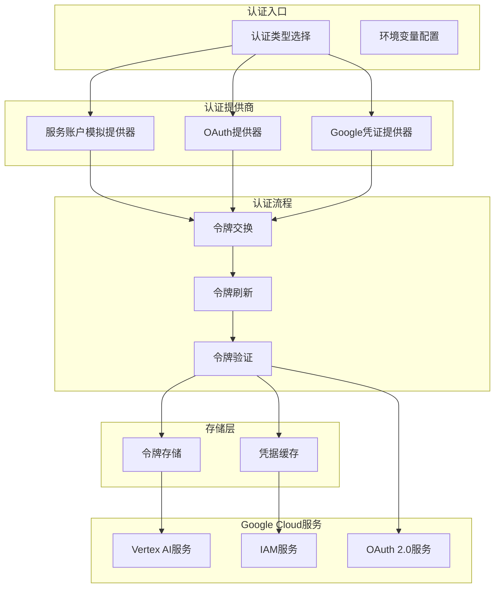
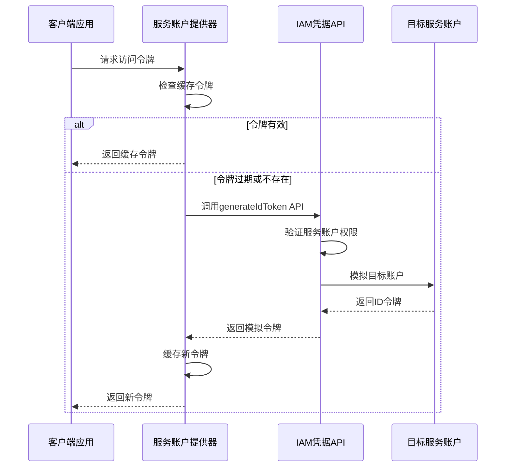
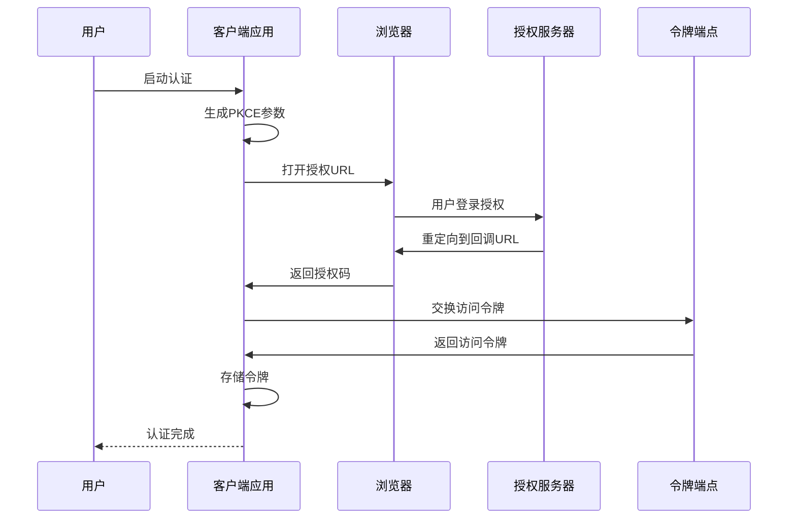
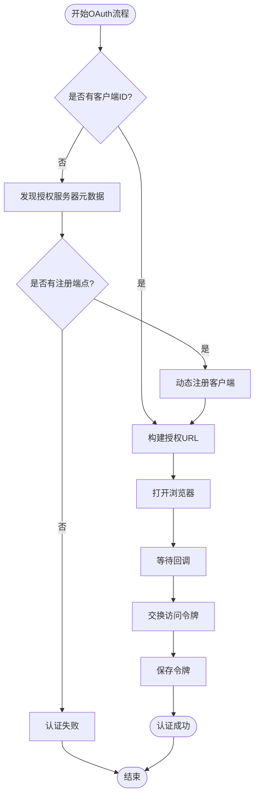

# Vertex AI认证

<cite>
**本文档中引用的文件**
- [sa-impersonation-provider.ts](file://packages/core/src/mcp/sa-impersonation-provider.ts)
- [oauth-provider.ts](file://packages/core/src/mcp/oauth-provider.ts)
- [google-auth-provider.ts](file://packages/core/src/mcp/google-auth-provider.ts)
- [oauth-utils.ts](file://packages/core/src/mcp/oauth-utils.ts)
- [oauth-token-storage.ts](file://packages/core/src/mcp/oauth-token-storage.ts)
- [config.ts](file://packages/core/src/config/config.ts)
- [contentGenerator.ts](file://packages/core/src/core/contentGenerator.ts)
- [auth.ts](file://packages/cli/src/config/auth.ts)
- [mcp-client.ts](file://packages/core/src/tools/mcp-client.ts)
</cite>

## 目录

1. [简介](#简介)
2. [认证架构概览](#认证架构概览)
3. [服务账户身份模拟](#服务账户身份模拟)
4. [OAuth 2.0认证流程](#oauth-20认证流程)
5. [环境变量配置](#环境变量配置)
6. [最佳实践](#最佳实践)
7. [故障排除指南](#故障排除指南)
8. [企业级部署优势](#企业级部署优势)
9. [总结](#总结)

## 简介

Vertex AI认证是Google Cloud Platform中用于安全访问Vertex
AI服务的一套完整认证机制。该系统支持多种认证方式，包括服务账户身份模拟、OAuth
2.0个人用户认证和API密钥认证。本文档深入探讨了这些认证方式的技术实现、配置方法和最佳实践。

Vertex
AI认证的核心目标是在保证安全性的同时，为不同类型的用户提供灵活的访问方式。对于企业级应用，服务账户身份模拟提供了细粒度的权限控制；对于个人开发者，OAuth
2.0认证简化了用户授权流程；而对于快速原型开发，API密钥认证则提供了最简单的接入方式。

## 认证架构概览

Vertex AI认证系统采用分层架构设计，支持多种认证提供商和认证方式的组合使用。



**图表来源**

- [sa-impersonation-provider.ts](file://packages/core/src/mcp/sa-impersonation-provider.ts#L25-L159)
- [oauth-provider.ts](file://packages/core/src/mcp/oauth-provider.ts#L99-L1026)
- [google-auth-provider.ts](file://packages/core/src/mcp/google-auth-provider.ts#L21-L127)

**章节来源**

- [contentGenerator.ts](file://packages/core/src/core/contentGenerator.ts#L47-L52)
- [config.ts](file://packages/core/src/config/config.ts#L208-L212)

## 服务账户身份模拟

服务账户身份模拟是Vertex
AI认证中最强大的功能之一，它允许一个服务账户代表另一个服务账户或用户账户执行操作。

### 核心概念

服务账户身份模拟基于Google Cloud Identity and Access Management
(IAM)服务，通过`generateIdToken` API端点实现。该机制的核心优势在于：

- **最小权限原则**：服务账户可以被授予有限的权限，仅能模拟特定的目标账户
- **审计追踪**：所有模拟操作都可以追溯到原始的服务账户
- **细粒度控制**：可以通过IAM策略精确控制哪些服务账户可以模拟哪些目标

### 实现原理



**图表来源**

- [sa-impersonation-provider.ts](file://packages/core/src/mcp/sa-impersonation-provider.ts#L78-L140)

### 配置要求

服务账户身份模拟需要以下配置参数：

| 参数                 | 类型   | 必需 | 描述                      |
| -------------------- | ------ | ---- | ------------------------- |
| targetServiceAccount | string | 是   | 目标服务账户邮箱地址      |
| targetAudience       | string | 是   | OAuth客户端ID（Audience） |
| url                  | string | 是   | MCP服务器URL              |

### 权限配置

为了启用服务账户身份模拟，必须满足以下权限要求：

1. **IAM权限**：调用服务账户需要`iam.serviceAccounts.actAs`权限
2. **目标账户权限**：目标服务账户需要授予模拟权限给源服务账户
3. **API访问**：需要启用IAM Credentials API

**章节来源**

- [sa-impersonation-provider.ts](file://packages/core/src/mcp/sa-impersonation-provider.ts#L45-L67)

## OAuth 2.0认证流程

OAuth
2.0认证为个人用户提供了安全的第三方应用授权机制，特别适用于需要用户个人数据访问的场景。

### 授权码流程

OAuth 2.0认证采用PKCE扩展的授权码流程，确保高安全性：



**图表来源**

- [oauth-provider.ts](file://packages/core/src/mcp/oauth-provider.ts#L700-L945)

### 动态客户端注册

对于不支持预注册的应用程序，系统支持动态客户端注册：



**图表来源**

- [oauth-provider.ts](file://packages/core/src/mcp/oauth-provider.ts#L804-L844)

### 令牌管理

OAuth 2.0认证实现了完整的令牌生命周期管理：

- **令牌缓存**：避免重复的授权请求
- **自动刷新**：使用刷新令牌获取新的访问令牌
- **过期检查**：提前5分钟检测令牌过期
- **安全存储**：加密存储敏感的令牌信息

**章节来源**

- [oauth-provider.ts](file://packages/core/src/mcp/oauth-provider.ts#L947-L1025)
- [oauth-token-storage.ts](file://packages/core/src/mcp/oauth-token-storage.ts#L26-L235)

## 环境变量配置

Vertex AI认证支持多种环境变量配置方式，以适应不同的部署场景。

### 基础认证配置

| 变量名                | 类型   | 描述           | 示例值             |
| --------------------- | ------ | -------------- | ------------------ |
| GOOGLE_API_KEY        | string | Google API密钥 | `your-api-key`     |
| GOOGLE_CLOUD_PROJECT  | string | GCP项目ID      | `my-project-12345` |
| GOOGLE_CLOUD_LOCATION | string | GCP区域位置    | `us-central1`      |

### 服务账户配置

| 变量名                         | 类型   | 描述                 | 示例值               |
| ------------------------------ | ------ | -------------------- | -------------------- |
| GOOGLE_APPLICATION_CREDENTIALS | string | 服务账户密钥文件路径 | `/path/to/key.json`  |
| GOOGLE_CLOUD_ACCESS_TOKEN      | string | 预生成的访问令牌     | `ya29.example_token` |

### OAuth配置

| 变量名                    | 类型    | 描述                 | 示例值 |
| ------------------------- | ------- | -------------------- | ------ |
| OAUTH_CALLBACK_PORT       | number  | OAuth回调端口        | `3000` |
| GOOGLE_GENAI_USE_GCA      | boolean | 使用Google Cloud认证 | `true` |
| GOOGLE_GENAI_USE_VERTEXAI | boolean | 使用Vertex AI认证    | `true` |

### 高级配置

```bash
# 禁用浏览器自动打开
export NO_BROWSER=true

# 设置自定义回调端口
export OAUTH_CALLBACK_PORT=8080

# 强制使用加密文件存储
export FORCE_ENCRYPTED_FILE=true

# 设置代理服务器
export HTTPS_PROXY=https://proxy.company.com:8080
```

**章节来源**

- [auth.ts](file://packages/cli/src/config/auth.ts#L1-L40)
- [config.ts](file://packages/core/src/config/config.ts#L65-L70)

## 最佳实践

### 权限配置最佳实践

1. **最小权限原则**
   - 为每个服务账户分配必要的最小权限
   - 使用IAM条件语句限制访问时间窗口
   - 定期审查和更新权限设置

2. **密钥管理**
   - 使用Google Cloud Secret Manager存储敏感信息
   - 定期轮换服务账户密钥
   - 启用密钥自动轮换功能

3. **网络安全**
   - 配置VPC服务网关限制访问
   - 使用私有Google访问（Private Google Access）
   - 实施网络防火墙规则

### 性能优化

1. **令牌缓存策略**

   ```typescript
   // 缓存5分钟缓冲期，避免时钟偏差问题
   const FIVE_MIN_BUFFER_MS = 5 * 60 * 1000;
   ```

2. **连接池管理**
   - 合理配置HTTP连接池大小
   - 启用连接复用减少延迟
   - 实施适当的超时设置

3. **并发控制**
   - 限制同时进行的认证请求数量
   - 实施退避算法处理临时失败
   - 使用异步处理提高响应性

### 监控和日志

1. **认证事件监控**
   - 监控认证成功率和失败率
   - 跟踪令牌刷新频率
   - 检测异常的认证模式

2. **安全审计**
   - 记录所有认证尝试
   - 跟踪权限变更历史
   - 实施异常行为检测

**章节来源**

- [oauth-utils.ts](file://packages/core/src/mcp/oauth-utils.ts#L41)
- [oauth-token-storage.ts](file://packages/core/src/mcp/oauth-token-storage.ts#L200-L235)

## 故障排除指南

### 常见错误及解决方案

#### 令牌过期问题

**症状**：收到401未授权错误或令牌过期警告

**诊断步骤**：

1. 检查本地令牌存储状态
2. 验证网络连接和API可达性
3. 确认系统时间同步

**解决方案**：

```bash
# 清除过期令牌
rm ~/.config/gemini-cli/mcp-oauth-tokens.json

# 重新认证
gemini mcp auth <server-name>
```

#### 权限不足错误

**症状**：IAM权限拒绝或403禁止访问

**诊断步骤**：

1. 验证服务账户是否具有actAs权限
2. 检查目标服务账户的模拟权限
3. 确认API是否已启用

**解决方案**：

```bash
# 检查权限
gcloud iam service-accounts get-iam-policy service-account@project.iam.gserviceaccount.com

# 授予actAs权限
gcloud iam service-accounts add-iam-policy-binding \
  target-service-account@project.iam.gserviceaccount.com \
  --member="serviceAccount:source-service-account@project.iam.gserviceaccount.com" \
  --role="roles/iam.serviceAccountUser"
```

#### 网络连接问题

**症状**：无法连接到Google Cloud API或OAuth端点

**诊断步骤**：

1. 测试基本网络连通性
2. 检查代理设置
3. 验证防火墙规则

**解决方案**：

```bash
# 测试API可达性
curl -I https://iamcredentials.googleapis.com/

# 配置代理（如果需要）
export HTTPS_PROXY=http://proxy.company.com:8080
```

### 调试工具

#### 日志级别配置

```bash
# 启用详细日志
export DEBUG=gemini:*

# 特定模块调试
export DEBUG=gemini:mcp:oauth,gemini:mcp:saimp
```

#### 令牌验证

```bash
# 检查存储的令牌
cat ~/.config/gemini-cli/mcp-oauth-tokens.json

# 验证JWT令牌
jwt decode <token>
```

#### 网络诊断

```bash
# 检查DNS解析
nslookup iamcredentials.googleapis.com

# 测试SSL证书
openssl s_client -connect iamcredentials.googleapis.com:443
```

**章节来源**

- [mcp-client.ts](file://packages/core/src/tools/mcp-client.ts#L867-L898)
- [oauth-provider.ts](file://packages/core/src/mcp/oauth-provider.ts#L299-L328)

## 企业级部署优势

### 安全性优势

1. **零信任架构支持**
   - 基于身份的访问控制
   - 持续的身份验证和授权
   - 细粒度的权限管理

2. **合规性支持**
   - 支持SOC 2、ISO 27001等标准
   - 提供完整的审计日志
   - 符合GDPR等隐私法规要求

3. **多因素认证集成**
   - 支持硬件安全模块（HSM）
   - 集成企业身份提供商
   - 实施强密码策略

### 运维优势

1. **集中化管理**
   - 统一的服务账户管理
   - 集中的权限策略配置
   - 集成的监控和告警

2. **自动化运维**
   - 自动化的密钥轮换
   - 智能的权限审计
   - 自动化的故障恢复

3. **成本优化**
   - 精确的资源使用跟踪
   - 智能的成本分配
   - 优化的资源配置

### 可扩展性

1. **水平扩展**
   - 无状态的认证服务
   - 分布式令牌存储
   - 负载均衡支持

2. **垂直扩展**
   - 高性能的令牌验证
   - 优化的缓存策略
   - 并发处理能力

3. **混合云支持**
   - 多云环境兼容
   - 混合云部署选项
   - 边缘计算支持

**章节来源**

- [config.ts](file://packages/core/src/config/config.ts#L208-L212)
- [contentGenerator.ts](file://packages/core/src/core/contentGenerator.ts#L47-L52)

## 总结

Vertex
AI认证系统提供了一套完整、安全且灵活的认证解决方案。通过服务账户身份模拟、OAuth
2.0和个人认证等多种方式，满足了从个人开发者到大型企业用户的多样化需求。

关键特性包括：

- **多层安全保护**：结合多种认证方式提供纵深防御
- **灵活的配置选项**：支持各种部署场景和安全要求
- **完善的生命周期管理**：从令牌生成到过期处理的全流程支持
- **企业级功能**：满足合规性、审计和运维需求

在实施过程中，建议遵循最小权限原则，定期审查权限配置，并建立完善的监控和故障排除机制。通过合理配置和持续优化，Vertex
AI认证能够为企业提供可靠的安全保障，同时保持良好的用户体验。
