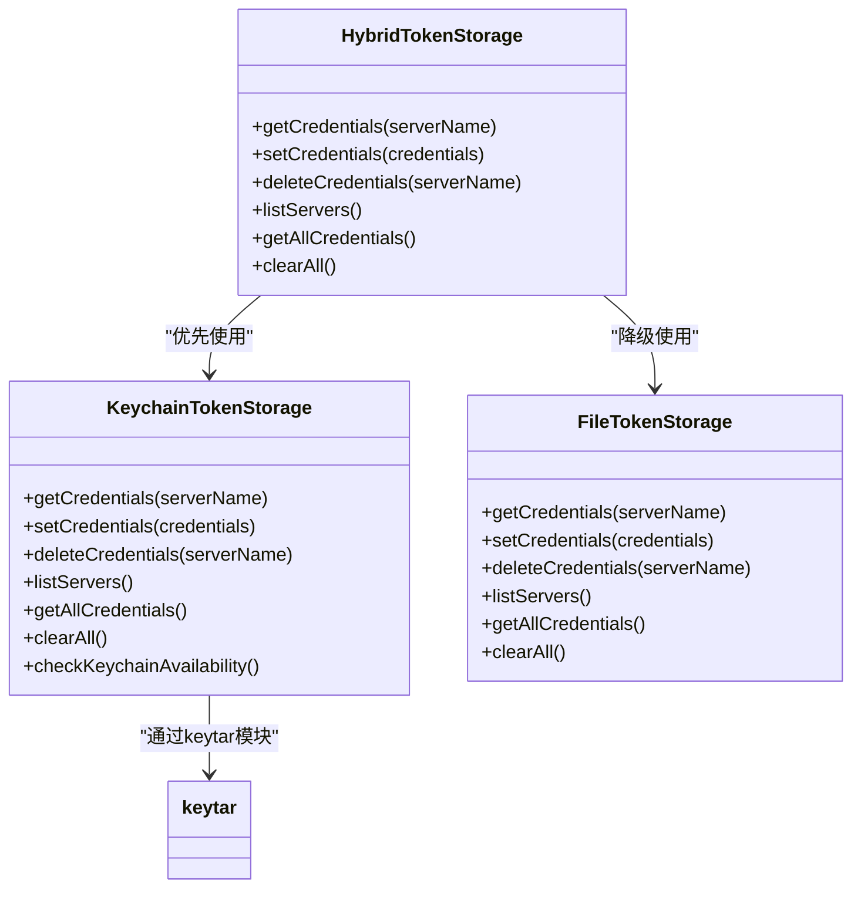
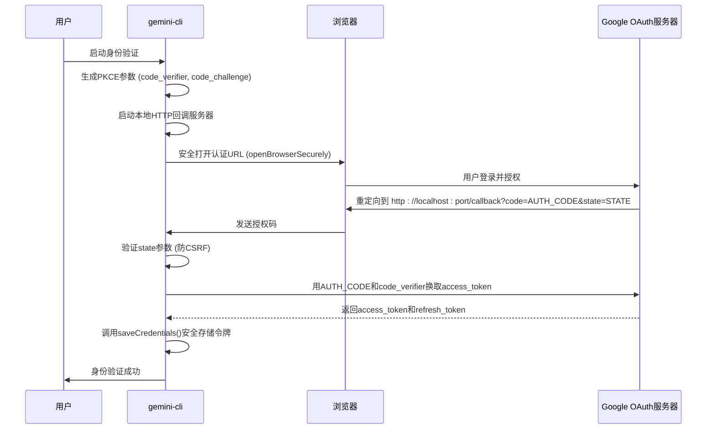

# 安全实践与凭证管理

<cite>
**本文档引用的文件**   
- [SECURITY.md](file://SECURITY.md)
- [keychain-token-storage.ts](file://packages/core/src/mcp/token-storage/keychain-token-storage.ts)
- [oauth-credential-storage.ts](file://packages/core/src/code_assist/oauth-credential-storage.ts)
- [oauth2.ts](file://packages/core/src/code_assist/oauth2.ts)
- [oauth-token-storage.ts](file://packages/core/src/mcp/oauth-token-storage.ts)
- [oauth-provider.ts](file://packages/core/src/mcp/oauth-provider.ts)
- [hybrid-token-storage.ts](file://packages/core/src/mcp/token-storage/hybrid-token-storage.ts)
- [storage.ts](file://packages/core/src/config/storage.ts)
- [secure-browser-launcher.ts](file://packages/core/src/utils/secure-browser-launcher.ts)
- [config.ts](file://packages/cli/src/config/config.ts)
- [trustedFolders.ts](file://packages/cli/src/config/trustedFolders.ts)
- [lint.js](file://scripts/lint.js)
- [check-lockfile.js](file://scripts/check-lockfile.js)
- [generate-notices.js](file://packages/vscode-ide-companion/scripts/generate-notices.js)
</cite>

## 目录

1. [安全凭证报告](#安全凭证报告)
2. [凭证的加密存储策略](#凭证的加密存储策略)
3. [内存中的安全处理与防泄露机制](#内存中的安全处理与防泄露机制)
4. [配置文件权限与脱敏处理](#配置文件权限与脱敏处理)
5. [网络通信与第三方依赖安全](#网络通信与第三方依赖安全)
6. [安全更新与应急响应](#安全更新与应急响应)
7. [用户安全检查清单](#用户安全检查清单)

## 安全凭证报告

根据项目`SECURITY.md`文件的指导，gemini-cli项目遵循严格的安全漏洞报告流程。用户或研究人员若发现任何安全问题，应通过官方指定的渠道`g.co/vulnz`进行报告。该项目使用GitHub
Security
Advisory进行安全协调和披露，确保所有报告都能得到及时响应。Google安全团队承诺在收到报告后的5个工作日内进行回复，以确保潜在的安全风险能够被迅速评估和处理。

**Section sources**

- [SECURITY.md](file://SECURITY.md#L1-L10)

## 凭证的加密存储策略

gemini-cli采用分层的凭证存储策略，优先使用操作系统的原生密钥链服务，以提供最高级别的安全保障。其核心机制由`HybridTokenStorage`类实现，该类会根据运行环境自动选择最优的存储后端。

### 与操作系统密钥链的交互

`keychain-token-storage.ts`文件定义了`KeychainTokenStorage`类，该类是与操作系统密钥链交互的核心。它通过动态导入`keytar`模块来实现跨平台支持。`keytar`是一个Node.js库，能够与不同操作系统的凭据管理服务进行通信：

- **macOS**: 与钥匙串（Keychain）服务交互。
- **Windows**: 与凭据管理器（Credential Manager）交互。
- **Linux**: 与`libsecret`或`KWallet`等服务交互。

该类在初始化时会执行一个可用性检查（`checkKeychainAvailability`），通过一个完整的“设置-获取-删除”循环来验证密钥链功能是否正常。只有在验证成功后，系统才会使用密钥链进行凭证存储。如果密钥链不可用或加载`keytar`模块失败，系统将自动降级到加密文件存储。

**Diagram sources**

- [hybrid-token-storage.ts](file://packages/core/src/mcp/token-storage/hybrid-token-storage.ts#L14-L97)
- [keychain-token-storage.ts](file://packages/core/src/mcp/token-storage/keychain-token-storage.ts#L28-L331)

### 凭证存储的实现流程

凭证的存储和加载流程由`OAuthCredentialStorage`类统一管理。当用户通过OAuth流程（如`authWithWeb`）完成身份验证后，生成的访问令牌（access
token）和刷新令牌（refresh token）会被封装为`Credentials`对象。

1.  **保存凭证**:
    `saveCredentials`方法会将`Credentials`对象转换为内部的`OAuthCredentials`格式，并调用`HybridTokenStorage`的`setCredentials`方法。该方法会根据初始化结果，将凭证安全地存储到密钥链或加密文件中。
2.  **加载凭证**:
    `loadCredentials`方法会首先尝试从`HybridTokenStorage`中获取凭证。如果成功，它会将内部格式转换回`google-auth-library`所需的`Credentials`格式。如果密钥链中没有找到凭证，它会尝试从旧的文件存储中迁移数据，以保证向后兼容性。

**Section sources**

- [oauth-credential-storage.ts](file://packages/core/src/code_assist/oauth-credential-storage.ts#L20-L139)
- [oauth2.ts](file://packages/core/src/code_assist/oauth2.ts#L74-L252)

## 内存中的安全处理与防泄露机制

gemini-cli在内存中处理敏感信息时，遵循最小权限和及时清理的原则，以降低凭证泄露的风险。

### 内存中的凭证处理

在身份验证流程中，OAuth授权码（authorization code）和访问令牌（access
token）等敏感信息会短暂地存在于内存中。代码通过以下方式确保其安全：

- **作用域限制**: 敏感信息（如授权码）被限制在最小的作用域内。例如，在`authWithUserCode`函数中，授权码通过`readline`接口从用户输入中获取，并立即用于换取令牌，之后该变量即被销毁。
- **避免日志记录**: 代码中明确避免将完整的凭证信息记录到日志中。`debugLogger`仅用于记录调试信息，且在生产环境中通常被禁用。

### 防泄露机制

为了防止敏感信息意外泄露，项目实施了多层防护：

- **环境变量验证**: 在`oauth2.ts`中，`initOauthClient`函数会检查`GOOGLE_GENAI_USE_GCA`和`GOOGLE_CLOUD_ACCESS_TOKEN`环境变量。如果这些变量存在，它会直接使用环境变量中的访问令牌，这通常用于CI/CD等自动化环境，避免了交互式登录。
- **浏览器安全启动**:
  `secure-browser-launcher.ts`文件中的`openBrowserSecurely`函数是防止命令注入的关键。它不使用shell命令（如`exec`），而是使用`execFile`直接执行二进制文件，并将URL作为参数传递。这消除了因恶意URL包含分号（`;`）或管道符（`|`）而执行任意命令的风险。此外，该函数会严格验证URL，只允许`http`和`https`协议。

**Diagram sources**

- [oauth2.ts](file://packages/core/src/code_assist/oauth2.ts#L199-L252)
- [secure-browser-launcher.ts](file://packages/core/src/utils/secure-browser-launcher.ts#L54-L141)
- [oauth-provider.ts](file://packages/core/src/mcp/oauth-provider.ts#L269-L392)

## 配置文件权限与脱敏处理

gemini-cli通过严格的文件权限控制和配置管理来保护用户数据。

### 配置文件权限控制

项目中的敏感配置文件，如OAuth令牌文件，会被创建在用户主目录下的`.gemini`隐藏目录中。在创建这些文件时，代码会显式地设置文件权限为`0o600`（即`-rw-------`），确保只有文件所有者才能读写，其他用户和组均无访问权限。

例如，在`oauth-token-storage.ts`中，当使用文件存储模式时，`setCredentials`方法会使用`fs.writeFile`并指定`{ mode: 0o600 }`选项来创建令牌文件。同样，在`oauth2.ts`中，`cacheCredentials`函数在写入`oauth_creds.json`文件时也设置了相同的权限。

### 敏感信息的脱敏处理

项目通过配置文件的分层加载机制来实现敏感信息的隔离和脱敏：

- **系统级配置**: 位于`/etc/gemini-cli/settings.json`（Linux）、`C:\ProgramData\gemini-cli\settings.json`（Windows）或`/Library/Application Support/GeminiCli/settings.json`（macOS）。此文件通常由管理员管理，包含全局策略。
- **用户级配置**: 位于`~/.gemini/settings.json`。此文件包含用户的个人偏好和设置。
- **工作区级配置**: 位于`<workspace>/.gemini/settings.json`。此文件包含特定于项目的设置。

当加载配置时，系统会按优先级合并这些文件，系统级配置优先级最高。这种设计允许管理员在系统层面禁用高风险功能（如`disableYoloMode`），而不会被用户或工作区的配置覆盖，从而实现了安全策略的强制执行。

**Section sources**

- [storage.ts](file://packages/core/src/config/storage.ts#L33-L141)
- [oauth-token-storage.ts](file://packages/core/src/mcp/oauth-token-storage.ts#L105-L106)
- [oauth2.ts](file://packages/core/src/code_assist/oauth2.ts#L506-L507)
- [config.ts](file://packages/cli/src/config/config.ts#L460-L471)

## 网络通信与第三方依赖安全

gemini-cli在设计上注重网络通信和第三方依赖的安全性。

### 网络通信安全性

项目强制使用HTTPS进行所有网络通信。在`oauth2.ts`和`oauth-provider.ts`中，所有与Google
OAuth服务器、MCP服务器的通信都通过`fetch`
API发起。`openBrowserSecurely`函数也强制验证URL，只允许`http`和`https`协议，有效防止了协议切换攻击。

### 第三方依赖的安全审计

项目通过自动化脚本对第三方依赖进行安全审计：

- **完整性检查**:
  `scripts/check-lockfile.js`脚本会检查`package-lock.json`文件中的所有依赖项是否都包含`resolved`和`integrity`字段。`integrity`字段包含依赖包的哈希值，可以防止依赖包在传输过程中被篡改。
- **许可证审计**:
  `packages/vscode-ide-companion/scripts/generate-notices.js`脚本会递归分析`package-lock.json`，收集所有直接和间接依赖的许可证信息，并生成`NOTICES.txt`文件。这有助于确保项目遵守所有第三方库的许可证要求。
- **敏感信息扫描**:
  `scripts/lint.js`脚本包含一个敏感模式扫描器，会在代码提交前检查是否意外提交了密码、API密钥等敏感信息。

**Section sources**

- [oauth2.ts](file://packages/core/src/code_assist/oauth2.ts#L7-L20)
- [oauth-provider.ts](file://packages/core/src/mcp/oauth-provider.ts#L7-L12)
- [check-lockfile.js](file://scripts/check-lockfile.js#L1-L46)
- [generate-notices.js](file://packages/vscode-ide-companion/scripts/generate-notices.js#L1-L160)
- [lint.js](file://scripts/lint.js#L221-L267)

## 安全更新与应急响应

gemini-cli项目通过标准化的流程来管理安全更新和应急响应。

### 安全更新的推送机制

项目的安全更新主要通过以下方式推送：

1.  **版本发布**: 安全修复会作为新版本发布。用户可以通过`npm`或`yarn`等包管理器更新到最新版本。
2.  **GitHub Security Advisory**: 所有已确认的安全漏洞都会通过GitHub Security
    Advisory进行披露，提供详细的漏洞描述、影响范围和修复建议。
3.  **依赖更新**: 项目会定期更新其依赖库，以包含最新的安全补丁。`package-lock.json`的完整性检查确保了更新的依赖包是可信的。

### 应急响应流程

当发生安全事件时，应遵循以下应急响应流程：

1.  **立即报告**: 通过`g.co/vulnz`立即报告安全问题。
2.  **凭证撤销**: 如果怀疑凭证已泄露，应立即在Google Cloud
    Console中撤销相关的OAuth令牌。
3.  **清除本地凭证**: 运行`gemini auth clear`命令，该命令会调用`clearCachedCredentialFile`，删除本地存储的所有凭证。
4.  **更新软件**: 将gemini-cli更新到包含安全修复的最新版本。
5.  **重新认证**: 运行`gemini auth login`重新进行身份验证，获取新的、安全的凭证。

**Section sources**

- [SECURITY.md](file://SECURITY.md#L1-L10)
- [oauth2.ts](file://packages/core/src/code_assist/oauth2.ts#L518-L532)

## 用户安全检查清单

为帮助用户安全地使用gemini-cli，以下是推荐的安全检查清单：

| 检查项                  | 描述                                   | 操作                                                                                           |
| :---------------------- | :------------------------------------- | :--------------------------------------------------------------------------------------------- |
| **1. 验证身份认证方式** | 确保使用安全的身份认证流程。           | 优先使用默认的浏览器登录流程，避免手动输入令牌。                                               |
| **2. 检查配置文件权限** | 确保敏感配置文件的权限设置正确。       | 运行 `ls -l ~/.gemini/`，确认`oauth_creds.json`和`mcp-oauth-tokens.json`的权限为`-rw-------`。 |
| **3. 管理工作区信任**   | 只在受信任的项目目录中运行gemini-cli。 | 使用 `gemini trust` 和 `gemini untrust` 命令管理文件夹信任状态。                               |
| **4. 审计第三方扩展**   | 谨慎安装和使用第三方扩展。             | 仅从可信来源安装扩展，并定期审查已安装的扩展列表 (`gemini extensions list`)。                  |
| **5. 保持软件更新**     | 确保gemini-cli及其依赖库为最新版本。   | 定期运行 `npm update -g @google/gemini-cli` 或相应的包管理器命令。                             |
| **6. 清理旧凭证**       | 定期清理不再需要的旧凭证。             | 运行 `gemini auth clear` 命令以清除所有本地存储的凭证。                                        |
