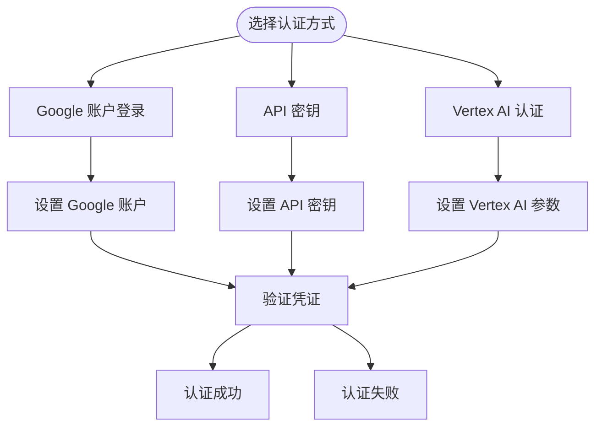
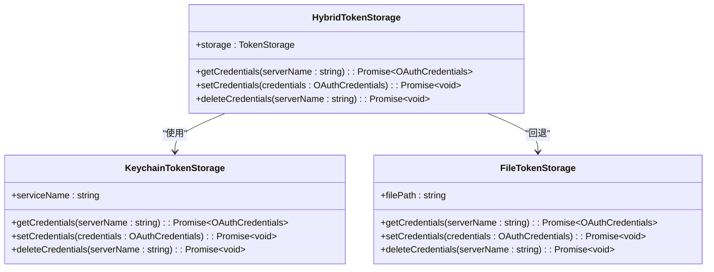
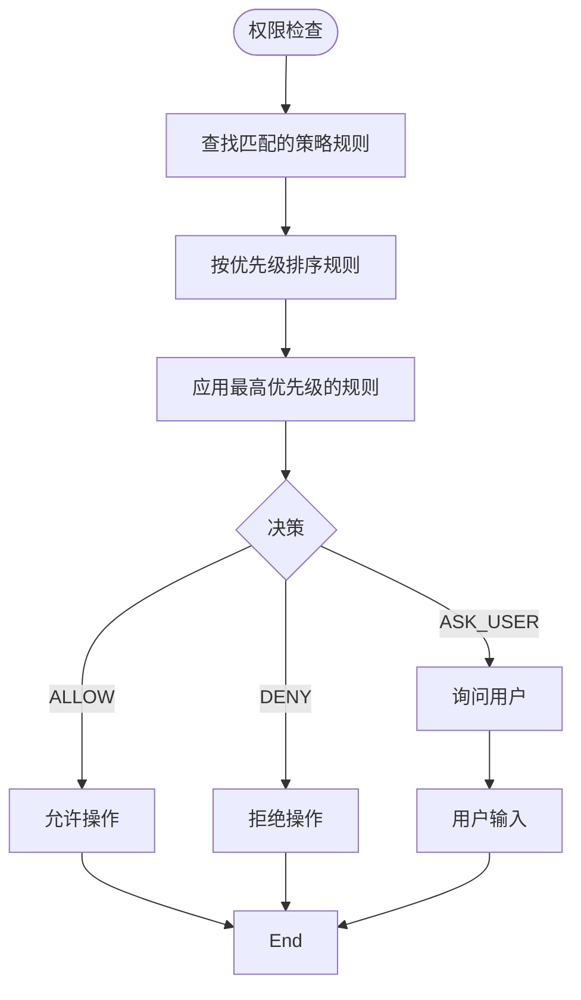
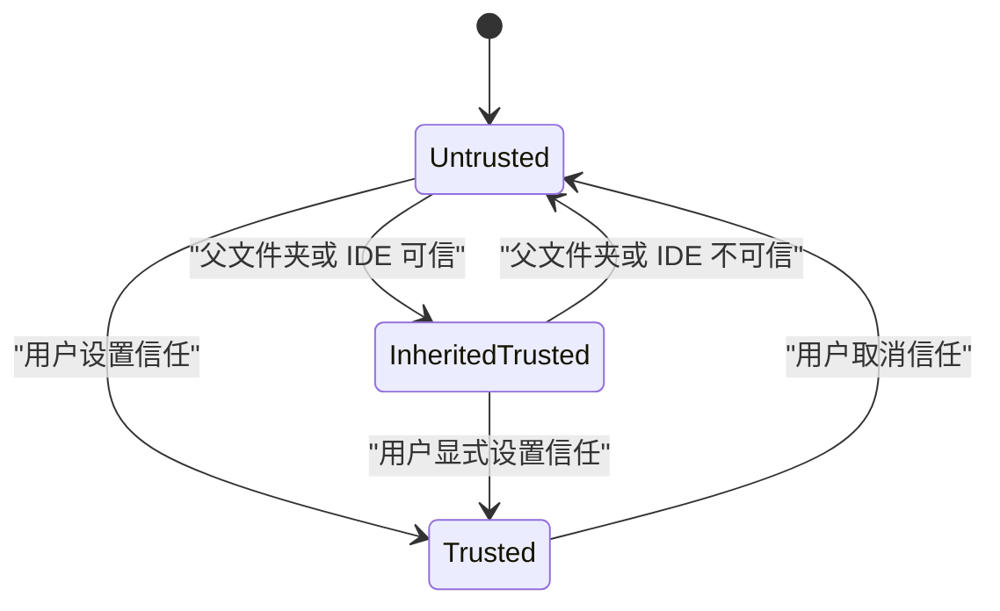

# 认证与安全

<cite>
**本文档中引用的文件**  
- [SECURITY.md](file://SECURITY.md)
- [auth.ts](file://packages/cli/src/config/auth.ts)
- [oauth-credential-storage.ts](file://packages/core/src/code_assist/oauth-credential-storage.ts)
- [apiKeyCredentialStorage.ts](file://packages/core/src/core/apiKeyCredentialStorage.ts)
- [google-auth-provider.ts](file://packages/core/src/mcp/google-auth-provider.ts)
- [sa-impersonation-provider.ts](file://packages/core/src/mcp/sa-impersonation-provider.ts)
- [oauth-token-storage.ts](file://packages/core/src/mcp/oauth-token-storage.ts)
- [hybrid-token-storage.ts](file://packages/core/src/mcp/token-storage/hybrid-token-storage.ts)
- [keychain-token-storage.ts](file://packages/core/src/mcp/token-storage/keychain-token-storage.ts)
- [contentGenerator.ts](file://packages/core/src/core/contentGenerator.ts)
- [AuthDialog.tsx](file://packages/cli/src/ui/auth/AuthDialog.tsx)
- [trustedFolders.ts](file://packages/cli/src/config/trustedFolders.ts)
- [policy-engine.integration.test.ts](file://packages/cli/src/config/policy-engine.integration.test.ts)
- [toml-loader.ts](file://packages/core/src/policy/toml-loader.ts)
</cite>

## 目录

1. [简介](#简介)
2. [认证方式](#认证方式)
3. [安全凭证存储](#安全凭证存储)
4. [权限模型与作用域](#权限模型与作用域)
5. [用户信任设置](#用户信任设置)
6. [最小权限原则](#最小权限原则)
7. [故障排除](#故障排除)
8. [安全最佳实践](#安全最佳实践)

## 简介

gemini-cli 提供了多种认证方式，允许用户通过不同的身份验证机制安全地访问 Google 服务。本文档详细说明了支持的三种主要认证方式：Google 账户登录、API 密钥和 Vertex
AI 认证。系统通过安全的凭证存储机制保护敏感信息，并遵循最小权限原则来限制对系统资源的访问。此外，CLI 还实现了用户信任设置和权限模型，以确保在执行操作时的安全性。

**Section sources**

- [SECURITY.md](file://SECURITY.md#L1-L10)

## 认证方式

gemini-cli 支持以下三种认证方式：

1. **Google 账户登录**：使用用户的 Google 账户进行身份验证。
2. **API 密钥**：使用 Gemini API 密钥进行身份验证。
3. **Vertex AI 认证**：使用 Vertex AI 服务进行身份验证。

每种认证方式都有其特定的设置流程和适用场景。例如，当使用 Vertex AI 时，必须指定
`GOOGLE_CLOUD_PROJECT` 和 `GOOGLE_CLOUD_LOCATION` 环境变量，或者设置
`GOOGLE_API_KEY` 环境变量（如果使用快速模式）。

**Diagram sources**

- [auth.ts](file://packages/cli/src/config/auth.ts#L10-L40)
- [contentGenerator.ts](file://packages/core/src/core/contentGenerator.ts#L42-L92)

**Section sources**

- [auth.ts](file://packages/cli/src/config/auth.ts#L1-L40)
- [contentGenerator.ts](file://packages/core/src/core/contentGenerator.ts#L42-L92)

## 安全凭证存储

gemini-cli 使用安全的凭证存储机制来处理和存储敏感凭证。OAuth 凭证和 API 密钥都通过
`HybridTokenStorage`
类进行管理，该类优先使用操作系统的密钥链服务（如 macOS 的 Keychain）来存储凭证，以提供额外的安全保护。

对于 OAuth 凭证，系统会尝试从旧的基于文件的存储迁移到密钥链存储。API 密钥则被包装在
`OAuthCredentials` 格式中，并通过 `HybridTokenStorage` 存储在密钥链中。

**Diagram sources**

- [oauth-credential-storage.ts](file://packages/core/src/code_assist/oauth-credential-storage.ts#L20-L140)
- [apiKeyCredentialStorage.ts](file://packages/core/src/core/apiKeyCredentialStorage.ts#L14-L74)
- [hybrid-token-storage.ts](file://packages/core/src/mcp/token-storage/hybrid-token-storage.ts)
- [keychain-token-storage.ts](file://packages/core/src/mcp/token-storage/keychain-token-storage.ts)

**Section sources**

- [oauth-credential-storage.ts](file://packages/core/src/code_assist/oauth-credential-storage.ts#L20-L140)
- [apiKeyCredentialStorage.ts](file://packages/core/src/core/apiKeyCredentialStorage.ts#L14-L74)

## 权限模型与作用域

gemini-cli 实现了基于策略的权限模型，用于控制对工具和服务器的访问。策略规则根据工具名称、命令前缀、正则表达式和参数模式进行匹配，并分配相应的决策（允许、拒绝或询问用户）。

权限决策的优先级由策略层级和规则优先级共同决定。系统支持默认、用户和管理员三个层级，每个层级内的规则按优先级排序。高优先级的规则会覆盖低优先级的规则。

**Diagram sources**

- [toml-loader.ts](file://packages/core/src/policy/toml-loader.ts#L161-L201)
- [policy-engine.integration.test.ts](file://packages/cli/src/config/policy-engine.integration.test.ts#L295-L326)

**Section sources**

- [toml-loader.ts](file://packages/core/src/policy/toml-loader.ts#L161-L201)
- [policy-engine.integration.test.ts](file://packages/cli/src/config/policy-engine.integration.test.ts#L295-L326)

## 用户信任设置

gemini-cli 提供了用户信任设置功能，允许用户指定哪些文件夹是可信的。信任级别包括：信任当前文件夹、信任父文件夹或不信任。系统会根据这些设置来决定是否允许在特定文件夹中执行操作。

当用户尝试在未信任的文件夹中执行操作时，CLI 会提示用户修改信任级别。信任设置可以继承自父文件夹或连接的 IDE 工作区。

**Diagram sources**

- [trustedFolders.ts](file://packages/cli/src/config/trustedFolders.ts#L59-L113)

**Section sources**

- [trustedFolders.ts](file://packages/cli/src/config/trustedFolders.ts#L59-L113)

## 最小权限原则

gemini-cli 遵循最小权限原则，确保每个操作只拥有完成任务所需的最低权限。系统通过策略引擎动态评估每个操作的权限需求，并根据预定义的策略规则做出决策。

例如，读取文件的操作通常被自动接受，而写入文件的操作则需要用户确认。这种设计减少了潜在的安全风险，防止恶意或意外的操作对系统造成损害。

**Section sources**

- [SECURITY.md](file://SECURITY.md#L1-L10)
- [policy-engine.integration.test.ts](file://packages/cli/src/config/policy-engine.integration.test.ts#L370-L407)

## 故障排除

以下是一些常见的认证问题及其解决方案：

- **认证失败**：检查环境变量是否正确设置，特别是
  `GOOGLE_CLOUD_PROJECT`、`GOOGLE_CLOUD_LOCATION` 和 `GOOGLE_API_KEY`。
- **凭证过期**：重新登录或更新 API 密钥。
- **权限被拒绝**：检查策略配置文件，确保相关工具和服务器被正确允许。
- **密钥链访问失败**：确保操作系统密钥链服务正常运行，并且应用程序有权限访问它。

**Section sources**

- [auth.ts](file://packages/cli/src/config/auth.ts#L10-L40)
- [oauth-credential-storage.ts](file://packages/core/src/code_assist/oauth-credential-storage.ts#L109-L138)

## 安全最佳实践

根据 `SECURITY.md` 文件中的最佳实践，建议采取以下措施来提高安全性：

- 定期更新 API 密钥和 OAuth 凭证。
- 使用最小权限原则配置策略规则。
- 启用用户信任设置，限制在可信文件夹中的操作。
- 监控和审查安全日志，及时发现异常行为。

**Section sources**

- [SECURITY.md](file://SECURITY.md#L1-L10)
- [policy-engine.integration.test.ts](file://packages/cli/src/config/policy-engine.integration.test.ts#L449-L471)
