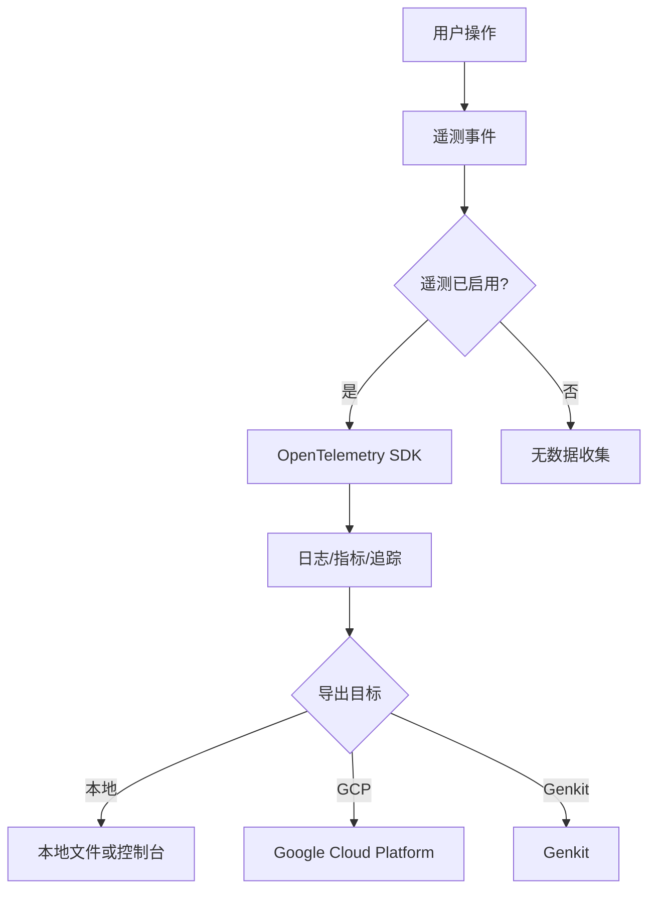

# 遥测与日志

<cite>
**本文档中引用的文件**   
- [index.ts](file://packages/core/src/telemetry/index.ts)
- [loggers.ts](file://packages/core/src/telemetry/loggers.ts)
- [config.ts](file://packages/core/src/config/config.ts)
- [sdk.ts](file://packages/core/src/telemetry/sdk.ts)
- [types.ts](file://packages/core/src/telemetry/types.ts)
- [errorReporting.ts](file://packages/core/src/utils/errorReporting.ts)
- [telemetry.js](file://scripts/telemetry.js)
- [telemetry.test.ts](file://integration-tests/telemetry.test.ts)
</cite>

## 目录

1. [引言](#引言)
2. [遥测系统概述](#遥测系统概述)
3. [数据收集与隐私](#数据收集与隐私)
4. [日志系统](#日志系统)
5. [错误报告机制](#错误报告机制)
6. [性能监控与指标](#性能监控与指标)
7. [配置与控制](#配置与控制)
8. [故障排除](#故障排除)
9. [结论](#结论)

## 引言

gemini-cli 的遥测和日志系统旨在通过收集使用数据、性能指标和错误报告来持续改进产品。本系统在提供有价值的洞察以优化用户体验的同时，也注重用户隐私和数据透明度。该系统基于 OpenTelemetry 标准构建，能够灵活地将数据导出到不同的后端，如本地文件、Google
Cloud Platform (GCP) 或 Genkit。用户可以通过命令行标志（如
`--disable-telemetry`）完全控制其数据共享偏好。此外，该系统集成了详细的错误报告机制，当发生异常时，会生成包含上下文信息的报告，以帮助开发团队快速诊断和解决问题。

**Section sources**

- [index.ts](file://packages/core/src/telemetry/index.ts#L1-L140)

## 遥测系统概述

gemini-cli 的遥测系统是一个综合性的数据收集框架，用于监控和分析工具的使用情况、性能和可靠性。该系统在
`packages/core/src/telemetry` 目录下实现，其核心是 OpenTelemetry
SDK，它提供了一套标准化的 API 来生成和导出遥测数据。遥测数据主要分为三类：日志（Logs）、指标（Metrics）和追踪（Traces）。系统通过
`initializeTelemetry` 函数启动，该函数根据配置创建一个 `NodeSDK`
实例，并配置相应的导出器（exporter）来将数据发送到指定的目标。遥测数据的收集是可配置的，用户可以选择启用或禁用整个系统，以及选择数据的导出目标（如本地、GCP 或 Genkit）。

**Diagram sources **

- [index.ts](file://packages/core/src/telemetry/index.ts#L1-L140)
- [sdk.ts](file://packages/core/src/telemetry/sdk.ts#L1-L223)

**Section sources**

- [index.ts](file://packages/core/src/telemetry/index.ts#L1-L140)
- [sdk.ts](file://packages/core/src/telemetry/sdk.ts#L1-L223)

## 数据收集与隐私

gemini-cli 非常重视用户隐私。遥测数据的收集是可选的，默认情况下可能处于启用状态，但用户可以随时通过
`--disable-telemetry` 标志来禁用。系统通过环境变量（如
`GEMINI_TELEMETRY_ENABLED`）、命令行参数和配置文件（`settings.json`）三个层级来确定遥测的最终状态，其中命令行参数的优先级最高。收集的数据旨在匿名化和聚合，以保护用户身份。例如，用户提示（user
prompt）的记录是可选的，由 `telemetryLogPrompts`
配置项控制，默认为启用，但用户可以将其关闭以防止任何提示内容被发送。所有数据收集都遵循最小化原则，仅收集改进产品所必需的信息。

**Section sources**

- [config.ts](file://packages/core/src/config/config.ts#L104-L112)
- [config.ts](file://packages/core/src/telemetry/config.ts#L46-L80)

## 日志系统

gemini-cli 的日志系统是其遥测框架的核心组成部分，负责记录应用程序在运行时的关键事件。日志事件被定义为实现了
`BaseTelemetryEvent` 接口的类，例如 `UserPromptEvent`、`ToolCallEvent` 和
`ApiResponseEvent`。每个事件都包含一个时间戳和一组描述该事件的属性。日志通过
`loggers.ts` 文件中的函数（如 `logUserPrompt` 和
`logToolCall`）进行记录。这些函数会将事件转换为 OpenTelemetry 兼容的格式，并通过 SDK 发出。日志的格式遵循结构化日志记录的原则，便于后续的分析和查询。日志的存储位置取决于
`telemetryTarget` 配置，可以是本地文件、GCP Logging 或控制台输出。

**Section sources**

- [types.ts](file://packages/core/src/telemetry/types.ts#L42-L800)
- [loggers.ts](file://packages/core/src/telemetry/loggers.ts#L1-L657)

## 错误报告机制

当 gemini-cli 遇到无法处理的错误时，它会通过 `errorReporting.ts` 文件中的
`reportError`
函数来生成详细的错误报告。该机制旨在为开发团队提供足够的上下文信息来复现和修复问题，同时尽量减少对用户的干扰。`reportError`
函数接收错误对象、上下文（如聊天历史或请求内容）和错误类型作为参数。它会创建一个包含错误消息、堆栈跟踪和上下文的 JSON 文件，并将其保存在系统的临时目录中。文件名包含时间戳和错误类型，例如
`gemini-client-error-general-2025-04-05T10-30-45.json`。然后，该函数会在控制台输出一条消息，告知用户错误报告已生成并提供文件路径，以便用户在需要时可以分享该报告。

**Section sources**

- [errorReporting.ts](file://packages/core/src/utils/errorReporting.ts#L1-L119)

## 性能监控与指标

除了日志，gemini-cli 还收集丰富的性能指标，以监控其运行状况和效率。这些指标由
`metrics.ts` 文件中的函数记录，例如 `recordToolCallMetrics` 和
`recordTokenUsageMetrics`。关键的性能指标包括：

- **工具调用延迟**：测量每个工具（如文件读取、shell 命令执行）的执行时间。
- **API 请求延迟**：跟踪与 Gemini API 通信的响应时间。
- **令牌使用情况**：按输入、输出、缓存等类型统计令牌消耗。
- **内存使用情况**：监控进程的内存占用，以检测潜在的内存泄漏。
- **会话计数**：统计启动的会话总数。

这些指标对于识别性能瓶颈、优化资源使用和确保服务的稳定性至关重要。系统还包含一个
`RateLimiter`
类，以防止在短时间内记录过多的度量数据，从而避免对性能造成负面影响。

**Section sources**

- [metrics.ts](file://packages/core/src/telemetry/metrics.ts#L1-L200)
- [rate-limiter.ts](file://packages/core/src/telemetry/rate-limiter.ts#L1-L44)

## 配置与控制

用户可以通过多种方式配置和控制 gemini-cli 的遥测和日志行为。主要的控制方式是通过命令行标志：

- `--disable-telemetry`：完全禁用遥测数据的收集。
- `--telemetry-target`：指定遥测数据的导出目标（`local`, `gcp`, `genkit`）。
- `--telemetry-log-prompts`：控制是否在日志中包含用户提示的完整内容。

此外，用户可以在 `settings.json`
配置文件中设置这些选项，或者通过设置环境变量（如
`GEMINI_TELEMETRY_ENABLED`）来覆盖配置。配置的优先级顺序为：命令行参数 > 环境变量 > 配置文件。这种分层配置方式为用户和管理员提供了极大的灵活性。

**Section sources**

- [config.ts](file://packages/core/src/config/config.ts#L241-L242)
- [config.ts](file://packages/core/src/telemetry/config.ts#L46-L80)

## 故障排除

为了帮助用户和开发人员进行故障排除，gemini-cli 提供了详细的日志记录和错误报告功能。要启用详细的日志记录，用户可以：

1.  确保遥测已启用（不使用 `--disable-telemetry`）。
2.  将 `telemetryTarget` 设置为 `local` 或 `gcp`，以便将日志导出到文件或云服务。
3.  在 `settings.json` 中将 `telemetry.logPrompts` 设置为
    `true`，以包含用户提示的完整内容。

当遇到错误时，应检查控制台输出，其中会包含指向生成的错误报告 JSON 文件的路径。该文件包含了错误的完整堆栈跟踪和相关的上下文信息，是诊断问题的关键。此外，`integration-tests/telemetry.test.ts`
文件中的测试用例可以作为验证遥测功能是否正常工作的参考。

**Section sources**

- [config.ts](file://packages/core/src/config/config.ts#L109-L110)
- [errorReporting.ts](file://packages/core/src/utils/errorReporting.ts#L1-L119)
- [telemetry.test.ts](file://integration-tests/telemetry.test.ts#L1-L27)

## 结论

gemini-cli 的遥测和日志系统是一个强大而灵活的工具，它在提升产品质量和用户体验方面发挥着至关重要的作用。通过透明地收集使用数据、性能指标和错误报告，开发团队能够获得宝贵的洞察，从而做出数据驱动的决策。同时，该系统通过提供
`--disable-telemetry`
等控制选项，尊重了用户的隐私选择。详细的错误报告机制确保了问题能够被快速识别和解决。总体而言，该系统在透明度和实用性之间取得了良好的平衡，既为产品改进提供了坚实的数据基础，又保障了用户对自身数据的控制权。
