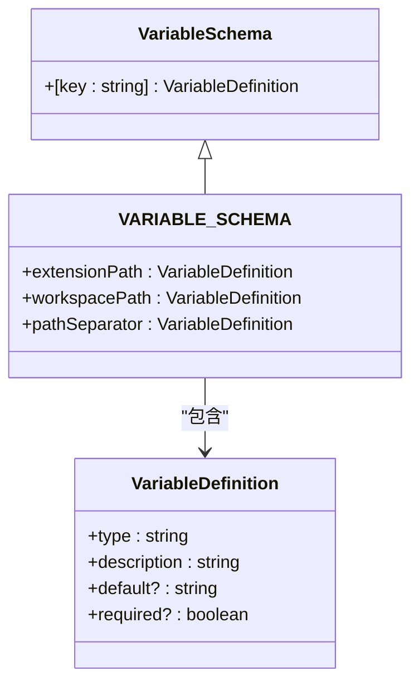
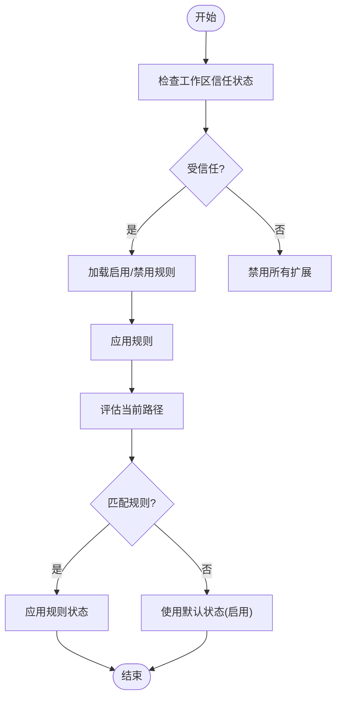
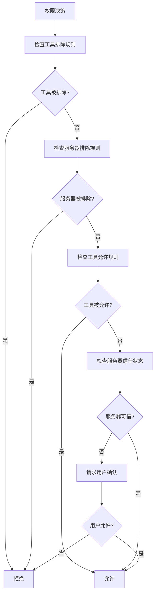

# 扩展配置

<cite>
**本文档中引用的文件**  
- [extensionSettings.ts](file://packages/cli/src/config/extensions/extensionSettings.ts)
- [variableSchema.ts](file://packages/cli/src/config/extensions/variableSchema.ts)
- [settings.ts](file://packages/cli/src/config/settings.ts)
- [settingsSchema.ts](file://packages/cli/src/config/settingsSchema.ts)
- [policy.ts](file://packages/cli/src/config/policy.ts)
- [trustedFolders.ts](file://packages/cli/src/config/trustedFolders.ts)
- [extension.ts](file://packages/cli/src/config/extension.ts)
</cite>

## 目录

1. [简介](#简介)
2. [扩展配置结构](#扩展配置结构)
3. [变量验证模式](#变量验证模式)
4. [扩展状态管理](#扩展状态管理)
5. [扩展权限与信任设置](#扩展权限与信任设置)
6. [配置实践示例](#配置实践示例)
7. [结论](#结论)

## 简介

本文档深入探讨gemini-cli扩展系统的配置机制。重点介绍如何通过配置文件管理已安装扩展的状态（启用/禁用）、设置扩展特定的变量（如API密钥或自定义参数）以及扩展的元数据存储。详细解释`extensionSettings.ts`中定义的配置结构和`variableSchema.ts`中变量的验证模式。提供配置扩展权限、信任设置和动态更新的实践示例，指导用户如何安全、有效地配置和管理MCP扩展。

## 扩展配置结构

gemini-cli的扩展配置系统通过分层结构管理扩展的设置和元数据。核心配置文件位于`packages/cli/src/config/extensions/`目录下，主要由`extensionSettings.ts`和`variableSchema.ts`两个文件构成。

`extensionSettings.ts`文件定义了扩展设置的核心接口和功能，包括`ExtensionSetting`接口，用于描述扩展的设置项，包含名称、描述和环境变量名等属性。该文件还提供了`maybePromptForSettings`函数，用于在扩展安装或更新时提示用户输入必要的设置值。

扩展的配置结构支持敏感信息和非敏感信息的区分存储。敏感信息（如API密钥）通过`KeychainTokenStorage`安全地存储在系统的密钥链中，而非敏感信息则存储在`.env`文件中。这种分离确保了敏感数据的安全性，同时保持了配置的灵活性。

**扩展配置文件路径**

- 用户级设置：`~/.gemini/settings.json`
- 工作区级设置：`<workspace>/.gemini/settings.json`
- 系统级设置：根据操作系统不同，位于`/Library/Application Support/GeminiCli/settings.json`（macOS）、`C:\ProgramData\gemini-cli\settings.json`（Windows）或`/etc/gemini-cli/settings.json`（Linux）

**扩展配置作用域** 系统支持多种配置作用域，通过`SettingScope`枚举定义：

- `User`：用户级配置，影响所有工作区
- `Workspace`：工作区级配置，仅影响当前工作区
- `System`：系统级配置，具有最高优先级
- `Session`：会话级配置，仅在当前会话中有效

```mermaid
graph TD
A[扩展配置] --> B[用户级配置]
A --> C[工作区级配置]
A --> D[系统级配置]
A --> E[会话级配置]
B --> F[~/.gemini/settings.json]
C --> G[<workspace>/.gemini/settings.json]
D --> H[/etc/gemini-cli/settings.json]
E --> I[内存中临时存储]
```

**配置来源**

- [extensionSettings.ts](file://packages/cli/src/config/extensions/extensionSettings.ts#L17-L192)
- [settings.ts](file://packages/cli/src/config/settings.ts#L155-L163)

## 变量验证模式

`variableSchema.ts`文件定义了扩展变量的验证模式，确保配置值的正确性和一致性。该文件导出`VARIABLE_SCHEMA`常量，包含一组预定义的变量定义，用于验证和解析扩展配置中的变量。

变量验证模式的核心是`VariableDefinition`接口，它定义了变量的基本属性：

- `type`：变量类型，目前仅支持字符串类型
- `description`：变量的描述信息
- `default`：变量的默认值
- `required`：变量是否为必需

预定义的变量包括：

- `extensionPath`：扩展在文件系统中的路径
- `workspacePath`：当前工作区的绝对路径
- `pathSeparator`：路径分隔符，根据操作系统自动确定

这些变量在扩展配置中可以通过`${variable}`语法引用，系统会在运行时自动解析和替换。例如，`${extensionPath}`会被替换为扩展的实际安装路径，`${workspacePath}`会被替换为当前工作区的路径。

变量验证模式还支持路径分隔符的自动适配，通过`PATH_SEPARATOR_DEFINITION`常量定义，确保在不同操作系统（Windows使用`\`，Unix-like系统使用`/`）上都能正确处理路径。



**变量验证来源**

- [variableSchema.ts](file://packages/cli/src/config/extensions/variableSchema.ts#L7-L35)
- [extensionSettings.ts](file://packages/cli/src/config/extensions/extensionSettings.ts#L110-L139)

## 扩展状态管理

扩展状态管理是gemini-cli扩展系统的核心功能之一，允许用户通过配置文件控制已安装扩展的启用和禁用状态。系统通过`extensionManager`组件管理扩展的生命周期，包括安装、启用、禁用和卸载。

扩展的启用/禁用状态通过`ExtensionEnablementManager`类管理，该类维护一个规则列表，用于确定特定路径下扩展的启用状态。规则支持基于路径的精细控制，允许用户在不同项目或目录中启用或禁用特定扩展。

当用户执行`enable`或`disable`命令时，系统会更新内部的规则列表，并持久化到配置文件中。规则的优先级由其添加顺序决定，后添加的规则优先级更高。例如，如果一个规则禁用了某个扩展，而后续又添加了一个启用该扩展的规则，则最终该扩展将处于启用状态。

扩展状态的管理还考虑了工作区的信任状态。只有在受信任的工作区中，扩展的配置才会被应用。这通过`isWorkspaceTrusted`函数实现，该函数检查当前工作区是否在用户的信任列表中。



**扩展状态管理来源**

- [extensionSettings.ts](file://packages/cli/src/config/extensions/extensionSettings.ts#L30-L96)
- [extensionEnablement.test.ts](file://packages/cli/src/config/extensions/extensionEnablement.test.ts#L53-L85)
- [trustedFolders.ts](file://packages/cli/src/config/trustedFolders.ts#L194-L241)

## 扩展权限与信任设置

gemini-cli的扩展权限与信任设置系统通过多层次的安全机制保护用户环境。核心权限管理由`PolicyEngine`实现，它根据预定义的规则决定是否允许特定工具或MCP服务器的执行。

权限配置主要通过`mcp`和`tools`设置项控制：

- `mcp.allowed`：允许的MCP服务器列表
- `mcp.excluded`：排除的MCP服务器列表
- `tools.allowed`：允许的工具列表
- `tools.exclude`：排除的工具列表

信任设置通过`mcpServers`配置项管理，允许用户标记特定的MCP服务器为可信。可信服务器的所有工具将被自动允许执行，无需额外确认。这种机制平衡了安全性和便利性，用户可以信任已知的安全服务器，同时对未知服务器保持警惕。

权限规则的优先级系统确保了安全策略的有效性。具体规则的优先级高于通用规则，排除规则的优先级高于允许规则。例如，即使一个服务器被标记为可信，但如果其特定工具被明确排除，则该工具仍会被拒绝执行。



**权限与信任设置来源**

- [policy.ts](file://packages/cli/src/config/policy.ts#L18-L39)
- [config.test.ts](file://packages/core/src/policy/config.test.ts#L141-L391)
- [config.ts](file://packages/core/src/policy/config.ts#L196-L251)

## 配置实践示例

本节提供配置扩展权限、信任设置和动态更新的实践示例，帮助用户安全、有效地管理MCP扩展。

### 配置扩展权限

要允许特定的MCP服务器，可以在用户设置中添加：

```json
{
  "mcp": {
    "allowed": ["my-trusted-server"]
  }
}
```

要排除不安全的服务器，可以添加：

```json
{
  "mcp": {
    "excluded": ["malicious-server"]
  }
}
```

### 配置信任设置

要将特定MCP服务器标记为可信，可以在设置中添加：

```json
{
  "mcpServers": {
    "trusted-server": {
      "trust": true
    }
  }
}
```

### 动态更新扩展

系统支持在运行时动态更新扩展配置。当扩展的配置发生变化时，`maybePromptForSettings`函数会自动检测变化并提示用户输入新的设置值。对于已移除的设置，系统会自动清理相应的环境变量和密钥链条目。

### 敏感信息管理

对于敏感信息如API密钥，系统会自动将其存储在系统的密钥链中，而不是明文存储在配置文件中。用户可以通过以下方式配置敏感设置：

```typescript
const settings: ExtensionSetting[] = [
  {
    name: 'API Key',
    description: 'Your API key for the service',
    envVar: 'API_KEY',
    sensitive: true,
  },
];
```

这些实践示例展示了如何安全地配置和管理扩展，确保系统的安全性和灵活性。

**配置实践来源**

- [extensionSettings.ts](file://packages/cli/src/config/extensions/extensionSettings.ts#L30-L96)
- [settingsSchema.ts](file://packages/cli/src/config/settingsSchema.ts#L137-L800)
- [policy.ts](file://packages/cli/src/config/policy.ts#L18-L39)

## 结论

gemini-cli的扩展配置系统提供了一套完整、安全且灵活的机制，用于管理扩展的状态、变量和权限。通过分层的配置结构、严格的变量验证模式、精细的状态管理和多层次的权限控制，系统确保了扩展的安全执行和用户的配置自由。用户可以通过配置文件轻松管理扩展的启用/禁用状态、设置扩展特定的变量，并配置复杂的权限和信任策略。这套系统不仅提高了开发效率，还增强了系统的安全性和可维护性。
