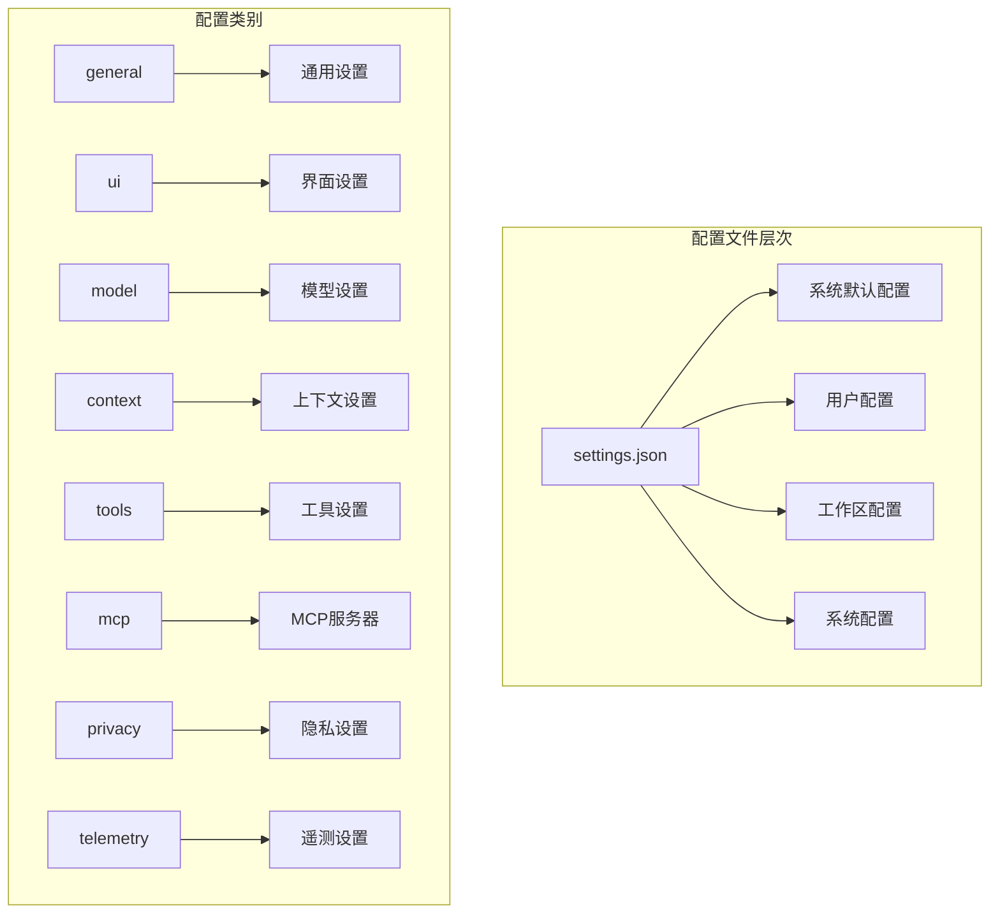
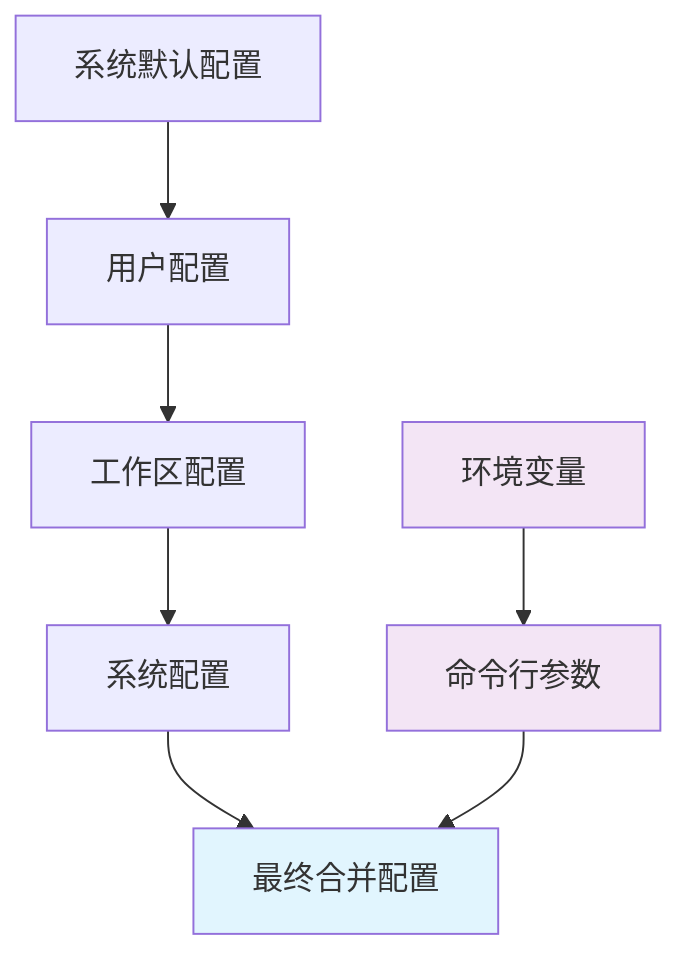
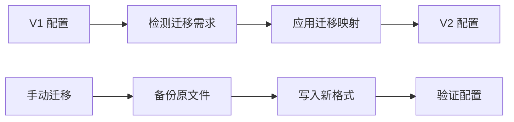

# 核心设置

<cite>
**本文档中引用的文件**
- [settings.schema.json](file://schemas/settings.schema.json)
- [settings.ts](file://packages/cli/src/config/settings.ts)
- [settingsSchema.ts](file://packages/cli/src/config/settingsSchema.ts)
- [settings.test.ts](file://packages/cli/src/config/settings.test.ts)
- [envVarResolver.ts](file://packages/cli/src/utils/envVarResolver.ts)
- [settingsUtils.ts](file://packages/cli/src/utils/settingsUtils.ts)
- [config.ts](file://packages/cli/src/config/config.ts)
</cite>

## 目录

1. [简介](#简介)
2. [配置文件结构](#配置文件结构)
3. [配置加载优先级](#配置加载优先级)
4. [核心配置分类](#核心配置分类)
5. [环境变量支持](#环境变量支持)
6. [命令行参数覆盖](#命令行参数覆盖)
7. [配置迁移机制](#配置迁移机制)
8. [高级配置选项](#高级配置选项)
9. [故障排除指南](#故障排除指南)
10. [最佳实践](#最佳实践)

## 简介

Gemini
CLI 的核心配置系统提供了灵活且强大的配置管理功能，支持多种配置来源和覆盖机制。配置系统采用分层架构，允许用户通过配置文件、环境变量和命令行参数来自定义 CLI 的行为。

### 主要特性

- **多层级配置支持**：系统默认、用户、工作区和系统级别的配置
- **环境变量解析**：自动解析和替换配置中的环境变量占位符
- **配置迁移**：向后兼容的配置格式迁移机制
- **类型安全**：完整的 TypeScript 类型定义和验证
- **动态重载**：支持运行时配置更新

## 配置文件结构

### settings.json 文件格式

Gemini CLI 使用 JSON 格式的配置文件，遵循严格的模式定义：



**图表来源**

- [settings.schema.json](file://schemas/settings.schema.json#L1-L800)
- [settings.ts](file://packages/cli/src/config/settings.ts#L1-L100)

### 基本配置结构

```json
{
  "general": {
    "vimMode": false,
    "preferredEditor": "code",
    "disableAutoUpdate": false
  },
  "ui": {
    "theme": "dark",
    "hideFooter": false,
    "showMemoryUsage": false
  },
  "model": {
    "name": "gemini-2.5-flash",
    "maxSessionTurns": -1,
    "compressionThreshold": 0.2
  },
  "context": {
    "fileName": "GEMINI.md",
    "includeDirectories": [],
    "fileFiltering": {
      "respectGitIgnore": true,
      "respectGeminiIgnore": true
    }
  }
}
```

**节来源**

- [settings.schema.json](file://schemas/settings.schema.json#L8-L800)

## 配置加载优先级

### 加载顺序

配置系统按照以下优先级顺序加载和合并配置：



**图表来源**

- [settings.ts](file://packages/cli/src/config/settings.ts#L401-L424)

### 配置路径

| 配置级别   | 路径                                   | 描述               |
| ---------- | -------------------------------------- | ------------------ |
| 系统默认   | `/etc/gemini-cli/system-defaults.json` | 系统级别的默认配置 |
| 系统配置   | `/etc/gemini-cli/settings.json`        | 系统管理员设置     |
| 用户配置   | `~/.config/gemini-cli/settings.json`   | 用户个人配置       |
| 工作区配置 | `./.gemini/settings.json`              | 项目特定配置       |

**节来源**

- [settings.ts](file://packages/cli/src/config/settings.ts#L130-L151)

## 核心配置分类

### 通用设置 (General)

| 配置项                   | 类型    | 默认值 | 描述              |
| ------------------------ | ------- | ------ | ----------------- |
| `vimMode`                | boolean | false  | 启用 Vim 键盘绑定 |
| `preferredEditor`        | string  | -      | 首选编辑器名称    |
| `disableAutoUpdate`      | boolean | false  | 禁用自动更新      |
| `checkpointing.enabled`  | boolean | false  | 启用会话检查点    |
| `enablePromptCompletion` | boolean | false  | 启用提示补全      |

### 用户界面设置 (UI)

| 配置项               | 类型     | 默认值 | 描述             |
| -------------------- | -------- | ------ | ---------------- |
| `theme`              | string   | -      | 主题名称         |
| `hideFooter`         | boolean  | false  | 隐藏底部栏       |
| `showMemoryUsage`    | boolean  | false  | 显示内存使用情况 |
| `useFullWidth`       | boolean  | false  | 使用完整宽度     |
| `customWittyPhrases` | string[] | []     | 自定义幽默短语   |

### 模型设置 (Model)

| 配置项                 | 类型    | 默认值 | 描述                 |
| ---------------------- | ------- | ------ | -------------------- |
| `name`                 | string  | -      | Gemini 模型名称      |
| `maxSessionTurns`      | number  | -1     | 最大会话轮次         |
| `compressionThreshold` | number  | 0.2    | 上下文压缩阈值       |
| `skipNextSpeakerCheck` | boolean | true   | 跳过下一个发言者检查 |

### 上下文设置 (Context)

| 配置项                           | 类型         | 默认值 | 描述                 |
| -------------------------------- | ------------ | ------ | -------------------- |
| `fileName`                       | string/array | -      | 上下文文件名         |
| `includeDirectories`             | string[]     | []     | 包含的目录列表       |
| `discoveryMaxDirs`               | number       | 200    | 内存发现最大目录数   |
| `fileFiltering.respectGitIgnore` | boolean      | true   | 尊重 .gitignore 文件 |

**节来源**

- [settingsSchema.ts](file://packages/cli/src/config/settingsSchema.ts#L137-L800)

## 环境变量支持

### 环境变量解析

Gemini CLI 支持在配置文件中使用环境变量占位符，语法类似于 `${VAR_NAME}` 或
`$VAR_NAME`：

```json
{
  "model": {
    "name": "${GEMINI_MODEL:-gemini-2.5-flash}"
  },
  "context": {
    "fileName": "/path/to/${PROJECT_NAME}/GEMINI.md"
  }
}
```

### 解析规则

1. **变量展开**：`$VAR_NAME` 和 `${VAR_NAME}` 会被替换为对应的环境变量值
2. **默认值支持**：`${VAR_NAME:-default}` 提供默认值
3. **未定义变量保留**：如果环境变量未定义，原始占位符保持不变
4. **递归解析**：支持嵌套的环境变量引用

### 受保护的环境变量

某些环境变量被系统保护，无法通过配置文件覆盖：

- `DEBUG`
- `DEBUG_MODE`
- `HOME`
- `PATH`

**节来源**

- [envVarResolver.ts](file://packages/cli/src/utils/envVarResolver.ts#L20-L35)
- [settings.ts](file://packages/cli/src/config/settings.ts#L542-L581)

## 命令行参数覆盖

### 支持的命令行标志

| 参数                    | 别名 | 类型    | 描述                             |
| ----------------------- | ---- | ------- | -------------------------------- |
| `--model`               | `-m` | string  | 指定使用的模型                   |
| `--prompt`              | `-p` | string  | 非交互式提示                     |
| `--prompt-interactive`  | `-i` | string  | 交互式提示                       |
| `--sandbox`             | `-s` | boolean | 启用沙盒模式                     |
| `--yolo`                | `-y` | boolean | 自动批准所有操作                 |
| `--approval-mode`       | -    | string  | 审批模式：default/auto_edit/yolo |
| `--allowed-tools`       | -    | array   | 允许的工具列表                   |
| `--include-directories` | -    | array   | 包含的目录列表                   |
| `--output-format`       | `-o` | string  | 输出格式：text/json/stream-json  |

### 参数解析示例

```bash
# 基本使用
gemini "解释这段代码"

# 交互式模式
gemini -i "编写测试用例"

# 指定模型
gemini -m gemini-2.5-pro "优化算法"

# 多个工具允许
gemini --allowed-tools read_file,write_file "处理文件"

# 沙盒模式
gemini --sandbox "安全测试"
```

**节来源**

- [config.ts](file://packages/cli/src/config/config.ts#L73-L320)

## 配置迁移机制

### 版本迁移

Gemini CLI 支持从旧版本配置格式自动迁移到新版本：



**图表来源**

- [settings.ts](file://packages/cli/src/config/settings.ts#L58-L128)

### 迁移映射表

| V1 键名           | V2 路径            | 描述           |
| ----------------- | ------------------ | -------------- |
| `theme`           | `ui.theme`         | 主题设置       |
| `vimMode`         | `general.vimMode`  | Vim 模式       |
| `contextFileName` | `context.fileName` | 上下文文件名   |
| `mcpServers`      | `mcpServers`       | MCP 服务器配置 |
| `allowedTools`    | `tools.allowed`    | 允许的工具     |

### 迁移过程

1. **检测**：扫描配置文件中的旧键名
2. **转换**：将旧键映射到新位置
3. **合并**：与现有 V2 配置合并
4. **验证**：确保配置有效性

**节来源**

- [settings.ts](file://packages/cli/src/config/settings.ts#L258-L331)

## 高级配置选项

### 模型配置别名

Gemini CLI 提供预定义的模型配置别名：

```json
{
  "modelConfigs": {
    "aliases": {
      "base": {
        "modelConfig": {
          "generateContentConfig": {
            "temperature": 0,
            "topP": 1
          }
        }
      },
      "chat-base": {
        "extends": "base",
        "modelConfig": {
          "generateContentConfig": {
            "thinkingConfig": {
              "includeThoughts": true,
              "thinkingBudget": -1
            }
          }
        }
      },
      "gemini-2.5-pro": {
        "extends": "chat-base",
        "modelConfig": {
          "model": "gemini-2.5-pro"
        }
      }
    }
  }
}
```

### 工具输出总结

配置工具输出的总结策略：

```json
{
  "model": {
    "summarizeToolOutput": {
      "run_shell_command": {
        "tokenBudget": 2000
      }
    }
  }
}
```

### MCP 服务器配置

```json
{
  "mcpServers": {
    "github": {
      "command": "node",
      "args": ["./mcp-servers/github.js"],
      "env": {
        "GITHUB_TOKEN": "${GITHUB_TOKEN}"
      }
    }
  }
}
```

**节来源**

- [settings.ts](file://packages/cli/src/config/settings.ts#L415-L500)

## 故障排除指南

### 常见配置问题

#### 1. 配置文件格式错误

**症状**：CLI 启动时显示配置错误消息

**解决方案**：

- 检查 JSON 语法是否正确
- 使用 JSON 验证工具
- 查看配置文件路径

#### 2. 环境变量未解析

**症状**：配置中的 `$VAR_NAME` 未被替换

**解决方案**：

- 确认环境变量已设置
- 检查变量名拼写
- 使用默认值语法：`${VAR_NAME:-default}`

#### 3. 权限问题

**症状**：无法读取或写入配置文件

**解决方案**：

- 检查文件权限
- 确认用户对配置目录有写权限
- 使用正确的配置路径

### 调试配置

启用调试模式查看配置加载详情：

```bash
DEBUG=true gemini --debug
```

### 配置验证

使用内置验证功能检查配置：

```bash
gemini --help
```

**节来源**

- [settings.test.ts](file://packages/cli/src/config/settings.test.ts#L1-L100)

## 最佳实践

### 配置组织

1. **分层配置**：使用不同的配置级别实现灵活性
2. **环境隔离**：为不同环境维护独立的配置
3. **版本控制**：将工作区配置纳入版本控制

### 性能优化

1. **合理设置阈值**：根据需要调整上下文压缩阈值
2. **限制工具数量**：只允许必要的工具以提高安全性
3. **缓存配置**：利用配置缓存减少启动时间

### 安全考虑

1. **敏感信息保护**：避免在配置文件中存储敏感数据
2. **权限最小化**：使用最小权限原则配置工具访问
3. **定期审查**：定期检查和更新配置设置

### 维护建议

1. **定期备份**：备份重要配置文件
2. **监控变更**：跟踪配置文件的修改历史
3. **文档记录**：记录自定义配置的目的和影响

通过遵循这些最佳实践，您可以充分利用 Gemini
CLI 的配置系统，获得更好的使用体验和更高的工作效率。
