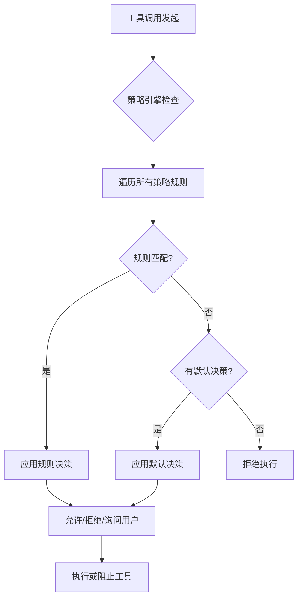
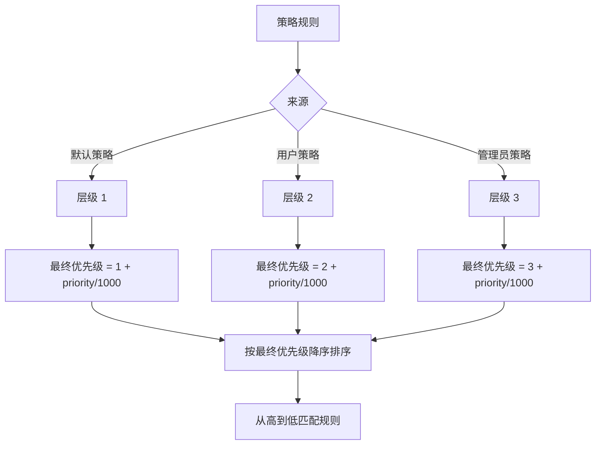
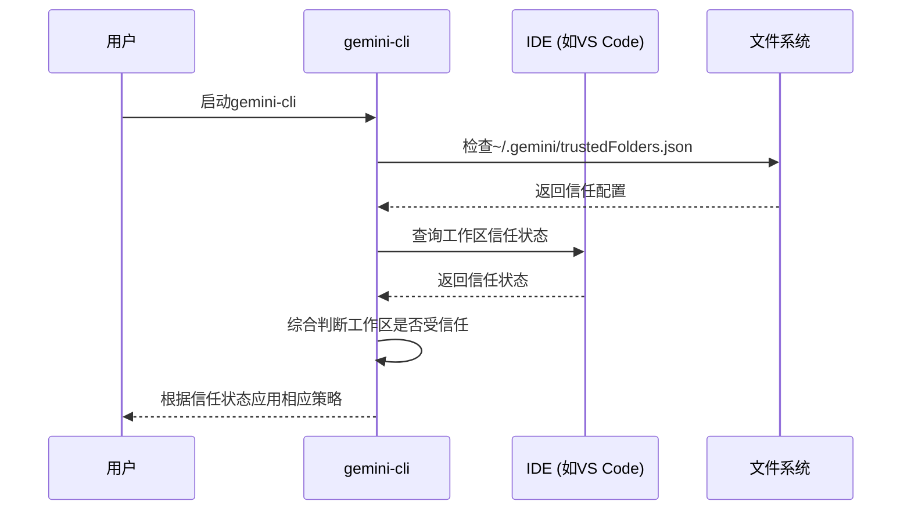

# 策略与安全设置

<cite>
**本文档引用的文件**   
- [policy-engine.ts](file://packages/core/src/policy/policy-engine.ts)
- [config.ts](file://packages/core/src/policy/config.ts)
- [toml-loader.ts](file://packages/core/src/policy/toml-loader.ts)
- [types.ts](file://packages/core/src/policy/types.ts)
- [read-only.toml](file://packages/core/src/policy/policies/read-only.toml)
- [write.toml](file://packages/core/src/policy/policies/write.toml)
- [yolo.toml](file://packages/core/src/policy/policies/yolo.toml)
- [discovered.toml](file://packages/core/src/policy/policies/discovered.toml)
- [policy.ts](file://packages/cli/src/config/policy.ts)
- [trustedFolders.ts](file://packages/cli/src/config/trustedFolders.ts)
- [settings.ts](file://packages/cli/src/config/settings.ts)
- [settings.schema.json](file://schemas/settings.schema.json)
</cite>

## 目录

1. [引言](#引言)
2. [策略引擎架构](#策略引擎架构)
3. [基于TOML的预设策略](#基于toml的预设策略)
4. [自定义策略编写](#自定义策略编写)
5. [文件夹信任机制](#文件夹信任机制)
6. [策略与用户配置的交互](#策略与用户配置的交互)
7. [最小权限原则实践](#最小权限原则实践)
8. [结论](#结论)

## 引言

gemini-cli的安全策略系统是一个多层次的权限控制系统，旨在平衡功能灵活性与安全性。该系统通过一个基于TOML的策略引擎（policy
engine）来管理工具的执行权限，确保用户对潜在危险操作有充分的控制权。核心安全机制包括预设的策略文件、用户自定义策略、命令行参数覆盖以及文件夹信任机制。本指南将深入解析这些组件的工作原理，并提供配置最佳实践。

## 策略引擎架构

gemini-cli的策略引擎是一个基于优先级的规则匹配系统，负责在工具执行前决定其权限。其核心工作流程如下：当一个工具调用（tool
call）被发起时，策略引擎会遍历所有已加载的规则，寻找与该调用匹配的规则。一旦找到匹配项，引擎将应用该规则指定的决策；若无任何规则匹配，则采用默认决策。



**图源**

- [policy-engine.ts](file://packages/core/src/policy/policy-engine.ts#L77-L106)

**节源**

- [policy-engine.ts](file://packages/core/src/policy/policy-engine.ts#L1-L139)
- [types.ts](file://packages/core/src/policy/types.ts#L7-L42)

## 基于TOML的预设策略

gemini-cli通过一系列预设的TOML策略文件来定义默认的安全行为。这些文件位于`packages/core/src/policy/policies/`目录下，为不同类型的工具调用提供了基础的权限框架。

### `read-only.toml` 策略

此策略文件定义了对只读工具的默认权限。它将一系列不会修改系统状态的工具（如文件读取、目录列表、网络搜索等）设置为自动允许（`allow`），并赋予较高的优先级（50）。这确保了用户在进行信息查询时无需频繁确认，提升了使用体验。

```toml
[[rule]]
toolName = "read_file"
decision = "allow"
priority = 50
```

### `write.toml` 策略

此策略文件针对可能修改系统状态的写入工具（如文件编辑、执行shell命令等）设置了默认的询问用户（`ask_user`）决策。这体现了最小权限原则，要求用户对潜在危险操作进行显式确认。此外，该文件还包含一个特殊规则，当用户启用`autoEdit`模式时，`replace`工具将被自动允许。

### `yolo.toml` 策略

此策略文件实现了一种“全权委托”模式。当用户通过`--approval-mode=yolo`命令行参数启用YOLO（You
Only Live
Once）模式时，此文件中的规则会被激活。它定义了一个无工具名称的通配规则，将所有工具调用的决策设置为`allow`，并赋予极高的优先级（999），从而覆盖所有其他规则。

### `discovered.toml` 策略

此策略文件用于处理通过`toolDiscoveryCommand`发现的自定义工具。由于这些工具的来源和行为未知，存在潜在安全风险，因此该策略默认将所有此类工具（通过通配符`discovered_tool_*`匹配）的决策设置为`ask_user`，强制用户在首次使用时进行确认。

**节源**

- [read-only.toml](file://packages/core/src/policy/policies/read-only.toml)
- [write.toml](file://packages/core/src/policy/policies/write.toml)
- [yolo.toml](file://packages/core/src/policy/policies/yolo.toml)
- [discovered.toml](file://packages/core/src/policy/policies/discovered.toml)

## 自定义策略编写

用户可以通过在用户策略目录（`~/.gemini/policies/`）中创建自定义的`.toml`文件来扩展或覆盖默认策略。策略规则的编写遵循严格的TOML格式，并通过一个复杂的优先级系统来决定最终决策。

### 策略规则结构

一个策略规则（`rule`）主要包含以下字段：

- **`toolName`**: 工具的名称。支持通配符`__*`来匹配特定MCP服务器下的所有工具。
- **`decision`**: 决策结果，可选值为`allow`、`deny`或`ask_user`。
- **`priority`**: 优先级数值，范围为0-999。数值越大，优先级越高。
- **`argsPattern`**: 一个正则表达式，用于匹配工具调用的参数。这允许进行细粒度的控制，例如只允许执行特定的shell命令。
- **`modes`**: 指定此规则生效的审批模式（如`yolo`或`autoEdit`）。

### 优先级系统

策略引擎采用一个分层的优先级系统，确保不同来源的规则能够有序地交互：

1.  **层级（Tier）**: 规则根据来源分为三个层级：默认策略（1.x）、用户策略（2.x）和管理员策略（3.x）。层级数字越大，优先级越高。
2.  **优先级（Priority）**: 在每个层级内，规则的优先级由`priority`字段决定。最终的排序优先级计算公式为：`tier + priority/1000`。

例如，一个用户策略（tier
2）中的`priority=950`的规则，其最终优先级为`2.950`，高于所有默认策略（1.x）和大部分用户策略。



**图源**

- [config.ts](file://packages/core/src/policy/config.ts#L133-L159)
- [toml-loader.ts](file://packages/core/src/policy/toml-loader.ts#L172-L174)

**节源**

- [config.ts](file://packages/core/src/policy/config.ts#L1-L252)
- [toml-loader.ts](file://packages/core/src/policy/toml-loader.ts#L1-L391)
- [types.ts](file://packages/core/src/policy/types.ts#L19-L42)

## 文件夹信任机制

文件夹信任机制是gemini-cli的一项高级安全功能，它允许用户将特定的项目文件夹标记为“受信任的”。当在受信任的文件夹中运行gemini-cli时，某些安全限制（如工具执行的确认提示）可以被放宽，从而在安全和便利性之间取得平衡。

### 配置方式

信任状态通过`~/.gemini/trustedFolders.json`文件进行管理。用户可以通过以下方式配置：

1.  **IDE集成**: 如果在支持的IDE（如VS
    Code）中打开项目，IDE可以向CLI发送信任状态。
2.  **本地配置**: 用户可以直接编辑`trustedFolders.json`文件，或通过CLI的交互式界面来添加、移除信任的文件夹路径。

### 对工具执行权限的影响

文件夹信任机制本身不直接控制单个工具的执行，而是作为一个更高层次的开关。当文件夹信任功能启用且当前工作目录被标记为受信任时，系统会认为用户已经对整个项目环境进行了风险评估。这为应用更宽松的策略（如通过`--approval-mode`参数）提供了安全基础。例如，用户可以在受信任的项目中启用`autoEdit`模式，而无需担心意外的文件修改。



**图源**

- [trustedFolders.ts](file://packages/cli/src/config/trustedFolders.ts#L200-L239)

**节源**

- [trustedFolders.ts](file://packages/cli/src/config/trustedFolders.ts#L1-L241)
- [settings.ts](file://packages/cli/src/config/settings.ts#L23)

## 策略与用户配置的交互

策略引擎的最终配置是多种来源的策略规则的综合结果。除了TOML文件，用户还可以通过`settings.json`配置文件和命令行参数来影响策略决策。

### 来源与优先级

策略规则的来源按优先级从低到高排列如下：

1.  **TOML策略文件**: 包括默认、用户和管理员策略。
2.  **`settings.json`配置**: 用户在`settings.json`中通过`mcpServers`、`tools.allowed`、`tools.exclude`等字段配置的规则，被赋予用户层级（2.x）的优先级。
3.  **命令行参数**: 通过`--allowed-tools`、`--exclude-tools`等参数指定的规则具有最高的用户层级优先级（2.3和2.4）。
4.  **交互式选择**: 用户在CLI界面中选择“始终允许”某个工具，会生成一个优先级为2.95的规则。

### 配置示例

在`settings.json`中，用户可以配置MCP服务器的信任状态：

```json
{
  "mcpServers": {
    "my-trusted-server": {
      "trust": true
    }
  },
  "tools": {
    "allowed": ["run_shell_command"],
    "exclude": ["dangerous-tool"]
  }
}
```

上述配置会生成相应的策略规则，允许来自`my-trusted-server`的所有工具调用，并允许`run_shell_command`工具，但会明确拒绝`dangerous-tool`。

**节源**

- [policy.ts](file://packages/cli/src/config/policy.ts#L1-L39)
- [settings.ts](file://packages/cli/src/config/settings.ts#L1-L836)
- [settings.schema.json](file://schemas/settings.schema.json#L795-L800)

## 最小权限原则实践

遵循最小权限原则是保障gemini-cli安全性的关键。以下是一些实际的配置案例：

### 案例一：安全的日常开发

对于大多数开发任务，应保持默认的严格策略。确保`write.toml`中的`ask_user`规则生效，对所有文件写入和shell命令执行进行确认。这可以有效防止AI模型因误解上下文而造成的意外修改。

### 案例二：受控的自动化

当需要自动化执行一系列编辑操作时，应结合使用文件夹信任和`autoEdit`模式。首先，将项目文件夹标记为受信任，然后在该目录下运行`gemini-cli --approval-mode=autoEdit`。这样既能实现自动化，又能将风险限制在已知的、受信任的项目范围内。

### 案例三：临时的完全信任

在进行原型设计或探索性编程时，可以使用`--approval-mode=yolo`来获得完全的自由度。但**强烈建议**仅在隔离的、可丢弃的环境中使用此模式，并且在完成后立即退出，以避免长期暴露于高风险状态。

## 结论

gemini-cli的安全策略系统通过一个灵活且强大的策略引擎，为用户提供了精细的权限控制能力。理解TOML策略文件、优先级系统、文件夹信任机制以及各种配置来源的交互方式，是安全有效地使用该工具的基础。始终建议从最严格的权限开始，并根据实际需求谨慎地放宽限制，以践行最小权限原则，保护您的系统和数据安全。
