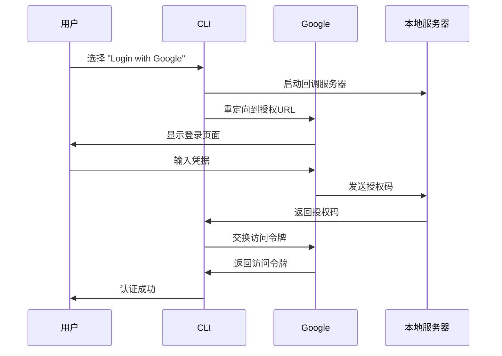
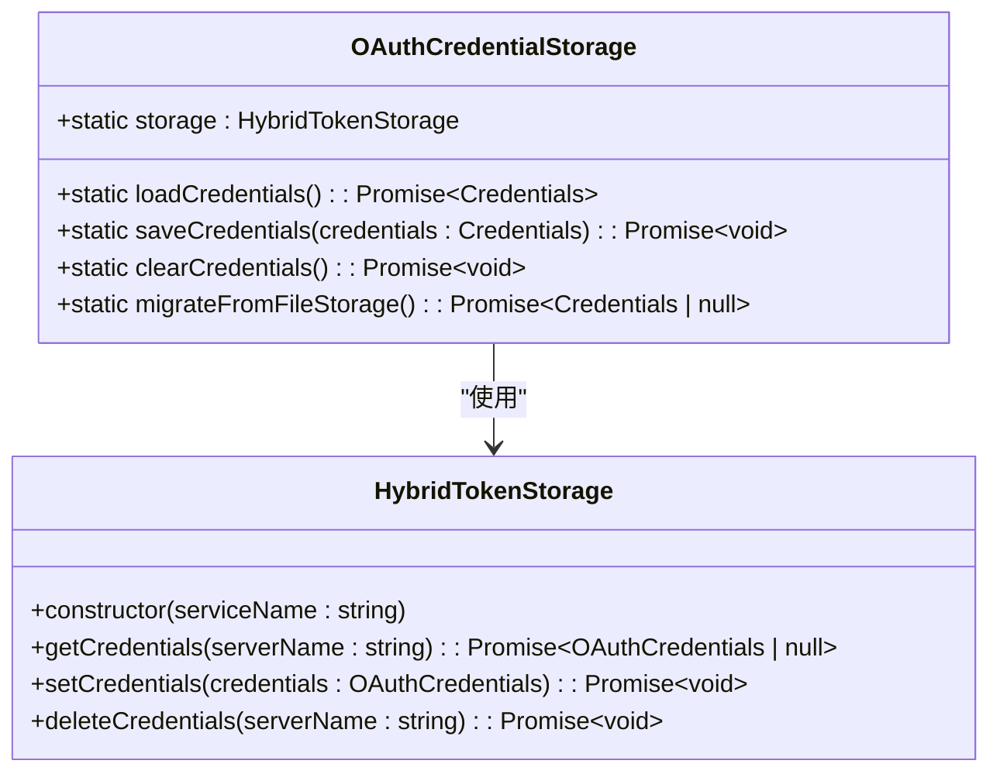
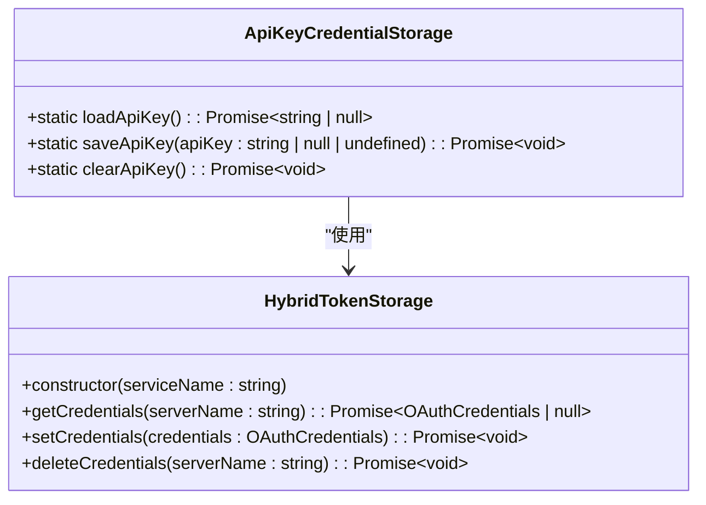
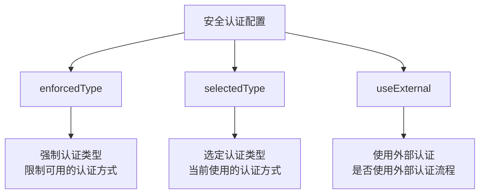
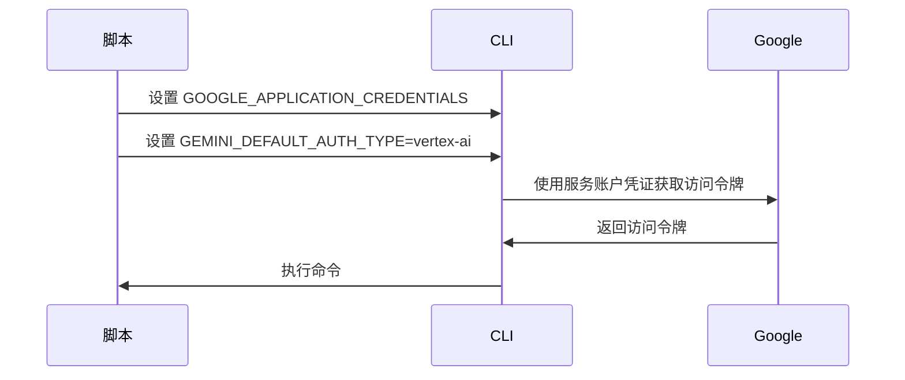
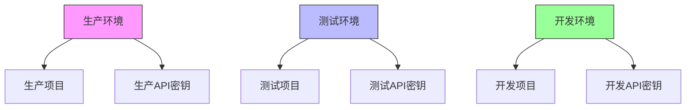

# 认证配置

<cite>
**本文档中引用的文件**   
- [auth.ts](file://packages/cli/src/config/auth.ts)
- [settings.ts](file://packages/cli/src/config/settings.ts)
- [settingsSchema.ts](file://packages/cli/src/config/settingsSchema.ts)
- [oauth-credential-storage.ts](file://packages/core/src/code_assist/oauth-credential-storage.ts)
- [apiKeyCredentialStorage.ts](file://packages/core/src/core/apiKeyCredentialStorage.ts)
- [storage.ts](file://packages/core/src/config/storage.ts)
- [google-auth-provider.ts](file://packages/core/src/mcp/google-auth-provider.ts)
- [sa-impersonation-provider.ts](file://packages/core/src/mcp/sa-impersonation-provider.ts)
</cite>

## 目录

1. [简介](#简介)
2. [认证方式](#认证方式)
3. [凭证存储](#凭证存储)
4. [配置文件设置](#配置文件设置)
5. [非交互式认证](#非交互式认证)
6. [最佳实践](#最佳实践)

## 简介

gemini-cli 提供了多种认证机制，允许用户通过不同的方式访问 Google 服务。本文档详细介绍了如何配置 Google
OAuth 登录、API 密钥和 Vertex
AI 服务账户等认证方式。我们将探讨认证凭证的存储位置、生命周期管理以及如何在配置文件中指定认证方法。

**Section sources**

- [auth.ts](file://packages/cli/src/config/auth.ts#L1-L41)
- [settings.ts](file://packages/cli/src/config/settings.ts#L54-L80)

## 认证方式

gemini-cli 支持多种认证方式，每种方式适用于不同的使用场景。

### Google OAuth 登录

Google
OAuth 登录是默认的交互式认证方式，允许用户通过 Google 账户进行身份验证。当用户选择此方式时，系统会启动一个本地 HTTP 服务器来处理 OAuth 回调，并在浏览器中打开 Google 登录页面。



**Diagram sources**

- [oauth-provider.ts](file://packages/core/src/mcp/oauth-provider.ts#L269-L393)
- [AuthDialog.tsx](file://packages/cli/src/ui/auth/AuthDialog.tsx#L36-L92)

### API 密钥

API 密钥是一种简单的认证方式，适用于自动化脚本和非交互式环境。用户可以通过环境变量
`GEMINI_API_KEY` 或在配置界面中输入 API 密钥来使用此方式。

### Vertex AI 服务账户

Vertex AI 服务账户认证适用于需要访问 Vertex AI 服务的场景。用户需要配置
`GOOGLE_CLOUD_PROJECT` 和 `GOOGLE_CLOUD_LOCATION` 环境变量，或者使用
`GOOGLE_API_KEY` 进行快速模式访问。

**Section sources**

- [contentGenerator.ts](file://packages/core/src/core/contentGenerator.ts#L46-L51)
- [zedIntegration.ts](file://packages/cli/src/zed-integration/zedIntegration.ts#L83-L141)

## 凭证存储

gemini-cli 使用安全的存储机制来管理认证凭证，确保用户凭据的安全性。

### OAuth 凭证存储

OAuth 凭证（如 Google 登录的访问令牌）使用系统密钥链（keychain）进行安全存储。在 macOS 上，凭证存储在钥匙串中；在 Windows 上，使用 Credential
Manager；在 Linux 上，使用 secret-service 或 KWallet。



**Diagram sources**

- [oauth-credential-storage.ts](file://packages/core/src/code_assist/oauth-credential-storage.ts#L20-L140)
- [hybrid-token-storage.ts](file://packages/core/src/mcp/token-storage/hybrid-token-storage.ts)

### API 密钥存储

API 密钥同样使用系统密钥链进行安全存储。当用户在 UI 中输入 API 密钥时，它会被安全地保存在密钥链中，而不是明文存储在配置文件中。



**Diagram sources**

- [apiKeyCredentialStorage.ts](file://packages/core/src/core/apiKeyCredentialStorage.ts#L1-L74)
- [hybrid-token-storage.ts](file://packages/core/src/mcp/token-storage/hybrid-token-storage.ts)

## 配置文件设置

gemini-cli 的认证配置主要通过配置文件和环境变量进行管理。

### 配置选项

认证相关的配置选项位于 `security.auth` 命名空间下：



**Diagram sources**

- [settingsSchema.ts](file://packages/cli/src/config/settingsSchema.ts#L137-L200)
- [settings.schema.json](file://schemas/settings.schema.json#L1017-L1042)

### 环境变量

除了配置文件，还可以通过环境变量来配置认证：

- `GEMINI_DEFAULT_AUTH_TYPE`: 设置默认的认证类型
- `GEMINI_API_KEY`: 设置 Gemini API 密钥
- `GOOGLE_API_KEY`: 设置 Google API 密钥（用于 Vertex AI 快速模式）
- `GOOGLE_CLOUD_PROJECT`: 设置 Google Cloud 项目 ID
- `GOOGLE_CLOUD_LOCATION`: 设置 Google Cloud 区域

**Section sources**

- [auth.ts](file://packages/cli/src/config/auth.ts#L24-L37)
- [contentGenerator.ts](file://packages/core/src/core/contentGenerator.ts#L65-L72)

## 非交互式认证

对于自动化脚本和 CI/CD 环境，gemini-cli 支持非交互式认证配置。

### 环境变量配置

最简单的非交互式认证方式是通过环境变量：

```bash
export GEMINI_API_KEY="your-api-key-here"
export GEMINI_DEFAULT_AUTH_TYPE="gemini-api-key"
```

### 服务账户配置

对于需要服务账户凭证的场景，可以使用服务账户密钥文件：



**Diagram sources**

- [google-auth-provider.ts](file://packages/core/src/mcp/google-auth-provider.ts#L19-L127)
- [sa-impersonation-provider.ts](file://packages/core/src/mcp/sa-impersonation-provider.ts#L1-L159)

### 配置文件示例

在 `.env` 文件中配置非交互式认证：

```ini
# .env 文件示例
GEMINI_DEFAULT_AUTH_TYPE=gemini-api-key
GEMINI_API_KEY=your-api-key-here
GOOGLE_CLOUD_PROJECT=your-project-id
GOOGLE_CLOUD_LOCATION=us-central1
```

**Section sources**

- [settings.ts](file://packages/cli/src/config/settings.ts#L520-L540)
- [auth.ts](file://packages/cli/src/config/auth.ts#L10-L40)

## 最佳实践

为了确保安全性和可靠性，建议遵循以下最佳实践：

### 凭证轮换

定期轮换 API 密钥和访问令牌，以降低安全风险。建议：

- 为每个项目或环境使用独立的 API 密钥
- 定期审查和撤销不再使用的密钥
- 使用短期有效的访问令牌

### 安全存储

- 始终使用系统密钥链存储敏感凭证
- 避免在版本控制系统中提交包含凭证的文件
- 使用 `.env` 文件时，确保将其添加到 `.gitignore`

### 环境隔离

为不同的环境（开发、测试、生产）使用独立的凭证和项目：



**Diagram sources**

- [storage.ts](file://packages/core/src/config/storage.ts#L18-L142)
- [settings.ts](file://packages/cli/src/config/settings.ts#L130-L141)
