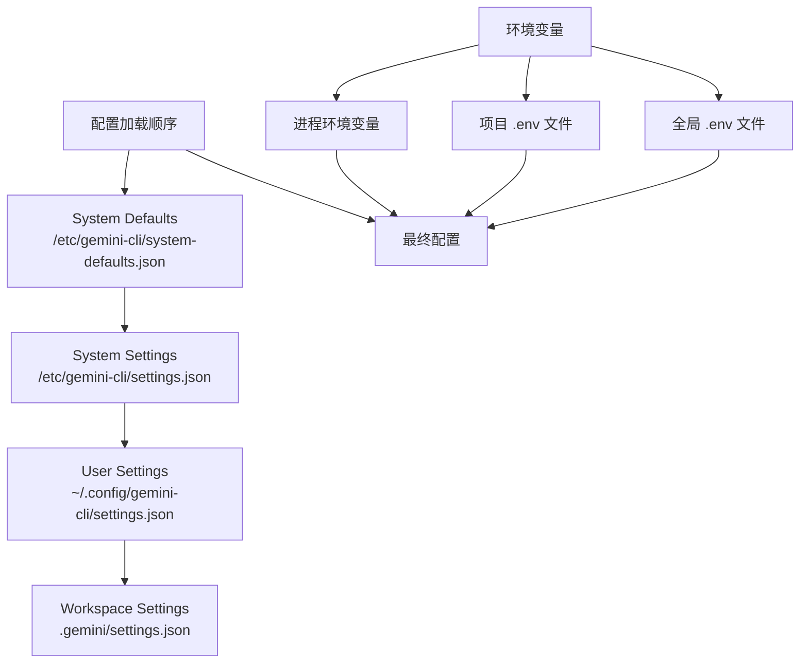
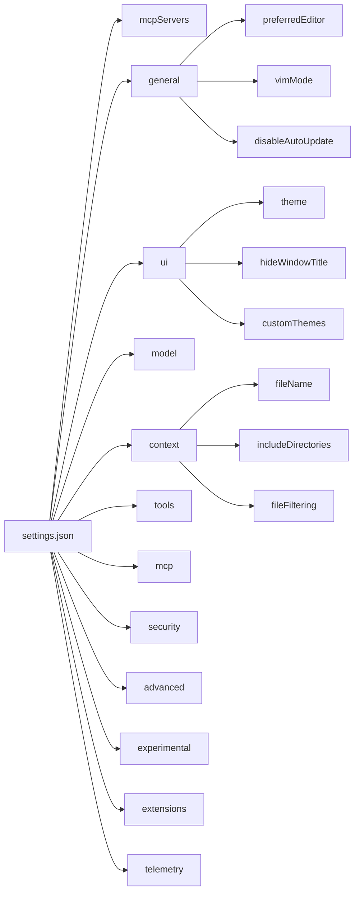
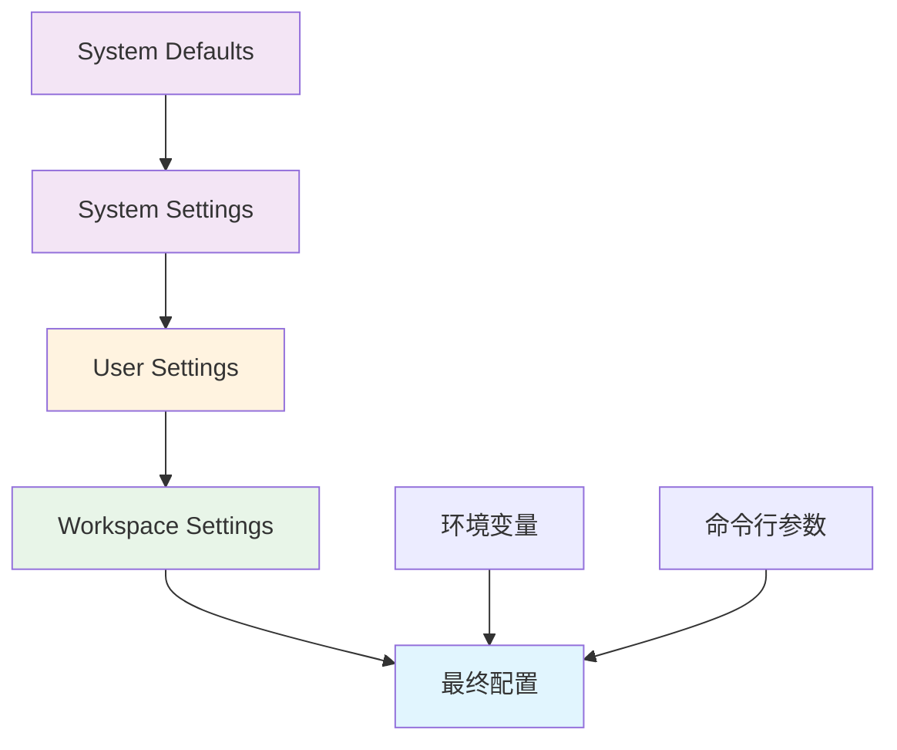
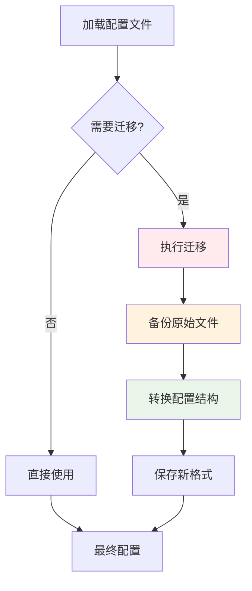
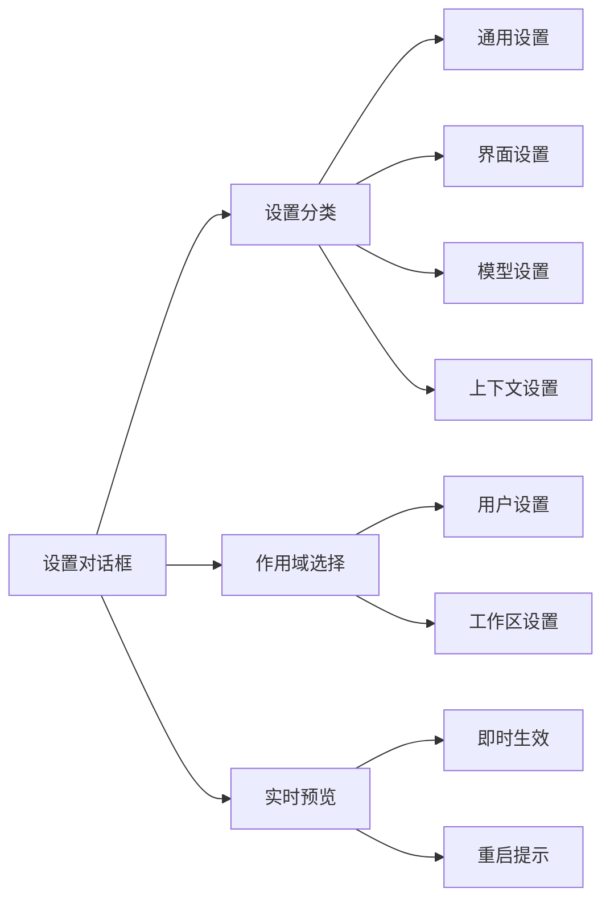

# 配置与设置

<cite>
**本文档中引用的文件**
- [settings.schema.json](file://schemas/settings.schema.json)
- [settings.ts](file://packages/cli/src/config/settings.ts)
- [settingsSchema.ts](file://packages/cli/src/config/settingsSchema.ts)
- [envVarResolver.ts](file://packages/cli/src/utils/envVarResolver.ts)
- [settings.test.ts](file://packages/cli/src/config/settings.test.ts)
- [SettingsDialog.tsx](file://packages/cli/src/ui/components/SettingsDialog.tsx)
- [generate-settings-schema.ts](file://scripts/generate-settings-schema.ts)
</cite>

## 目录

1. [简介](#简介)
2. [配置文件位置](#配置文件位置)
3. [配置文件结构](#配置文件结构)
4. [配置优先级](#配置优先级)
5. [配置选项详解](#配置选项详解)
6. [环境变量支持](#环境变量支持)
7. [配置迁移](#配置迁移)
8. [配置管理工具](#配置管理工具)
9. [最佳实践](#最佳实践)
10. [故障排除](#故障排除)

## 简介

Gemini
CLI 提供了一个强大而灵活的配置系统，允许用户通过多种方式自定义应用程序的行为。配置系统支持多个配置文件、环境变量覆盖以及动态配置管理，为不同使用场景提供了最大的灵活性。

## 配置文件位置

Gemini CLI 使用分层的配置系统，支持以下配置文件位置：



**图表来源**

- [settings.ts](file://packages/cli/src/config/settings.ts#L130-L182)

### 配置文件路径说明

| 配置级别     | 路径                                   | 描述                             |
| ------------ | -------------------------------------- | -------------------------------- |
| 系统默认配置 | `/etc/gemini-cli/system-defaults.json` | 系统级别的默认配置，所有用户共享 |
| 系统配置     | `/etc/gemini-cli/settings.json`        | 系统管理员设置的配置             |
| 用户配置     | `~/.config/gemini-cli/settings.json`   | 当前用户的个人配置               |
| 工作区配置   | `.gemini/settings.json`                | 项目特定的配置                   |

### 环境变量文件查找

Gemini CLI 按以下顺序查找环境变量文件：

1. **项目特定环境变量**：`./.gemini/.env`
2. **项目环境变量**：`./.env`
3. **用户主目录环境变量**：`~/.config/gemini-cli/.env`
4. **用户主目录环境变量**：`~/.env`

**章节来源**

- [settings.ts](file://packages/cli/src/config/settings.ts#L491-L518)

## 配置文件结构

Gemini
CLI 的配置文件采用 JSON 格式，遵循预定义的模式结构。配置文件的基本结构如下：



**图表来源**

- [settings.schema.json](file://schemas/settings.schema.json#L8-L1533)

### 基本配置结构示例

```json
{
  "general": {
    "preferredEditor": "code",
    "vimMode": false,
    "disableAutoUpdate": false
  },
  "ui": {
    "theme": "dark",
    "hideWindowTitle": false
  },
  "model": {
    "name": "gemini-2.5-flash",
    "maxSessionTurns": -1
  },
  "context": {
    "fileName": "CONTEXT.md",
    "includeDirectories": ["src", "lib"]
  },
  "tools": {
    "sandbox": true,
    "autoAccept": false
  }
}
```

**章节来源**

- [settings.schema.json](file://schemas/settings.schema.json#L8-L1533)

## 配置优先级

Gemini CLI 使用明确的配置优先级规则，确保配置的正确合并和覆盖：



**图表来源**

- [settings.ts](file://packages/cli/src/config/settings.ts#L401-L425)

### 优先级规则

1. **系统默认配置** (`system-defaults.json`) - 最低优先级
2. **系统配置** (`settings.json`) - 系统管理员设置
3. **用户配置** (`~/.config/gemini-cli/settings.json`) - 用户个人设置
4. **工作区配置** (`.gemini/settings.json`) - 项目特定设置
5. **环境变量** - 运行时动态设置
6. **命令行参数** - 最高优先级

**章节来源**

- [settings.ts](file://packages/cli/src/config/settings.ts#L401-L425)

## 配置选项详解

### 通用设置 (general)

| 设置项                   | 类型    | 默认值 | 描述                       |
| ------------------------ | ------- | ------ | -------------------------- |
| `preferredEditor`        | string  | -      | 首选编辑器，用于打开文件   |
| `vimMode`                | boolean | false  | 启用 Vim 键盘绑定          |
| `disableAutoUpdate`      | boolean | false  | 禁用自动更新               |
| `disableUpdateNag`       | boolean | false  | 禁用更新通知提示           |
| `enablePromptCompletion` | boolean | false  | 启用 AI 驱动的提示完成建议 |
| `retryFetchErrors`       | boolean | false  | 重试 "fetch failed" 错误   |
| `debugKeystrokeLogging`  | boolean | false  | 启用控制台中的按键记录调试 |

### 用户界面设置 (ui)

| 设置项               | 类型    | 默认值 | 描述                                    |
| -------------------- | ------- | ------ | --------------------------------------- |
| `theme`              | string  | -      | UI 颜色主题名称                         |
| `hideWindowTitle`    | boolean | false  | 隐藏窗口标题栏                          |
| `showStatusInTitle`  | boolean | false  | 在终端窗口标题中显示状态                |
| `hideTips`           | boolean | false  | 隐藏 UI 中的帮助提示                    |
| `hideBanner`         | boolean | false  | 隐藏应用横幅                            |
| `hideContextSummary` | boolean | false  | 隐藏输入框上方的上下文摘要              |
| `hideFooter`         | boolean | false  | 从 UI 中隐藏页脚                        |
| `showMemoryUsage`    | boolean | false  | 在 UI 中显示内存使用信息                |
| `showLineNumbers`    | boolean | false  | 在聊天中显示行号                        |
| `showCitations`      | boolean | false  | 显示聊天中生成文本的引用                |
| `useFullWidth`       | boolean | false  | 使用终端的全部宽度输出                  |
| `useAlternateBuffer` | boolean | false  | 使用备用屏幕缓冲区，保留 shell 历史记录 |

### 模型设置 (model)

| 设置项                 | 类型    | 默认值 | 描述                               |
| ---------------------- | ------- | ------ | ---------------------------------- |
| `name`                 | string  | -      | 要使用的 Gemini 模型               |
| `maxSessionTurns`      | number  | -1     | 会话中保持的最大用户/模型/工具轮次 |
| `compressionThreshold` | number  | 0.2    | 触发上下文压缩的上下文使用比例     |
| `skipNextSpeakerCheck` | boolean | true   | 跳过下一个发言者检查               |

### 上下文设置 (context)

| 设置项                              | 类型         | 默认值 | 描述                                         |
| ----------------------------------- | ------------ | ------ | -------------------------------------------- |
| `fileName`                          | string/array | -      | 要加载到内存中的上下文文件名                 |
| `includeDirectories`                | array        | []     | 要包含在工作区上下文中的额外目录             |
| `loadMemoryFromIncludeDirectories`  | boolean      | false  | 控制 /memory refresh 如何加载 GEMINI.md 文件 |
| `discoveryMaxDirs`                  | number       | 200    | 搜索内存时的最大目录数                       |
| `fileFiltering.respectGitIgnore`    | boolean      | true   | 搜索时尊重 .gitignore 文件                   |
| `fileFiltering.respectGeminiIgnore` | boolean      | true   | 搜索时尊重 .geminiignore 文件                |

### 工具设置 (tools)

| 设置项                        | 类型           | 默认值  | 描述                           |
| ----------------------------- | -------------- | ------- | ------------------------------ |
| `sandbox`                     | boolean/string | -       | 沙盒执行环境设置               |
| `autoAccept`                  | boolean        | false   | 自动接受被认为是安全的工具调用 |
| `useRipgrep`                  | boolean        | true    | 使用 ripgrep 进行文件内容搜索  |
| `enableToolOutputTruncation`  | boolean        | true    | 启用大型工具输出的截断         |
| `truncateToolOutputThreshold` | number         | 4000000 | 截断工具输出的字符阈值         |
| `truncateToolOutputLines`     | number         | 1000    | 截断工具输出时保留的行数       |

**章节来源**

- [settings.schema.json](file://schemas/settings.schema.json#L8-L1533)

## 环境变量支持

Gemini CLI 支持通过环境变量进行配置，提供了灵活的运行时配置能力。

### 环境变量解析机制

```mermaid
flowchart TD
A[环境变量字符串] --> B{匹配模式?}
B --> |$VAR_NAME| C[解析单个变量]
B --> |${VAR_NAME}| D[解析大括号变量]
B --> |无匹配| E[保持原样]
C --> F{变量存在?}
D --> F
F --> |是| G[替换为值]
F --> |否| H[保留占位符]
E --> I[最终结果]
G --> I
H --> I
```

**图表来源**

- [envVarResolver.ts](file://packages/cli/src/utils/envVarResolver.ts#L20-L35)

### 环境变量语法

支持两种语法格式：

- `$VAR_NAME` - 简单变量引用
- `${VAR_NAME}` - 大括号变量引用

### 示例配置

```json
{
  "model": {
    "name": "${GEMINI_MODEL:-gemini-2.5-flash}"
  },
  "context": {
    "fileName": "${PROJECT_CONTEXT_FILE:-CONTEXT.md}"
  },
  "tools": {
    "sandbox": "${ENABLE_SANDBOX:-true}"
  }
}
```

### 排除的环境变量

默认情况下，以下环境变量会被排除在项目上下文中：

- `DEBUG`
- `DEBUG_MODE`

可以通过 `advanced.excludedEnvVars` 配置自定义排除列表。

**章节来源**

- [envVarResolver.ts](file://packages/cli/src/utils/envVarResolver.ts#L1-127)
- [settings.ts](file://packages/cli/src/config/settings.ts#L542-L582)

## 配置迁移

Gemini CLI 具有自动配置迁移功能，确保向后兼容性。

### 迁移流程



**图表来源**

- [settings.ts](file://packages/cli/src/config/settings.ts#L242-L331)

### 迁移映射表

| V1 键名           | V2 路径                   | 描述           |
| ----------------- | ------------------------- | -------------- |
| `theme`           | `ui.theme`                | UI 主题设置    |
| `vimMode`         | `general.vimMode`         | Vim 模式启用   |
| `preferredEditor` | `general.preferredEditor` | 首选编辑器     |
| `mcpServers`      | `mcpServers`              | MCP 服务器配置 |
| `sandbox`         | `tools.sandbox`           | 沙盒设置       |

### 迁移策略

1. **自动迁移**：支持 `MIGRATE_V2_OVERWRITE=true` 自动覆盖旧文件
2. **内存迁移**：不修改文件，仅在内存中转换格式
3. **备份保留**：迁移失败时保留原始文件

**章节来源**

- [settings.ts](file://packages/cli/src/config/settings.ts#L242-L331)

## 配置管理工具

### 设置对话框

Gemini CLI 提供了交互式的设置管理界面：



**图表来源**

- [SettingsDialog.tsx](file://packages/cli/src/ui/components/SettingsDialog.tsx#L47-L88)

### 设置验证

系统提供全面的设置验证功能：

- **类型验证**：确保设置值符合预期类型
- **范围验证**：检查数值是否在有效范围内
- **枚举验证**：验证枚举类型的值
- **依赖验证**：检查设置间的依赖关系

### 设置导出/导入

支持配置的导出和导入功能，便于配置备份和迁移。

**章节来源**

- [SettingsDialog.tsx](file://packages/cli/src/ui/components/SettingsDialog.tsx#L47-L88)

## 最佳实践

### 配置组织

1. **按作用域分离配置**
   - 用户级配置放在用户配置文件中
   - 项目级配置放在工作区配置文件中
   - 系统级配置由系统管理员管理

2. **使用环境变量进行部署配置**

   ```json
   {
     "model": {
       "name": "${GEMINI_MODEL:-gemini-2.5-flash}"
     },
     "security": {
       "folderTrust": {
         "enabled": "${ENABLE_FOLDER_TRUST:-false}"
       }
     }
   }
   ```

3. **合理使用配置继承**
   ```json
   {
     "modelConfigs": {
       "aliases": {
         "production": {
           "extends": "chat-base",
           "modelConfig": {
             "model": "gemini-2.5-pro",
             "generateContentConfig": {
               "temperature": 0.1
             }
           }
         }
       }
     }
   }
   ```

### 性能优化

1. **限制上下文大小**

   ```json
   {
     "context": {
       "discoveryMaxDirs": 100,
       "maxSessionTurns": 50
     }
   }
   ```

2. **优化工具配置**
   ```json
   {
     "tools": {
       "useRipgrep": true,
       "enableToolOutputTruncation": true,
       "truncateToolOutputThreshold": 1000000
     }
   }
   ```

### 安全考虑

1. **启用文件夹信任**

   ```json
   {
     "security": {
       "folderTrust": {
         "enabled": true
       }
     }
   }
   ```

2. **限制工具访问**
   ```json
   {
     "tools": {
       "allowed": ["read_file", "write_file"],
       "exclude": ["run_shell_command"]
     }
   }
   ```

## 故障排除

### 常见问题

1. **配置文件格式错误**
   - **症状**：配置加载失败
   - **解决**：检查 JSON 语法，使用 JSON 验证工具

2. **环境变量未解析**
   - **症状**：环境变量占位符未被替换
   - **解决**：确认环境变量已设置且拼写正确

3. **配置优先级问题**
   - **症状**：设置未按预期生效
   - **解决**：检查配置文件加载顺序和作用域

4. **迁移失败**
   - **症状**：配置文件损坏
   - **解决**：检查备份文件或手动修复配置

### 调试技巧

1. **启用调试日志**

   ```bash
   DEBUG=gemini:* gemini-cli
   ```

2. **检查配置加载**

   ```bash
   gemini-cli --debug-config
   ```

3. **验证配置有效性**
   ```bash
   gemini-cli --validate-config
   ```

### 配置重置

如果配置出现问题，可以重置到默认状态：

1. 备份当前配置
2. 删除用户配置文件
3. 重新启动应用程序

**章节来源**

- [settings.test.ts](file://packages/cli/src/config/settings.test.ts#L1264-L1299)
