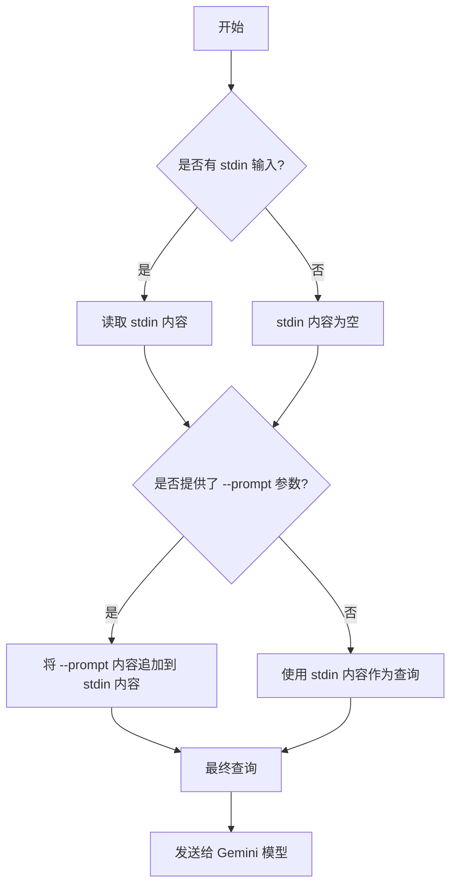
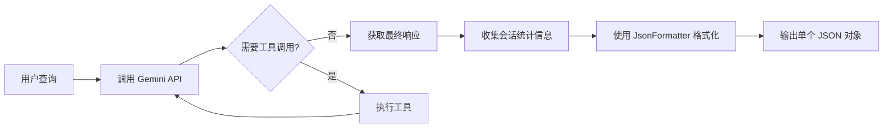
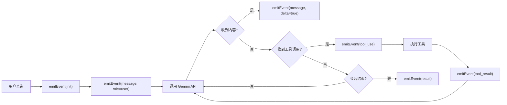

# 非交互模式

<cite>
**本文档中引用的文件**
- [nonInteractiveCli.ts](file://packages/cli/src/nonInteractiveCli.ts)
- [config.ts](file://packages/cli/src/config/config.ts)
- [json-formatter.ts](file://packages/core/src/output/json-formatter.ts)
- [stream-json-formatter.ts](file://packages/core/src/output/stream-json-formatter.ts)
- [readStdin.ts](file://packages/cli/src/utils/readStdin.ts)
- [json-output.test.ts](file://integration-tests/json-output.test.ts)
</cite>

## 目录

1. [简介](#简介)
2. [命令行参数与输入处理](#命令行参数与输入处理)
3. [输出格式详解](#输出格式详解)
4. [与自动化工具集成](#与自动化工具集成)
5. [错误处理](#错误处理)
6. [最佳实践](#最佳实践)

## 简介

非交互模式是 `gemini-cli`
的核心功能之一，它允许将该工具无缝集成到脚本、CI/CD 管道和其他自动化工作流中。在此模式下，`gemini-cli`
不会启动交互式界面，而是直接处理输入、生成响应并以预定义的格式输出结果，然后立即退出。这使得它能够像传统的 Unix 命令行工具一样被调用和组合。

该模式主要通过命令行参数和标准输入（stdin）来接收查询，并通过标准输出（stdout）和标准错误（stderr）返回结果。其关键特性在于支持结构化的 JSON 输出，这为程序化解析和集成提供了极大的便利。

**Section sources**

- [nonInteractiveCli.ts](file://packages/cli/src/nonInteractiveCli.ts#L46-L439)
- [config.ts](file://packages/cli/src/config/config.ts#L73-L200)

## 命令行参数与输入处理

`gemini-cli` 提供了多种方式在非交互模式下传递查询，确保了使用的灵活性。

### 通过命令行参数传递查询

最直接的方式是使用 `--prompt` (`-p`) 标志或位置参数来传递查询。

- **位置参数**: 这是推荐的方法。将您的查询作为命令的第一个参数。
  ```bash
  gemini "解释这个代码库的架构"
  ```
- **`--prompt` 标志**: 使用 `-p` 或 `--prompt`
  标志后跟查询内容。请注意，此标志已被弃用，未来版本中将被移除。
  ```bash
  gemini --prompt "解释这个代码库的架构"
  ```

在代码实现中，`parseArguments` 函数负责解析这些参数。它使用 `yargs` 库定义了
`query`（位置参数）和 `prompt`（标志）选项，并确保它们不会同时使用。

### 通过管道和重定向传递输入

对于更复杂的场景，`gemini-cli` 支持从标准输入（stdin）读取内容。这使得它可以与
`echo`、`cat` 或其他命令的输出进行管道连接。

```bash
echo "总结以下代码：" | gemini
```

```bash
cat code.py | gemini --prompt "分析此代码的潜在安全漏洞"
```

在 `nonInteractiveCli.ts` 中，`runNonInteractive` 函数会调用 `readStdin()`
函数来异步读取所有可用的 stdin 数据。如果同时提供了 `--prompt`
参数，该参数的值会附加到 stdin 的内容之后，共同构成完整的查询。



**Diagram sources**

- [nonInteractiveCli.ts](file://packages/cli/src/nonInteractiveCli.ts#L198-L233)
- [readStdin.ts](file://packages/cli/src/utils/readStdin.ts#L1-L71)

**Section sources**

- [nonInteractiveCli.ts](file://packages/cli/src/nonInteractiveCli.ts#L198-L233)
- [config.ts](file://packages/cli/src/config/config.ts#L100-L105)
- [readStdin.ts](file://packages/cli/src/utils/readStdin.ts#L1-L71)

## 输出格式详解

`gemini-cli` 提供了三种输出格式，通过 `--output-format`
(`-o`) 标志进行选择：`text`（默认）、`json` 和
`stream-json`。后两者对于自动化集成至关重要。

### `--json` 格式

`--json`
格式将最终结果以单个、格式化的 JSON 对象输出到 stdout。这个对象包含模型的响应、会话统计信息和可能的错误。

**结构**:

```json
{
  "response": "模型的完整响应文本",
  "stats": {
    "total_tokens": 123,
    "input_tokens": 45,
    "output_tokens": 78,
    "duration_ms": 2500,
    "tool_calls": 2
  }
}
```

**用途**: 适用于需要获取最终、完整结果的场景。脚本可以轻松地使用 `jq`
等工具解析此 JSON 以提取 `response` 字段。

**实现**: 在 `nonInteractiveCli.ts` 中，当检测到 `json`
格式时，系统会等待所有处理完成，然后使用 `JsonFormatter`
类将响应和统计信息格式化为一个 JSON 字符串并输出。



**Diagram sources**

- [nonInteractiveCli.ts](file://packages/cli/src/nonInteractiveCli.ts#L411-L417)
- [json-formatter.ts](file://packages/core/src/output/json-formatter.ts#L11-L40)

### `--stream-json` 格式

`--stream-json`
格式提供了一种实时、流式的输出机制。它将操作过程中的每一个事件（如接收到用户消息、生成内容、调用工具、返回结果）作为独立的 JSON 对象，以换行符分隔（JSONL 格式）输出到 stdout。

**事件类型**:

- `init`: 会话开始，包含会话ID和模型信息。
- `message`: 用户或助手的消息。
- `tool_use`: 模型请求调用一个工具。
- `tool_result`: 工具执行完成并返回结果。
- `result`: 会话结束，包含最终状态和统计信息。
- `error`: 发生错误。

**用途**: 适用于需要实时监控操作进度、实现进度条或在长时间运行的任务中提供即时反馈的场景。例如，在 CI/CD 管道中，可以实时看到
`gemini-cli` 正在执行哪些命令。

**实现**: `StreamJsonFormatter` 类负责此功能。它在 `nonInteractiveCli.ts`
的主循环中被调用，每当发生一个事件时，就立即通过 `emitEvent`
方法将该事件以 JSONL 格式写入 stdout。



**Diagram sources**

- [nonInteractiveCli.ts](file://packages/cli/src/nonInteractiveCli.ts#L189-L411)
- [stream-json-formatter.ts](file://packages/core/src/output/stream-json-formatter.ts#L14-L31)

## 与自动化工具集成

`gemini-cli` 的非交互模式使其成为自动化工作流的理想选择。

### 在 Shell 脚本中使用

您可以将 `gemini-cli` 像任何其他命令一样嵌入到 shell 脚本中。

```bash
#!/bin/bash
# analyze_code.sh

# 获取代码摘要
SUMMARY=$(gemini -p "总结 $1 文件的主要功能" --output-format json | jq -r '.response')

# 将摘要写入文档
echo "# 代码摘要" > SUMMARY.md
echo "$SUMMARY" >> SUMMARY.md

echo "分析完成，结果已保存到 SUMMARY.md"
```

### 在 CI/CD 管道中使用

在 CI/CD 管道（如 GitHub Actions）中，您可以使用 `stream-json`
格式来提供详细的构建日志。

```yaml
# .github/workflows/code-review.yml
name: Code Review
on: [pull_request]

jobs:
  review:
    runs-on: ubuntu-latest
    steps:
      - uses: actions/checkout@v4
      - name: Run Gemini Code Review
        run: |
          gemini -p "审查本次 PR 的代码，重点关注安全性和性能问题" \
                 --output-format stream-json \
                 --approval-mode yolo # 在 CI 环境中自动批准
        env:
          GEMINI_API_KEY: ${{ secrets.GEMINI_API_KEY }}
```

**Section sources**

- [nonInteractiveCli.ts](file://packages/cli/src/nonInteractiveCli.ts#L263-L419)
- [json-output.test.ts](file://integration-tests/json-output.test.ts#L23-L132)

## 错误处理

在非交互模式下，错误处理是可预测且结构化的。

- **`text` 模式**: 错误消息会输出到 stderr，然后进程以非零状态码退出。
- **`json`
  模式**: 即使发生错误，CLI 也会尝试输出一个包含错误详情的 JSON 对象，然后退出。这允许调用者区分是 CLI 本身的错误还是模型/工具的错误。
- **`stream-json` 模式**: 会发出一个 `error` 事件，然后发出 `result`
  事件（状态为 `error`），最后退出。

这种设计确保了脚本可以根据退出状态码和输出内容来可靠地处理各种错误情况。

**Section sources**

- [nonInteractiveCli.ts](file://packages/cli/src/nonInteractiveCli.ts#L421-L437)
- [errors.ts](file://packages/cli/src/utils/errors.ts#L61-L101)

## 最佳实践

1.  **优先使用 `json` 或
    `stream-json`**: 为了实现可靠的自动化，应始终使用结构化的 JSON 输出格式。
2.  **处理 EPIPE 错误**: 当输出被管道传输到一个提前关闭的命令（如
    `head`）时，`gemini-cli` 会收到 `EPIPE`
    错误。它会优雅地处理此错误并退出，避免不必要的错误消息。
3.  **利用 `--approval-mode yolo`**: 在 CI/CD 等无人值守环境中，使用
    `--approval-mode yolo` 可以自动批准所有操作，避免流程挂起。
4.  **设置超时**: 在脚本中调用 `gemini-cli` 时，建议使用 `timeout`
    命令来防止长时间运行的任务阻塞整个流程。
