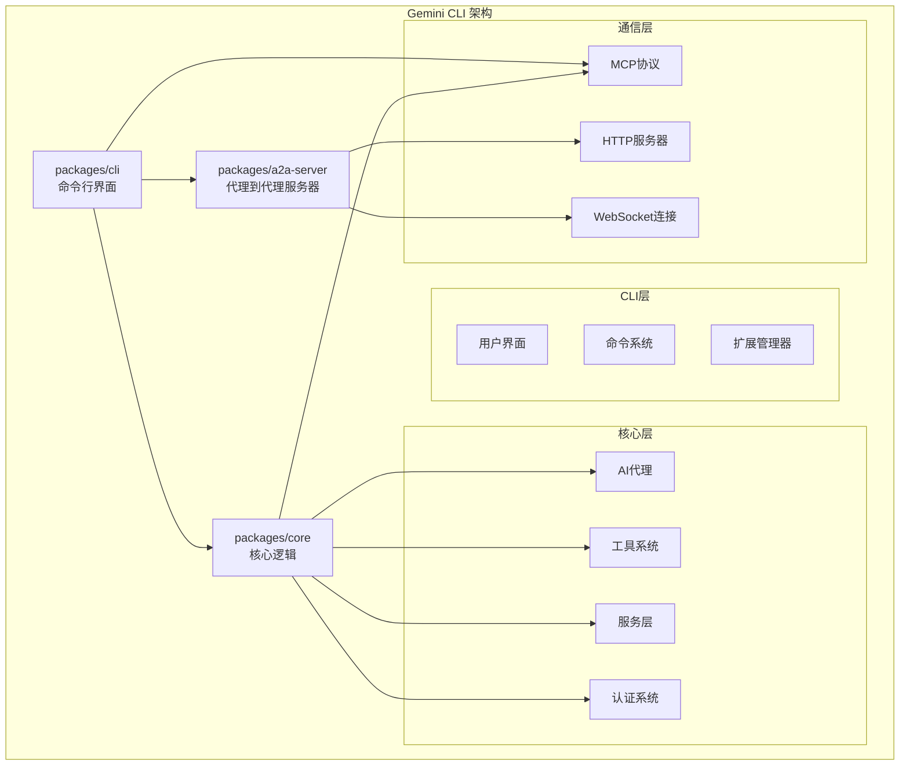

# 项目概述

<cite>
**本文档中引用的文件**
- [README.md](file://README.md)
- [GEMINI.md](file://GEMINI.md)
- [ROADMAP.md](file://ROADMAP.md)
- [package.json](file://package.json)
- [packages/cli/package.json](file://packages/cli/package.json)
- [packages/core/package.json](file://packages/core/package.json)
- [packages/a2a-server/package.json](file://packages/a2a-server/package.json)
- [packages/cli/src/index.ts](file://packages/cli/src/index.ts)
- [packages/core/src/index.ts](file://packages/core/src/index.ts)
- [packages/a2a-server/src/index.ts](file://packages/a2a-server/src/index.ts)
- [packages/cli/src/config/extension-manager.ts](file://packages/cli/src/config/extension-manager.ts)
</cite>

## 目录

1. [项目简介](#项目简介)
2. [核心价值主张](#核心价值主张)
3. [主要功能特性](#主要功能特性)
4. [应用场景](#应用场景)
5. [项目架构](#项目架构)
6. [核心组件详解](#核心组件详解)
7. [技术栈与依赖](#技术栈与依赖)
8. [开发环境设置](#开发环境设置)
9. [贡献指南](#贡献指南)
10. [总结](#总结)

## 项目简介

Gemini
CLI是一个开源的AI代理项目，由Google开发并维护，旨在将Google的Gemini模型直接带入用户的终端环境中。该项目为开发者提供了一个轻量级的访问方式，让用户能够通过最直接的路径从提示词到达我们的AI模型。

作为一个现代化的命令行工具，Gemini
CLI不仅提供了强大的AI能力，还具备高度的可扩展性和安全性。它支持多种认证方式，包括Google登录、API密钥和Vertex
AI，满足不同用户群体的需求。

**章节来源**

- [README.md](file://README.md#L1-L20)
- [ROADMAP.md](file://ROADMAP.md#L1-L15)

## 核心价值主张

### 1. 免费tier访问

- **60请求/分钟**和**1,000请求/天**的免费配额（个人Google账户）
- 无需支付费用即可体验最先进的AI能力
- 支持持续使用和实验

### 2. 强大的Gemini 2.5 Pro模型

- 访问**1M token上下文窗口**的强大语言模型
- 支持复杂的多轮对话和长文本处理
- 提供最佳的AI推理能力

### 3. 内置工具生态系统

- **Google搜索集成**：实时信息检索和知识补充
- **文件系统操作**：安全的文件读写和目录管理
- **Shell命令执行**：系统级自动化和脚本执行
- **网页抓取**：网络数据获取和信息提取

### 4. 可扩展性

- **MCP（Model Context Protocol）支持**：自定义集成能力
- 模块化架构设计，便于功能扩展
- 插件系统支持第三方扩展开发

### 5. 终端优先设计

- 专为开发者设计的命令行界面
- 集成VS Code等主流IDE
- 支持脚本化和自动化工作流

**章节来源**

- [README.md](file://README.md#L16-L26)

## 主要功能特性

### 代码理解与生成

- **大型代码库查询**：智能分析和理解复杂项目结构
- **多模态生成**：基于PDF、图片或草图生成应用程序
- **调试辅助**：使用自然语言进行问题诊断和故障排除

### 自动化与集成

- **运营任务自动化**：查询拉取请求、处理复杂合并等
- **MCP服务器集成**：连接新功能，包括媒体生成功能
- **脚本化运行**：在工作流中非交互式运行

### 高级功能

- **内置Google搜索**：实时信息检索
- **对话检查点**：保存和恢复复杂会话
- **自定义上下文文件**：为项目定制行为

### GitHub集成

- **自动代码审查**：基于上下文的反馈和建议
- **问题分类**：基于内容分析的标签和优先级
- **按需协助**：在问题和拉取请求中提及获得帮助

**章节来源**

- [README.md](file://README.md#L90-L127)

## 应用场景

### 开发者场景

- **代码补全和重构**：智能代码生成和优化建议
- **技术文档编写**：快速生成项目文档和API说明
- **测试用例生成**：自动化测试代码生成
- **架构设计讨论**：AI辅助的系统设计决策

### 企业团队场景

- **代码质量保证**：自动化代码审查和质量检查
- **知识管理**：组织内部知识库构建和维护
- **项目规划**：基于历史数据的项目估算和规划
- **培训支持**：新员工技能提升和知识传递

### 个人用户场景

- **学习辅助**：编程语言学习和技术概念理解
- **创意写作**：故事创作和内容生成
- **生活助手**：日常任务管理和信息查询
- **研究支持**：学术研究和资料整理

## 项目架构

Gemini CLI采用模块化的微服务架构，主要包含三个核心包：



**图表来源**

- [packages/cli/package.json](file://packages/cli/package.json#L1-L20)
- [packages/core/package.json](file://packages/core/package.json#L1-L20)
- [packages/a2a-server/package.json](file://packages/a2a-server/package.json#L1-L20)

### 架构特点

- **分层设计**：清晰的职责分离和模块化
- **插件架构**：支持动态加载和扩展
- **协议标准化**：基于MCP的统一接口
- **安全隔离**：沙箱环境和权限控制

**章节来源**

- [packages/cli/src/index.ts](file://packages/cli/src/index.ts#L1-L10)
- [packages/core/src/index.ts](file://packages/core/src/index.ts#L1-L145)
- [packages/a2a-server/src/index.ts](file://packages/a2a-server/src/index.ts#L1-L10)

## 核心组件详解

### packages/cli - 命令行界面

CLI包是用户与Gemini CLI交互的主要入口点，提供完整的命令行体验：

#### 主要功能

- **React用户界面**：基于Ink的现代终端UI
- **命令解析系统**：支持斜杠命令和自然语言输入
- **主题系统**：可定制的视觉外观
- **键盘快捷键**：高效的交互方式

#### 技术实现

- 使用React和Ink构建终端界面
- 实现了完整的状态管理系统
- 支持实时渲染和响应式更新

**章节来源**

- [packages/cli/package.json](file://packages/cli/package.json#L1-L92)

### packages/core - 核心逻辑

Core包包含了Gemini CLI的所有核心业务逻辑：

#### AI代理系统

- **代理注册表**：管理各种AI代理实例
- **执行器**：协调代理任务执行
- **调用机制**：智能的任务分发和结果聚合

#### 工具系统

- **工具注册表**：统一管理所有可用工具
- **基础工具类**：提供工具开发的标准框架
- **工具验证**：确保工具参数的安全性和有效性

#### 服务层

- **文件发现服务**：智能文件系统导航
- **Git服务**：版本控制系统集成
- **聊天记录服务**：对话历史管理和持久化

#### 认证与安全

- **多种认证方式**：Google OAuth、API密钥、Vertex AI
- **权限控制**：基于工作区的信任级别管理
- **沙箱机制**：安全的代码执行环境

**章节来源**

- [packages/core/src/index.ts](file://packages/core/src/index.ts#L1-L145)

### packages/a2a-server - 代理到代理服务器

A2A服务器实现了代理间的通信协议，支持复杂的分布式AI任务：

#### 核心功能

- **任务执行器**：协调跨代理的任务执行
- **HTTP端点**：RESTful API接口
- **命令注册表**：管理可用的命令和工具

#### 协议支持

- **Model Context Protocol**：标准的AI代理通信协议
- **Express框架**：高性能的HTTP服务器
- **WebSocket支持**：实时双向通信

**章节来源**

- [packages/a2a-server/src/index.ts](file://packages/a2a-server/src/index.ts#L1-L10)

## 扩展系统

Gemini CLI拥有强大的扩展系统，允许用户和第三方开发者创建和分享功能扩展：

### 扩展类型

- **本地扩展**：基于本地文件系统的扩展
- **Git扩展**：从Git仓库安装的扩展
- **GitHub发布扩展**：从GitHub Releases安装的扩展
- **链接扩展**：符号链接到本地开发的扩展

### 扩展管理功能

- **自动安装和更新**：支持版本管理和自动更新
- **信任级别控制**：基于工作区的安全策略
- **环境变量支持**：灵活的配置管理
- **MCP服务器集成**：扩展的外部工具连接

**章节来源**

- [packages/cli/src/config/extension-manager.ts](file://packages/cli/src/config/extension-manager.ts#L1-L731)

## 认证与安全

### 多种认证方式

1. **Google登录**：OAuth流程，适合个人开发者
2. **Gemini API密钥**：直接API访问，适合开发者
3. **Vertex AI**：企业级解决方案，适合生产环境

### 安全特性

- **工作区信任系统**：基于路径的信任级别管理
- **沙箱执行**：限制扩展和工具的系统访问权限
- **权限验证**：严格的文件系统和网络访问控制
- **审计日志**：完整的操作记录和监控

## 技术栈与依赖

### 核心技术栈

- **TypeScript**：强类型JavaScript超集
- **Node.js**：服务器端JavaScript运行时
- **React**：用户界面库
- **Ink**：React for Terminal
- **Express**：Web应用框架

### 关键依赖

- **@google/genai**：Google AI API客户端
- **@modelcontextprotocol/sdk**：MCP协议SDK
- **vitest**：测试框架
- **esbuild**：JavaScript打包工具

**章节来源**

- [package.json](file://package.json#L1-L146)
- [packages/cli/package.json](file://packages/cli/package.json#L30-L65)
- [packages/core/package.json](file://packages/core/package.json#L22-L70)

## 开发环境设置

### 系统要求

- **Node.js**：版本20或更高
- **操作系统**：macOS、Linux或Windows
- **内存**：建议8GB RAM以上

### 快速开始

```bash
# 全局安装
npm install -g @google/gemini-cli

# 或使用npx立即运行
npx https://github.com/google-gemini/gemini-cli
```

### 开发设置

```bash
# 克隆仓库
git clone https://github.com/google-gemini/gemini-cli.git
cd gemini-cli

# 安装依赖
npm install

# 运行预检测试
npm run preflight

# 启动开发服务器
npm run start
```

**章节来源**

- [README.md](file://README.md#L28-L89)
- [GEMINI.md](file://GEMINI.md#L1-L20)

## 贡献指南

### 项目治理

- **Apache 2.0许可证**：开放源码，欢迎社区贡献
- **GitHub Issues**：功能请求和问题报告
- **官方路线图**：透明的开发计划

### 贡献方式

- **Bug报告**：详细的错误描述和重现步骤
- **功能建议**：清晰的需求说明和使用场景
- **代码贡献**：遵循项目的编码规范和测试要求
- **文档改进**：帮助完善项目文档和教程

### 开发流程

- **预检测试**：运行完整的测试套件
- **代码风格**：遵循ESLint和Prettier规则
- **类型检查**：确保TypeScript类型安全
- **单元测试**：为新功能编写测试用例

**章节来源**

- [README.md](file://README.md#L333-L375)
- [ROADMAP.md](file://ROADMAP.md#L89-L114)

## 总结

Gemini
CLI代表了AI技术与开发者工具融合的新范式。通过将Google的先进Gemini模型集成到终端环境中，它为开发者提供了一个强大而灵活的AI助手。

### 核心优势

- **易用性**：简洁直观的命令行界面
- **功能性**：涵盖开发工作的各个方面
- **可扩展性**：丰富的插件和扩展生态系统
- **安全性**：完善的权限控制和沙箱机制
- **开源性**：透明的开发过程和社区驱动

### 发展前景

随着AI技术的不断发展和社区的积极参与，Gemini
CLI将继续演进，为开发者提供更加强大和便捷的AI辅助工具。无论是个人开发者还是企业团队，都能从中获得显著的生产力提升。

这个项目不仅展示了Google在AI领域的技术实力，也体现了开源社区协作的力量。通过持续的创新和改进，Gemini
CLI有望成为开发者工作中不可或缺的重要工具。
